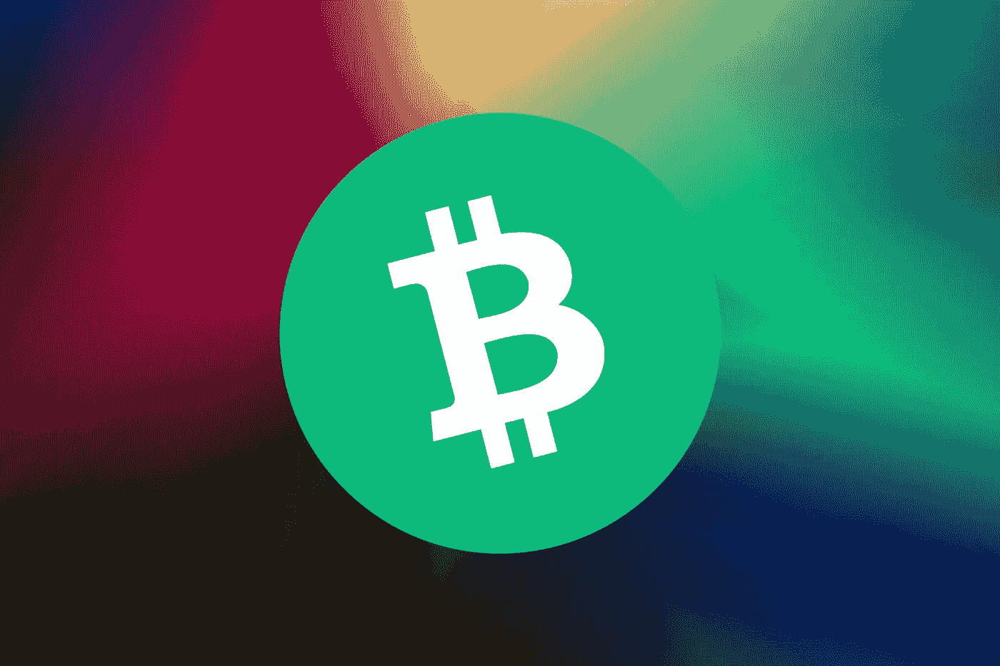
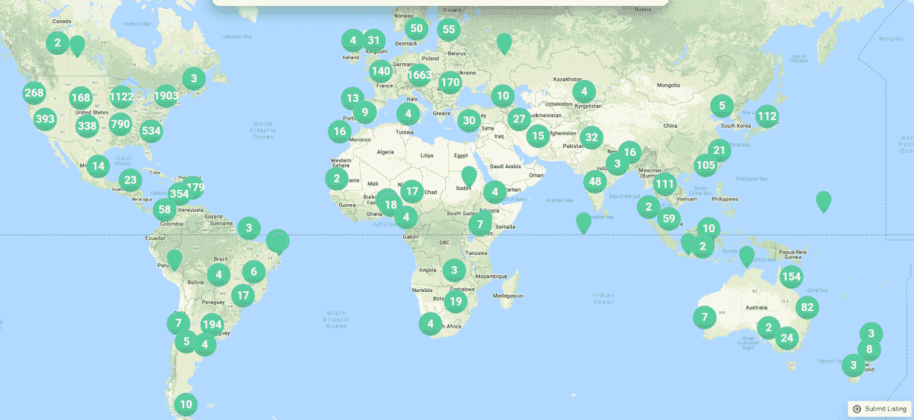
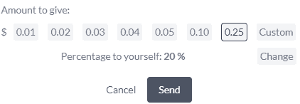
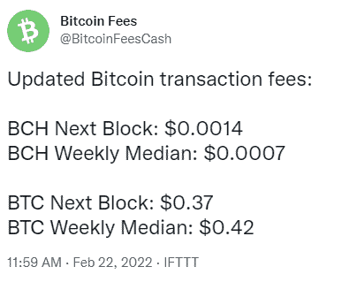

# 比特币现金在这四个领域蓬勃发展

> 原文：<https://medium.com/coinmonks/bitcoin-cash-thrives-in-these-four-sectors-investors-demand-a6c2a183375a?source=collection_archive---------28----------------------->

*Photo: by Gradienta on* [*Unsplash*](https://unsplash.com/photos/g2k4DgLBqcg) *(modified)*

熊市有一些好处，其中之一是 Vitalik Buterin 最近指出的。

投资者的焦点现在正从“炒作”和投机转向实际工作并朝着实现目标的方向发展的项目。

我们无法确定“加密冬天”是否已经到来，或者加密货币还需要一两年的时间才能复兴并再次成为主流。

不过，加密季节不会影响比特币现金的发展。

当 2021 年 5 月达到 1600 美元的年度高点时，BCH 并没有停止。

合理的估值应该更高，尽管在过去几个月里，我们目睹了 2018 年和 2019 年经历的水平下滑。

价格可能也大幅下跌，目前接近历史低点。对于比特币现金，我们观察到的情况与围绕其他区块链社区的恐慌截然相反。

比特币现金现在是一个团结的社区，专注于实现其目标。

随着加密“炒作”的平息，以及持续建设的项目从短期投机狂热的烟雾中再次浮出水面，我们有必要再次审视比特币现金。

# 比特币现金繁荣的四个关键领域

价格，价格，再价格。

多年来，反对比特币现金的唯一理由是 BCH 表现不佳的价格。

没有人可以争辩，这是 BCH 目前的价格。不管是否受到抑制，每个投资者都知道，它应该表现得更好。

但是，[什么时候是购买](https://read.cash/@Pantera/the-best-time-to-buy-crypto-f1108257)的最佳时机？投资者还能持续多久，买入代表运转不良的区块链的顶级资产，而忽视处于底部的顶级资产？

> *买入的最佳时机是当你觉得这是一个注定要失败的时候。你会检查价格，觉得这是一场灾难。*

现在是购买的最佳时机。

现在人们关注的是比特币现金给投资者带来的基本面，以及为什么现在是在 289.52 美元买入的好时机(在撰写本文时)。不过，总是在提出这种观点时警告说，价格可能会继续下跌一段时间。

美元成本平均法(DCA)可能是我们目前最好的投资选择，因为我们甚至不知道绝对的底部或顶部。

价格回升可能需要两个月或两年的时间，但投资是长期的。

## 1.全球商户采用

( [map.bitcoin.com](https://map.bitcoin.com/))

如今，超过 10，000 个地点接受比特币现金。

在拉丁美洲、澳大利亚、加勒比海、东南亚和中欧等地区，比特币现金作为 P2P 电子现金的采用正在迅速增长。

比特币现金遵循了中本聪创造比特币背后的逻辑。

它通过增加区块容量和取消支付更新限制(RBF)升级了比特币网络，现在专注于作为一种货币的全球采用。

## 2.在线微交易和提示

比特币现金是小费和微交易的最佳方法。

*   **read . cash**

*   ****【chain tip(Twitter 和 Reddit app)****
*   ****tipb.ch****

*微交易在 BTC、瑞士联邦理工学院和大多数其他区块链网络中是不可能的，因为它们受到高额费用和网络拥塞的困扰。*

**

*费用中位数为 0.0007 美元，现代数字经济在比特币现金中找到了一个独特的盟友。*

*一个分散的区块链网络，即时且交易费用低廉，可以在多方面帮助元宇宙的建设。*

***Noise.cash** 是一个理想的**模式社交媒体平台**，一个 **Twitter** 试图(不成功地)复制的平台，包括(以太坊和 LN) **小费服务**。*

*比特币现金是小费服务可用的最佳方法之一。*

*许多 read.cash 和 noise.cash 用户现在对加密货币有很好的了解，并专注于比特币现金的采用。*

*read.cash 和 noise.cash 都为比特币现金带来了多重积极影响。*

## *3.机构收养*

*仅在 2021 年，一些顶级金融和零售机构就采用比特币现金作为投资或支付选项。*

*   ****摩根大通&公司(美国):****(BCH—BTC—ETH—ETC)**
*   ****SBI 控股(日):****(BCH-XRP-BTC-ETH-LTC)**
*   ****乐天(日本):****(BCH——BTC——瑞士联邦理工大学)**
*   ****21 股(欧盟):*** *(BCH — BTC —瑞士联邦理工大学)**
*   ****互动经纪人(目前美国):****(BCH—BTC—ETH—LTC)**
*   ****AMC 影院*** *— Bitpay:(美国)**
*   ****PayPal(目前美国&英国):****(BCH—BTC—ETH—LTC)**
*   ****Bancolombia(哥伦比亚):****(BCH—BTC—ETH—LTC)**

*比特币现金不仅仅是一种数字货币。*

*这是处理法定货币问题的一种更好的方式，也是对金融不稳定的一种对冲，这是吸引机构的一个特征。*

*机构投资者对比特币现金感兴趣。这是一个众所周知的加密“品牌”,在某些情况下将满足高需求。*

*收养作为一种交换手段总是排在前面。*

*投资者看到一家大公司或者甚至是一个政府支持它并接受 BCH 为法定货币，肯定会感觉更好。不是以一种专制或强制的方式，而是作为消费者和企业的一种自愿选择。*

## *4.智能合同:SmartBCH*

**

*SmartBCH(与 BCH 兼容的高吞吐量 EVM 侧链)是一颗冉冉升起的新星，并得到了比特币现金用户群的大力支持。*

*SmartBCH 是比特币现金基础上的最佳发展之一，它使用 BCH 作为网络原生令牌，并以对用户经济高效的方式探索以太坊智能合约(NFTs、DeFi、Dapps)。*

*smartBCH 越来越多的日常用户直接成为 BCH 的用户，并融入 P2P 电子现金的比特币现金理念。*

*目前，smartBCH 提供多个分散式金融平台，随着 SHA-Gate 的发布，这些平台将很快扩展到“Cryptoverse ”,这是一个通往以太坊(和 ETH 侧链)的分散式桥梁。*

# *最后*

*加密货币市场的价格已经大幅下跌，而该领域的一些知名人士表示，我们可能已经进入了一个长期的熊市，至少对于大量的加密货币来说是如此。*

*价格在回升之前可能会大幅下跌。然而，像比特币现金这样不断交付和发展的网络是投资的优先事项，特别是在价格比 2021 年的年度高点低 80%的情况下。*

*BCH 的价格大幅下降，但随着越来越多的采用和创新，价格最终会回升。*

*今天，BCH 提供了一个难得的机会，其风险回报比非同寻常。*

*比特币现金的投资者认识到，从长远来看，它有可能达到公平的估值。*

*每一项重大发展都必须应对传播错误信息和 FUD 的反对派，今天存在的反 BCH 宣传不会实现其目标，因为最终*效用胜过投机*。*

*比特币现金是数字货币，容易获取和使用。*

*其效用适用于元宇宙，具有微交易功能和智能合约功能。*

**

*Writing on: ● [ReadCash](https://read.cash/@Pantera) ● [NoiseCash](https://noise.cash/u/Pantera99) ● [Medium](/@panterabch) ● [Hive](https://hive.blog/@pantera1) ● [Twitter](https://twitter.com/Panterabch) ● [Reddit](https://www.reddit.com/user/coinflip1211) ● [email](http://pantera9999@protonmail.com/)*

> *版权声明:
> 本内容发布的所有材料均用于娱乐和教育目的，并符合合理使用的准则。无意侵犯版权。如果您是或代表本文中使用的图像的版权所有者，并且对所述材料的使用有问题，请[通知我](http://pantera9999@protonmail.com/)。*

*如果你喜欢这篇文章，别忘了订阅并点赞！*

**原发布于*[*https://read . cash*](https://read.cash/@Pantera/bitcoin-cash-thrives-in-these-four-sectors-investors-demand-a224ab62)*。**

**

> *加入 Coinmonks [电报频道](https://t.me/coincodecap)和 [Youtube 频道](https://www.youtube.com/c/coinmonks/videos)了解加密交易和投资*

# *另外，阅读*

*   *【Capital.com】|[港加密借贷平台](https://coincodecap.com/crypto-lending-hong-kong)*
*   *[如何在 Uniswap 上交换加密？](https://coincodecap.com/swap-crypto-on-uniswap) | [A-Ads 评论](https://coincodecap.com/a-ads-review)*
*   *[WazirX vs CoinDCX vs bit bns](/coinmonks/wazirx-vs-coindcx-vs-bitbns-149f4f19a2f1)|[block fi vs coin loan vs Nexo](/coinmonks/blockfi-vs-coinloan-vs-nexo-cb624635230d)*
*   *[本地比特币审核](/coinmonks/localbitcoins-review-6cc001c6ed56) | [加密货币储蓄账户](https://coincodecap.com/cryptocurrency-savings-accounts)*
*   *[什么是保证金交易](https://coincodecap.com/margin-trading) | [美元成本平均法](https://coincodecap.com/dca)*
*   *[支持卡审核](https://coincodecap.com/uphold-card-review) | [信任钱包 vs 元掩码](https://coincodecap.com/trust-wallet-vs-metamask)*
*   *[Exness 回顾](https://coincodecap.com/exness-review)|[moon xbt Vs bit get Vs Bingbon](https://coincodecap.com/bingbon-vs-bitget-vs-moonxbt)*
*   *[如何开始通过加密贷款赚取被动收入](https://coincodecap.com/passive-income-crypto-lending)*