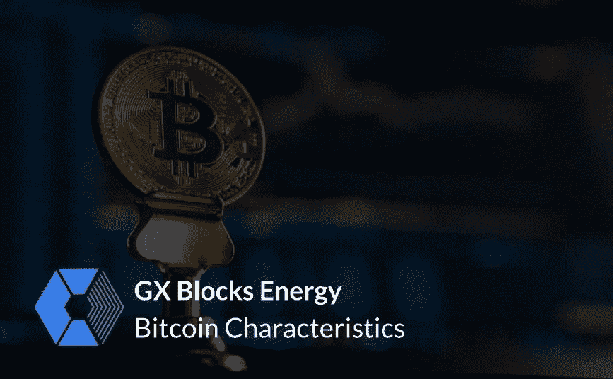

# 比特币特征

> 原文：<https://medium.com/coinmonks/bitcoin-characteristics-8c9b2f1ae8?source=collection_archive---------12----------------------->

## 你只需要知道…

[GX Blocks](http://www.gxblocks.com)

比特币是一种运行在分布式计算机网络上的全球数字分散货币，由中本聪于 2009 年 1 月在 T4 创造。比特币的创造者最初描述了对“ ***基于密码证明的电子支付系统，而不是*** [***信任***](https://wire.insiderfinance.io/blockchain-network-nodes-trust-in-bitcoin-97e38dcd3ac9) ”的需求。BTC 的运作不受任何中央控制，也不受政府或银行的监督。

交易通过位于世界各地的节点从加密系统进行验证，并记录在一个叫做区块链的公共分类账上。

> 比特币是第一种加密货币。
> 
> 比特币正在改变整个世界。它将成为未来的货币。
> 
> 比特币是一种数字货币，允许在互联网上进行安全的点对点交易。

## 比特币方面—特征

*   分散
*   透明度
*   开源
*   快速、简单且安全
*   隐私
*   价值
*   未经许可

# 分散

> 比特币的整个网络是去中心化的。

比特币最关键的一个特点就是**去中心化**。**比特币节点**由全球数百万矿工分发，不像传统货币(法定货币)那样存在中央权力，由中央权威机构(银行、政府)发行，没有任何实体可以阻止它。没有一个中央实体来关闭网络、更改协议或编辑分类账。这些都是基于共识协议。这意味着任何类型的网络变革只有在 51%的用户同意的情况下才能实现。

> 全世界的每个人都可以成为这个网络的一员。

# 透明度

正如我们已经提到的，每笔交易都存储在**公共账本**、区块链中，这自动意味着**透明**。使用这种数字货币的人可以保持匿名；**没有人可以知道个人或财务信息**，尽管交易都记录在这个账本上，并在生态系统中公开。必须激励网络用户信任网络。

# 开源

比特币**开源**。比特币的设计是公开的，全世界的开发者都可以参与网络的改进和发展。没有人拥有或控制比特币。

# 快速、简单且安全

其中最重要的特点就是交易过程的**快捷**和**安全**。比特币有可能**以**低交易成本**在**几秒钟**或**分钟**内向全球**汇款。比特币比其他任何交易方式都要快。值得一提的是，交易是**点对点**或 **P2P** ，这意味着**不需要第三方**来完成和验证交易。然后，用户只需几分钟就可以在比特币网络中建立地址。用户不需要任何法律文件(如在银行)，唯一的事情是创建一个非常强的密码，记住它是很重要的，因为它是不可恢复的！

# 隐私

反复提到匿名并不重要，因为事实上没有办法跟踪用户的一切。没有任何法律文件的要求，可以帮助确定该人。所以，政府不可能从每个账户都知道谁是幕后黑手。

# 价值

比特币的价格在短短十年多的时间里呈指数增长，从 2011 年的不到 1 美元到 2021 年 11 月的超过 68000 美元。它的价值来源于几个方面，包括它的相对稀缺性、市场需求和开采过程中的生产成本(T21)。

# 未经许可

比特币挖矿允许**任何人**通过工作证明或节点机制在网络中作为验证者进行交易和加入。这些区块链上的数据是公开的，账本的完整副本保存在全球各地。这就是为什么**很难审查**或**入侵**这些系统。这个区块链没有任何人控制它，并保持你的隐私，因为没有必要识别自己获得一个地址和执行交易。

> 比特币人人都有！

# 总结一下…

**主要方面——比特币的特点**上面提到了，这也是它区别于传统货币的地方。从 2009 年[到现在，比特币网络的每个方面都在不断优化、成熟和专业化。](/gx-blocks/the-history-of-blockchain-9cce9e619ab1)

[GX Blocks](https://gxblocks.com/)

*如果您喜欢这篇文章，请务必关注* [*GX 版块*](https://medium.com/u/2bdbbc23c69?source=post_page-----a888d6c8f735-----------------------------------) *了解更多关于区块链科技的教育内容。*

> ***我们的邮寄地址:【info@gxblocks.net】***
> 
> **订阅我们的快讯待更新* [***此处***](https://t.co/YHXeSlXykY) *。**
> 
> ****www.gxblocks.com*GX 区块能源—官网:***

**[**推特**](https://twitter.com/GxBlocks) | [**领英**](https://gr.linkedin.com/company/gx-blocks-energy)**

***版权所有 2021 GX 区块能源有限公司***