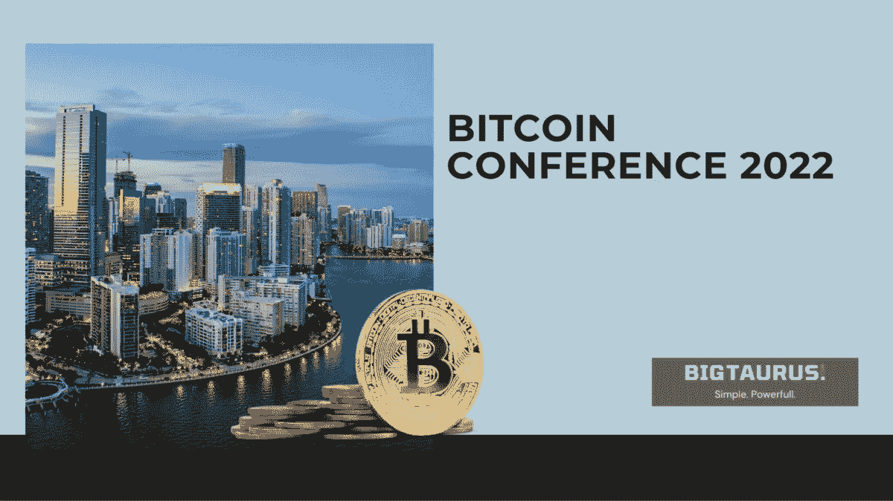
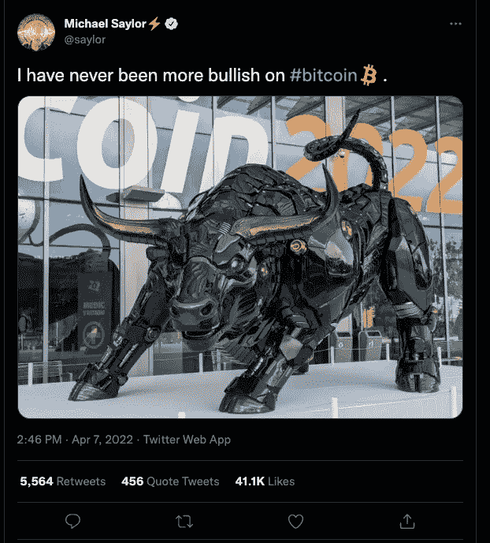

# 比特币大会 2022

> 原文：<https://medium.com/coinmonks/bitcoin-conference-2022-c23caa3d1a51?source=collection_archive---------65----------------------->

上周举行了 2022 年比特币大会，这是由 T2 市长 Francis Suarez 召集的最著名的加密货币的最大规模的世界会议。

**它带来了什么消息**？

**历史上最大的加密会议比特币大会 2022** 在迈阿密海滩会议中心举行，售出超过 25000 张门票。

*迈阿密市长弗朗西斯·苏亚雷斯*从未掩饰过他对比特币的热情，恰恰相反。自从他当选市长以来，他一直对区块链提供的优势表现出兴趣，例如他已经接受了 **CityCoins** 的技术(city coins on Stacks，一个允许使用比特币智能合约的网络；使用户参与他们所在城市的活动的有效方法)。

苏亚雷斯竭尽全力让迈阿密成为未来经济的先锋城市。这也是比特币制造者选择佛罗里达州首府举办世界上最重要的比特币大会的原因。

开幕式无疑令人印象深刻，人们发现了一座完美体现比特币的雕像:一只长着激光眼睛的机械公牛。

这座雕像重现了著名的华尔街公牛，这是艺术家安东尼奥·迪·莫迪卡安装在纽约证券交易所前的雕塑。

苏亚雷斯本人随后在迈阿密召开了 2022 年比特币大会:

> 市长说:“比特币有能力为那些无法进入银行的人，以及我们社区中因通货膨胀和浪费而大量减少的穷人创造财富。”。

为此，他概述了他的计划，即到 2024 年将比特币和区块链“带到我们社会的每一个角落”。他总结说，下一任美国总统应该是支持加密的。“也可能是我……不，今年不会了，”他开玩笑地补充道。

在这次活动中，宣布了许多交易，行业内的知名人士也发表了讲话。但许多初创公司也在努力创办与比特币相关的新公司。

在到场的名人中，美国国家橄榄球联盟超级巨星小奥德尔·贝克汉姆说:

> “美联储印刷了大量美元来对抗通胀，但现在每个人都知道，对抗通胀只有比特币。当人们从这条路经过时，他们就再也不会回来了”。

瑟琳娜·威廉姆斯也宣称自己是加密和比特币的粉丝。

贝宝创始人、比特币的大力倡导者彼得·泰尔没有错过他的出席。他反对用于对抗比特币的政治正确的环境可持续性规则，称比特币代表着“世界上最诚实的市场”。

由于国内公共秩序的原因，萨尔瓦多总统不得不放弃在迈阿密的活动。而*墨西哥亿万富翁 Ricardo Salinas* ，曾经非常贫穷，强调了生活在一个通货膨胀率非常高的国家意味着什么，以及比特币作为中期价值储存手段如何是唯一的解决办法:*“当你买房子时，你不会每十分钟就看一次它的价值。你必须对比特币做同样的事情:买下来，放起来，十年后再看一眼”。*

来自迈阿密 2022 年比特币大会的其他消息包括两个州将比特币作为法定货币的意愿。

来自墨西哥的参议员 Indira Kempis 说她想提交一份关于金融科技和数字货币的法案。

他的目标是让议会投票表决一项革命性的法律:比特币成为法定货币。

*葡萄牙自治区马德拉岛主席米格尔·阿尔布克尔克*也想让比特币合法化:*“我相信未来，我相信比特币”。*

2022 年比特币大会的大部分内容都集中在人们熟悉的话题上:如何对加密货币进行估值、购买、存储、出售、营销和消费。

2022 年比特币大会留下了几个未解决的重要现实。它很少关注解决加密行业内部的问题，加密行业仍然是一个不受监管的金融前沿，充斥着不愿自我监管的公司。

*如果你想进入加密的世界，但是你没有一个可以获取信息的参考点，请联系我们*

[加入 BGT 俱乐部](https://bigtaurus.com/affiliazione-bt/)

> 加入 Coinmonks [电报频道](https://t.me/coincodecap)和 [Youtube 频道](https://www.youtube.com/c/coinmonks/videos)了解加密交易和投资

# 另外，阅读

*   [用于 Huobi 的加密交易信号](https://coincodecap.com/huobi-crypto-trading-signals) | [Swapzone 审查](/coinmonks/swapzone-review-crypto-exchange-data-aggregator-e0ad78e55ed7)
*   最佳[密码交易机器人](https://coincodecap.com/best-crypto-trading-bots) | [购买索拉纳](https://coincodecap.com/buy-solana) | [矩阵导出评论](https://coincodecap.com/matrixport-review)
*   [Coldcard 评论](https://coincodecap.com/coldcard-review) | [BOXtradEX 评论](https://coincodecap.com/boxtradex-review)|[uni swap 指南](https://coincodecap.com/uniswap)
*   [比特币基地评论](/coinmonks/coinbase-review-6ef4e0f56064) | [德里比特评论](/coinmonks/deribit-review-options-fees-apis-and-testnet-2ca16c4bbdb2) | [FTX 评论](/coinmonks/ftx-crypto-exchange-review-53664ac1198f)
*   [联合国硬币评论](https://coincodecap.com/unocoin-review) | [最佳加密赌注硬币](https://coincodecap.com/best-crypto-staking-coins)