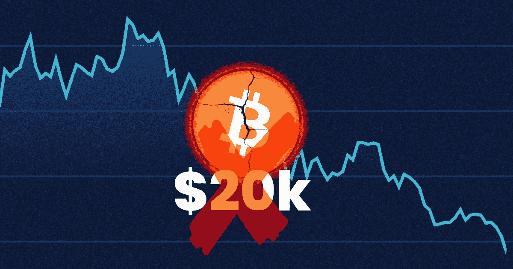

# 比特币可能会跌破 2 万美元

> 原文：<https://medium.com/coinmonks/bitcoin-could-go-below-20-000-13125ab52c1?source=collection_archive---------48----------------------->

这就是为什么我认为比特币可能会低于 20，000 美元。在我进入这些原因之前，我认为重要的是，我长期看好比特币。但尽管如此，我从未忘记比特币看跌的一面。很多人在情感上非常依恋比特币，当你对比特币做出负面预测时，人们会发疯。我保证这种类型的人将会在加密中失败。所以在读这篇文章的时候，试着保持开放的心态。

# 比特币跟随股市

在过去的几个月里，比特币一直密切关注着股市。随着股市下跌，比特币也下跌了，但比特币下跌的百分比更多。在恐惧时期，资金会从风险更高的股票转移到更安全的股票。因此，远离科技股，转向可口可乐这样的股票。比特币属于高风险类别，这就是它一直下跌的原因。

# 熊市中的标准普尔 500

标准普尔 500 短暂进入熊市。从高点下跌 20%就被认为是熊市。在熊市期间，标准普尔 500 平均下跌 33%。这意味着市场可能会再下跌 13%或更多。

# 如果标准普尔 500 下降更多会发生什么？

如果标准普尔 500 下跌更多，那么比特币也会下跌更多。如果股市下跌，比特币图表上的阻力点将不会存在。它们是相互关联的，所以如果你在交易比特币时不看 SPY 或 ES，你就是在盲目交易。

# 我的计划

这是我对这个市场的计划。我确实认为，基于目前发生的一切，股市可能会进一步下跌。我主要交易加密期货。我打算做的是，如果我长一个密码，我会确保它是一个快速长。如果短的东西，这将是一个更长的贸易。市场仍处于整体下跌行情中，因此逆势而动没有意义。感谢阅读，并关注更多类似的内容。

> 加入 Coinmonks [电报频道](https://t.me/coincodecap)和 [Youtube 频道](https://www.youtube.com/c/coinmonks/videos)了解加密交易和投资

# 另外，阅读

*   [5 款最佳加密交易终端](https://coincodecap.com/crypto-trading-terminals) | [最佳 DeFi 应用](https://coincodecap.com/best-defi-apps)
*   [最佳网上赌场](https://coincodecap.com/best-online-casinos) | [币安评论](/coinmonks/binance-review-ee10d3bf3b6e) | [BitMEX 评论](https://coincodecap.com/bitmex-review)
*   [麻雀交换评论](https://coincodecap.com/sparrow-exchange-review) | [纳什交换评论](https://coincodecap.com/nash-exchange-review)
*   [美国最佳加密交易机器人](https://coincodecap.com/crypto-trading-bots-in-the-us) | [经常性评论](https://coincodecap.com/changelly-review)
*   [在印度利用加密套利赚取被动收入](https://coincodecap.com/crypto-arbitrage-in-india)
*   [Godex.io 审核](/coinmonks/godex-io-review-7366086519fb) | [邀请审核](/coinmonks/invity-review-70f3030c0502) | [BitForex 审核](https://coincodecap.com/bitforex-review)