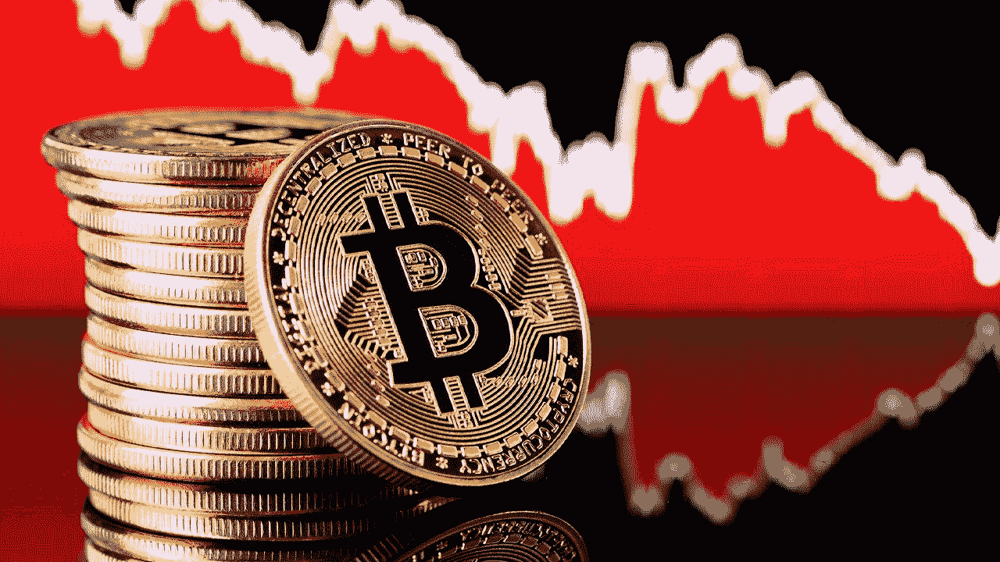
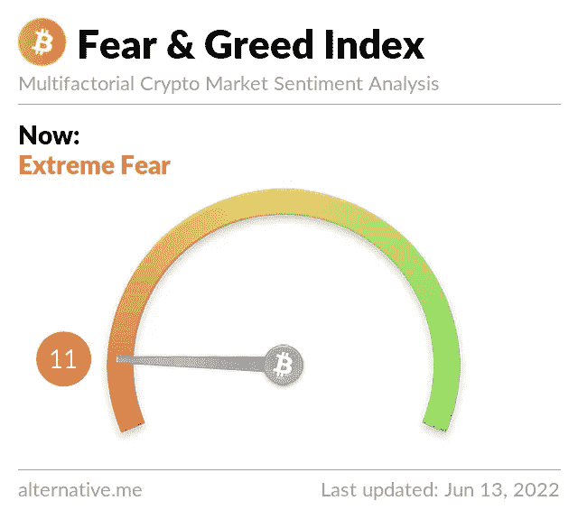

# 比特币崩盘原因！为什么是今天？

> 原文：<https://medium.com/coinmonks/bitcoin-crash-reason-why-today-359f5684975f?source=collection_archive---------17----------------------->

[https://chainoflegends.com/](https://chainoflegends.com/)

B itcoin 和加密货币市场今天(6/13)跌至新低。这个价格是在 2020 年 12 月的上一轮牛市中经历过的。全球市值也从昨天的 1.10 万亿美元降至 1 万亿美元以下。

> “比特币崩盘”的原因是什么？
> 为什么是今天？！
> 专家怎么说？

## 为什么今天 crypto 崩溃了？

6 月 13 日，比特币和加密货币市场跌至新低。这个价格是在 2020 年 12 月的上一轮牛市中经历过的。全球市值也从昨天的 1.10 万亿美元降至 1 万亿美元以下。如今，加密货币的市值已降至 9750 亿美元，而几乎每枚顶级硬币的价值都比 ATH 低 70%至 90%。

这一触发因素可能是由于最近美国通胀消息导致投资者大量抛售而发生的。投资者也在继续远离风险资产，这也反映在股票市场上。

alternative.me

最大、最受欢迎的加密货币比特币已跌至 24000 美元，而从以太坊开始的几乎所有替代货币自周末以来都经历了流血价格。

以太坊已经跌至 14 个多月来的最低水平，在撰写本文时交易价格约为 1200 美元。BNB 下跌近 12%，徘徊在 220 美元关口附近。

## 专家怎么说？

专家表示，加密价格跳水表明投资者的风险偏好下降。他们对风险资产持谨慎态度。考虑到所有的不确定性和波动性，加密被认为是投资目的中最凶猛的工具之一。

“加密货币一直受到美联储的很大压力，过去几个月来提高了利率以对抗通胀。加密投资平台 Mudrex 的联合创始人兼首席执行官 Edul Patel 表示:“比特币、以太坊和大多数加密货币在数据显示美国通胀创下 40 年新高后出现广泛抛售，周末遭受损失。

由于投资者似乎已经恐慌，自上周五以来，加密清算的数量一直很高。比特币和以太坊从 14%暴跌至 18%，目前交易价格最低，分别为 24000 美元和 1200 美元。这种看跌趋势可能会在未来几天继续。

虽然替代硬币的表现历来不如比特币，但这一次，它们面临潜在监管障碍的额外压力。CoinDesk 的一份报告援引一位专家的话说，只有少数替代硬币可能在这样的市场波动中幸存下来。

加密交易所 BuyUcoin 的首席执行官 Shivam Thakral 表示，不断上涨的食品、天然气和能源价格给加密市场带来了巨大压力，因为比特币和以太网在过去 24 小时内出现了两位数的损失。

“在消费者价格指数报告了自 1981 年以来的最高通胀率后，全球金融市场出现了急剧下滑，”Thakral 说。

“预计未来几周市场将继续波动，全球各国将继续报告高通胀数据。目前密码价格的下跌允许投资者以 2021 年的价格购买密码，我们预计经验丰富的投资者将利用这一下跌，”他补充说。

crypto exchange Vauld 的首席执行官 Darshan Bathija 表示，大多数投资者担心，除非通胀数据很快开始下降，否则美联储可能不得不以比预期更快的速度加息，从而收紧货币政策。

所有这些或好或坏的消息和猜测都无法弥补加密社区遭受的损失，尤其是当卢娜崩溃的伤口还没有完全愈合的时候。这种市场下跌趋势不仅对低市值投资者来说难以承受，对初创公司和新项目来说也更难承受。

但是游戏和《传奇链》的团队成员在这种可怕的情况下从不退缩。我们总是尽力优化项目和我们社区的进度！

不要被 cryptos 的野蛮本性所压倒，因为这也会过去的！别忘了，困难的时候我们永远是彼此的后盾，我们会一起成长！

更多的文章即将发表。敬请期待！

👇加入我们，我们一起成长👇

**网站和社交媒体**

**🔹网址:(******)****

****🔹电报频道:(**[**)https://t.me/chainoflegends**](https://t.me/chainoflegends)**)****

****🔹不和:(【https://discord.gg/chainoflegends】****)********

****🔹推特:(**[**)https://twitter.com/chainoflegends**](https://twitter.com/chainoflegends)**)****

****🔹YouTube:(**[**https://www.youtube.com/c/chainoflegends**](https://www.youtube.com/c/chainoflegends)**)****

****🔹组:(******)******

> ****加入 Coinmonks [电报频道](https://t.me/coincodecap)和 [Youtube 频道](https://www.youtube.com/c/coinmonks/videos)了解加密交易和投资****

# ****另外，阅读****

*   ****[新加坡十大最佳加密交易所](https://coincodecap.com/crypto-exchange-in-singapore) | [购买 AXS](https://coincodecap.com/buy-axs-token)****
*   ****[投资印度的最佳加密软件](https://coincodecap.com/best-crypto-to-invest-in-india-in-2021) | [WazirX P2P](https://coincodecap.com/wazirx-p2p)****
*   ****[西班牙 5 大最佳文案交易平台](https://coincodecap.com/copy-trading-spain)****
*   ****[Pionex 双重投资](https://coincodecap.com/pionex-dual-investment) | [AdvCash 审查](https://coincodecap.com/advcash-review) | [支持审查](https://coincodecap.com/uphold-review)****
*   ****[面向开发者的 8 个最佳加密货币 API](https://coincodecap.com/best-cryptocurrency-apis)****