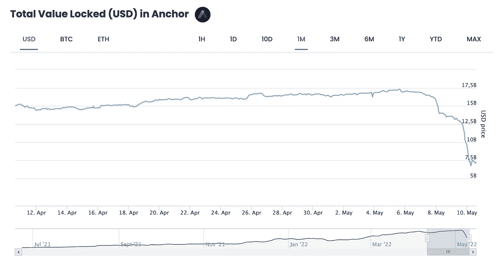
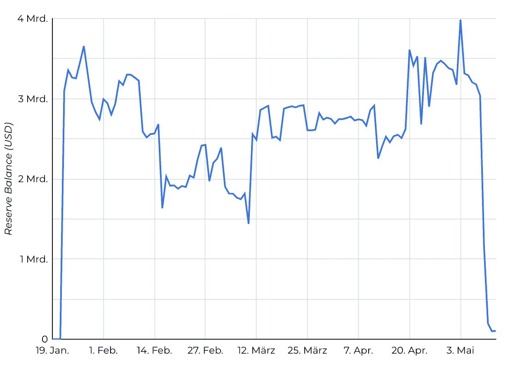

# 比特币崩盘:稳定的比特币 UST 是原因

> 原文：<https://medium.com/coinmonks/bitcoin-crash-stablecoin-ust-is-the-cause-9d34c9595291?source=collection_archive---------42----------------------->

Source: [Bitcoin.com](http://bit.ly/3w2fgTu)

几天前，知名算法 Stablecoin UST 短暂下跌近 35%，引发比特币崩盘。为了恢复一美元的原始等值，UST 背后的组织卢纳基金会卫队(LFG)动用了其比特币储备，导致比特币市场出现大幅抛售。

# 撞车的导火索

出售 Stablecoin 的原因是锚协议。它的用户可以获得 20%的 UST 稳定币利率。然而，越来越多的用户对 UST 失去了信心，开始一个接一个地从协议中撤资。这种情绪越来越强烈，导致了对数字银行的大抢购。

三天之内，Anchor 协议的资本从 160 亿美元减半至 75 亿美元。UST 代币不像稳定币[美元系绳(USDT)](https://coinmarketcap.com/currencies/tether/) 那样由资产支持，而是由月亮代币在算法上支持。当新 UST 被铸造时，月神令牌被烧掉，所以有更多的供应，这意味着价格相应下降。当 UST 代币低于一美元时，UST 被烧掉，新的月亮代币被铸造出来。

Source: [Stelareum](https://www.stelareum.io/en/defi-tvl/protocol/anc.html)

# **UST 的大问题**

这两种加密货币相互通信，这在大多数情况下确保了稳定性。但是，有一个很大的问题:
*如果 UST 陷落，更多的新月币被铸造出来，从而增加了加密货币的通货膨胀。在最坏的情况下，它保证了卢娜和 UST 的价格同步下降，从而稳定了硬币的价格。*

为了应对这个问题，Luna Foundation Guard 最近积累了大量的比特币，确切地说他们有 80，300。这使他们成为迄今为止除了 MicroStrategy 之外最大的比特币持有者之一。如果 Luna-Token 下跌到足以威胁到 UST 与美元挂钩的汇率，Luna Foundation Guard 将向 UST 出售部分比特币储备，以稳定 UST 币。当稳定币低于 0.98 美元时，需要这样做。

随着对锚协议信任的丧失，这种确切的情况发生了。UST 令牌和露娜同时崩溃了。与此同时，UST 代币的交易价格仅为 60 美分左右。Luna 在过去 24 小时内损失了一半的价值，目前交易价格约为 32 美元。然后，卢娜基金会卫队试图用比特币储备稳定 UST，并在此期间彻底清空这些储备。超过 52，000 BTC 显然是由 LFG 直接出售的，而其他则被“借给”场外交易商购买 UST。除了普遍困难的市场形势，这笔等值约 40 亿美元的出售很可能是昨天比特币暴跌的主要原因。

# 卢娜的批评者是对的

当 Luna Foundation Guard 在 3 月份第一次购买比特币时，它在比特币社区内引起了很多讨论。毕竟，该基金会购买了大量的 BTC，这与替代硬币的成功有关。主要讨论的是 Luna 协议的可持续性，因为如果该项目失败，这将对比特币价格产生直接影响，如上所述。

昨天之后，现在很明显，对露娜的批评是正确的。协议的开发者无法确保项目的可持续性。虽然该基金会现在已经出售了所有的比特币股份，但 UST 的交易价格仍在 0.9 美元左右，比其目标面值低 10%。UST 元是否会以及如何回到 1 美元的水平仍有待观察。

另一个批评点是露娜基金会卫队的激进营销。该基金会的主席权道(Do Kwon)仍在 4 月初表示，该基金会希望成为仅次于中本聪的第二大比特币所有者。许多 altcoin 项目做出的重大承诺，但大多数都没有(或无法)遵守，这是比特币社区经常批评的一点。露娜基金会守卫现在加入了这个名单。

Source: [LFG](https://dashboard.lfg.org/)

# 结论

即使是该项目的最大批评者可能也没有想到 Luna 的比特币 Stablecoin 项目会这么快失败。此外，正如人们担心的那样，该项目对比特币价格产生了直接影响。昨日暴跌 11%，短暂跌破 3 万美元关口。最后，我们可能会很高兴 Luna 项目失败了，因为如果基金会持有更多比特币，这可能会导致更大的价格下跌。目前，没有人能说 Luna 项目将如何继续。在 BTC 储备被完全抛售后，基金会现在只有几种选择来再次稳定稳定的货币。Luna 的问题表明，在加密货币的世界里，文字和现实往往相距甚远，加密领域对这类项目持有某种基本的怀疑态度通常是恰当的。