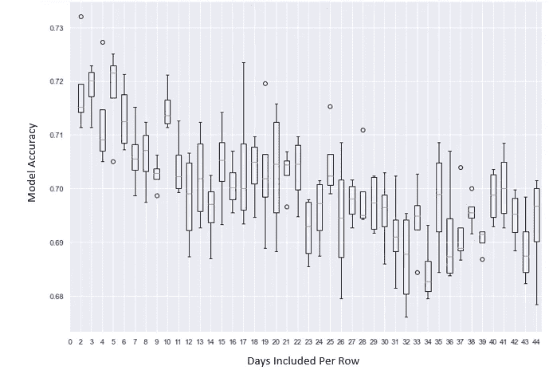
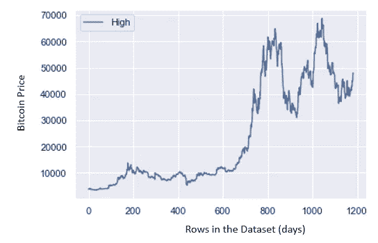
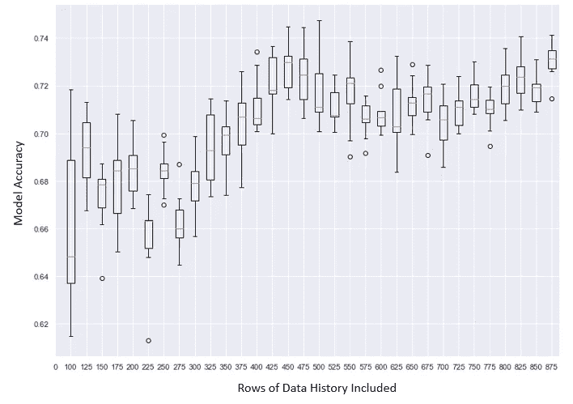
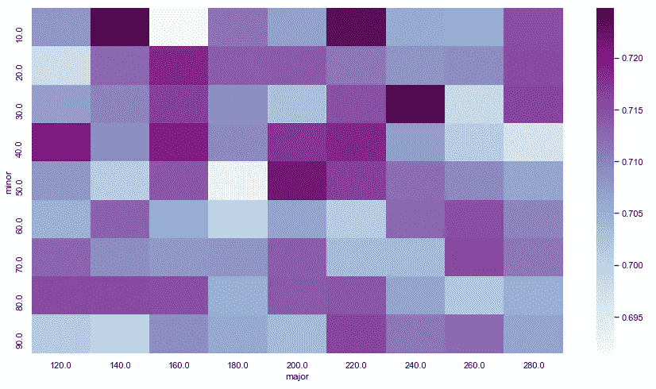

# 比特币日高预测

> 原文：<https://medium.com/coinmonks/bitcoin-daily-high-prediction-b7d98a433a07?source=collection_archive---------21----------------------->

使用机器学习分类算法来识别指示近期价格运动的价格模式。


# **问题介绍**

比特币是当今世界上领先的数字货币，被持有者用于交易和价值储存。更广泛采用比特币的一个障碍是其价格不稳定，这造成了大多数投资者都不舒服的风险水平。为了更好地理解比特币价格波动背后的驱动因素，并为潜在投资者提供降低风险的工具，需要能够更准确地预测比特币价格变化的模型。

# **项目概述**

大多数股票和加密货币市场价格的预测模型都是基于时间序列的，如自回归综合移动平均(ARIMA)或机器学习算法，如递归神经网络(RNN)和长期短期记忆(LSTM)。市场价格历史的技术分析是预测市场变动的时间序列方法的替代方法，因为它基于最近价格历史中的模式。众所周知的模式如 W *边缘*、*下降*和*上升三角形*和*头肩顶*被用作可能价格变动的指标。基于价格模式识别的机器学习模型，而不是基于时间序列数据的预测，可以提供更多工具来更好地预测比特币波动性的变化。

大约三年的比特币价格数据以 csv 文件的形式从 Yahoo Finance 下载。这些数据由雅虎在 https://www.yahoofinanceapi.com/免费慷慨提供。同一时期的历史*恐惧和贪婪指数*数据通过 Alternate Me 在[https://api.alternative.me/](https://api.alternative.me/)提供的免费 API 下载。该指数是当前市场状况的一个有用指标，可从多种来源计算得出，用于量化投资者对比特币的情绪和信心。Ta 库用于计算历史数据集的技术指标*相对强度指数* (rsi)，随机振荡指标 *stoch_k* 和 *stoch_d* 。固定长度的每日价格模式是通过将多行每日高点按顺序转换为多列以在单行数据中表示一系列价格而从比特币价格历史中生成的。最后，使用 50 和 250 天的数据以及指示 50 SMA 值何时大于 250 SMA 的“Signal”标志从历史价格数据计算出一对简单移动平均值(SMA)并将其添加到训练数据集中。有关如何为机器学习编辑和准备数据的技术细节，请参见本项目的 GitHub 资源库[此处的](https://github.com/jrmerwin/Udacity_data_science_Proj_4/blob/main/Merwin_Capstone.ipynb)。

# **解决问题的策略**

该项目正在探索的理念是使用机器学习算法，这种算法擅长识别分类数据中的模式，以识别与近期上涨相关的比特币价格模式。模式识别模型将使用与技术分析类似的方法，提供时间序列建模的替代技术。对于该项目，选择了 XGBoost 分类器算法，其是具有高性能分类历史的梯度提升树算法的实现。分类器将被训练出历史每日高价格模式，该模式具有指示随后一天的高点是否高于当前天的二进制标签。

# **模型性能指标**

模型性能将使用精度指标进行测量。准确性指标的计算方法是正确预测总数(真阳性和真阴性)与预测总数(真阳性、真阴性、假阳性和假阴性)之比。选择这一指标是因为模型输出是对第二天高点的二元预测，因此它有两种正确的方式(真正的正和真正的负都应被视为正确)。因此，我们希望使用准确性来调整模型，以最大化正确预测的总数，包括正面和负面预测，这与其他度量标准(如精度或召回)相反，后者侧重于正面预测的数量。

# 探索性数据分析

从雅虎财经下载了大约三年的比特币价格数据，作为 csv 文件。这些数据是雅虎在 https://www.yahoofinanceapi.com/时间[慷慨地免费提供的。同一时期的历史恐惧和贪婪指数数据是使用位于 https://api.alternative.me/](https://www.yahoofinanceapi.com/)[的 Alternate Me 提供的免费 API 下载的。该指数是当前市场状况的一个有用指标，通过各种来源计算得出，以量化投资者对比特币的情绪和情感。Ta 库用于计算技术指标相对强弱指数(rsi)，以及历史数据集中的随机振荡指标 stoch_k 和 stoch_d。固定长度的每日价格模式是从比特币价格历史中生成的，方法是将每日高点的行按顺序转置成列，以便在单行数据中表示一系列价格。最后，使用 50 和 250 天的数据以及指示 50 SMA 值何时大于 250 SMA 值的“信号”标志，从历史价格数据计算出一对简单移动平均线(SMA ),并将其添加到训练数据集中。关于如何为机器学习创建和准备数据的技术细节可以在这个项目的 GitHub 知识库中找到。](https://api.alternative.me/)

探索了数据集的几个方面，并测量了工程特征的最佳范围。迭代方法用于测试工程特征的一系列值，其中该系列中的每个值用于产生模型并多次测量其精度，以产生精度箱线图。

**价格模式中包含的最佳天数**

该模型使用一组比特币的历史日高值，从中识别相关的模式，并增加第二天的日高。为了确定模式识别的最佳历史观测值数量，基本 XGBoost 模型在 2 到 45 天的范围内迭代，对每个天值取 5 个独立模型准确度分数的平均值。从结果中生成每历史天数的平均准确度分数的箱线图，以便确定最佳数量。



该图表明，一个令人惊讶的小范围的日高点，在 3 和 5 之间，产生了大约 0.73 的价格预测的最佳精度。将日高点的数量增加到 4 个以上会导致精确度逐渐下降，直到大约 30 天，在这一点上，精确度稳定在大约 0.68 和 0.7 之间振荡。使用此信息，我们将继续每天观察值为 4。

**优化训练数据中包含的历史长度**

在合并、计算指标以及在计算指标之前删除因出现 NAs 而导致的行之后，完整的数据集包含大约 1000 行，或略少于 3 年的历史比特币价格。一个数据集的图表显示，比特币的每日高点在 2020 年经历了一段时间的爆炸式增长(在数据集的第 650 天左右)，然后在 2021 年初稳定下来。



由于该模型使用价格模式作为输入，因此包括爆炸式增长期可能无法准确反映自 2021 年以来我们所处的当前价值振荡期。在数据集中包含的日期范围内对模型进行迭代，以确定包含在训练数据中的最佳天数，从而获得最大的准确性。



得到的精度图显示，通过将行数增加到 375 以上直到大约 475，模型的精度得到了提高。增加行数超过 475 会导致精确度略有下降，直到我们达到大约 800 时，随着包含行数的增加，精确度又开始增加。由于 875 行的最大值给出了大约 0.73 的精度，这大约相当于从 450 行测量的精度，并且 875 行将达到数据集的最大限制，因此选择 450 行作为我们的最佳数字似乎是合理的。

**优化简单移动平均线对**

简单移动平均线(SMA)是帮助投资者预测资产价值长期趋势的常用技术指标。通常，使用从 50、100 和 200 天生成的 SMA。由于 SMA 是直接从历史数据集中计算的，我们可以使用迭代过程来确定特定的 SMA 组合是否在模型中产生不同水平的准确性。与之前使用的类似的迭代方法，用于测试 SMA 值范围对模型精度的影响。



热图显示分数在测试的组合中基本上是随机分布的，因此 SMAs 将使用 50 天和 250 天的标准值。多次重复网格和每对运行更多次证实了准确性和给定对的天数之间缺乏相关性(数据未显示)。

# **方法论**

所有数据处理步骤和模型拟合的准备都是使用 python 进行的。流程中的每一步都被模块化为一个可执行函数，代码如下。一个完整的项目代码库可以在[这里](https://github.com/jrmerwin/Udacity_data_science_Proj_4/blob/main/Merwin_Capstone.ipynb)找到。

```
*#Functions for data processing, feature engineering, and data optimization*

**def** cross_fold_accuracy(X, y):
    '''
    input - 
        X - the features list from training data
        y - the label list from training data
    output - an accuracy score
    '''    
    *# define the classifier*
    model **=** XGBClassifier()
    *# evaluate the model with cross validation*
    cv **=** RepeatedKFold(n_splits**=**10, n_repeats**=**3, random_state**=**1)
    n_scores **=** cross_val_score(model, X, y, scoring**=**'accuracy', cv**=**cv, n_jobs**=-**1, error_score**=**'raise')
    *# print performance and return accuracy score*
    *#print('Accuracy: %.3f (%.3f)' % (mean(n_scores), std(n_scores)))*
    accuracy **=** mean(n_scores)

    **return** accuracy **def** row_transpose(index, rows, BTC_data):
    '''
    input - 
        index - the row number of the dataset to start transposition on
        rows - the number of dates (rows) to transpose into columns and add to the dataframe
        BTC_data - the dataframe upoin which to act
    output - a dataframe with a single row of the transposed dates and the row values of the final date in the series
    '''
    *#transpose the daily High column*
    High_row **=** pd**.**DataFrame(BTC_data['High']**.**iloc[index**-**rows:index])
    High_row_T **=** High_row**.**transpose()
    High_row_T **=** High_row_T**.**reset_index()**.**drop(columns**=**['index'])

    *#isolate the selected row for merging*
    row_to_merge **=** pd**.**DataFrame(BTC_data**.**iloc[index**-**1])
    row_to_merge **=** row_to_merge**.**transpose()
    row_to_merge **=** row_to_merge**.**reset_index()**.**drop(columns**=**['High','index'])

    *#merge and change the column names*
    merged_row **=** pd**.**concat([High_row_T, row_to_merge], axis**=**1)
    **for** i **in** range(rows**+**1):
        merged_row**.**rename(columns**=**{ merged_row**.**columns[i**-**1]: i }, inplace **=** **True**)
        merged_row**.**columns **=** [*****merged_row**.**columns[:**-**1], 'week_year_numeric'] 

    **return** merged_row **def** iterate_dataframe(starting_index, rows, BTC_data):
    '''
    input - 
        starting_index = scalar value for starting row in dataframe, 
        rows = number of days (rows) prior to index to transpose, 
        BTC_data = dataset
    output - transposed row values as columns
    '''
    *#set the parameters*
    *#print('iterating over rows...')*
    total_rows **=** len(BTC_data**.**index)
    row_increase **=** 0

    *#Get first row*
    result **=** row_transpose(starting_index, rows, BTC_data)

    *#transpose rows*
    **for** i **in** range(starting_index,total_rows):
        row_increase **=** row_increase**+**1
        inter_results **=** row_transpose(starting_index**+**row_increase, rows, BTC_data)
        result **=** result**.**append(inter_results)

    *#rename transposed columns* 
    result **=** create_label(starting_index, rows, result)
    result**.**rename(columns **=** {'Day_0':'week_numeric'}, inplace **=** **True**)

    **return** result **def** generate_lists(df):
    '''
    input - Dataset containing features and label identified as 'Label'
    output - 'labels' = Label list, 'features' = Features list, 'feature_list' = and a list of feature names
    '''
    *#generate the labels and the features*
    labels **=** np**.**array(df['Label'])
    features **=** df**.**drop('Label', axis **=** 1)

    *# Saving feature names as list*
    feature_list **=** list(features**.**columns)

    *# Convert features to array*
    features **=** np**.**array(features)

    **return** labels, features, feature_list **def** create_label(index, rows, df):
    '''
    input - 
        index - the row number to start transposition on
        rows - the number of dates to transpose as columns and the dataframe
        df - the dataframe upoin which to act
    output - a dataframe with the final daily high value removed, repalced with a label column
    '''
    *#replace row names*
    **for** i **in** range(rows**+**1):
        row_name **=** 'Day_' **+** str(i)
        df**.**rename(columns**=**{ df**.**columns[i**-**1]: row_name }, inplace **=** **True**)

    *#drop final day and create label*
    untimate_col **=** 'Day_' **+** str(rows)
    penultimat_col **=** 'Day_' **+** str((rows**-**1))
    df['Pre_Label'] **=** df[untimate_col] **-** df[penultimat_col]

    df**.**loc[df['Pre_Label'] **<=** 0, 'Label'] **=** 0 
    df**.**loc[df['Pre_Label'] **>** 0, 'Label'] **=** 1 

    *#clean up NAs and auxiliary columns*
    df **=** df**.**drop(columns**=**['Pre_Label', untimate_col])
    df **=** df**.**dropna()

    **return** df **def** SMA(data, period**=**30, column**=**'High'):
    '''
    input - 
        data - dataset containing historical daily prices
        period - the number of days for which to calculate the moving average
        column - the name of the column containing the value to be averaged
    output - the simple moving average for the indicated period (days)
    '''
    **return** data[column]**.**rolling(window**=**period)**.**mean() **def** SMA_minor_major(minor_SMA, major_SMA, data):
    '''
    input - 
        minor_SMA - the number of days from which the smalled SMA will be calculated
        major_SMA - the number of days from which the larger SMA will be calculated
        data - dataframe containing the historical price information
    output - the input dataframe with simple moving average columns added for the indicated days
    '''
    *#add the 10 and 50 day*
    data['minor_SMA'] **=** SMA(data, minor_SMA)
    data['major_SMA'] **=** SMA(data, major_SMA)

    *# Get buy and sell signals*
    data['Signal'] **=** np**.**where(data['minor_SMA'] **>** data['major_SMA'], 1, 0)
    data['Signal_vol'] **=** data['minor_SMA'] **-** data['major_SMA']
    **return** data **def** prep_for_ml(prepared_data, data_SMA_df, total_days**=**400):
    '''
    input - 
        prepared_data - a dataframe containing the features including the transposed rows as previous day high column values
        data_SMA_df - a dataframe containing the calculated SMA values
        total_days - value indicating the number of rows counted from the end to include in the output dataframe
    output - a merged data set containing all the features and label needed for model training
    '''
    *#merge on the date*
    merged_data **=** prepared_data**.**merge(data_SMA_df, left_on**=**'date_format', right_on**=**'date_format', suffixes**=**('', '_y'))
    *#clean up the columns and NAs*
    merged_data**.**drop(columns**=**['High', 'date_format', 'day_count_y', 'Open_y', 'Low_y', 'Close_y', 'Adj Close_y', 'Volume_y',
                          'rsi_y', 'stoch_k_y', 'stoch_d_y', 'Fear_N_Greed_y', 'month_numeric_y', 'weekday_numeric_y',
                          'week_month_numeric_y', 'minor_SMA_y', 'major_SMA_y', 'Signal_y'
                         ], inplace**=True**)
    *#drop the na rows*
    data_clean **=** merged_data**.**dropna()
    *#take the most recent days (default = 400)*
    data_clean **=** data_clean**.**tail(total_days)
    **return** data_clean
```

# 建模和超参数调整

使用包括用于缩放数据的标准缩放器和 XGBoost 分类器的流水线来训练该模型。如下所示定义参数网格，以测试每个参数的范围，并使用 GridSearch 通过交叉验证拟合模型。

```
*#generate training and testing datasets*
train_features, test_features, train_labels, test_labels **=** train_test_split(features, labels, test_size **=** 0.1)

*#set up pipeline*
pipe **=** Pipeline([
                 ('scl', StandardScaler()),
                 ('m', XGBClassifier())
                ])

*#define the parameter ranges as grid*
param_grid **=** {
    "m__n_estimators": range(25,100,25),
    'm__max_depth':range(3,10,2),
    'm__min_child_weight':range(1,6,2),
    'm__subsample':[i**/**10.0 **for** i **in** range(6,10)],
    'm__colsample_bytree':[i**/**10.0 **for** i **in** range(6,10)],
    'm__reg_alpha':[1e-5, 1e-2, 0.1, 1, 100] 
}

*#Instantiate the cross validation grid search*
gs_cv **=** GridSearchCV(estimator**=**pipe,
                     param_grid**=**param_grid,
                     n_jobs**=-**1)

*#fit the model*
gs_cv**.**fit(train_features, train_labels)

*#report accuracy and optimal parameter values*
print("Best parameter (CV score=%0.3f):" **%** gs_cv**.**best_score_)
print(gs_cv**.**best_params_)Best parameter (CV score=0.764):
{'m__colsample_bytree': 0.8, 'm__max_depth': 7, 'm__min_child_weight': 3, 'm__n_estimators': 75, 'm__reg_alpha': 0.01, 'm__subsample': 0.7}
```

# **结果**

模型超参数的优化使其精度从 0.725 提高到 0.764。这个值表明，该模型可以用来预测比特币未来的价格相对于今天的价格，准确率为 76.4%。

# 结论/反思

这个项目的目标是训练一个分类模型，以识别每日比特币价格历史中预测下一个每日高值增加的模式。使用 XGBoost 模型，表明优化后的精度为 0.764。本研究调查了数据集的几个特征对模型准确性的影响，揭示了关于比特币波动性建模的有用见解。

**过犹不及。**对数据集特征的探索揭示了在有些狭窄的空间内，存在包含在模型中的最佳数据范围。例如，准确度箱线图表明，包含 3 到 5 之间的令人惊讶的小范围日高点的 a 产生了最好的价格预测准确度。将日高点的数量增加到 5 个以上会导致准确性逐渐下降，直到大约 30 天，在这一点上它稳定下来并在大约 0.68 和 0.7 之间波动。

**了解自己的历史。**对于要包括的历史数据的天数，发现了类似的小的最佳范围。准确度随着天数的增加而增加，直到 450 天，此时增加天数导致准确度下降。这可能是因为 450 天的历史对应于 2021 年初，当时比特币价格结束了一个爆炸式增长阶段，因此包括该日期之前的增长期的数据可能会混淆模型。最终，精确度在大约 700 天后开始恢复，因为它达到了 2020 年爆炸式增长之前的相对价格稳定阶段。

平均值。用于计算训练数据中包含的一对简单移动平均线的天数似乎没有明显的趋势或模型性能的最佳范围。一个热图显示了模型在用于较小移动平均线和较大移动平均线(在本研究中分别称为次要和主要移动平均线)的日期组合范围内的准确性，该热图看起来基本上是随机的。多次重复网格和每对运行更多次证实了准确性和给定对的天数之间缺乏相关性或明显趋势(数据未显示)。虽然在数据集中包含 SMAs 提高了准确性，但是对于使用哪一对似乎没有明确的选择。这可能是因为所有货币对的表现都一样好，或者是因为简单移动平均线与中长期价格变化的相关性更好。

# 丰富

通过使用不同的分类算法或通过将多个单独优化的算法一起用作集成模型，模型的性能可能会得到改善。此外，虽然该模型的输出是二进制的，但预测本身是介于 0 和 1 之间的概率，这可能用历史数据来校准，以给出预测置信度和预期价格变动幅度的概念。在构建其他市场预测算法时，从上述数据和模型性能的探索中获得的见解可能是有用的考虑因素。

# 参考

BTC 历史数据 API(免费):[https://www.yahoofinanceapi.com/](https://www.yahoofinanceapi.com/)
另类的我恐惧与贪婪 API(免费):[https://api.alternative.me/](https://api.alternative.me/)
[https://www . analyticsvidhya . com/blog/2016/03/complete-guide-parameter-tuning-xgboost-with-codes-python/](https://www.analyticsvidhya.com/blog/2016/03/complete-guide-parameter-tuning-xgboost-with-codes-python/)
[https://www.machinelearningplus.com/plots/python-boxplot/](https://www.machinelearningplus.com/plots/python-boxplot/)
[https://www . journal dev . com/32984/numpy-matrix-transpose-array](https://www.journaldev.com/32984/numpy-matrix-transpose-array)

> 加入 Coinmonks [电报频道](https://t.me/coincodecap)和 [Youtube 频道](https://www.youtube.com/c/coinmonks/videos)了解加密交易和投资

# 另外，阅读

*   [如何在 FTX 交易所交易期货](https://coincodecap.com/ftx-futures-trading) | [OKEx vs 币安](https://coincodecap.com/okex-vs-binance)
*   [CoinLoan 审查](https://coincodecap.com/coinloan-review) | [YouHodler 审查](/coinmonks/youhodler-4-easy-ways-to-make-money-98969b9689f2) | [BlockFi 审查](https://coincodecap.com/blockfi-review)
*   [XT.COM 评论](https://coincodecap.com/profittradingapp-for-binance)币安评论 |
*   [SmithBot 评论](https://coincodecap.com/smithbot-review) | [4 款最佳免费开源交易机器人](https://coincodecap.com/free-open-source-trading-bots)
*   [比特币基地僵尸程序](/coinmonks/coinbase-bots-ac6359e897f3) | [AscendEX 审查](/coinmonks/ascendex-review-53e829cf75fa) | [OKEx 交易僵尸程序](/coinmonks/okex-trading-bots-234920f61e60)