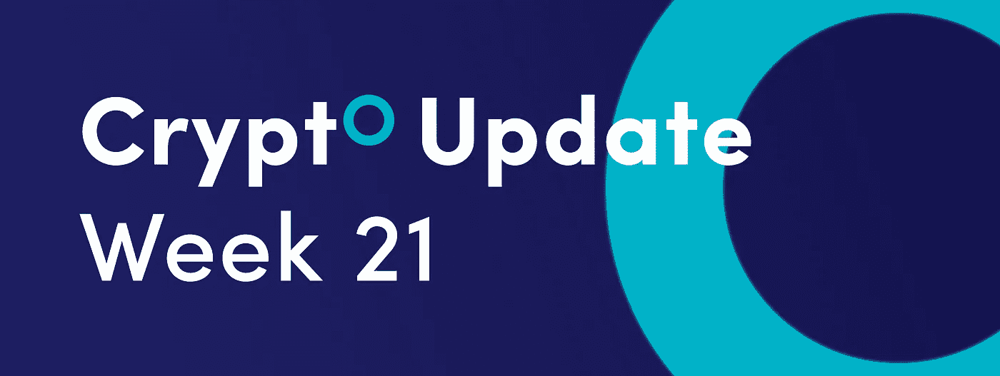
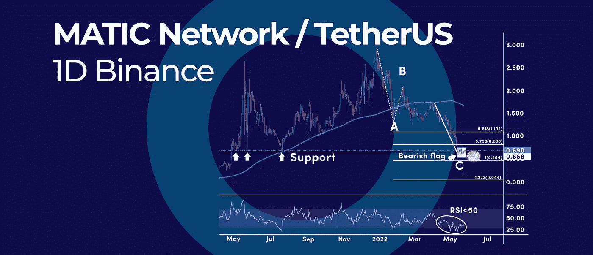
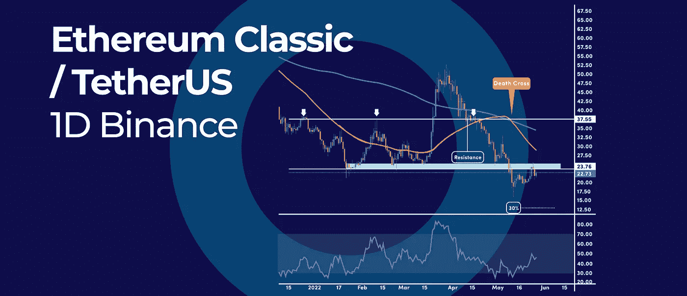

# 比特币统治地位创下 2022 年新高，这对 Altcoins 和 BTC 意味着什么？|以及本周加密更新中的更多内容。

> 原文：<https://medium.com/coinmonks/bitcoin-dominance-hits-new-2022-high-what-it-means-for-altcoins-and-btc-and-more-b03e1a69a6e1?source=collection_archive---------30----------------------->

*   多边形测试多月支持，它会举行吗？
*   以太坊经典日线图上的死亡交叉形态
*   比特币统治地位创下 2022 年新高，这对 Altcoins 和 BTC 意味着什么？

## 多边形测试多月支持，它会举行吗？

[Polygon's (MATIC)](https://polygon.technology/) 急剧下跌导致加密货币重新测试 0.50 美元附近的多月支持。虽然支撑位可以为我们提供反弹，但由于熊市旗的形成，熊市击穿的可能性很大，这可能导致另一轮抛售。

# 多月支持

自 2021 年 7 月以来，0.50 美元的支持区域尚未经过测试。这是 2021 年的一个关键水平，标志着反弹开始向 2.92 美元的历史高点迈进。

此外，从 12 月份 2021 年高点的下跌正在 3 个大浪中展开，这是一个修正价格形成。ABC 下跌似乎已经完成，因为我们几乎已经达到了 A 阶段相对于 b 波高点的 100%斐波纳契延伸。

如果 MATIC 的价格能够稳定在 0.50 美元的支撑位附近，那么随后的任何反弹都可能在 1.00 美元这个相当大的心理数字处面临阻力。

# 熊市旗形成

如果 MATIC 未能守住 0.50 美元区域作为支撑，则可以激活看跌旗形态，加密货币可以进一步下跌。然而，目前的趋势仍然是看跌的，因为大多数 RSI 读数都低于 50 的中间水平，这表明了看跌的压力。

# 什么是看跌旗形态？

熊市旗形态是一种支持熊市趋势延续的常见技术形态，因为它仅仅是一种延续形态。

熊市旗形态是一个矩形形态，在一次强烈的熊市运动后形成，被称为旗杆。熊市标志着趋势的第二阶段恢复之前的盘整阶段。当这个形态被标志下方的突破确认后，它就被认为是可靠的。

# 什么是 MATIC？

Polygon 是一个侧链网络，作为以太坊的扩展解决方案而构建。它使用户能够在一个层上部署和运行分散的应用程序，避免了以太坊区块链的限制。

Polygon 团队创建了一套工具，使开发人员能够构建自己的侧链，而不必构建自己的网络。Polygon 旨在使创建侧链的过程尽可能简单。

# 总而言之，

多边形仍然卡在岩石和硬的地方，因为我们同时有强烈的看涨信号和看跌信号。0.50 美元的支撑区是一个关键的水平，必须保持看涨的前景。否则，MATIC 可以继续其对 0.30 美元支撑区的看跌趋势。

随着牛熊之战的加剧，我们很有可能会在更多的整合中结束，但时间会告诉我们这场战斗将如何解决。

## 以太坊经典日线图上的死亡交叉形态

以太坊经典(ETC)在日线图上印出了死亡交叉信号，这是呼吁进一步下跌的警告信号。当短期 50 天简单移动平均线在长期 200 天简单移动平均线下方交叉时，出现死亡交叉信号。

# 以太坊经典价格历史

以太坊经典(ETC)自 2018 年 1 月以来一直处于熊市。2018 年 2 月，ETC 达到 44.96 美元的高点，随后急剧下跌，导致加密货币在 2018 年 12 月一路跌至 7.32 美元。经过 2019 年的抛物线上涨，ETC 在 2020 年 9 月达到 13.86 美元的峰值。

在 13.86 美元的水平遭到拒绝后，ETC 一直在自由落体，导致加密货币在 2020 年 10 月跌至 5.98 美元。此后，ETC 一直在 7.30 美元至 13.86 美元之间横盘整理。目前，ETC 的交易价格在 17.50 美元左右，正好高于 50 天简单移动平均线 17.20 美元。

# 死亡交叉信号

上一次死亡交叉信号发生在 2021 年 10 月，ETC 下跌了 62%。然而，在前三次死亡交叉发生时，它是一个反向信号。平均而言，死亡交叉信号在反弹之前引发了约 30%的抛售。30%的抛售可能会使 ETC 的价格跌至 14 美元左右。

短期来看，ETC 价格在 24 美元和 26 美元之间面临阻力。同时，RSI 振荡器也接近 50 的中间水平。因此，如果 RSI 振荡器能够突破中级 50 上方，多头势头可能会回到市场。

# 什么是死亡交叉信号

死亡交叉是一种技术指标，在价格图上表示看跌信号。当短期 50 移动平均线在 200 长期移动平均线下方交叉时，就会出现死亡交叉，这表明熊市已经控制了势头。

# 硬币的另一面

另一方面，日线跌破 24 美元至 26 美元阻力区，可能会为 50 天均线的再次测试打开大门，目前均线跌至 29.70 美元。进一步上行，下一个主要阻力在 37.50 美元附近。

看涨突破 37.50 美元水平可能是一个巨大的看涨信号。这将证实先前的死亡交叉信号是一个错误的信号。由于死亡交叉信号之前一直是反向信号，突破 37.50 美元可能是一个巨大的看涨信号。

## 比特币统治地位创下 2022 年新高，这对 Altcoins 和 BTC 意味着什么？

自 2021 年 10 月 UST 稳定币崩溃以来，比特币(BTC)的主导地位已经上升到前所未有的水平。简而言之，比特币的主导地位衡量的是 BTC 占加密市场总资本的比例。在撰写本文时，比特币的主导地位为 44.49%，比以太坊的主导地位高出一倍以上。

# 比特币优势增强

当比特币相对于 altcoins 的市场份额不断增加时，这意味着投资者正在出售其高度投机的 altcoins，以换取世界上最大的加密货币。通常情况下，如果比特币的主导地位增强，就更有可能看到替代比特币在熊市中继续存在。或者，至少比特币的下跌速度会比替代币慢。

通常，比特币的主导地位在熊市中上升，在牛市中下降。然而，这并不是 100%可靠的相关性。例如，比特币主导地位上一次经历显著增长是在 2021 年初。然而，比特币主导地位的增强已导致 BTC 触底反弹，并创下历史新高。

总之，虽然比特币的主导因素仍然是牛市或熊市的一个可行信号，但我们需要考虑其他因素，以更好地评估整体情况。

订阅我们的媒体每周博客和更新。
在[推特上关注我们](https://twitter.com/cryptohopper) | [脸书](https://www.facebook.com/cryptohopper)|[Reddit](https://www.reddit.com/r/CryptoHopper/)|[insta gram](https://www.instagram.com/cryptohopper/?hl=nl)

在 [Cryptohopper](https://www.cryptohopper.com/) 开始交易！

> 加入 Coinmonks [电报频道](https://t.me/coincodecap)和 [Youtube 频道](https://www.youtube.com/c/coinmonks/videos)了解加密交易和投资

# 另外，阅读

*   [OKEx 评论](/coinmonks/okex-review-6b369304110f) | [Coinswitch 俱吠罗评论](/coinmonks/coinswitch-kuber-review-1a8dc5c7a739) | [比特币基地收费](/coinmonks/coinbase-fees-831e77d4f2c5)
*   [AscendEX 审查](/coinmonks/ascendex-review-53e829cf75fa) | [OKEx 交易机器人](/coinmonks/okex-trading-bots-234920f61e60) | [OKEx 交易机器人](/coinmonks/okex-trading-bots-234920f61e60)
*   [火币交易机器人](https://coincodecap.com/huobi-trading-bot) | [如何购买 ADA](https://coincodecap.com/buy-ada-cardano) | [Geco？一次审查](https://coincodecap.com/geco-one-review)
*   [币安 vs Bitstamp](https://coincodecap.com/binance-vs-bitstamp) | [Bitpanda vs 比特币基地 vs Coinsbit](https://coincodecap.com/bitpanda-coinbase-coinsbit)
*   [如何购买瑞波(XRP)](https://coincodecap.com/buy-ripple-india) | [非洲最好的加密交易所](https://coincodecap.com/crypto-exchange-africa)
*   [非洲最佳加密交易所](https://coincodecap.com/crypto-exchange-africa) | [Hoo 交易所评论](https://coincodecap.com/hoo-exchange-review)