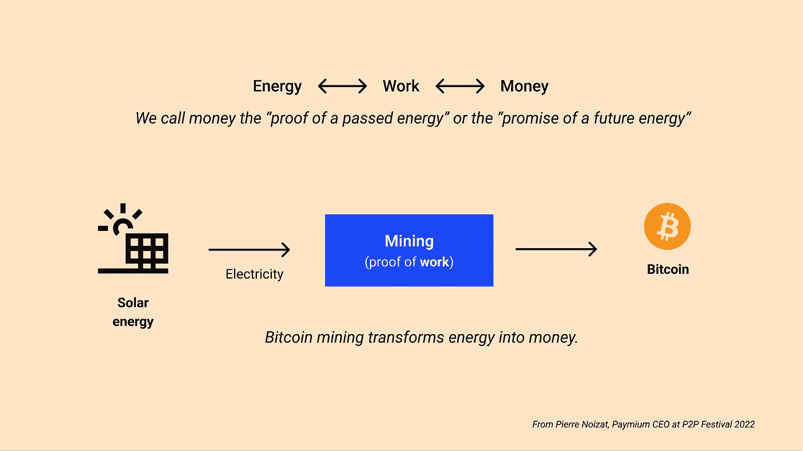

# 比特币与能源，第 1 部分:比特币的能源组合和功耗的作用

> 原文：<https://medium.com/coinmonks/bitcoin-energy-part-1-energy-mix-and-the-role-of-power-consumption-for-bitcoin-b805f02ff764?source=collection_archive---------36----------------------->

*这是* [***比特币&能源系列***](https://thebitcoinmail.substack.com/) *的第一部分，四篇文章专门介绍比特币及其用电量。目标是:你可以对其环境影响以及比特币对社会未来的潜力做出自己的判断。*

*好读书👇*

# 介绍

第一部分着重于:

*   能源组合的概念，以及为什么它与比特币如此相关
*   电能消耗在比特币中的作用

# 能源组合:消费和污染的区别

比特币消耗了大量的能源。一般来说，这很快被翻译成“比特币正在污染”或“比特币对地球有害”。然而，**能源消耗并不是污染的同义词**。每种能源消耗的排放都取决于它们的来源。这就是我们所说的**能源组合**。

以电动汽车为例。如果它属于一个德国城市的家庭，而这个家庭的电力来自煤矿，那么使用这种汽车将会排放大量的二氧化碳。然而，如果这辆车在西班牙南部，使用太阳能电池板发电，同样的电力消耗显然会减少污染。

这个例子是简化的(太阳能电池板的起源和更新)，但它是连贯的，很好地说明了能源组合的概念。

这种消费和污染之间的混淆还有另一面:认为能源消费的增加本身就是污染。这在今天的地球上是真实的，因为我们仍然主要依赖碳氢化合物(石油和天然气)，排放大量的二氧化碳。然而,“无碳”能源对环境的影响主要来自基础设施的建设，而不是其产品的消费(如水电或核电)。

**与碳氢化合物相比,“无碳”来源产生和消耗的能量数量的变化影响不大。**

在看待比特币挖矿时，所有这些概念都非常重要。它的消耗完全是电力。它可以来自全球任何可以转化为电能的能源，而且它的需求是无限的。制造捷径“比特币耗电多所以对我们的环境不好”是一派胡言。我们需要看看这种电力来自哪里，它的来源。这将是下周的话题。

# 功耗对比特币的作用

在研究比特币的电力消耗之前，我们需要思考它的作用。真的有必要吗？

比特币挖矿是保护网络安全的机制。它完成交易，并帮助他们在一个人人都同意的历史性时刻注册:网络的**共识**。多亏了采矿，共识可以以一种**自主和分散的方式**达成。

采矿基于工作证明(PoW)系统。顾名思义，它在于证明某项工作已经完成。这项工作需要是不可逆转的，因为它扮演着网络分类账的状态，它的共识。这就是为什么**证明需要能量消耗**的原因。这样，历史只能通过复制这笔支出来逆转，这需要额外的成本。

这一成本，加上通过交易费和新发行的比特币的奖励系统，**鼓励**所有潜在的**参与者** **到** **加入**网络而不是攻击它。没有这种能源消耗，就不可能有如此强大的分散式网络。

还存在其他能耗较低的机制，如利益证明(PoS)。然而，PoS 不需要任何额外的能量消耗来达成共识。它依赖于纯粹的经济激励。因此，物理不可逆性的概念在这里很少出现。

除了确保网络安全，该系统还直接将能量转化为金钱。它把钱带回到它的基本表现形式:过去或未来的能源。

这第一篇文章关注的是为什么比特币消耗能量，以及为什么这种消耗对其工作方式至关重要。它还回顾了能源组合的概念，以及消耗的能源量如何与对我们环境的影响没有直接联系。

下周的主题将集中在比特币采矿的游牧方面，以及对其能源消耗的影响。

来源和资源:

*   [能源组合](https://ourworldindata.org/energy-mix)
*   [通电线程与通电线程以及它们之间的内在差异](https://twitter.com/namcios/status/1529527152101687296)
*   [Eric Wall on power vs PoS](https://ercwl.medium.com/proof-of-stake-is-less-wasteful-b2854a191766)
*   [作为去中心化时钟的比特币](https://grisha.org/blog/2018/01/23/explaining-proof-of-work/)

部分 1⎟ [部分 2](https://gustave-laurant.medium.com/bitcoin-energy-part-2-the-advantages-of-a-delocalized-consumption-a91b0019a72b) ⎟ [部分 3](https://gustave-laurant.medium.com/bitcoin-energy-part-3-an-opportunity-for-renewables-ec8fb91ba26f) ⎟ [部分 4](https://gustave-laurant.medium.com/bitcoin-energy-part-4-a-beneficial-tool-for-society-80a35ab389f4)

> 加入 Coinmonks [电报频道](https://t.me/coincodecap)和 [Youtube 频道](https://www.youtube.com/c/coinmonks/videos)了解加密交易和投资