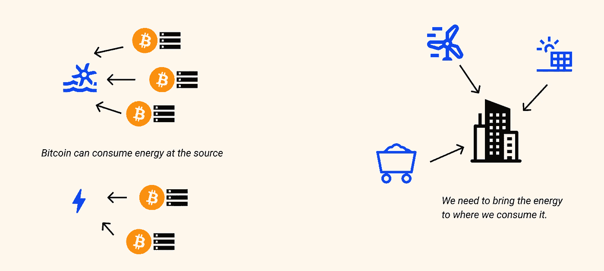
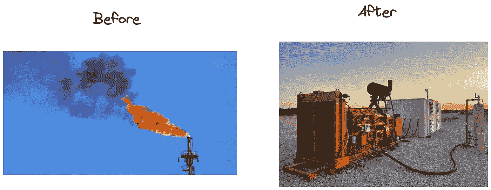

# 比特币与能源，第二部分:异地消费的优势

> 原文：<https://medium.com/coinmonks/bitcoin-energy-part-2-the-advantages-of-a-delocalized-consumption-a91b0019a72b?source=collection_archive---------38----------------------->

*这是* [***比特币&能源系列***](https://thebitcoinmail.substack.com/) *的第二部分，四篇文章专门讲述比特币及其用电量。目标是:你可以对其环境影响以及比特币对社会未来的潜力做出自己的判断。*

*好读书👇*

# 介绍

[第一部分](https://gustave-laurant.medium.com/bitcoin-energy-part-1-energy-mix-and-the-role-of-power-consumption-for-bitcoin-b805f02ff764)聚焦于比特币功耗背后的原因及其对网络运行的重要作用。还讨论了能源组合的概念，以及能源消耗量和对环境的影响之间缺乏直接联系的问题。

第二篇文章将关注比特币网络能耗的一个独特方面及其后果:

*   非定域方面挖掘
*   这次搬迁首先允许的能源“剩余”消耗

# 异地消费

比特币消耗能源的方式与我们的社会非常不同。工业、交通工具或人类的传统消费必须发生在特定的时间和地点。

为了做到这一点，我们把能源从源头带到以后需要消耗的地方，通常是以电力、石油或天然气的形式。例如，一架飞机总是需要足够的油储备以供飞行期间消耗。

相反，比特币挖矿能耗完全非本地化。它可以在地球上任何有能量转化为电能的地方工作，没有地理限制。它只需要一个互联网连接来传输消费的输出(挖掘的比特币)。

这使得比特币可以使用无法输送到社会需要的地方的能源:未开发的能源。

除了不在本地，比特币矿工还可以非常容易地**将**重新安置到新的地点。

## 独特的可变成本:电价

采矿的另一个重要方面是它的成本结构。一家矿商唯一的可变成本在于其电价。只有获得廉价电力，采矿在经济上才是可持续的。此外，采矿是全球竞争非常激烈的活动。使用更贵的电力是一个太大而不可持续的缺点。

综上所述，比特币矿工:

*   是游牧民族:他们可以在任何地方消耗能源，尤其是在源头
*   他们的主要限制是电费

正如我们将要看到的，这两个方面促使矿工去寻找能源，那里的能源供应和人类需求之间存在不平衡。

# 未开发能源的消耗

我们现在知道，每个比特币矿工都在寻找地球上任何地方最便宜的能源。碰巧的是，人类的活动需要消耗当地的能源，也就是它们的所在地。难道地球上不会有一些地方的可用能源超过需求吗？

事实确实如此。据估计，全世界产生的[能量只有 1 到 2/3 被实际消耗掉。这种差异来自能源生产和传输的物理限制，但也来自我们无法有效地开发、储存和分配所有的潜在能源。除此之外还必须加上](https://www.enerdynamics.com/Energy-Currents_Blog/How-Much-Primary-Energy-Is-Wasted-Before-Consumers-See-Value-from-Electricity.aspx)[许多仍未开发的可再生能源](https://www.comparethemarket.com.au/energy/features/untapped-renewable-energy/)，这主要是由于它们偏远的地理位置。

我们现在知道，由于各种限制，一方面生产的能源“过剩”,另一方面全球还有大量未开发的能源。此外，比特币矿工可以在任何地方定居。由于他们的主要目标是将电力价格降至最低，很自然会看到这些**比特币矿工首先走向供需失衡**。这些情况主要出现在更偏远的可再生能源上(水力、地热)，其产品的储存和分配更复杂。

重要的是要记住，从长远来看，比特币矿工将总是从消费未开发的盈余中受益，而不是推动新的、更高成本的生产。

> P S 1:在配电网络发达的地方，比如法国，因为生产和消费之间的良好平衡，开采比特币只有在某些非常特定的情况下才有利可图。
> 
> PS 2:在任何电气网络中，注入的电量必须等于流出的电量。这就是为什么网络中的电量需要实时控制，并受到用电量变化的限制。不幸的是，电池的效率还不足以克服这个问题。在这种情况下，比特币可以支持网络，充当需求底线，平滑网络的平均生产成本。

# 例子

## **无本地需求的水电站**

让我们看看水力坝的例子。如果它的发电站生产 100 兆瓦的电力，而附近的消耗和储存为 80 兆瓦，这个发电站将把它的产量限制在 80 兆瓦。这是一种未开发的能源，不会增加财政或环境成本。矿工们自然会去寻找这种廉价的可用电力。

## **火炬气**

当从地下开采石油或天然气时，会有大量无用的气体(主要是甲烷)逸出。这种气体污染很大(x20 C02)，目前去除它的主要方法是燃烧它，将其转化为污染较小的 CO2。这被释放到大气中，原始气体的能量 100%损失。据估计[每年欧洲天然气消耗量的 30%就这样浪费掉了](https://fr.wikipedia.org/wiki/Torchage_du_gaz_naturel#:~:text=150%20milliards%20de%20m%C2%B3%20de,consommation%20annuelle%20des%20%C3%89tats-Unis)，额外污染了大气。

在很多情况下，由于所需基础设施的成本，甲烷甚至不能燃烧。

在美国，大量石油和天然气生产商已经意识到比特币采矿通过消耗这种浪费的能源所代表的[金融和环境机遇](https://twitter.com/DSBatten/status/1519902364819685376)。所以他们开始挖掘比特币，将燃烧甲烷产生的热量转化为电能。

这有助于在所有这些地点将甲烷燃烧成二氧化碳，从而显著降低其对环境的影响。采矿收入也降低了社会的总体能源生产成本。

# 结论

由于不同类型的限制，地球上有大量的“过剩”能源。

比特币挖矿的非本地化特点使其非常适合消费这种盈余。中国对廉价电力的需求自然会将它推向那些供需不平衡的能源。通过首先消耗这种“泄漏”的能量，矿工对环境的影响非常有限。

在下一部分中，我们将看到比特币采矿特有的这些特征如何帮助可再生项目的开发。

**来源&资源:**

能源“过剩”:

*   [全球未开发的可再生能源](https://www.comparethemarket.com.au/energy/features/untapped-renewable-energy/)
*   [生产和消耗的能源之间的差异(美国)](https://www.enerdynamics.com/Energy-Currents_Blog/How-Much-Primary-Energy-Is-Wasted-Before-Consumers-See-Value-from-Electricity.aspx)

能源浪费:

*   [气体燃烧废物](https://fr.wikipedia.org/wiki/Torchage_du_gaz_naturel#:~:text=150%20milliards%20de%20m%C2%B3%20de,consommation%20annuelle%20des%20%C3%89tats-Unis)
*   [美国天然气产量过剩](https://compassmining.io/education/an-overview-of-excess-natural-gas-production-in-the-united-states/)

剩余比特币的挖掘:

*   [比特币开采减少甲烷排放](https://twitter.com/DSBatten/status/1519902364819685376)
*   [全球比特币挖矿数据回顾—2021 年 10 月](https://bitcoinminingcouncil.com/wp-content/uploads/2021/10/2021.10.19-Q3-BMC-Presentation-Materials-Final.pdf)
*   [采访怀俄明州石油&天然气生产商](https://twitter.com/compass_mining/status/1509553605237424128)

比特币采矿作为电网的发电机:

*   [比特币采矿作为电网的发电机](https://braiins.com/blog/bitcoin-mining-the-grid-generators)
*   [https://ezblockchain.net/smartgrid/](https://ezblockchain.net/smartgrid/)

[第一部](https://gustave-laurant.medium.com/bitcoin-energy-part-1-energy-mix-and-the-role-of-power-consumption-for-bitcoin-b805f02ff764) ⎟Part 2⎟ [第三部](https://gustave-laurant.medium.com/bitcoin-energy-part-3-an-opportunity-for-renewables-ec8fb91ba26f) ⎟ [第四部](https://gustave-laurant.medium.com/bitcoin-energy-part-4-a-beneficial-tool-for-society-80a35ab389f4)

> 加入 Coinmonks [电报频道](https://t.me/coincodecap)和 [Youtube 频道](https://www.youtube.com/c/coinmonks/videos)了解加密交易和投资