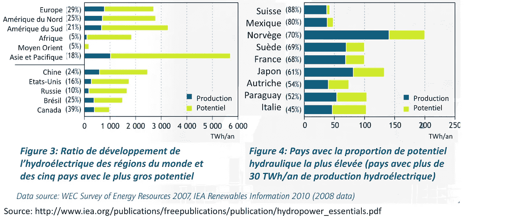
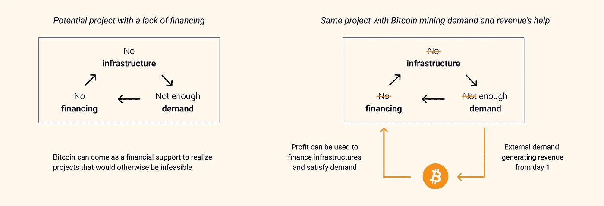

# 比特币与能源，第三部分:可再生能源的机遇

> 原文：<https://medium.com/coinmonks/bitcoin-energy-part-3-an-opportunity-for-renewables-ec8fb91ba26f?source=collection_archive---------40----------------------->

*这是第三部分* [***比特币&能量系列***](https://thebitcoinmail.substack.com/) *，四篇文章专门讲述比特币及其电能消耗。目标是:你可以对其环境影响以及比特币对社会未来的潜力做出自己的判断。*

*好读书👇*

# 介绍

在第二部分中，我们发现了比特币矿工优先消耗的电力来源:实际或潜在供应与需求之间不平衡的剩余能源。

这第三篇文章着眼于比特币采矿如何帮助利用更多的可再生能源，这是我们当今社会的主要挑战之一。

# 未开发的可再生能源

地球上有大量未开发的可再生能源。开发它的困难主要来自前面提到的地理限制。

这些可再生能源位于特定的地方，并产生一定量的能量。然而，**当地的电力需求并不总是与产量**一致，因此开采项目的规模也不一致。这阻碍了大量可再生项目的实施，特别是在电力仍未广泛使用的发展中国家。

另一个更常见的制约因素是生产基础设施建设和销售基础设施建设之间的时间间隔。分销网络的建设时间可能比生产基础设施的建设时间长 3 至 4 倍。投资成本和第一笔收入之间的这种延迟往往太高，使这些项目在财务上无法盈利。

这些限制形成了一个恶性循环:没有需求就没有融资，没有融资就没有基础设施，没有基础设施就没有需求…

# 比特币作为金融支持

事实证明，比特币挖矿可以带来这些项目实现所需的需求。**它的异地性和持续消费使其成为地球上任何地方都可用的需求缓冲**。

这种额外的需求为上述情况下的项目带来了必要的收入，使它们的实现成为可能并且在财务上可行。

一旦基础设施建成，人们对电力的需求就可以得到满足。如果当地需求不足，矿工可以补充，或者很容易转移到另一个有电力需求的项目。

这对于所有可再生能源项目来说尤其重要，这些项目的位置取决于能源来源:水力、地热、太阳能、风能……

总结一下:

*   许多可再生能源项目缺乏短期需求，难以实施。
*   采矿可以通过消耗地球上任何地方的剩余电力为这些项目带来额外的收入。
*   明智地使用并在一定条件下(法律和/或合同)，采矿可以成为发展可再生能源的**非常有效的加速器**。

# 例子

## **刚果民主共和国东部维龙加公园的水电站**

目前，公园周围的人们用它的木材满足能源需求的速度比它生长的速度快。与此同时，该园区的水力潜力巨大，但由于上述原因很难开发:人们不习惯用电，没有配电网。

就在项目开始后，公园管理者面临财务困难，并寻找替代方案。

他们意识到，他们可以在等待配电网建设和当地电力需求的同时，利用自己的剩余能源开采比特币。在一家法国公司 Big Block Data Center 的帮助下，他们安装了一个采矿系统。这使得他们可以开始用采矿收入偿还成本，而不会对公园造成任何额外的环境影响。

如今，该公园的发电厂为 10MW 的需求生产 35MW，比特币消费并从这一盈余中产生收入。

Hydropower station in Virunga Park

## **萨尔瓦多火山上的地热能**

例如，在萨尔瓦多，火山脚下有大量未开发的地热能源。因此，萨尔瓦多政府在这些网站上开发了比特币采矿活动，以比特币的形式为政府带来了额外的收入。

这是另一个利用可再生能源进行开采的例子，碳排放影响非常有限。在配电网建成后，部分电力生产可以重新分配给居民。

此外，挖掘比特币对政府来说是一个显著的优势。这是一个创造你自己的比特币的问题，因此是在一个向所有人开放的去中心化网络中找到某种形式的货币主权的问题。

# 结论

比特币挖矿不仅倾向于消耗多余的能量。它还可以为能源项目(通常是可再生能源)提供财政支持，否则这些项目在财政上是不可行的。因此，这项活动是在全球发展低碳能源基础设施的真正机会。

在第四部分也是最后一部分，我们会看到比特币远远超出了它的用电量。这是一个庞大的主题，必须作为一个整体来处理，以把握其对社会和我们面临的挑战的所有积极方面。

来源和资源:

*   [播客: **Minage et écologie，不兼容？Avec 塞巴斯蒂安·古斯比卢**](https://podcasts.apple.com/fr/podcast/univers-bitcoin-podcast/id1511416748?i=1000485433874)
*   [未开发的可再生能源](https://www.comparethemarket.com.au/energy/features/untapped-renewable-energy/)
*   [比特币作为电网的电池](https://twitter.com/DSBatten/status/1537008853740830720)
*   [纳伊卜布克勒特火山开采](https://twitter.com/nayibbukele/status/1402680890057166858/photo/1)

[第一部](https://gustave-laurant.medium.com/bitcoin-energy-part-1-energy-mix-and-the-role-of-power-consumption-for-bitcoin-b805f02ff764) ⎟ [第二部](https://gustave-laurant.medium.com/bitcoin-energy-part-2-the-advantages-of-a-delocalized-consumption-a91b0019a72b) ⎟Part 3⎟ [第四部](https://gustave-laurant.medium.com/bitcoin-energy-part-4-a-beneficial-tool-for-society-80a35ab389f4)

> 加入 Coinmonks [电报频道](https://t.me/coincodecap)和 [Youtube 频道](https://www.youtube.com/c/coinmonks/videos)了解加密交易和投资

# 另外，阅读

*   [有哪些交易信号？](https://coincodecap.com/trading-signal) | [Bitstamp vs 比特币基地](https://coincodecap.com/bitstamp-coinbase) | [买索拉纳](https://coincodecap.com/buy-solana)
*   [密码交易机器人](/coinmonks/crypto-trading-bot-c2ffce8acb2a) | [维护审查](https://coincodecap.com/uphold-review)
*   [如何给 MetaMask 钱包添加 Arbitrum？](https://coincodecap.com/how-to-add-arbitrum-to-metamask-wallet)
*   [KuCoin vs 北海巨妖 vs BitYard](https://coincodecap.com/kucoin-vs-kraken-vs-bityard)
*   [最适合加密交易的 VPN](https://coincodecap.com/best-vpns-for-crypto-trading)
*   [ProfitFarmers 回顾](https://coincodecap.com/profitfarmers-review) | [如何使用 Cornix Trading Bot](https://coincodecap.com/cornix-trading-bot)