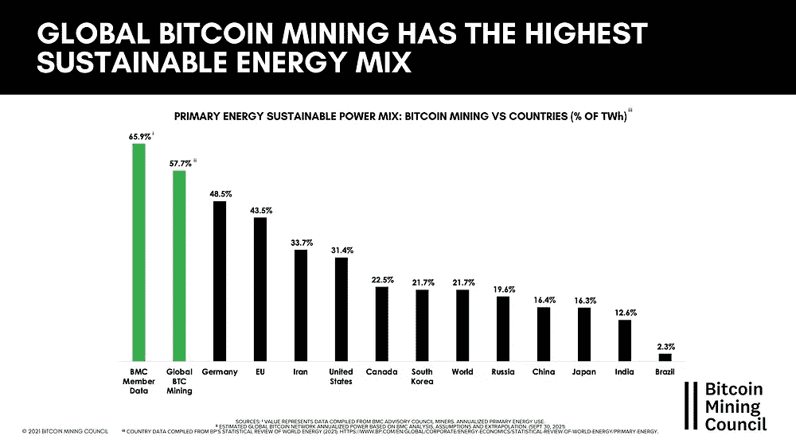

# 比特币与能源，第四部分:对社会有益的工具

> 原文：<https://medium.com/coinmonks/bitcoin-energy-part-4-a-beneficial-tool-for-society-80a35ab389f4?source=collection_archive---------37----------------------->

*这是第四篇也是最后一篇* [***比特币&能量系列***](https://thebitcoinmail.substack.com/) *，四篇文章专门讲述比特币及其用电量。目标是:你可以对其环境影响以及比特币对社会未来的潜力做出自己的判断。*

*好读书👇*

# 介绍

第三篇文章是关于比特币如何帮助开发新的可再生能源项目。在之前的案例中，这是关于比特币走向能源“过剩”的自然趋势。

我们已经知道，它对环境的真正影响实际上远没有它的电力消耗可能导致的想象那么重要。

第四部分也是最后一部分包括:

*   比特币挖矿用电的来源。
*   这种消费背后的背景:比特币的价值
*   当前社会面临的挑战与比特币提供的解决方案之间的一致性

# 电动混合动力车的数字

对约占网络三分之一的一群志愿未成年人进行了一项研究。她得出结论，这些矿工超过 65%的电力消耗来自可再生能源。该研究估计，可再生能源在所有矿工中的比例为 55%。

随着时间的推移，这种电力组合会得到改善，前面提到的原因促使矿工转向可再生能源。

# **比特币，对社会有益的工具**

尽管比特币具有良好的电气混合，但它仍然消耗大量能源。但是有什么好处呢？比特币对社会的附加值是什么？要回答这个问题，我们得回到比特币的基础。

比特币的核心是一个点对点的交易网络。它允许我们在互联网上以比特币的形式直接从一个人到另一个人交换价值，而不需要通过一个集中的中介。它的分散性和开放性使它成为一种公共产品:世界各地的每个人都可以使用它，没有任何区别。

安德烈亚斯·安东诺普洛斯恰如其分地将他的一本优秀著作命名为“*”的《金钱的互联网》。在互联网作为一种全球通信手段得到发展之后，比特币似乎成为了卓越的全球货币工具。它允许每个人在地球上的任何地方进行交易，几乎是即时的，而且成本很低。*

*这些是比特币成为我们社会不可否认的资产的部分原因。在我看来，通过将我们的经济和金融模式转向更可持续的方式，它的影响甚至会更大。*

# *比特币是社会变革的引擎*

*自 1970 年代以来，我们无节制的增长一直是我们环境退化的主要因素。这主要是由于两个原因。首先是碳氢化合物的大规模开采。我们增长的第二个原因使这种剥削成为可能:中央银行发行的货币数量稳步增加。*

*即使是逐渐地，这种增长也会导致货币的“成本”或价值随着时间的推移而下降。如果明天€1 号的价值会比今天低，那么最好现在就花掉或投资它，而不是留着以后用。*

*这种机制推动所有经济主体(政府、公司、消费者)在没有任何特定需求的情况下生产和消费更多。正是这种现象维持了大部分人为的增长，并加速了碳氢化合物的大规模开采。*

*比特币逆转了这一机制。随着时间的推移，比特币作为货币的成本或价值会随着发行数量的减少而增加。因此，无论是消费、生产还是投资，在花比特币之前最好三思。比特币是一个有限的货币系统，就像我们星球上的资源一样，而不像当前的金融系统。*

*这些原因让我相信，将我们的经济体系建立在比特币这样的货币上，将迫使我们重新考虑我们的(过度)消费习惯。这将降低社会无节制的增长速度，导致我们的环境退化。*

*在一个有限的世界里，一个有限的货币体系将带来更加理性和合理的增长，同时减缓对我们环境的影响。*

# *结论*

*通过这四篇文章，我们发现了比特币网络对电力的需求来自哪里。*

*它的非本地化方面向我们表明，无论它在哪里都可以消耗能源，并且矿工们倾向于向电网或供需不平衡的可再生资源转移。*

*在这种背景下，比特币挖矿甚至可以通过提供额外的收入来帮助推动可再生项目的实现。*

*最后，在两个方面，比特币似乎是未来几年社会转型的特别合适的工具。首先，比特币挖矿给我们的能源开采效率带来了好处。其次，这是一个有限的货币体系，与我们这个星球的资源相一致。*

*来源和资源:*

*   *[剑桥比特币电力消费指数——对比](https://ccaf.io/cbeci/index/comparisons)*
*   *[与黄金和银行业的对比](https://www.lopp.net/pdf/On_Bitcoin_Energy_Consumption.pdf)*
*   *[https://21lessons.com/preface](https://21lessons.com/preface)*
*   *[货币互联网](https://www.amazon.fr/Internet-Money-collection-Andreas-Antonopoulos/dp/1537000454/ref=sr_1_1?crid=3Q1IWF5GBMNBU&keywords=the+internet+of+money&qid=1655544499&sprefix=the+internet+of+%2Caps%2C308&sr=8-1)*

*[第一部](https://gustave-laurant.medium.com/bitcoin-energy-part-1-energy-mix-and-the-role-of-power-consumption-for-bitcoin-b805f02ff764) ⎟ [第二部](https://gustave-laurant.medium.com/bitcoin-energy-part-2-the-advantages-of-a-delocalized-consumption-a91b0019a72b) ⎟ [第三部](https://gustave-laurant.medium.com/bitcoin-energy-part-3-an-opportunity-for-renewables-ec8fb91ba26f) ⎟Part 4*

**比特币是一个迷人的主题，包含各种主题:经济、金融、计算机科学、能源、博弈论、哲学……我的文章只是这个主题的一小部分，我非常邀请你去了解它。如果您想要其他资源或有任何问题，请随时通过 Telegram @gustave12 联系我！**

> *加入 Coinmonks [电报频道](https://t.me/coincodecap)和 [Youtube 频道](https://www.youtube.com/c/coinmonks/videos)了解加密交易和投资*

# *另外，阅读*

*   *[加密货币储蓄账户](/coinmonks/cryptocurrency-savings-accounts-be3bc0feffbf) | [加密交易机器人](/coinmonks/crypto-trading-bot-c2ffce8acb2a)*
*   *[BigONE 交易所评论](/coinmonks/bigone-exchange-review-64705d85a1d4) | [CEX。IO 审查](https://coincodecap.com/cex-io-review) | [交换区审查](/coinmonks/swapzone-review-crypto-exchange-data-aggregator-e0ad78e55ed7)*
*   *[最佳比特币保证金交易](/coinmonks/bitcoin-margin-trading-exchange-bcbfcbf7b8e3) | [比特币保证金交易](https://coincodecap.com/bityard-margin-trading)*
*   *[加密保证金交易交易所](/coinmonks/crypto-margin-trading-exchanges-428b1f7ad108) | [赚取比特币](/coinmonks/earn-bitcoin-6e8bd3c592d9)*
*   *[WazirX vs CoinDCX vs bit bns](/coinmonks/wazirx-vs-coindcx-vs-bitbns-149f4f19a2f1)|[block fi vs coin loan vs Nexo](/coinmonks/blockfi-vs-coinloan-vs-nexo-cb624635230d)*
*   *[BlockFi 信用卡](https://coincodecap.com/blockfi-credit-card) | [如何在币安购买比特币](https://coincodecap.com/buy-bitcoin-binance)*