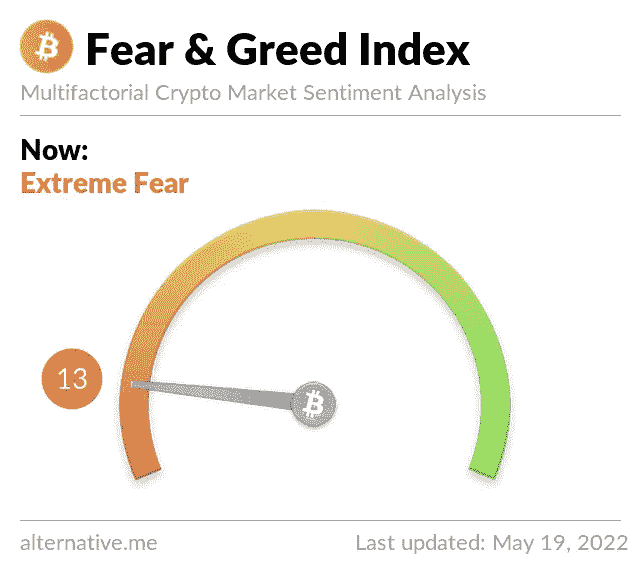
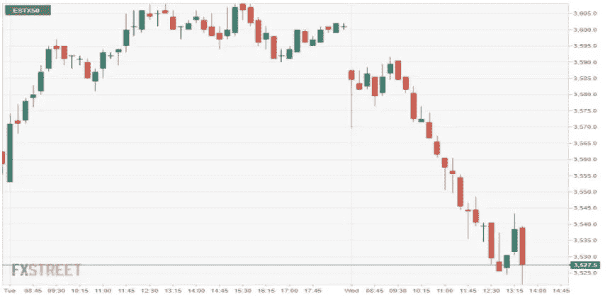

# 比特币，以太坊分析:情绪分析倾向于极度恐惧

> 原文：<https://medium.com/coinmonks/bitcoin-ethereum-analysis-as-sentiment-analysis-tends-towards-extreme-fear-22a8e8ea1488?source=collection_archive---------65----------------------->

比特币周四跌破 29000 美元水平，因为本周空头继续推低价格。

由于连续第二个交易日的抛售，[BTC](https://markets.bitcoin.com/crypto/BTC)/美元周四跌至 28，708.96 美元的盘中低点。

这一下跌发生在周三价格交易在 30，016.18 美元的水平之后。然而，由于交易者仍在寻找稳定的支撑点，它们已经下跌了 3%以上。

> 在触及 26，637 美元的近期低点后，比特币目前在 ***、28，593 美元至 31，450 美元*** 之间的区间盘整，未来几周可能会进一步走低。
> 
> 目前，比特币价格处于 30，000 美元的低位，近几个小时买家数量不断增加。

# 比特币情绪分析

理论上，加密市场情绪分析是对影响加密货币价格运动的因素的心理评估。投资者对加密货币的感受会对加密货币的市场周期和价格产生切实的影响。

虽然许多交易商在投资市场中使用市场情绪分析，但它在加密货币市场中可能特别有用，因为区块链行业和加密市场仍然相对较小，公众看法和情绪可能会导致价格波动。

# **为什么情绪分析显示极度恐惧？**

周四，加密货币[的交易价格略低于 3 万美元，较去年 11 月的历史高点下跌了 56%，而其他主要加密货币也远低于历史高点。](https://www.independent.co.uk/topic/cryptocurrency)

经济低迷导致超过 1.5 万亿美元从市场上抹去，并导致分析师警告称，另一个类似于 2018 年的“秘密冬天”可能正在进行中。

比特币价格不稳定之际，萨尔瓦多总统纳伊布·布克勒(Nayib Bukele)周一主持了 44 个国家的会议，讨论加密货币的优点和采用的好处。

在萨尔瓦多将比特币定为法定货币八个月后，尽管国际货币基金组织和业内一些人士发出警告，但其他几个国家似乎也接近采用这种加密货币。

*另一个原因是，*

**比特币和以太坊跌破关键水平**

比特币(BTC)和以太坊(ETH)都跌破了过去几天它们一直保持的水平。BTC 跌破 3 万美元，而 ETH 目前的交易价格低于 2000 美元，分析师将此归咎于美国股市低迷的连锁效应。

## 根据 bitfinex 的说法:

> 继昨日美国股价大幅下跌后，比特币今日交易走低。随着全球经济衰退的前景日益逼近，螺旋式上升的通胀水平让全球金融市场陷入了深渊。这使得所有受益于各国央行 10 多年宽松货币政策的资产，随着利率上升，很容易出现回调。

**这是什么意思？**

加密货币市场的行为非常情绪化。当市场上涨时，人们往往变得贪婪，这导致了 FOMO(害怕错过)。此外，人们经常在看到红色数字时做出不理智的反应，卖掉他们的硬币。

*'* ***'极度恐惧'*** 意味着投资者非常担忧，但也可能意味着这是一个买入机会。当指数显示投资者变得过于贪婪时，这意味着市场将进行调整。

按照目前的趋势，在市场获得上行动力之前，我们可能会看到更多更低的低点。

> 加入 Coinmonks [电报频道](https://t.me/coincodecap)和 [Youtube 频道](https://www.youtube.com/c/coinmonks/videos)了解加密交易和投资

# 另外，阅读

*   [3 商业评论](/coinmonks/3commas-review-an-excellent-crypto-trading-bot-2020-1313a58bec92) | [Pionex 评论](https://coincodecap.com/pionex-review-exchange-with-crypto-trading-bot) | [Coinrule 评论](/coinmonks/coinrule-review-2021-a-beginner-friendly-crypto-trading-bot-daf0504848ba)
*   [莱杰 vs Ngrave](/coinmonks/ledger-vs-ngrave-zero-7e40f0c1d694) | [莱杰 nano s vs x](/coinmonks/ledger-nano-s-vs-x-battery-hardware-price-storage-59a6663fe3b0) | [币安评论](/coinmonks/binance-review-ee10d3bf3b6e)
*   [Bybit Exchange 审查](/coinmonks/bybit-exchange-review-dbd570019b71) | [Bityard 审查](https://coincodecap.com/bityard-reivew) | [Jet-Bot 审查](https://coincodecap.com/jet-bot-review)
*   [3 commas vs crypto hopper](/coinmonks/3commas-vs-pionex-vs-cryptohopper-best-crypto-bot-6a98d2baa203)|[赚取加密利息](/coinmonks/earn-crypto-interest-b10b810fdda3)
*   最好的比特币[硬件钱包](/coinmonks/hardware-wallets-dfa1211730c6) | [BitBox02 回顾](/coinmonks/bitbox02-review-your-swiss-bitcoin-hardware-wallet-c36c88fff29)
*   [BlockFi vs 摄氏](/coinmonks/blockfi-vs-celsius-vs-hodlnaut-8a1cc8c26630) | [Hodlnaut 点评](/coinmonks/hodlnaut-review-best-way-to-hodl-is-to-earn-interest-on-your-bitcoin-6658a8c19edf) | [KuCoin 点评](https://coincodecap.com/kucoin-review)