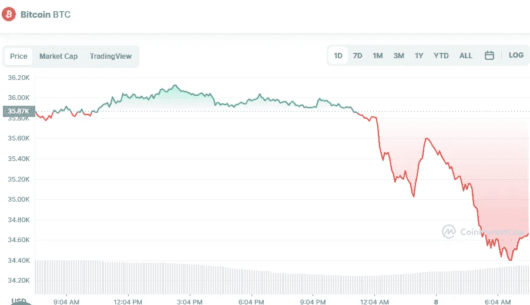

# 5 月 8 日比特币、以太坊和卡达诺价格分析

> 原文：<https://medium.com/coinmonks/bitcoin-ethereum-and-cardano-price-analyse-on-8th-of-may-761109cc4df7?source=collection_archive---------23----------------------->

# 1.比特币(-3.36%)

Source photo [Bitcoin price today, BTC to USD live, marketcap and chart | CoinMarketCap](https://coinmarketcap.com/currencies/bitcoin/)

# 市值 6590 亿美元

比特币目前的价格为 34.72356 美元，24 小时交易量为 31.16 美元。

在过去的 24 小时里，比特币的使用量下降了 3.36%。