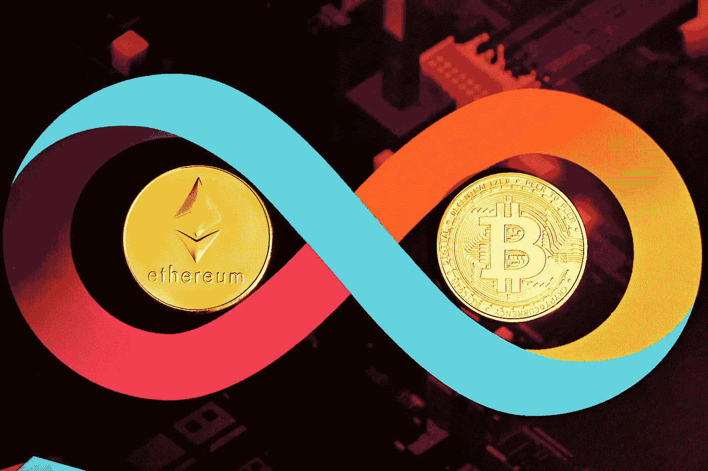

# 比特币、以太坊和 XRP 价格预测:最终空头陷阱为主要反弹定位密码

> 原文：<https://medium.com/coinmonks/bitcoin-ethereum-and-xrp-price-predictions-final-bear-traps-position-cryptos-for-major-rally-d8852033d43e?source=collection_archive---------9----------------------->

Source photo Unsplash

比特币价格达到并保持其主要支持区域，而看涨突破的障碍下降。尽管存在武力威胁和全球不确定性，以太坊的价格仍然乐观。

在回到 1.00 美元的价格区间之前，XRP 制作了一面牛市旗。
的价格…