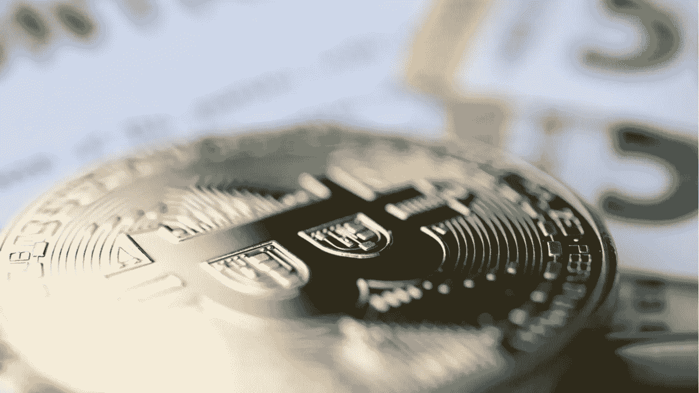
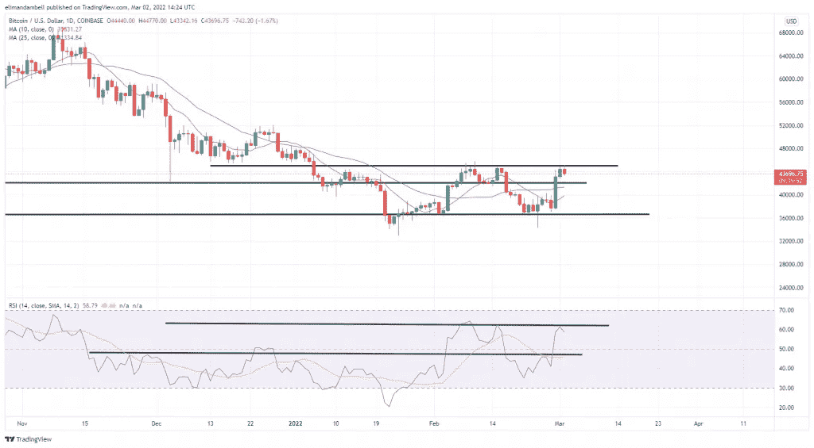
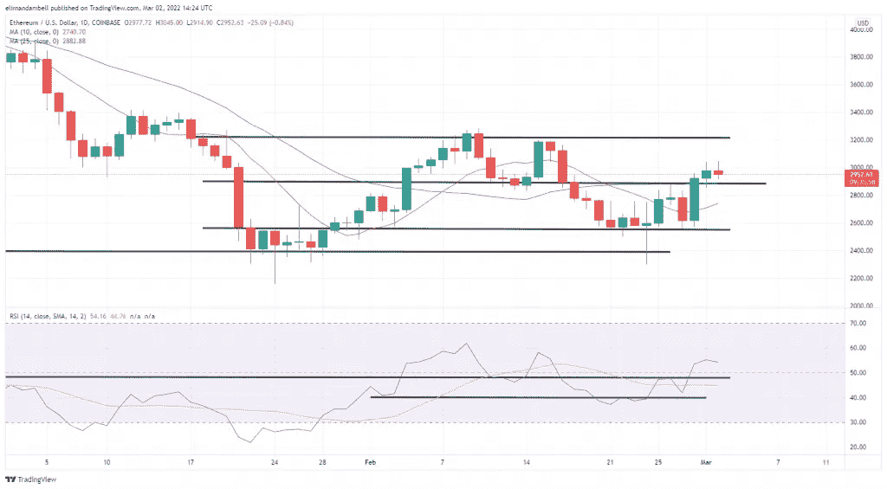

# 比特币、以太坊技术分析:BTC 暴涨在关键阻力位失速

> 原文：<https://medium.com/coinmonks/bitcoin-ethereum-technical-analysis-btc-surge-stalls-at-key-resistance-level-50aade21fc64?source=collection_archive---------83----------------------->

继周二的价格飙升之后，比特币在今天的交易中走低，因为市场触及了一个关键的阻力点。此时， [**ETH**](https://markets.bitcoin.com/crypto/ETH) **再次跌破 3000 美元水平。截至发稿时，crypto 市值下跌了 1.87%。**

# 比特币

BTC 多头周三遇到了绊脚石，交易员似乎再次做空世界上最大的加密货币。

继昨天的高点 44，793.60 美元之后，[BTC](https://markets.bitcoin.com/crypto/BTC)/美元在今天早些时候触及 43，307.96 美元的日内低点。

[截至发稿时，BTC](https://markets.bitcoin.com/crypto/BTC) 当日下跌 2.42%，目前交易价为 43，637.72 美元，14 天 RSI 跟踪值为 58.7。

请看图表，周三的走势发生在 BTC 未能突破 44，870 美元阻力位之后，这在历史上一直是空头进入的点。

与 2 月 16 日类似，这些空头停止了牛市猛攻，许多人现在预计比特币将出现更多整合。

价格力度也开始下降，因为 RSI 上限 62 在本周开始时保持稳定。

如果我们准备进一步整合，42，120 美元的底部可能是卖方的下一个价格目标。

> [即刻从比特币基地购买比特币](https://www.coinbase.com/join/9npib9)

# 以太坊

继周二突破自身阻力位后，ETH 价格周三小幅下跌，目前交易价格低于 3000 美元。

今天早些时候，ETH/美元触及 3，045 美元的三周高点。然而，这些进展是短暂的。

截至发稿时， [ETH](https://markets.bitcoin.com/crypto/ETH) 已经跌至 2907.46 美元的低点，因为昨天的走势已经成熟为一次假突破。

如果这种看跌压力继续延续到本交易日的剩余时间，空头可能会将以太坊的价格拉回 2880 美元以下。

相对而言，目标为 3200 美元的多头前景仍然存在，然而，任何进一步的下跌都可能减少这些机会，因为价格可能会继续巩固。

> [立即从比特币基地购买以太坊](https://www.coinbase.com/join/9npib9)

非常感谢！

> 加入 Coinmonks [电报频道](https://t.me/coincodecap)和 [Youtube 频道](https://www.youtube.com/c/coinmonks/videos)了解加密交易和投资

# 另外，阅读

*   [Exness 回顾](https://coincodecap.com/exness-review)|[moon xbt Vs bit get Vs Bingbon](https://coincodecap.com/bingbon-vs-bitget-vs-moonxbt)
*   [如何开始通过加密贷款赚取被动收入](https://coincodecap.com/passive-income-crypto-lending)
*   [BigONE 交易所评论](/coinmonks/bigone-exchange-review-64705d85a1d4) | [电网交易机器人](https://coincodecap.com/grid-trading)
*   [氹欞侊贸易评论](https://coincodecap.com/anny-trade-review) | [CoinSpot 评论](https://coincodecap.com/coinspot-review)
*   [新加坡十大最佳加密交易所](https://coincodecap.com/crypto-exchange-in-singapore) | [购买 AXS](https://coincodecap.com/buy-axs-token)
*   [投资印度的最佳加密软件](https://coincodecap.com/best-crypto-to-invest-in-india-in-2021) | [WazirX P2P](https://coincodecap.com/wazirx-p2p)
*   [7 个最佳零费用加密交易平台](https://coincodecap.com/zero-fee-crypto-exchanges)
*   [最佳网上赌场](https://coincodecap.com/best-online-casinos) | [期货交易机器人](/coinmonks/futures-trading-bots-5a282ccee3f5)
*   [分散交易所](https://coincodecap.com/what-are-decentralized-exchanges) | [比特 FIP](https://coincodecap.com/bitbns-fip) | [宾邦评论](https://coincodecap.com/bingbon-review)
*   [用信用卡购买密码的 10 个最佳地点](https://coincodecap.com/buy-crypto-with-credit-card)