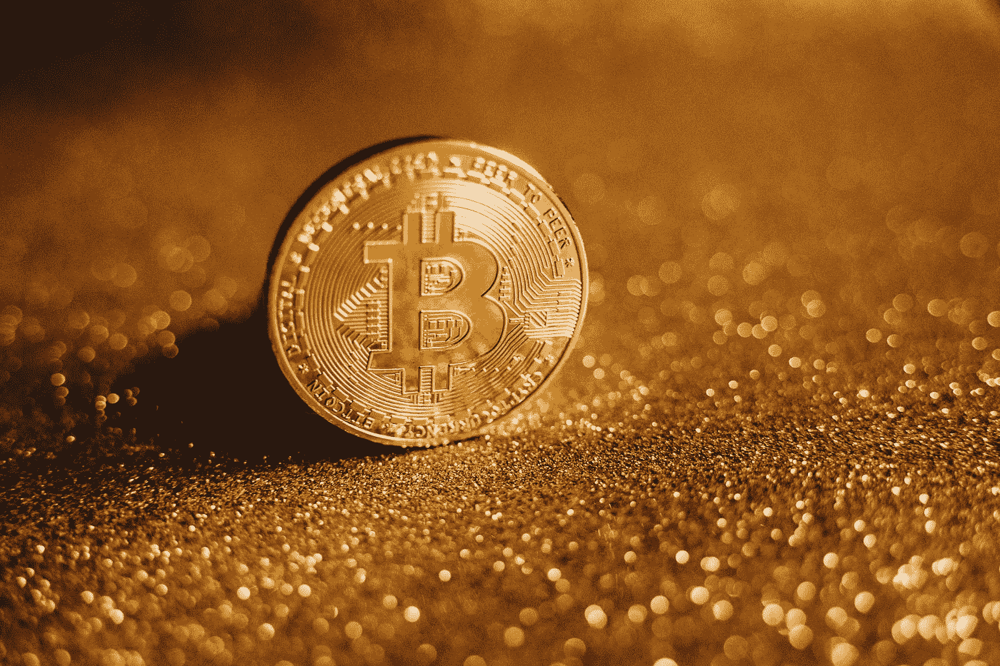

# 比特币|关于比特币的事实|如何挖掘比特币

> 原文：<https://medium.com/coinmonks/bitcoin-facts-about-bitcoin-how-to-mine-bitcoin-17700f478812?source=collection_archive---------64----------------------->

Bitcoin Cryptocurrency

## 了解比特币加密货币

加密货币是金融市场的新时代，也是将技术融入我们生活的途径，包括我们操作金钱的方式。加密货币之所以广受欢迎，可以归功于它的技术，这使得它不可能被伪造或使用超过一次。

这进一步导致它成为我们常用的法定货币的最有潜力的替代品之一。这使得这种新的证券从金融市场获得了很大的兴趣和吸引力。然而，分析师和政府一次又一次地警告投资者，因为他们是一种新的证券类型，在市场上非常新，如果他们仅仅因为趋势而投资，他们将会非常不稳定，并可能导致严重的损失。

最受欢迎的加密货币是比特币。在这篇文章中，我们将读到更多关于比特币的内容，它是如何产生的，你如何购买或开采它们，以及它的未来。

## 比特币从何而来？

当全球经济因 2007-09 年的市场大崩盘而陷入困境时，2008 年，第一张比特币数字纸由一个化名为中本聪的人推出。然而，尽管比特币的发展如此复杂和神秘，但它的起源故事和创始人被笼罩在神秘之中才是有意义的。

在这些研究论文中，Satoshi 提出了一种分散式货币的概念，这种货币不涉及任何管理员，交易可以通过点对点比特币网络完成。区块链的分析师估计，中本聪在 2010 年消失前开采了大约 100 万个比特币。他把网络警报钥匙交给了加文·安德森，他现在是比特币基金会的首席开发者。

关于比特币需要注意的重要事实

1.  比特币的最大供应量是 2100 万，这将是所有的。
2.  比特币发行后，任何政府、个人或团体都无法改变其供应量。它不可能被再造或复制。
3.  比特币甚至可以存储在 u 盘上
4.  通过设定比特币数量的数字挖掘过程，新的比特币被发现并可供购买。
5.  今天，每天大约有 900 个比特币通过采矿进入流通。
6.  每四年，进入流通领域的新比特币数量就会减半

## 比特币怎么挖矿？

利用比特币的处理能力，矿工们反复跟踪新进入区块的交易以及对其做出反应的节点。因此，他们追踪节点回到原点，以获得新的比特币块。

每个比特币都有一个以 SHA-256 开始的密码散列。为了被网络的其余部分接受，新的块必须包含工作证明(PoW)。这种工作证明系统与区块链技术一起允许极其困难地修改链，并且攻击者必须通过链中的每个节点来进行任何改变。

随着比特币越来越多地在流通，这些变化变得更加困难，因为新的和新的节点不断添加到链中。

## 怎么才能买到比特币？

在印度，存在许多加密货币交易所，这些交易所被设计成销售不同的加密货币，而不被印度政府或任何其他中央机构(如 SEBI)忽视。印度排名前五的加密货币交易所是 CoinSWITCH 俱吠罗、CoinDCX、WazirX、ZebPay 和 Vauld。

**购买比特币请遵循以下步骤:**

1.  向您决定选择以旧换新的加密货币交易所提交 Aadhar 卡和 PAN 卡等基本身份证明文件。这是 KYC 进程所要求的
2.  购买比特币，你需要在平台下购买订单
3.  下单后，应根据加密货币交易平台的功能，从 app、NEFT、RTGS、IMPS 或 UPI 的钱包中转账。卡支付、网上银行等选项也是可用的，它们因平台而异。
4.  交易执行后，这些加密货币被安全地存储在平台提供的钱包中

## 比特币在印度

1.  对比特币投资进行彻底的分析是极其必要的，加密货币是目前世界上最不稳定的交易商品之一。它们风险极大，未经全面研究的投资会造成重大损失
2.  投资不同的密码交易平台可以给出不同的价格。因此，建议投资多个在线平台
3.  比特币作为一种支付媒介，尚未得到印度任何中央机构的授权或监管

*原载于*[*https://financialanswers . in*](https://financialanswers.in/bitcoin-facts-about-bitcoin-how-to-mine-bitcoin/)*2022 年 03 月 05 日*