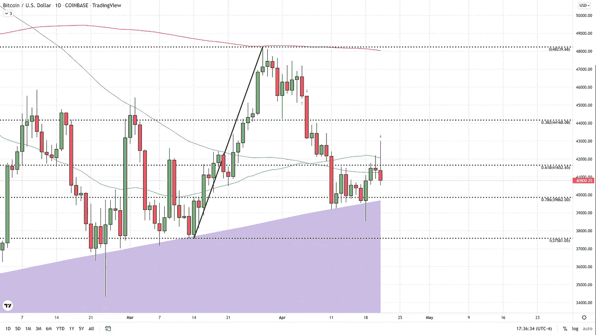
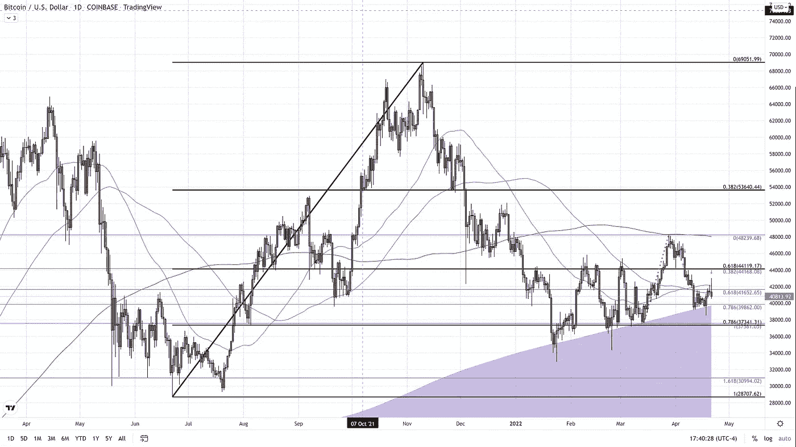

# 比特币第三次尝试收于短期 61.8%短期回撤上方失败

> 原文：<https://medium.com/coinmonks/bitcoin-fails-third-attempt-to-close-above-short-term-61-8-short-term-retracement-b3500b84e8c?source=collection_archive---------77----------------------->

在过去的四天里，比特币连续创新高，但缺乏任何看涨反转的迹象。

周一，比特币从 38500 美元的长期低点反弹后大幅收高，这是一个多月来的最低交易点。今天，比特币出现了相反的行为，上涨和上涨，截至下午 4 点 50 分，东部时间有一个大的红色主体，反映了自开盘以来的较低定价，交易价格约为 40，700 美元(比特币基地)。今天的交易抹去了周二的涨幅，看起来会继续走低。

看跌前景背后的主要技术推理是未能突破短期数据集的 61.8%斐波纳契回撤水平。该数据集的跨度从 3 月 14 日的低点 37，500 美元到 3 月 28 日的高点 48，200 美元。过去三天，虽然有更高的日内价格，但未能收于 41，650 美元(61.8%回撤)的关键水平之上。

我们的短期数据集还强调了我们一直关注的斐波纳契谐波水平。对于我的读者或任何一直关注比特币的交易者来说，这个水平应该不会感到惊讶，比特币的价格约为 44，100 美元。这个水平的真正有效阻力存在于我们较长数据集的 61.8%回撤(黑色)和较短数据集的 38.2%回撤。

目前固定在 42，000 美元的 50 天简单移动平均线是我们提到的需要克服的点，以做出任何类型的假设，即实际的反弹正在进行。这个区域昨天和今天也拒绝了 BTC，因为我们看到它也回到了 100 日均线下方。今天的行动也使得一个由最近三个交易日组成的三江晚星出现了变异。为了成为真正的三江晚星，我们必须让昨天的烛体出现在周二和今天的烛体之上。同样值得一提的是，这种烛台模式必须在一个明确的上升趋势之后出现。虽然我们在周一上涨了 1000 美元，但这一天的上涨是在实际下跌趋势之后发生的。所以，假设我们明天确实得到了这个三江晚星模式的确认，它是一根红烛，有低有高，这是我所期待的。在这种情况下，信号可以以同样的方式交易，就好像传统模式满足所有的标准。

我们可以肯定地说，我们对 19 日星期二死猫反弹的预测似乎是正确的。正是出于这个原因，我们今天发布了做空市场的交易警报。我们最初的目标是 600 天均线，目前锁定在 39，700 美元左右。如果我们达到了那个点，我们可以将止损点降低，以锁定无损失交易，并看看它在 600 天的反应，因为跌破这个水平将带来重新访问 37，500 美元的高可能性，由于这个支撑位的重要性，可能会低得多。所以，虽然这个不能贴上三江晚星的标签，但是我们要自己编一个图案，我就叫这个三江溺猫。

如需更深入的比特币分析，只需点击此[链接](https://www.thegoldforecast.com/bitcoin)。

> 加入 Coinmonks [电报频道](https://t.me/coincodecap)和 [Youtube 频道](https://www.youtube.com/c/coinmonks/videos)了解加密交易和投资

# 另外，阅读

*   [Bookmap 评论](https://coincodecap.com/bookmap-review-2021-best-trading-software) | [美国 5 大最佳加密交易所](https://coincodecap.com/crypto-exchange-usa)
*   最佳加密[硬件钱包](/coinmonks/hardware-wallets-dfa1211730c6) | [Bitbns 评论](/coinmonks/bitbns-review-38256a07e161)
*   [新加坡十大最佳加密交易所](https://coincodecap.com/crypto-exchange-in-singapore) | [购买 AXS](https://coincodecap.com/buy-axs-token)
*   [红狗赌场评论](https://coincodecap.com/red-dog-casino-review) | [Swyftx 评论](https://coincodecap.com/swyftx-review) | [CoinGate 评论](https://coincodecap.com/coingate-review)
*   [投资印度的最佳密码](https://coincodecap.com/best-crypto-to-invest-in-india-in-2021)|[WazirX P2P](https://coincodecap.com/wazirx-p2p)|[Hi Dollar Review](https://coincodecap.com/hi-dollar-review)