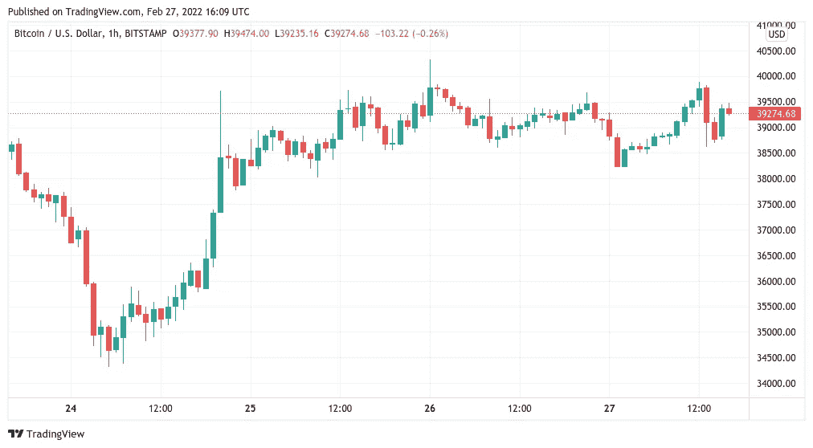
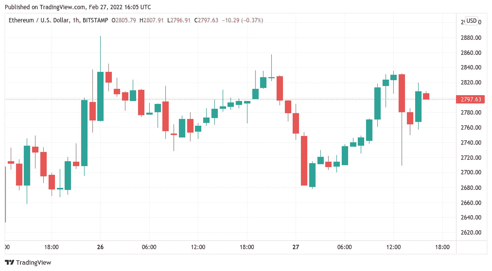

# 比特币未能突破阻力，随着本周接近尾声，4 万美元仍遥不可及

> 原文：<https://medium.com/coinmonks/bitcoin-fails-to-break-through-resistance-and-40k-remains-out-of-reach-as-the-week-draws-to-a-cbcea31f192d?source=collection_archive---------35----------------------->

**Visit our website:-** [**https://bitcoinsupports.com/**](https://bitcoinsupports.com/)

对于宏观市场来说，黯淡的一周正在等待着，而密码交易员在周末享受了一些缓刑。2 月 27 日，比特币(BTC)的交易价格为 40，000 美元，预计每周收盘的基础是避免连续第四个红色月蜡烛。当贸易市场开放时，紧张局势正在上升。

**Visit our website:-** [**https://bitcoinsupports.com/**](https://bitcoinsupports.com/)

根据 Cointelegraph Markets Pro 和 TradingView 的数据，BTC/美元周日多次试图突破 30，000 美元至 40，000 美元的区间，但都被拒绝。在地缘政治和媒体头条引发的一周波动之后，该货币对在周末保持普遍走高，为交易员提供了一些安慰。

现在，人们预计比特币本周和本月将以 38500 美元收盘，如果做不到这一点，将导致连续第四个月出现红烛。

[https://Twitter . com/Matthew hyland _/status/1497933550133391363？cxt = hhwwhsc5 jzso 3c kpaaaa](https://twitter.com/MatthewHyland_/status/1497933550133391363?cxt=HHwWhsC5jZSo3ckpAAAA)

尽管乌克兰入侵导致股价下跌，但该股已触底反弹至 34，300 美元左右，而 1 月份为 32，800 美元。著名交易员和分析师 Pentoshi 表示，“谨慎乐观地认为，这是 BTC 的中短期底部。”

“我正在撤回我的 40.3k 订单(这并不美妙)，并专注于 41.6k 以消除风险。如果你能把它翻过来，肯定有很大的好处。我仍然担心，因为在我看来，宏观环境并不乐观。”

周一开盘，由于西方切断俄罗斯银行离岸流动性的措施和 SWIFT 支付系统，宏观形势注定会带来新一轮的不确定性。弗拉基米尔·普京总统关于俄罗斯核威慑力量的声明在周末引起了一些人的不满，乌克兰和俄罗斯在周日恢复了在白俄罗斯边境的边界谈判。与此同时，对于比特币的支持者来说，俄罗斯金融处罚的潜在后果，以及加密货币作为价值转移的中立网络的作用，开始占据中心舞台。

[https://Twitter . com/jasonprowery/status/1497694345977282560？cxt = hhwwgicyodle 8 mgp AAAA](https://twitter.com/JasonPLowery/status/1497694345977282560?cxt=HHwWgICyodLE8MgpAAAA)

在对央行资产被冻结的推特回应中，前比特币基地首席技术官 Balaji Srinivasan 发推文说，“仍在处理后果。”

“这是金融原子武器。人破产不用炸楼。它同时影响到所有 1.45 亿俄罗斯人，每一个卢布持有者。俄罗斯经济可能会在最大化的情况下崩溃。”就乌克兰而言，它已经开始接受比特币、以太网(ETH)以及为其军队(USDT)提供的系绳捐赠。在撰写本文时，其钱包已收到超过 91 BTC(357 万美元)、1，797 ETH(502 万美元)和 USDT 100 万美元。

对于比特币来说，周末仍然“无聊”

然而，由于投资者仍处于“观望”心态，加密市场的机会很少。

按市值排名的前 10 大加密货币没有一种在最近 24 小时内取得重大收益或亏损。

ETH/USD 目前交投于 2800 美元附近，周涨幅接近 6%。

**Visit our website:-** [**https://bitcoinsupports.com/**](https://bitcoinsupports.com/)

“鉴于乌克兰的局势，我们可能会经历非常繁忙和动荡的一周。在你的位置上要谨慎，不要走极端。由于这些政治事件，情绪和势头可能会迅速转变。”

**访问我们的网站:-**[**【https://bitcoinsupports.com/】**](https://bitcoinsupports.com/)

**免责声明:这些是作者的观点，不应被视为投资建议。读者应该自己做研究。**

> 加入 Coinmonks [电报频道](https://t.me/coincodecap)和 [Youtube 频道](https://www.youtube.com/c/coinmonks/videos)了解加密交易和投资

# 另外，阅读

*   [7 大副本交易平台](https://coincodecap.com/copy-trading-platforms) | [BuyCoins 点评](https://coincodecap.com/buycoins-review)
*   [XT.COM 评论](https://coincodecap.com/profittradingapp-for-binance)币安评论 |
*   [SmithBot 评论](https://coincodecap.com/smithbot-review) | [4 款最佳免费开源交易机器人](https://coincodecap.com/free-open-source-trading-bots)
*   [杠杆代币](/coinmonks/leveraged-token-3f5257808b22) | [最佳密码交易所](/coinmonks/crypto-exchange-dd2f9d6f3769) | [Paxful 点评](/coinmonks/paxful-review-4daf2354ab70)
*   [加密套利](/coinmonks/crypto-arbitrage-guide-how-to-make-money-as-a-beginner-62bfe5c868f6)指南| [如何做空比特币](/coinmonks/how-to-short-bitcoin-568a2d0b4ae5)
*   [币安期货交易](https://coincodecap.com/binance-futures-trading)|[3 commas vs Mudrex vs eToro](https://coincodecap.com/mudrex-3commas-etoro)
*   [如何购买 Monero](https://coincodecap.com/buy-monero) | [IDEX 评论](https://coincodecap.com/idex-review) | [BitKan 交易机器人](https://coincodecap.com/bitkan-trading-bot)
*   [尤霍德勒 vs 考尼洛 vs 霍德诺特](/coinmonks/youhodler-vs-coinloan-vs-hodlnaut-b1050acde55a) | [Cryptohopper vs 哈斯博特](https://coincodecap.com/cryptohopper-vs-haasbot)
*   [顶级付费加密货币和区块链课程](https://coincodecap.com/blockchain-courses)
*   [MXC 交易所评论](/coinmonks/mxc-exchange-review-3af0ec1cba8c) | [Pionex vs 币安](https://coincodecap.com/pionex-vs-binance) | [Pionex 套利机器人](https://coincodecap.com/pionex-arbitrage-bot)