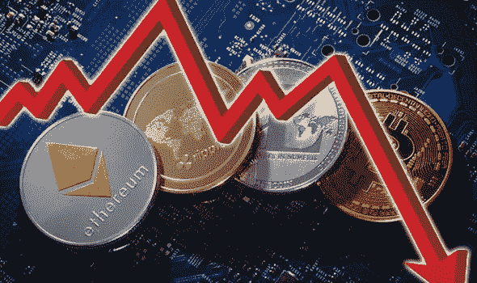
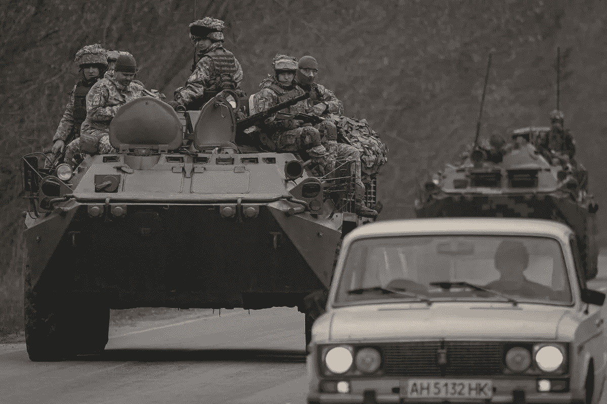
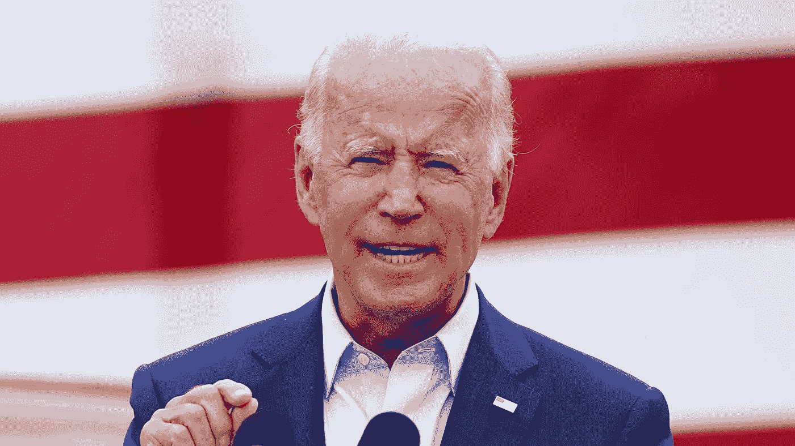
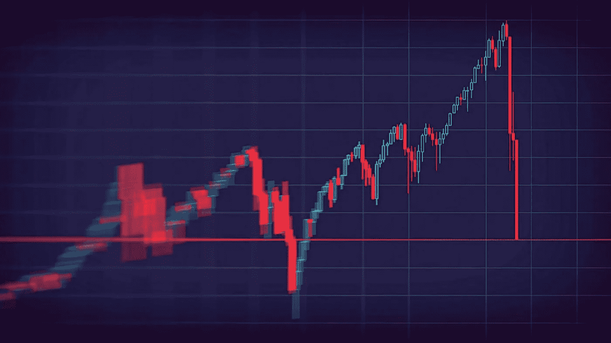

# 比特币再次跌破 35k，原因不是你想的那样。

> 原文：<https://medium.com/coinmonks/bitcoin-falls-under-35k-again-the-reason-why-is-not-what-you-think-9bbc9ddcb71a?source=collection_archive---------16----------------------->

为什么比特币和其他加密货币的价格会越来越低？可能只是全球范围内的事件导致了这种下降。在这篇文章中，我将概述加密货币和其他资产迅速下跌的原因。

# **俄罗斯和乌克兰的战争**

弗拉基米尔·普京宣布在乌克兰采取军事行动后，比特币价格跌破 3.5 万美元。与前一天相比，下降了 8%以上。美国有线电视新闻网(CNN)写道，“由于地缘政治紧张局势，美国美联储加息的前景，以及一些主要经济体对数字资产的限制，货币自 11 月高点 68，990 美元以来已失去近一半的价值。”对美联储收紧货币政策、俄罗斯发生军事冲突以及站错了市场立场的担忧，在周一早间引发了股市恐慌。然后，投资者买入了下跌。标准普尔 500 上涨 0.3%，盘中一度下跌近 4%。似乎现在所有资产都在下跌，除了 1。

# **NFT 的**

NFT 领域现在正在蓬勃发展，1 月份 NFTs 的销售额创下了 70 亿美元的历史新高。那是一个庞大的产业。目前，我因为这个原因买入了以太坊和多边形等资产的 dip。我甚至在 NFTs 上投资了一些钱。我认为，根据目前的市场和元宇宙计划，非功能性测试将会继续存在。

# **乔·拜登的立场**

拜登在推特上说:“世界将追究俄罗斯的责任。”。“普京总统的行动需要坚定的回应。这就是为什么我们对 VEB 和俄罗斯军事银行实施全面封锁制裁，切断俄罗斯的西方融资，对精英实施制裁，等等，”拜登在另一条推文中表示，“俄罗斯应对这次袭击将带来的死亡和破坏负责，美国及其盟友和伙伴将以团结和果断的方式做出回应，”根据福克斯新闻频道的说法，“今晚，全世界的祈祷与乌克兰人民同在，因为他们遭受了俄罗斯军事力量无端和无理的袭击，”拜登通过白宫说。

# **结论**

我相信，尽管加密货币和其他资产现在下跌，但它们总会反弹。我认为这些资产好像在“打折”。反正资产有波动，很正常。以此为契机，获得你所相信的最好的股票、加密货币，甚至是 NFT。非常感谢您的阅读！如果你喜欢，请留下掌声并评论你对这个话题的想法。祝你今天愉快，我的朋友。

> *加入 Coinmonks* [*电报频道*](https://t.me/coincodecap) *和* [*Youtube 频道*](https://www.youtube.com/c/coinmonks/videos) *了解加密交易和投资*

# 另外，阅读

*   [Bookmap 评论](https://coincodecap.com/bookmap-review-2021-best-trading-software) | [美国 5 大最佳加密交易所](https://coincodecap.com/crypto-exchange-usa)
*   最佳加密[硬件钱包](/coinmonks/hardware-wallets-dfa1211730c6) | [Bitbns 评论](/coinmonks/bitbns-review-38256a07e161)
*   [新加坡十大最佳加密交易所](https://coincodecap.com/crypto-exchange-in-singapore) | [购买 AXS](https://coincodecap.com/buy-axs-token)
*   [红狗赌场评论](https://coincodecap.com/red-dog-casino-review) | [Swyftx 评论](https://coincodecap.com/swyftx-review) | [CoinGate 评论](https://coincodecap.com/coingate-review)
*   [投资印度的最佳密码](https://coincodecap.com/best-crypto-to-invest-in-india-in-2021)|[WazirX P2P](https://coincodecap.com/wazirx-p2p)|[Hi Dollar Review](https://coincodecap.com/hi-dollar-review)
*   [加拿大最佳加密交易机器人](https://coincodecap.com/5-best-crypto-trading-bots-in-canada) | [库币评论](https://coincodecap.com/kucoin-review)
*   [用于 Huobi 的加密交易信号](https://coincodecap.com/huobi-crypto-trading-signals) | [HitBTC 审查](/coinmonks/hitbtc-review-c5143c5d53c2)
*   [如何在 FTX 交易所交易期货](https://coincodecap.com/ftx-futures-trading) | [OKEx vs 币安](https://coincodecap.com/okex-vs-binance)