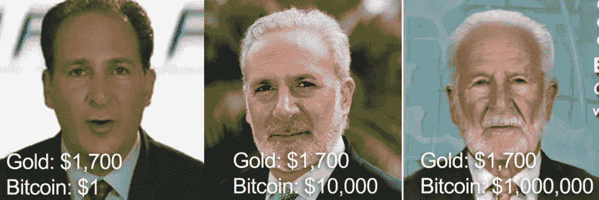
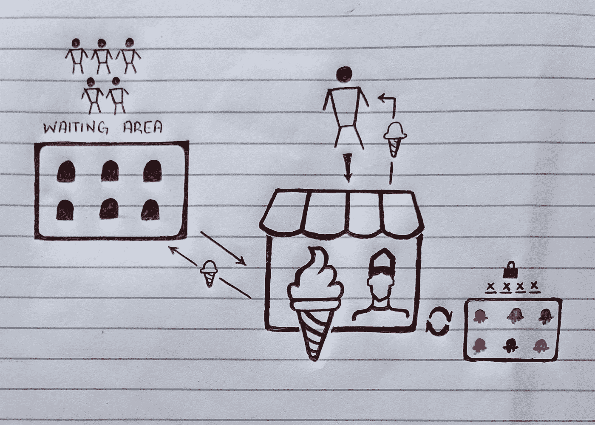
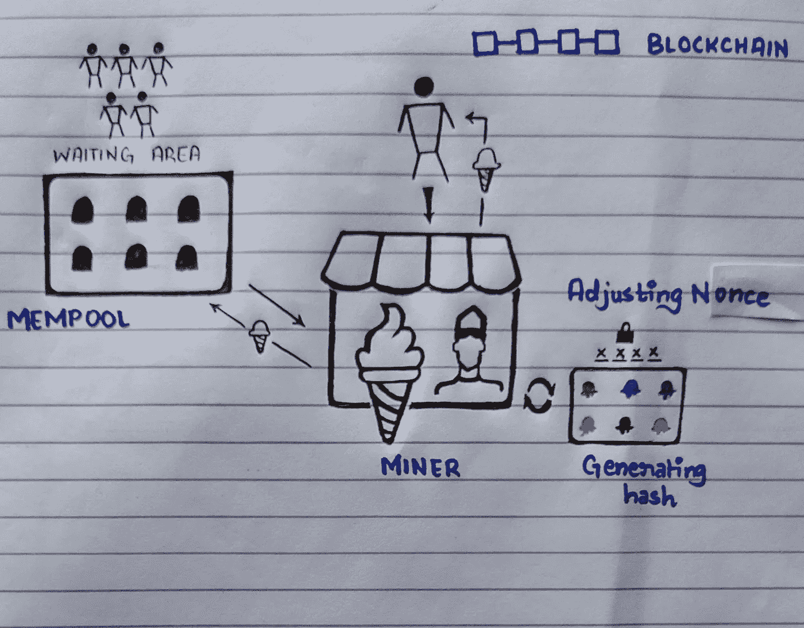

# 比特币口味的冰淇淋

> 原文：<https://medium.com/coinmonks/bitcoin-flavoured-ice-cream-175ad88b9cf5?source=collection_archive---------20----------------------->

比特币……不……是电脑怪胎和书呆子为了在网上找乐子而发明的货币。你只要把你的钱放进去，然后看它如何翻倍。它永远不会是你可以利用的东西。它是为毒贩和瘾君子制作的。现在参加这个网络游戏已经太晚了，祝你再赌一把。

但是等一下，一个国家把它作为法定货币。乌克兰将其作为捐赠接受。它的价值超过了脸书、万事达和著名的美国银行摩根大通。它没有停止生长的迹象。它甚至没有像彼得·希夫(Peter Schiff)预测的那样消亡，他一直是指出美国经济缺陷的杰出人士。

正如其支持者所宣传的那样，比特币可以成为人们的理想货币。这被称为“超比特币化”其基本面支持这一点。用过比特币的用途吗？没有吗？你只是想买一些然后忘记了；你会发财的。正如 [Andreas Antonopoulos](https://www.whatbitcoindid.com/podcast/andreas-m-antonopoulos-on-what-happens-when-bitcoin-takes-over#.YoOHUIbiLko.link) 所指出的，将比特币用于实际目的的人们对这项技术的奇迹感到惊讶。他们受益于它的用例。朝鲜、巴勒斯坦和阿根廷的人民就是几个例子，表明了它的真正潜力，把人民从强权的暴行中解放出来。

> “比特币是时间和空间上最受欢迎的财产。”
> 
> 迈克尔·塞勒

比特币是一种技术。这是一个不变的分布式分类账。如果你忽视了比特币，你就忽视了技术，历史对不相信技术进步的人一直很残酷。2009 年 1 月 3 日，一位名不见经传的程序员中本聪发明了比特币，赋予人们用钱的权利，并解除了对主宰金融领域的银行和机构的控制。这是有史以来最简单、最独特的代码，象征着安全、抵制审查和自我主权。但是底层机制是如何工作的呢？我们将通过我们神奇的冰淇淋店来解释这一点。

想想乔治，我们的冰激淋先生。但这不是普通的冰淇淋店。每个来这里的人都会得到一个补充他们性格特征的冰淇淋。但是为了找到这种完美的冰淇淋，乔治必须根据不同的人来搭配不同的口味。所以，假设你想要最理想的冰淇淋。你去找乔治，他会操作他的冰淇淋机找出你想要的确切口味。这台冰淇淋机是独一无二的，因为它的口味每秒钟都在变化。还有，它可以在一秒钟内做出大量的可能性。但是，如果在一秒钟内，现有的口味不能提供你想要的冰淇淋呢？乔治将不得不等待整整一秒钟再试一次，现在这不是一个“神奇”的冰淇淋机足智多谋。

乔治所做的是在商店里开辟一个等候区，这样顾客可以坐在那里等候。每次他点餐时，如果组合不符合口味，他就会从等候区的人那里接受订单，并尝试做出自己喜欢的口味。在等候区有很多人，所以他根据他给冰淇淋的钱来选择那个人。此外，乔治是一名出色的员工，所以他从老板那里每卖出一个冰淇淋就能得到一份奖励，还有顾客支付的钱。

现在，让我们把这个概念融入到比特币中。乔治是我们的矿工，他的组合数是他通过改变一个叫做 nonce 的随机数生成的散列数。做出来的冰淇淋是区块链上包含的交易，老板收到的金额是客户支付的交易费之外的区块奖励。等候室类似于内存池。

当你去冰淇淋店下订单时，类似于将你的交易提交给矿工。在我们的案例中，矿工乔治通过根据比特币的目标历史(你独特的个性特征)改变随机数，找到了你交易的确切散列。一台挖掘比特币的普通机器每秒可以产生 55 个 terra 哈希，这是一个巨大的数字。因此，有可能您提供的关于事务的详细信息和 miner 提供的 nonce 的可能性，直到组合数用完，您才得到块的散列。第二，必须等待新品种被试用。在这种情况下，矿工指的是 Mempool，人们在这里等待他们的交易被包括在区块链中。你没有选择这些人之前，因为他们给你一个较低的交易费。最好是通过寻找数据的新组合来处理他们的交易，而不是等待一秒钟；请记住，我们这里讨论的是 exa-hashes，运行该机器需要电力。矿工通过从交易费和集体奖励中获得的比特币数量来激励他运行这台机器，类似于为员工的工作支付报酬。这种“工作证明”保护了比特币网络，并允许以分散的方式处理交易。

在 miner 处理您的事务后，它将由一个额外的验证器层进行验证，然后包含在区块链中。但有趣的是，你的冰淇淋收据上有一个与前一个人的收据相关的号码。这就是在比特币中，每一个之前的区块都可以被追踪，整个链条可以形成，因此有了“区块链”这个术语这就是为什么它是迄今为止最安全的账本。

当你买比特币的时候，你不会买一个矿工，一个账本，或者一个区块。它甚至不是你可以藏在床垫下的实体硬币。你获得的是一枚存在于区块链的硬币，它负责链条上的所有经济活动:转移链条上的流动价值，为处理交易向矿工支付费用，以及管理比特币协议的规则。比特币协议的基础是比特币网络的每个成员都必须遵守的规则。

比特币被设计成一种“点对点货币”。其背后的机制确实支持这种说法。它是由互不相识的矿工维持的，没有一个单独的组织在背后支持它。货币通常被定义为价值储存手段、记账单位和交易媒介。如果你看到比特币，它在所有三个领域都很突出。它通过随时间对数增长来保持购买力，并且是通货紧缩的。它可分为等于 0.00000001 BTC 的几分之一，允许液体流动的价值。比特币之所以有需求，是因为它的基本面。这使得它成为任何人交易的标准交换媒介。

中本聪写的那些[九页](https://bitcoin.org/bitcoin.pdf)代表了一种优雅而独特的技术，它经受住了时间的考验，是金融界的一个突破。我们彻底改变了通过互联网交流的方式；这就是“[货币互联网](https://www.youtube.com/watch?v=KW_wYvZ1eZg)”

比特币很简单，你尊重它，它也会尊重你。

> 加入 Coinmonks [电报频道](https://t.me/coincodecap)和 [Youtube 频道](https://www.youtube.com/c/coinmonks/videos)了解加密交易和投资

# 另外，阅读

*   [TraderWagon 回顾](https://coincodecap.com/traderwagon-review) | [北海巨妖 vs 双子星 vs BitYard](https://coincodecap.com/kraken-vs-gemini-vs-bityard)
*   [Exness 回顾](https://coincodecap.com/exness-review)|[moon xbt Vs bit get Vs Bingbon](https://coincodecap.com/bingbon-vs-bitget-vs-moonxbt)
*   [如何开始通过加密贷款赚取被动收入](https://coincodecap.com/passive-income-crypto-lending)
*   [加密货币储蓄账户](/coinmonks/cryptocurrency-savings-accounts-be3bc0feffbf) | [加密交易机器人](https://coincodecap.com/best-crypto-trading-bots)
*   [BigONE 交易所评论](/coinmonks/bigone-exchange-review-64705d85a1d4) | [CEX。IO 审查](https://coincodecap.com/cex-io-review) | [Swapzone 审查](/coinmonks/swapzone-review-crypto-exchange-data-aggregator-e0ad78e55ed7)
*   [最佳比特币保证金交易](/coinmonks/bitcoin-margin-trading-exchange-bcbfcbf7b8e3) | [比特币保证金交易](https://coincodecap.com/bityard-margin-trading)