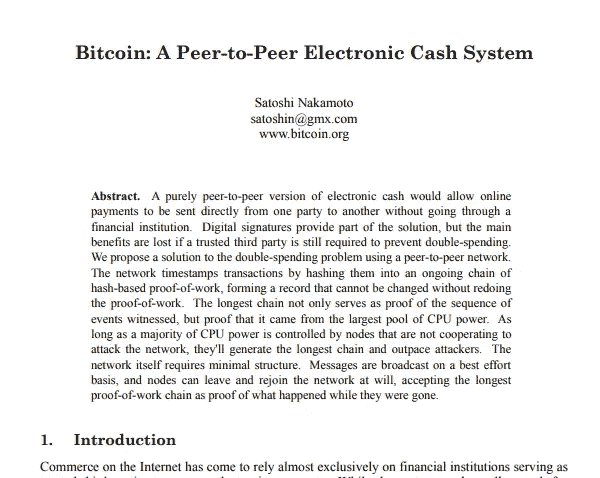

# 自下而上的比特币

> 原文：<https://medium.com/coinmonks/bitcoin-from-the-bottom-up-6c9e17486a19?source=collection_archive---------13----------------------->

*地图注释，第 1 部分，v0.1*

顾名思义，这些笔记的目的是自下而上地解释比特币。在接下来的章节中，我将讨论电力、计算机、宏观经济学、货币的历史和哲学、金融市场、政治哲学以及比特币网络的架构。

我这样做是希望增加对比特币工作原理的理解。在许多我在道德和智力上尊敬的人当中，比特币经常被认为是行不通的。我认为那是错误的。我认为它至少值得关注和思考，关注它将我们的注意力集中在到处出现的重要而深刻的哲学和政治问题上。

我不打算“捍卫”比特币。事实上，我想含蓄地主张的立场是:

**比特币或许主义**。比特币可能是个好主意。很复杂，不清楚。

据我所知，比特币的可能主义者并不多。比特币往往会引出极端分子、福音传播者和活动人士，我认为不确定但好奇的人没有被充分代表。我希望纠正这种代表性不足的情况。

我称之为“地图笔记”是有原因的。首先，注意:你应该把我当成一个同龄人，一个没有政治或知识权威地位的公民。我读过一些书，想试着解释一下我的发现。这些我都没有资格。其次，地图:我讨论的一切都是简化的。此外，因为很多事情都很复杂，我肯定犯过错误。我认为，如果我成功地建立了概念领域，让人们能够搜索他们感兴趣的主题，找出我错在哪里，并变得更加清晰，我的工作就完成了。

计划如下。我将学习教科书中介绍的电学、计算机、宏观经济学；互联网经济(平台资本主义)；金融市场；关于货币本质的人类学和哲学观点；一般的政治哲学，对 20 世纪经济史的解读，以及对比特币工作原理的讨论。我也接受请求。在这篇文章中，你会找到前三个部分。我希望尽快写其他的，并且已经做了大部分的研究，但是工作特别忙。

当我说这里有错误时，我并不是虚情假意地谦虚。警告选者！如果你发现错误，请让我知道，无论是在这里的评论中，还是在 Twitter 上，或者——最后的手段——电子邮件(你不必让我知道错别字，我会在随后的草稿中发现它们)。最后，为了公正起见，我尽量不引用支持比特币的人；然而，在某些时候，不这样做是不诚实的。目前，我倾向于只提到人们的名字(大多数情况下，我是通过 Twitter 听到这些想法的，很难找到可以引用的推文)。我将在未来的草案中改进这种提法。

这里介绍的三个部分是独立的。如果您知道或对某一部分的材料不感兴趣，您可以跳过它，而不会有任何损失。

# **第一节电**

人类已经发展到这样的程度——通过让大自然代替我们完成各种任务，每天消耗数万卡路里的能量。这些数字非常惊人。根据 Lewis Dartnell 的《T2 的知识》，大约在 2014 年，欧洲人平均每年消耗 40，000kWh；普通美国人有 9 万人。正如他告诉我们的那样，普通美国人(当然，平均起来包括工业产出，所以这有点误导性)的年能耗相当于一个由 14 匹马组成的团队，或超过 100 人，每天 24/7 不停地工作(p163)。

很容易忽视我们甚至我们的近亲之间的巨大差异。但是，我们所拥有的越来越多的能源已经多次改变了世界。今天所有的讨论都是关于人工智能的，但是十九世纪蒸汽机所实现的人工*运动*在那时是人工智能所希望的我们未来不可或缺的发展。另一个这样的 19 世纪的发展是人造光。在灯泡发明之前，我们天黑后的生活是暗淡的。这不仅影响了我们的生活，当然也影响了我们能做多少和做什么样的工作。根据经济史学家罗伯特·戈登的说法，即使是最好的个人光源——蜡烛或各种类型的油——发出的光也只有一个 100 瓦灯泡强度的十二分之一到十五分之一之间(戈登，T6)《美国增长的兴衰》( T7，p116)。灯泡的发明使工厂经营者能够在夜幕降临后经营他们的工厂，潜在地克服了历史上阻碍人类发展的生产力障碍。

因此，能量是我们需要适当考虑的东西，以理解它今天作为人类是什么。评估比特币也很重要，因为如果人们知道比特币的一点，那就是它(必然)使用大量电力，这意味着(事实上)它使用大量污染性化石燃料，尤其是煤炭。事实证明，从物理学、经济学、历史和法律的角度来看，能源也非常有趣。因此，了解一下它是值得的。下面我将介绍一些关于电的基本事实，希望能给那些想了解更多的人提供一张电的一些重要特征的地图。

**什么是电？**

让我们从接近开始说起。有东西。物质是由化学*元素*的化合物组成的，其中大约有 100 种，具体取决于你计算的数量。水是由氢元素的两个原子和氧元素的一个原子组成的化合物构成的；为此，我们直截了当地称它为 H2O。原子本身有内部结构。它们由质子、中子和电子组成。质子和电子带相反的电荷。从原子中去掉一个质子很难，但有时去掉一个电子或给一个电子增加一个电子很容易。在一些叫做导体的物质中，我们可以使电子穿过这种物质。如果我们把物质想象成一条由相邻原子组成的一维线，我们可以把一个电子从一个原子打到线中的下一个原子上。

如果一个原子有多余的电子，而附近的原子缺少电子，自然会试图通过从多余的电子转移到不足的电子来纠正这种不平衡，这种转移就是*电流*。电流以安培为单位，与电流流经的地方之间的电子不平衡量(以伏特为单位)和电流流经的材料的电阻(以欧姆为单位)成比例，后者衡量电子在原子间移动的难度。

19 世纪晚期，人们意识到电流可以让 T4 做很多事情。在这里，依赖民间的、不准确的隐喻是非常诱人的，我们也是如此。想象一下，我们有一股电流流过一种物质——电子从一个原子到另一个原子被排斥和激发(发明一个词)。在一些原子中，增加和移除电子会更加困难。我们可以想象，电子不得不推离它要离开的原子，并推向它要进入的原子。就像你自己被困在一个塑料泡泡里(就像《宋飞正传》中的泡泡男孩)，必须努力去戳破它，然后努力去打破相邻的泡泡，你会以汗水的形式产生热量，所以电子迫使自己进出一些原子，从而产生热量。这就是灯泡的工作原理。我们让电流流动，然后提供电阻；在突破电阻时，电子以热的形式损失能量，这改变了电阻材料的颜色，直到它变热并发光。

人们很早就意识到电的另一种用途。奇怪的是，启动电流的一种方式是旋转磁铁。这是由于关于物理世界的一个非常深刻的事实，即电和磁——粗略地说——是同一个东西。这意味着机械运动(磁铁的运动)可以转化为电能。反之亦然:我们可以让电流流动，产生磁场来移动磁性物体，因此我们可以用电流制造各种电子马达，将电能转化为动能。无需深入细节，你可能很熟悉磁铁是如何相互吸引和排斥的。如果你让电流流过导线，它将产生一个磁场，这个磁场将移动附近的任何磁铁(由于前面提到的物理学的深层事实)，这种移动可以用来制造马达。

但是这个事实使我们能够回答另一个你可能想知道的问题，这个问题将被证明是基本的:电从哪里来？而答案是:同上，反过来。如果我们将一根导线绕在一块磁铁上，然后旋转这块磁铁，我们将产生一种与导线匝数、磁铁的磁场强度(以及导线的特性)成正比的电流。

但这只是把问题带了回来:我们如何旋转磁铁？当然，如果我们非常强壮，我们可以自己旋转它，但是我们的手可能会有点累。幸运的是，我们知道如何从各种东西中产生运动，机械功。罗马人和更远的地方(可能在此之前)都熟悉使用水车，例如:在水车中，我们利用水的下落来撞击并转动水车的挡板；利用齿轮系统，我们将力的方向从垂直变为水平，并发明了像磨坊这样的基本发明。我们也可以利用风能或太阳能。

但是，在这里，我们开始从物理转向工程，当涉及到生产我们需要的电能时，这种自然能源是棘手的。为了发电，我们需要一个稳定可靠的能源来源，但目前自然资源还不太充足。出于这个原因，从保持稳定的电力来源的角度来看，“最好的”资源是像化石燃料这样的东西，其数量可以预先订购和储存，并且不依赖于变化无常的太阳或风(也许他们确实依赖于俄罗斯政府的变化无常，但那是一个单独的问题……)正如格雷琴·巴克所说，她的*电网*是我所有下面和一些上面的来源，我衷心地向每个人推荐，所谓的“可变发电”，这是一个问题真正让它成为问题的是，如果地球要生存下去，我们就不能没有它。如果我们想继续我们已经习惯的高能量生活，同时又不想完全毁灭地球，电力做出了生动而非常困难的选择，这是一个很好的理由去关注它，甚至在我们考虑比特币之前。

电的问题远远超出了我们用来发电的能源。正如我们将看到的，这是一种独特的产品，即使在最好的情况下也很难销售，这一事实只会因 20 世纪的一些文化和经济趋势而加剧。我们现在转向他们。

**电力经济学**

一旦我们从这些物理事实上升或下降，故事就变得有趣了。我们使用惊人数量的电，但是电，作为一种东西，是非常怪异的。它的某些特性使得电力经济学非常令人担忧。让我们来解释其中的一些(这些都是直接来自巴克)。

电是一种奇怪的产品。想想它的一些特性。它不能储存和运输:我们不能用电力装满集装箱，然后把它们送到需要的地方。当我们有太多牛奶时，我们不能像买太多牛奶时那样把它放在冰箱里。此外，当它被需要时，它会被很多人需要。当它不被需要时，很少有人需要它。作为前者的一个例子，考虑在住宅区下午 5:30 左右。你下班回家，打开空调或暖气，打开(可能)电炉、XBox、个人电脑，打开冰箱。大多数其他 9-5 岁的孩子也这样做。相比之下，在凌晨 2 点，几乎所有这些事情都被关闭了，因为他们在其他 9-5 岁的人家里。

这简直是一个非常大的问题。想象一下，你负责给某个住宅区供电。碰巧的是，你最大的成本是建造工厂和其他机器的固定成本；每个单元的额外成本相对来说是微不足道的。这意味着，从你的角度来看，一个理想的世界对电力的需求应该是恒定的:凌晨 2 点和 5 点一样多，下午 5:30 比早上 5:30 不多，也不多。

你没有那个。事实上，你将面临，最早的电力巨头，如塞缪尔·英萨尔指出(巴克 68)，无论是否使用，基本上运行成本一样高，只有大约 75%的效率。

这些时间变化，高需求时期，变得更糟。在某种程度上，供应商可以预见 5:30 的高峰和凌晨 3 点的平静。他们可以预见八月(一月)将会有更多的高温。但有些事情是无法预见的，或者充其量只能是已知的未知:最艰难的时候不合时宜的日子。气温超出预期几个标准差的八月。我们知道这一点:我们知道它可能会发生，但我们不知道何时或是否会发生。

如果你的公用事业公司为你提供电力，那么你想要电力。此外，当别人想要权力时，你也想要权力。在得克萨斯炎热的一天或挪威寒冷的冬夜，你会变得没有耐心。所以供应商必须能够提供。一个简单且符合理论的思考方式是，当然，这是可以做到的——在需求高峰期，你只需打开更多的电厂。事情就是这样。问题是他们是那些因为某种原因而一直被关闭的人。想象一下，你拥有一家家族企业，你的孩子在忙的时候帮忙。他们大多还好，大约从一个粗暴的青少年非常糟糕的举止。所以你不让他轮换。但有时候就是没办法:客户不停来，你就派他去接单。这并不伟大——他对顾客破口大骂——但你一年只需要他一个小时，所以你容忍了。

当这种情况发生在电力行业时，我们有所谓的“高峰需求”，但问题比乖戾的青少年更糟糕:当那些已知的未知发生时，正如它们越来越多地发生的那样，电力公司启动了他们最古老、污染最严重的电厂。这导致了糟糕的结果。根据 Bakke (P175)的说法，当我们处理已知的未知时，“10%的公用事业资源被投入到……2%的时间”。

这里有两个概念，或者两种看待一个概念的方式，我们应该从中吸取教训。当每个人都需要电力的时候，我们也需要电力(炎热的德克萨斯天气)。每当没人要电的时候(凌晨 3 点)，我们都不想要电。长期以来，比特币对其能源使用的回应是，它可以帮助实现这种微妙的平衡:当没有人使用能源时，它可以用来使用能源，平滑 24 小时的消耗，有利于电网及其用户(我至少从安德烈亚斯·安德洛波洛斯、安德鲁·贝利和特洛伊·克罗斯以及尼克·卡特那里听说过这一点(或其变体);这不是我的眼睛)。我不打算为此争辩；简单地说，为了评估它，我们需要知道这些关于电的事实。

从某种意义上说，我们最终有了电是一个奇迹。上面提到的属性——不可储存性、高峰需求、高启动成本——使它成为一个非常没有吸引力的提议。在电力行业的最初几十年，人们尝试了各种配置和商业模式来处理这些事情。因此，最初的模型是，电力将是一种分散的东西:每条街道，或工厂，或任何其他地方，都有自己的发电机，不与任何其他地方相连(这个模型部分是由 DC 电流的一个特征提出的——我们在这里不解释——这是很难长距离传输；另一种选择是 AC，它更适合地理上分散的公用事业。)事情不是这样结束的。

但是为什么呢？我不认为我们——当然我也不认为——能找到任何单一原因的解释。一件事是，一个核心玩家，上面提到的 Insull，试图使用任何一个拥有优步的人都非常熟悉的策略来补贴非高峰时期的使用。他以折扣价卖给工厂，这件事的魔力开始显现:他得到的那一点点费用，比他如果不费心的话什么也得不到要多得多。这种通过灵活定价来转移需求的想法在所谓的“智能电网”中依然存在。(电动汽车的一大希望是，它们是车轮上的电池，可以在夜间充电。)

但也许最重要的是一定的监管俘获。粗略地说，自然垄断是指只有一个产品卖方给消费者带来的成本低于有一个以上卖方时消费者支付的价格。拥有大型发电厂的电力被视为自然垄断，因苏尔设法让政府站在一边，支持他声称自己是镇上唯一的一家。正如巴克总结说的:

> “与物理、市场或文化的任何事实相比，长期贷款担保形式的监管，加上有保证的投资利润，使电力公司能够承受建设更大、更强大的发电厂和更广阔的电网的巨大基础设施成本。监管也保护了它们免受竞争，让出了各自对特定服务区域内电力生产和分配的绝对控制权。这种长期国家支持的原因是，电力被认为是一种特殊的公共产品，其价格因竞争而被抬高而不是降低，其可用性受到多个相互竞争的供应商的干扰而不是保证。”

解读历史的一种方式是，我们有某种自然垄断，这种垄断只有在国家支持下才能存在，正是这种垄断使美国实现了电气化，尽管这种情况发生的可能性很小。

不过，这种情况在 70 年代前后发生了变化。它从几个方面做到了这一点。这是一个石油危机的时代，因为在 1973 年的石油输出国组织危机中，石油价格急剧上涨。同样，大约在这个时候，人们开始变得更加环保，并意识到化石燃料引起的问题，这在一定程度上体现在一系列法规中，这些法规大幅增加了制造电厂的固定成本，从而逐渐危及公用事业公司设法恢复秩序的奇迹般的平衡行为。

此外，1978 年的《国家能源法》,尤其是其《公共事业管理政策法》,极大地改变了这些政策。PURPA 意味着公用事业公司必须购买和分配任何实体生产的能源。也就是说，如果我买了一台太阳能发电机并开始发电，我可以把它接入电网，公用事业公司必须为此向我付费。以前，电力公司控制着电力的生产和分配。这种情况发生了变化，系统变得更加分散。

这是我想引起注意的一个深刻的讽刺。比特币经常被视为去中心化的梦想:其表面上吸引人的逻辑是，权力(我指的是政治权力)的集中持有者往往是坏事。有人可能会认为 PURPA 是反独裁主义者应该深情地看待的东西。但根据贝克的说法，该法案对公共事业或我们都没有好处。该法案颠覆了经营一家盈利的公用事业公司所需要的极其微妙的经济平衡行为，尽管这种行为显然是有害的。一种思考方式是，由于拥有对电力系统的(受法律保护的)完全控制权，公用事业公司能够承担巨额成本。随着 2001 年能源政策法案的出台，这种控制变得更加明显，事情发生了变化。据我所知，如果 PURPA 让除了公用事业公司以外的代理人生产和销售电力成为可能，EPA 就让它成为 T2 的义务，将发电和配电分开，这样分销商就不能发电(120)。

巴克告诉我们，问题在于网格。电网——发电站、变电站(将长距离传输的超高压电力转换成更接近我们家庭和企业使用的电力)、电线等庞大的机械设备——逐渐让所有这些人寻求利用它来盈利，但没有人的利润是通过维护电网获得的。因此网格变得更老，破损更多。

**道德**

电的故事是有用的，原因有几个。第一个原因很简单，它表明事情有多困难。在认真思考如何共同生活时，我们不得不做出艰难且不完美的决定。也许需要一些垄断。也许政府应该支持他们。某些事情——允许个人产生并对他们产生的力量有发言权——可能是似是而非的。某些事情可能就是不一致，比如稳定的电力供应，这是我们大多数人日常生活中必不可少的东西，以及放弃化石燃料。

关于电力市场还有很多要说的。我们只是触及了表面。但希望它带来的挑战现在更加明显。



The aim of these notes is to present bitcoin in as wide a context as possible

# **第二节。电脑**

这一节的目的是简要描述计算机是如何工作的。在这些笔记中这样做有几个原因。

首先是因为这是我任务的一部分:自下而上地解释比特币。我们现在有各种设备，我们知道电流通过其中一些设备，以及复杂而令人担忧的故事。但是，我们如何将电变成社交媒体，或者电子表格，甚至可以创造性地下棋的人工智能系统？有趣的是它的可理解性——正如我们将会看到的，计算机是一种制造机器的机器，它只是简单地快速地做许多事情。第二，一点点计算机科学架构知识可能会帮助我们了解为什么比特币的能源消耗是这样的，以及能源是如何几乎针对计算机使用的，从而使比特币成为一种独特的互联网技术。第三个是最简单也是最重要的:想法很美很酷。

**代号**

一台计算机由几件设备组成，但在基础上只是一根电线，电通过它移动，还有一些阻碍电流或以其他方式对电流起作用的设备。

这里首先要掌握的也是最重要的一点是代码的概念。你可能听过有人说都是 0 和 1，也许你想知道这是什么意思。Doom，n 维线性回归，@wint 等如何。来自 1 和 0？部分答案是不需要——它还需要声学和光学设备以及信息理论。我们不会多谈这些。对于其余的，我是按照一个简化版本的计算机在，但它怎么知道？作者 J .克拉克.斯科特。查尔斯·佩佐德的《代码》涵盖了我认为相同的领域，尽管我没有看它。马尔维诺和布朗*的数字计算机电子学*也被提到了不少。

但部分答案是代码。我们可以储存信息——一个厄运。wad 映射文件、一组数字、一条 tweet——以二进制表示。二进制是由两个符号 0 和 1 组成的表示系统，这两个符号决定了一个数字基数。就像普通数字中的数字 10 一样，一个数字的第二位出现 1 表示它的值是 10 * 1，所以这个数字在二进制中表示第*2** 1 个数字，也就是 2。继续这个模式，只是为了说明，我们可以在基数 2 和基数 10 之间转换，如下所示:

1=01

2=10

3=011

4=100

诸如此类。但不止如此。显然，只要给出这两个数字，我们也可以用代码来表示单词。不太明显的是，我们可以编写代码来捕捉声波或视觉波的波长和频率。让我们只考虑第一个:通过二进制表示单词。

最简单的方法就是如此，这个小表格显示了我们如何先用十进制再用二进制对字母进行编码:

a=1=01

b=2=10

c=3=11

..

z=26=11010

空间= 11011

因为我们最大的数字有五位数，所以更容易假设它们都有，并用前导零填充其余的数字。

现在一些很酷的东西出现了。我们可以用载流导线传输信息(这基本上是一种电报)。我们可以闭合和打开一个开关，将电路的闭合状态与 1 和断开状态与 0 配对。然后我可以用电写下“hello world ”,与一个朋友达成一致，信号或无信号持续一秒钟表示一个字母，然后像这样打开和关闭电路:

t1。打开，闭合电路，打开，打开，打开

t2。关，关，开，关，关

t.3 打开，关闭，关闭，打开，打开

t4。开，关，关，开，开

t5。开，关，关，关，关，关

那会拼出“你好”！当然，那会有点慢，所以如果我想这么做，我最好收集一堆电线(在 5s 内)。然后，每次对应的代码都有自己的线路，我们一次发送“hello”(诚然，我们必须非常擅长多任务处理，同时轻触 5 个开关)。

这已经很了不起了:我们可以用电来记录和存储数据。我们将使用的非常简单的计算机的第一个组成部分很简单:它是一组电线的集合，电流可以沿着这些电线通过，也可以不通过。在我们的计算机中，电线的数量将是 8；每根电线编码两个值中的一个，代表一个位，一个单一的二进制数字；它们的集合是一个字节。

我们要添加的下一项是内存。我们可以假设我们称之为简单的位置(如果你知道这个主题，或者想看得更远，为了简单起见，我在这里有意将寄存器和 RAM 合并在一起)。位置是字节长度的，它们连接到所谓的总线，总线只是一组(也是字节长度的)导线。我们可以在任何给定的地方*设置*或*启用*。当我们设置它时，总线的内容被存储在这个地方；当我们启用它时，这个地方的内容就会被转移到总线上。

这些地方是如何运作的相当复杂，恐怕我无法向你解释清楚(谷歌“与非逻辑门”，希望你能找到一些有用的东西)。但事实证明，通过相对简单的电子线路，我们可以创建一个存储信息的设备，即如果我们在 t1 时在总线上有一个模式，那么在 t2 时有一个不同的模式，假设我们在 t1 时设置位置来记录数据，当我们在 t2 时，当 t1 模式从总线上消失时，t1 模式存储在该位置。也就是说，我们可以让我们的设备*记住*系统过去的状态。

虽然我不会详细描述记忆是如何工作的，但我会介绍一种我们用来记忆的东西，事实上在计算机中可以做更多的事情:逻辑门。

如果你曾经上过逻辑学导论课，你可能会遇到命题逻辑。它是整个句子及其组合的逻辑。它假设了一组命题原子，我们可以指定为 p，q，r 等等，以及一组连接词。我们可以把一个原子和一个连接词放在一起构成复合句。出于逻辑目的，我们需要知道的关于原子的唯一事情是它们的真值。因为有两个这样的命题(所有事物都是真或假的，至少让我们假设)，我们可以相应地用电来做命题逻辑。

我们可以取原子 p，而形成 NOT p；我们可以谈论原子 p 和 q，形成 p 和 q，等等。我们给原子分配句子，从而解释它们；因此，p 可能是“拜登是总统”，q 可能是“哈里斯是副总统”。我们可以用这个来建立一个逻辑——一组总是正确的句子。这是我们逻辑的一部分，例如，如果 P 和 Q，那么 P。

下面是我们如何用电来捕捉命题逻辑。举个最简单的例子，不是。我们可以制造一个逻辑门，它对电的作用就像抽象的否定运算对命题原子的作用一样。这个门，当一根电线通上电流时，输出一个没有电流的信号；当没有电荷时，输出电流。

对于‘和’，我们也可以这样做。“与”门接收两条导线。它有一根输出线，当且仅当两根输入线都接通时，它才接通。我们使用真值表来指定这种门的行为。这里有一些例子，其中最左边的列表示原子的可能状态和跟随它的那些状态，由处于这些状态的原子组成的复合物的真值(medium 弄乱了格式，我没有时间或兴趣马上修复它，但希望下面的内容是可理解的，如果难看的话):

p Q | NOT p | p OR Q | p and Q | if p then Q | p XOR Q

00| 1| 0| 0| 1| 0

01| 1| 1| 0| 1| 1

10| 0| 1| 0| 0| 1

11| 0| 1| 1| 1| 1

“与”和“或”的定义适用于位，但我们也可以提出适用于字节的门。因此，您可以执行按位 AND，这是一个字节的每一位与另一个字节的相应位进行 AND 的结果(存在溢出问题，但我们会忽略它)。或者，我们可以执行按位 Or，顾名思义，对相应的位进行 OR 运算。

我们可以这样做:我们可以简单地添加来自每个地方的电线，然后连接到“与”或“或”门。

但是我们可以做些更酷的事情。我们可以指定一种新类型的东西，一个*单元*。该单元连接到总线，因此它可以从内存中读取。在单元内部，有单独的逻辑门，如 AND、OR 等，以及其他一些逻辑门，如执行加法或减法或乘法的门(你必须相信我们可以从简单的门构建它们；这个你可以谷歌确认一下)。它还连接到一个*设置器*位，告知该单元执行哪个操作。为简单起见，我们假设该单元只有 AND 或 OR；我们如何扩展它应该是很明显的。

我们已经有了制造机器的机器的雏形。特别是，这种安排要么是或机，要么是和机。决定它是哪一个的是 setter 位的值，我们可以假设它是由某个输入设置的(后面会有更多；如果该单元有两个以上的操作，我们将需要不止一个位来设置哪个操作)。

所以我们有代码、总线、门和这些门执行的操作。让我们进一步规定，AND 和 OR 运算必须应用于位置 1 和 2 中的任何内容，而不能应用于其他地方。

然后我们可以描述我们的或机器——描述它是如何工作的。假设我们想在内存中存储两个值，比如位置 15 和 17。首先，你自己想想，鉴于我所规定的，我们该如何去做。

这就是我们的工作。我们启用 17，把它放到总线上。我们禁用它——你可以想象这就像“关上水龙头”。然后我们设置 1，也就是说将总线复制到 1 中。我们对 15 人和 2 人做同样的事情。然后，我们将单位设置位设置为 1，表示或。该单元有它需要的三个输入:一个 setter 值，以及其中包含数据的 1 和 2。它相应地产生一个输出，也就是说一个电的模式，沿着八根导线，对位“或”运算的结果进行编码。让我们称之为*计划 1* 。

它还不是一个真正的程序。这是一套说明。为了了解程序是如何工作的，我们需要介绍一个基本概念:*存储程序概念*。正如我们可以为字母表编写代码一样，我们也可以为描述机器编写代码。此外，这是最重要的事情，我们对待它们就像对待任何其他数据一样，存储在内存中，可以在总线上移动。所有这些都应该用斜体字，因为这真的是中心思想，如果你拿走任何东西，也要拿走。

首先是代码。让我们假设代码由字节组成。我们知道我们在电脑上移动东西，并对它们进行操作，所以我们需要为这些东西、这些移动和操作编写单独的代码。我们知道操作必须发生在位置 1 和位置 2，所以一旦我们指定了要执行哪个操作，我们就不需要指出操作的输入在哪里(在更复杂的计算机中，我们可以在不同的位置操作；那么我们需要指出输入来自哪里)。我们可以在代码的开头用 1 标志表示移动操作，用 0 标志表示移动操作。这里有一个例子:

00001001:将 r1 移动到 r2

00000110:将 r2 移动到 r1

10000001:或 r1 和 r2

10000010:以及 r1 和 r2

我们还需要一些规定。假设所有地点都有唯一的地址。一个地址——为什么要改变一生的习惯？—可以是简单的二进制数字(不过，为了便于理解，我们将使用十进制数字)。假设我们有十个位置，也就是 10 个字节的内存。那么也许我们的计算机程序位于位置 7-10。这就是我们运行程序要做的。我们看一个叫做地址指令寄存器的东西，一个新的地方，一个字节长，它告诉我们下一个要运行的操作是什么。开始时，这将是 7(即 00000111)。我们启用位置 7，将其数据 00001001 放到总线上。我们将它复制到一个新的特殊位置，称为*指令寄存器*。然后，IR 对操作进行解码并执行，同时，我们将地址指令寄存器(一个新位置)加 1。最后，你能猜到发生了什么吗？—该系统现在拥有 15 合 1 的容量，空气读数为 8。

然后:冲洗，重复！通过将程序简单地视为多一位可移动数据，我们可以选择它，然后执行它。请注意，在这个设置中，我们可以很容易地通过将 11 放到空中，加载 OR 程序来开始整个过程。我们已经有了通用计算机的雏形，这是一种通过读取内存来制造机器的机器。

你可能会不知所措。这是最基本的！此外，你也许应该有一些问题。我一直在谈论“步骤”；最后，我谈到了“解码”。但是“步骤”是一个内在的时间概念，它是在时间中执行的事情。我们从未认为计算机有时间感。是的，但是我没有描述过。这是一个松散的草图。同样，我也没有说“解码”意味着什么。也许，通过一些思考，你可以自己解决它。如果没有，我衷心推荐关于这个话题的真正合适的书籍，它们会非常令人满意地解释这个问题。

我想以展示这种建筑的力量来结束我的演讲。你可能会认为我们目前的设置是相当微不足道的。根本做不了多少。是真的。但是让我来展示一下，利用一点点额外的资源，我们可以完成更多的事情。

如果你曾经开始谈论编程课程，你可能已经了解了循环。如果我们想对我们班的人的分数进行平均，我们用这样的东西

```
total=0peopleinclass=9for (x=0; x<peopleinclass;x++){total=total+x}average=total/peopleinclass
```

让我向你展示我们如何(几乎)在我们的设置中做到这一点。首先，我们需要存储班上所有人的分数。让我们假设他们居住在第 35-44 位。此外，假设我们有一个运行总数为 14，一个计数器变量，最初在 13 设置为 0，在 10 设置为 1。下面是存储在每个位置的信息的高级表示:

17.移动 35 比 1

18.将 13 移动到 2

19.增加

20.第 14 组

21.将 13 移动到 1

22.将 10 移动到 2

23.增加

24.第 13 集

25.如果 13 小于 5，请转到 17

26.启用 14

这里的新奇之处在于 25，它包含了一些我们没见过的东西。“转到”操作设置 IAR，只要满足某个条件，它就会这样做。我在将条件的规范与操作捆绑在一起时作弊了，但是严格地做这样的事情是相当容易的。

想想这是怎么回事。在上面的例子中，我们首先将累计和计数器移动到加法位置。我们添加它们。然后，我们用它的新值、前一个值的总和以及计数器上的分数来设置累计值。然后，我们递增计数器。那我们去，如果条件满足的话。当我们这样做时，我们将 IAR 改为 17，再次开始循环。如果条件不满足，我们就停在输出总线上让我们检查。

希望基本结构比较清晰。最后，我想谈谈一个突出的缺失:输入和输出。我们桌子上和口袋里的电脑有互动的方式:我们打字和滑动，它们显示并发出哔哔声。使用总线、门和存储程序的框架，这是如何工作的？

可能不难。要做的一件事是假设，由于电子工程师的奇迹，这些设备的部件——键盘、屏幕上的像素——直接连接到内存中的位置。为了读取和注册一个按键，一个程序只是简单地看看这个地方是否有任何东西。为了把屏幕涂成红色，程序设置了相应的位置。在这种做事方式下，I/O 会消失，成为硬件工程师的麻烦，并且可以嵌入到我描述的体系结构中。然而，即使承认这一点，上面的草图也是不完整的。计算机带有操作系统，使人们能够选择运行哪个程序，让它们在一台设备上同时运行，等等。我还没有告诉你各种更友好的编程语言，我们如何从代码片段到内存中的一组二进制数。我也不会。我相信以上足以让你大致了解计算机是如何工作的，重复一遍，就是非常快速地做非常简单的事情。

# **第三节。经济学，第一部分:来自教科书的观点**

> “我们的支付系统……是一个庞大而复杂的公共事业，类似于我们的电网，在全国和世界范围内移动数量惊人的资金，以清偿金融债务”*(有人引用琳达·艾伦的话，*资本市场和机构:全球视角*，我现在找不到参考页。)*

钱是什么？本章的目的是介绍一个答案，来自主流经济学教科书的答案。正如我们将看到的，回答这个问题涉及货币政策、金融基础设施和金融市场等问题，我们大多数人很少停下来思考这些问题，但要理解比特币，就必须关注这些问题。

我们将从银行准备金这个概念开始。我的主张是，我们需要了解的大部分内容，可以通过追踪银行准备金在整个金融体系中的含义和影响来获得。

一句口号是，银行借入短期资金，贷出长期资金。我们把钱存入银行，如果运气好的话，还能获得存款利息。银行放贷，收取更高的利率。这完全符合逻辑:从这个角度来看，银行是一个中介，是那些拥有多余存款但不需要的人和需要的人之间的纽带。你可能会认为这与你无关，这只是富人关心的事情，但事实并非如此。如果你交易不止一种货币，你将受益于金融科技银行提供的更好的汇率；如果你没有养老金计划，你将受益于以低成本投资股票和债券市场的机会，这两者甚至在十年前都是不可能的。金融基础设施对我们所有人都很重要。

想象一下这个简化的模型。银行接受你 100 美元的存款，支付 1%的利息，然后借给别人，收取 2%的利息。一年后，在借款人还款而你不动你的钱的完美快乐的情况下，银行付给你 1 美元的利息，并从借款人那里收回 102 美元，从他们 1 美元的活动中获利。在一个完美的世界里，有很多人想存款，也有很多人想贷款，所以银行可以多次这样做，并获得可观的利润。

当然没那么简单。我们将继续认为银行在这方面做得足够多，但我们需要找到一种方法来理解这样一个事实，即银行需要能够让其客户在短时间内将存款变成现金。在上述模式中，他们不能:“你的”钱毕竟在被贷款人那里，被贷款人用这些钱做事，在一年到期前，他们既没有义务也没有能力还钱。

如果我们强迫一家银行手头留有资金，提供给任何想赎回存款的储户，即使在有两个客户的情况下，我们也能合理地规避这个问题。更抽象地说，我们可以把银行想象成购买存款和出售贷款的机构，银行的成本就是它的存款，它必须有能力支付这些成本。银行就像我，买粮食卖脑力劳动。我有自己的成本，我为这些成本留出了钱，但即使我们说我“留出”这个月的租金来支付这笔支出，这实际上并不是同一笔钱，银行的情况也不是这样。

在经济学教科书的世界里，我这样做是着眼于持有货币的机会成本。在这些书里，拥有钱的消费者可以持有它，也可以把它存入有息账户。持有的机会成本只是放弃的利息，一个微不足道的数额，但无论如何，如果我要支付我的租金，或者在预期的销售中再次买一个便宜的 VR 耳机，这是必须产生的成本(这是*留出钱的投机理由*)。

银行也是如此。如果他们要支付账单，他们手头必须有足够的钱来满足客户的预期需求。银行业的目标是找到一种方法，让手头上的资金保持在最低水平，这样他们就可以贷出最高水平的有息贷款，从而获得利润。这个最低金额是正式的，并在银行之间达成一致，被称为银行的准备金要求。

我们人类每个人都有自己的付款时间表，我们自己为账单保留的现金数量。但是银行的准备金要求是法律强加给他们的。银行本身也有自己的客户，而客户的银行——中央银行——决定了一家银行在任何时候必须持有多少资金，以占总存款的百分比计算。

标准的百分比是 10%。这意味着，如果一家银行有 1 亿贷款，他们只需要持有 1000 万现金。他们可以在两个地方这样做:作为“金库现金”或作为他们在央行的银行账户中的条目。

这种所谓的准备金要求决定了银行业背后的魔力，它以一种激烈的方式决定了一个社会在特定时间的货币流通量。为了看到这一点，想象一个假设的(和不现实的)情况。想象一下，出于我们将在稍后讨论的原因，准备金率已经达到了 20%这个大数目。这意味着该银行将不得不为其 1 亿英镑的存款保留 2000 万英镑。

随着这一变化，这一数字已经减半。但是现在想想会发生什么。他们可以用这笔钱向一家公司提供 1000 万英镑的贷款。正如我们将看到的，一旦他们这样做了，他们就改变了流通中的货币数量，即可用的，非预留的货币数量。假设一家公司 ABC 获得了贷款。

1000 万英镑是一大笔钱，所以 ABC 会把它存入他们的银行，即第二银行。想象一下，银行 2 以前有 5000 万存款，因此，在变化下，有 500 万存款。他们将增加 100 万英镑的储备和 1000 万英镑的存款，所以他们现在将有 600 万英镑的储备和 6000 万英镑的存款。

这意味着银行收到了 1000 万英镑，不得不留出 100 万英镑来满足他们的准备金要求。但是他们可以借出剩下的钱。如果他们表现理性，人们也在看，他们会贷款 900 万英镑。

现在对比一下前后。在改变之前，我们这个小小的游戏世界的总收入是 1.5 亿。改动后变成 150+10+9=169。货币供应量增加了 10%左右，我们还没有讲完故事。如果我们想象有另一家银行，第三银行，它会，购买同样的推理，能够潜在地增加大约 800 万到我们的总货币供应量。

显然，存款准备金率是货币供应量的一个极其重要的决定因素。但货币供应本身是经济现实的一个极其重要的特征。如果我们理解了其中的原因，我们就会明白很多我们需要明白的事情，我们如何能够以比削减准备金要求更微妙的方式影响货币供应，正如上述例子所示，这往往会产生过大的影响，以及银行如何能够在经营盈利业务的同时设法遵守准备金要求。

想象一个像我们建议的那样的大变化真的发生了。会发生什么？我们也许可以说一些先验的东西。银行会有更多的贷款发放。如果银行(它们必须这样做)根据潜在贷款人的可信度对其进行审查和排名，那么贷款能力提高的后果几乎肯定会导致贷款人的可信度降低——银行的标准将会下降。

可以说，这对经济不利。如果我们对银行和金融不完全冷嘲热讽，我们可能会认为它背后有一个崇高的目标:它旨在将钱转移给最能使用它的人。通过增加贷款对象，有钱人的整体(经济)素质似乎会下降。然后经济可能会受到影响。新出现的现金充裕的商人进行糟糕的交易，在贷款前景更好的情况下哄抬价格，导致价格上涨，而价格上涨与物品价值的上涨不一致，这将扭曲价格。

也就是说，上述变化似乎可能会通过将资金分配到不该分配的地方来损害整体经济活动(或者相反，尽管我没有指出这一点，但如果你反过来想象这个故事，我们可能无法将资金分配到该去的地方)，并且它会使价格不稳定。(在一个不太正式的背景下，当我们考虑 20 世纪经济史的进程时，究竟有多少宏观经济灾难可以归咎于货币供应，这是我们要考虑的一个问题。)

这些事情是不好的，而且是央行的工作来处理的不好的事情。美国央行美联储有两个目标，一是维持经济活动，二是维持物价。

比特币的人对央行行长非常警惕。他们怀疑拥有一个可以干预经济、设置关键变量以最大化经济表现的代理人是可能的、可取的或道德上现实的。

正如我们开始引用的那样，我们有理由认为，经济就像电网一样，是一个非常复杂的系统，它很可能需要集中代理能够提供的范围和规模经济才能成功运行。与此相反，反对央行的理由很充分。正如我们将在后面看到的，我们可以很容易地指出央行的渎职行为:从 2008 年后的“紧缩”到欧元的困境，到“格林斯潘对策”及其他，到可以说是出于政治动机的决定，即运行经济不是为了其人民的最佳表现，而是为了使已经富裕的人更加富裕，对现有经济秩序的信心很低。这个规范性问题至少是值得思考和关注的。

让我们稍微了解一下我们的方位并回顾一下。我们引入了银行准备金的概念，银行的目标是发放尽可能多的(好的)贷款，而这些钱是银行借不出去的。我们看到储备如何决定货币供应，我们看到货币供应与经济健康相关，我们看到中央银行在某种程度上有责任关注经济健康。然后，我们可以通过重复我们顺便提到的内容，即由非央行设定准备金要求，来打一个漂亮的结。这给了我们一个(大大简化的)货币、银行、央行计划和整体经济如何相互联系的模型。

在接下来的时间里，我想集中讨论三个话题。第一个问题是比特币的基本问题，这将超出本章的内容:什么是货币，央行关注的对象？央行还能如何推进其目标？从机械的角度来看，货币是如何在经济中流动的？

**钱是什么？**

钱太重要了，不能留给经济学家。在下一章中，我们将研究历史、人类学和相关学科，试图了解什么是金钱以及金钱在人类事务中扮演了怎样的角色。对比特币的一个核心批评是，它毫无价值；但它的价值只有在我们知道它是什么，以及如果它按照其支持者所希望的那样运转会有多大价值的情况下才能得到评估(这将在后面描述)。

关于经济学家的钱，我想指出的第一件事是，它是一个模糊的术语。在某种意义上，你已经看到了这一点。记住我们的例子:货币供应量中的货币是存款。储备金被排除在外。当我用“钱”的时候，那么，在上面，我指的是钱减去银行准备金。但是为什么呢？

经济学家有一个很棒的答案:没有原因。这只是口头上的。有时候把钱集中起来当存款也不错；有时，我们可以用货币来指基础货币，其数量(与准备金要求一起)决定了存款货币。在其他时候，我们可以用其他方式使用它。正如我很大程度上依赖的教科书(艾伦)所说:“‘钱’的定义是你希望它是什么”(第 74 页)。

但这并不是完全免费的。话虽如此，我们的作者继续说，货币的一个关键方面是*流动性*，也就是说，在任何给定的时间，一件东西能以多快的速度卖出合理的价格。我认为，美国人所说的“支票账户”和英国人所说的“往来账户”具有很高的流动性；如果你持有股票或 10 年期债券，它们就没那么重要了。

教科书谈到了流动性光谱。在最底层，在一些分类法上，你可能简单地拥有所有的实物货币(如 m0)；然后作为 mb，你有实物货币和上面简单提到的美联储银行账户的总和。我的书从 m1 开始计算，它包括非储备实物货币，以及各种短期的东西，如银行存款。随着你越走越远，你会得到越来越难清算的项目，比如定期存款(你同意在一定时期内不动这些存款，否则会被罚款)，甚至是美国政府证券(稍后解释)。

实际的形式定义对我们来说有点晦涩难懂，因为我不得不引入一堆晦涩难懂的工具来忽略它们。但是最重要的一点是，有一个金钱谱，一件物品在这个谱上的位置是由它的金钱决定的。(让我顺便指出，如果有人买了这个定义，也是直接从教科书上抄来的，虽然比特币不会被算作任何 m *n* s，但它显然可以以合理的价格相当容易地变现(实际上，让我加上括号:正如我们稍后将看到的，推荐的存储比特币访问权限的方式是通过物理上位于你附近的设备，而不是在其他人的监管下。但如果你这样做，那么可以说你需要支付并等待将比特币转移到你可以出售它的交易所，如果你试图在其他人都有同样想法的情况下这样做(加密银行)，这将需要金钱(网络费)和时间(因为区块链的每个区块只能容纳一定数量的交易，你必须排队)。因此，对于某种东西是货币的标准来说，比特币在*总是以公平价格变现*上的表现可能有些可疑。)

你可能已经看到了钱的另一种定义，它再次出现在教科书中(奇怪的是，我看到的不是这本教科书)。根据这个定义，货币有三个属性:货币是价值储存手段、记账单位和交换媒介。关于这一点，我没有什么有趣的话要说；一些人说比特币在这种情况下表现很差，也许确实如此，但我不认为这非常令人担忧。似乎，比特币就是比特币，在某些方面像，但在其他方面不像，更正常的货币。

所以我们已经看到了钱是什么。流通货币的数量很重要，这至少可以说是一种直觉。但是流通的货币数量并不是一个自然事实，就像地球表面下的石油数量一样。这是我们，或者更确切地说是中央银行能够影响的事情。的确如此。根据教科书，中央银行的目标是维持社会的经济健康，实现这一目标的部分途径是试图控制货币数量:这种想法是，过多和过少都会导致次优效果，因此我们应该试图控制货币数量。多少算太多可能取决于正在发生的事情:如果你读金融版，或者即使你不读，你可能会读到股票定价过高(这是我昨天看到的一个数字:按照标准衡量，它们与互联网泡沫和 1929 年崩盘期间一样被高估)，并认为经济中有太多的钱在晃荡(注意:你会经常读到这类事情——我不止一次遇到“晃荡”这个词。我总是觉得这没什么帮助。这并不像金钱是船体中的水，尽管这正是大众媒体所宣扬的那种形象。希望下面能在某种程度上澄清钱太多的想法，我不会再用‘s’这个词了)。

因此，央行通过瞄准货币供应来帮助经济(即理论上的美国)。一种方法是改变存款准备金率。但是我们在上面看到了这有很大的影响。如果我们想微调它呢？

为此，央行每天都使用公开市场操作。根据我的书(我认为时机可能已经改变，我不确定)，在上午 11 点 15 分，美联储各个分支机构的成员接到电话，决定他们认为经济中有多少钱是好的。为了看他们下一步做什么，回想一下其他银行在美联储有账户。例如，美联储的资产负债表可能是这样的:高盛 1 亿美元，摩根大通 3 亿美元，等等。这些钱没有被算作央行措施的目标货币供应量的一部分，而是被算作储备的一部分。此外，我们可以假设银行在财务上是理性的:如果高盛持有 1 亿美元现金，而不是将它贷出去，它们肯定有理由，就像你会拿出 500 美元来支付租金一样。如果你发现你的 500 美元突然变成了 750 美元，你会用多出来的 250 美元做点什么。所以在这里。类似地，如果你的财富突然减少到 400 美元，你会通过借贷或出售东西来获得额外的 100 美元。

关键的想法是，中央银行，假设他们为之存款的银行的这种理性行为，可以通过改变银行在中央银行的账户余额来改变他们拥有的资金量。他们确实这样做了。一定数量的银行被预先批准参与公开市场操作。如果中央银行想要*增加*货币供应，他们会想要增加单个银行的余额，从而导致他们拥有超过必要的储备，从而导致他们为了利润最大化，通过向人们提供贷款来花费更多的钱，从而实际上改变了货币供应。他们通过向预先批准的银行购买或出售美国政府证券来实现这一点。因此，如果他们想增加货币供应，他们会发出信息说'我们想购买 n 数量的这种债券'。预先批准的银行被迫对它们进行投标；美联储挑选最好的出价，直到 n 被填满。然后，最好的投标人卖出债券，联邦交易所将把债券的价格记入他们的账户。假设高盛出售价值 500 万美元的债券。然后，美联储将有 1.05 亿美元的余额，它可以使用这额外的 500 万美元来发放新贷款，正如我们所见，增加准备金对货币供应有着强大的倍增效应。如果政府想从供给中抽走货币，同样的事情会反过来发生。

这些公开市场操作要灵活得多，因为政府可以准确选择他们希望从系统中增加或减少多少新资金。然而，所谓的回购操作带来了更大的灵活性。在他们那里，同样的事情发生了，但是证券兑换现金是暂时的，并且有义务在不久的将来的某一天重新兑换。尤其是隔夜回购很常见。因此，高盛可能会购买 500 万美元的美国债券，扩大货币供应，直到明天他们将出售这些债券，使供应减少。这些细节可能比我书中揭示的要复杂得多，而且在很多方面可能已经过时了。但我们还是要追求数量级的正确性，我认为一个有用的收获是，央行操作是在日常基础上进行的。在某种程度上，比特币既像货币，又像货币政策，正确评估它需要将其与实际的货币政策进行比较。这是本章的另一个重点。

**关于机械的更多信息**

我想用两件事来结束我的演讲。第一个问题很小，可以很快解决，那就是联邦基金市场。到目前为止，我们把事情看做是银行购买存款和出售贷款。甚至看起来好像他们从存款人 x 那里“拿”了一些钱给企业 y。但这比那更复杂和抽象。为了满足(并最大限度地利用)储备需求，我们基本上需要每天(每小时)的行动。一种方法是在联邦基金市场。这是一个纯粹竞争的银行间市场，涉及从银行间发放或接受非常短期的贷款。我提到它只是为了指出让经济平稳运行所涉及的抽象和困难，我们完全忽视了这些困难。面对巨大且不可预测的消费者和市场行为，为了满足准备金要求，银行不断向其他银行放贷和借款，以在不违反法律的情况下，从银行体系中榨取最大利润。

不过，最后一点很重要。除了维持经济健康，美联储还运行一些支付系统。这很抽象，但也很直观。如果我们不断地转移价值，那么即使大部分是通过数字按键完成的，也必须有某种方式及时有效地更新余额。事实证明，支付是复杂的，我们只会尝试一下。

美联储运行 Fedwire，这是一个大额支付处理系统，将拥有 Fed 账户或协议的银行与拥有 Fed 账户或协议的银行联系起来(在这种情况下，后者代表前者的“代理”银行)。Fedwire 提供所谓的“实时结算总额”，前两个词都有分量。总额意味着每笔支付都是单独结算的，而且是实时的——嗯，你可以猜猜这是什么意思。

制造一个具有这些特性的系统并不容易。在 Fedwire 的例子中，它是这样工作的。银行提交付款通知。然后美联储立即借记其账户，贷记收款人账户。也就是说，甚至在付款银行向美联储付款之前，美联储就已经这么做了。那是冒险！很可能是付款银行没有钱，一旦考虑到银行试图最大限度地提高效率，并在一天内进行大量交易的巨大规模下运作，这种情况就显得尤其可能。一连串的大额借款可能会让他们暂时资金告罄。在这种情况下，美联储本身就是担保人。从某种意义上说，美联储向收款人付款是因为相信付款人会对其有利。

需要注意的关键是，在这种情况下，一种社会公益——即时支付——之所以成为可能，只是因为有一个中央机构准备好站在付款人和收款人之间，并将其自身暴露于风险之中。当我们谈到比特币时，会有几个相关的事情——一个是比特币似乎也是一种支付处理器，另一个是它如何避免这些结算风险，以及其成本是否值得。但关键是要弄清楚这些事情是复杂的，当你看似免费获得一些东西时，往往是某个地方的某个人在为此付费，或者你在暗中依赖你可能不喜欢的强大实体。因此，一个稍具监控性的结论将是，鉴于我们刚刚触及表面的巨大复杂性，所有这些都旨在更有效地利用金融系统，如果比特币——由一个人(我们认为)编写一段代码并定期更新——至少在理论上具有与当前系统声称的相同的好处，这将近乎奇迹。所有这些都不是以某种方式提出主张(我当然不会天真到认为央行显然是书中所称的社会效用最大化者)，但希望这足以让问题变得突出。

如果你一直坚持到最后，哇，干得好。请继续关注下一期，它将在某个时间下降，很可能在未来。