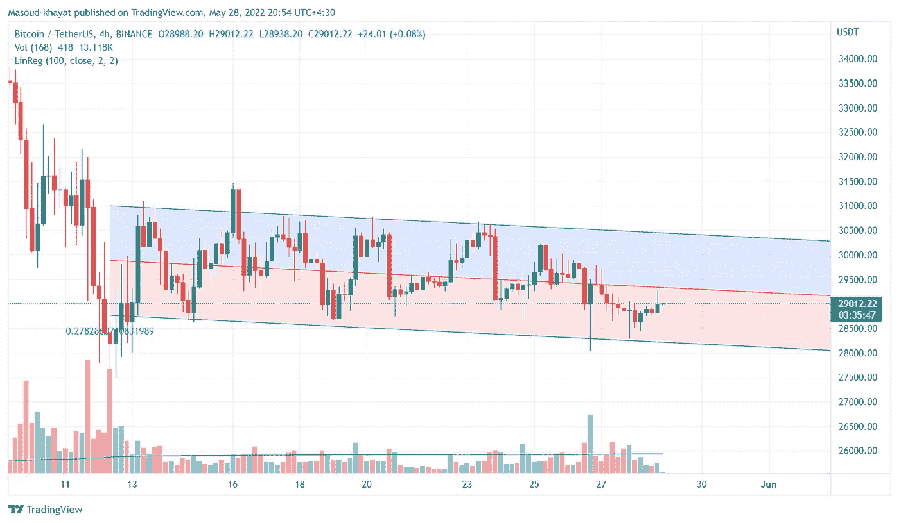
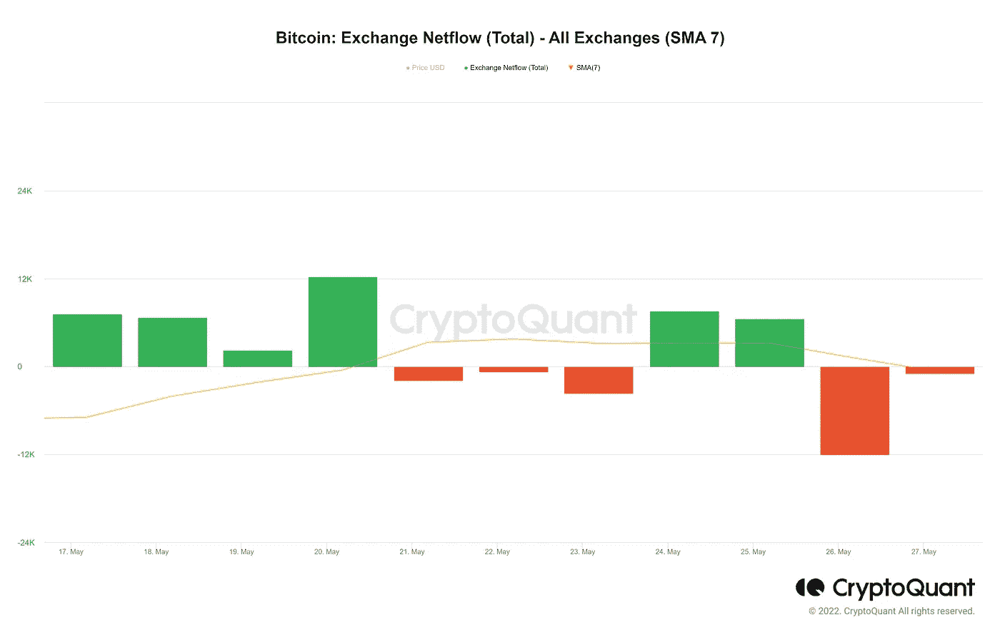
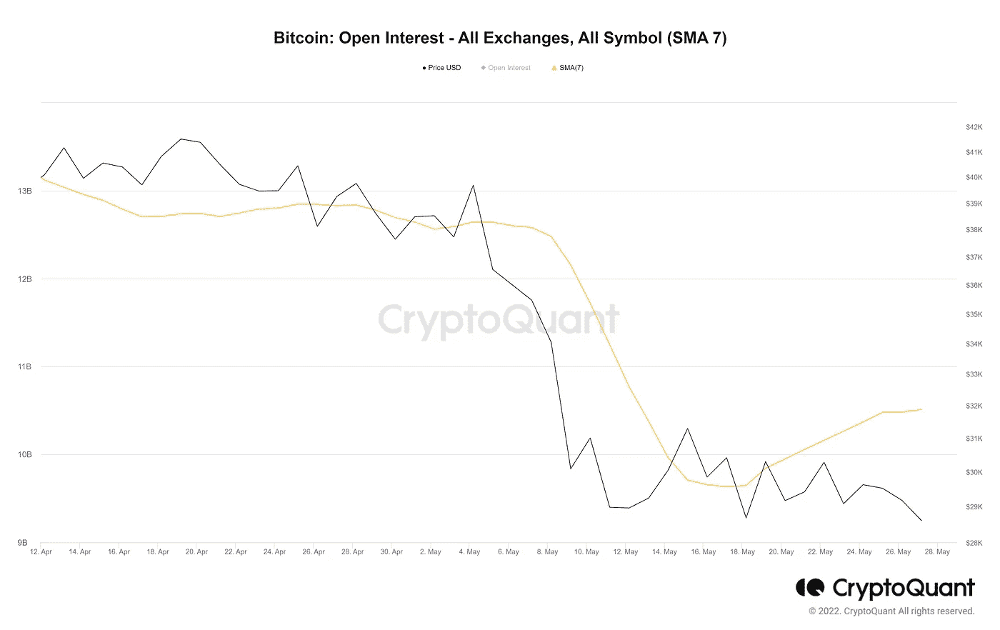
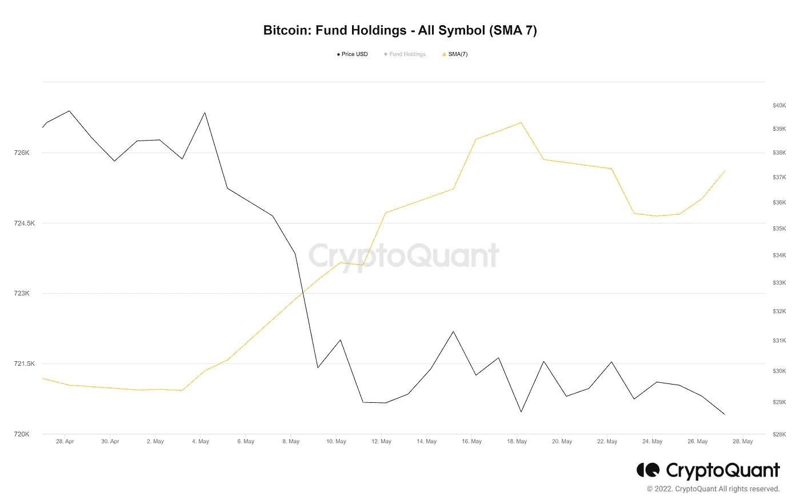
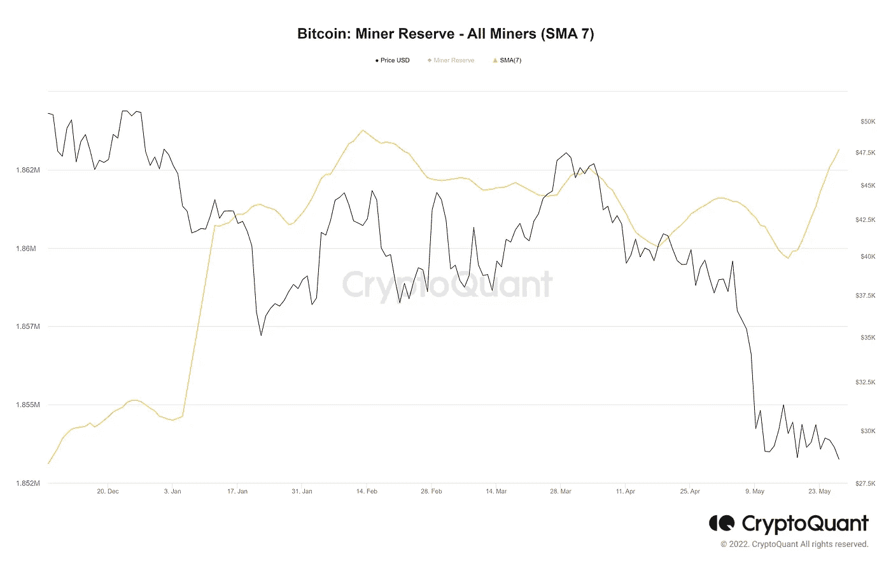
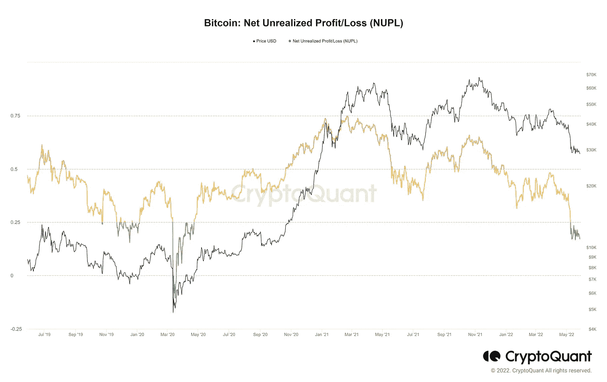
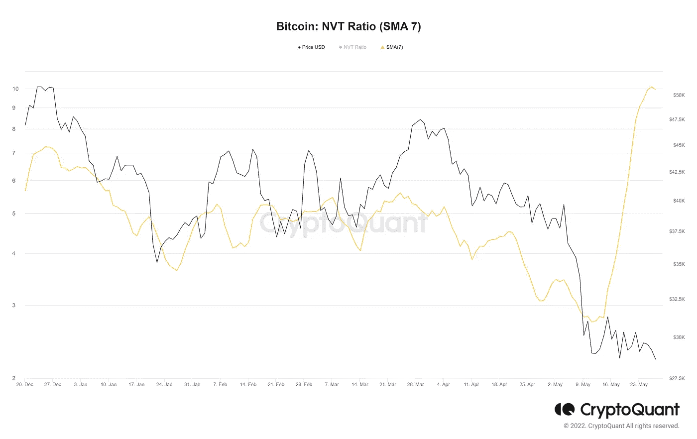

# 从链上数据看比特币

> 原文：<https://medium.com/coinmonks/bitcoin-from-the-perspective-of-on-chain-data-1084c4bfd6c9?source=collection_archive---------35----------------------->

比特币在 28000 美元至 31000 美元附近波动了 16 天左右，市场似乎处于一种犹豫不决的状态。

通过研究中国的数据，我们试图回答这样一个问题:市场上是否有任何供求迹象？

指标 1
上周流入和流出交易所的比特币几乎是中性的，如黄线所示(简单的七天移动平均线)

度量 2
为了移动最近十天的未平仓合约，比特币的价格已经与未平仓合约背离，如果这种趋势持续下去，可以认为是未来几天价格增长的燃料。

指标 3
基金持有指数近日上涨，信托、ETF 和基金等数字资产持有人似乎已经评估当前价格区间适合买入。

指标 4:
矿工储备指数近日也在上涨，是矿工正在收集比特币的迹象。这可能是一个更好的未来的迹象。

指标 5:
NUPL 指数显示市场正在接近投降水平。这种趋势可以减轻销售压力。

指标 6:
由于交易量减少，NVT 比率近日大幅上升。当比特币价格呈下降趋势，NVT 比率出现这种情况时，可能表明交易者已经放弃，不愿进入市场。

结论:
总的来说，把信息放在一起，我可以说市场并没有强烈的需求迹象，但似乎供应压力减少了很多，如果刺激需求端，情况可以准备破 3.1 万阻力。

> 加入 Coinmonks [电报频道](https://t.me/coincodecap)和 [Youtube 频道](https://www.youtube.com/c/coinmonks/videos)了解加密交易和投资

# 另外，阅读

*   [如何获得自己的。XYZ 领域？](https://coincodecap.com/xyz-domain)
*   [最佳加密交换平台](https://coincodecap.com/best-crypto-swap-platforms) | [最佳加密交易所](https://coincodecap.com/crypto-exchange)
*   [购买比特币印度](/coinmonks/buy-bitcoin-in-india-feb50ddfef94) | [Pionex 评论](/coinmonks/pionex-review-exchange-with-crypto-trading-bot-1e459d0191ea) | [加密交易机器人](/coinmonks/crypto-trading-bot-c2ffce8acb2a)
*   [n rave 零点回顾](/coinmonks/ngrave-zero-review-c465cf8307fc) | [Phemex 回顾](/coinmonks/phemex-review-4cfba0b49e28) | [PrimeXBT 回顾](/coinmonks/primexbt-review-88e0815be858)
*   最佳[区块链分析](https://bitquery.io/blog/best-blockchain-analysis-tools-and-software)工具| [赚比特币](/coinmonks/earn-bitcoin-6e8bd3c592d9)
*   [Cloudbet 赌场评论](https://coincodecap.com/cloudbet-casino-review) | [点火赌场评论](https://coincodecap.com/ignition-casino-review)
*   [加密套利](/coinmonks/crypto-arbitrage-guide-how-to-make-money-as-a-beginner-62bfe5c868f6)指南| [如何做空比特币](/coinmonks/how-to-short-bitcoin-568a2d0b4ae5)