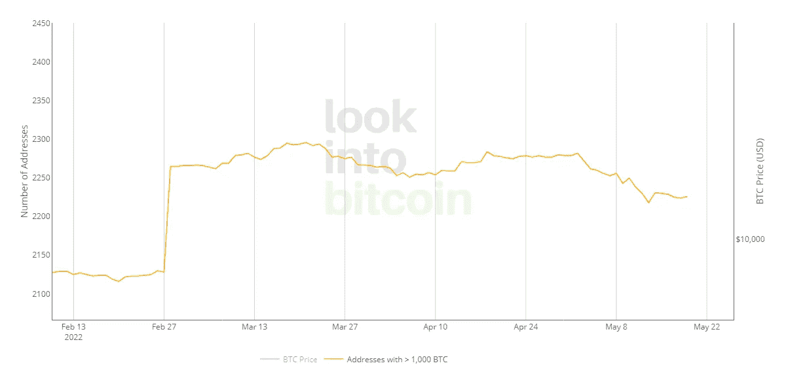

# 从链上数据看比特币

> 原文：<https://medium.com/coinmonks/bitcoin-from-the-perspective-of-on-chain-data-9ef77dd769fc?source=collection_archive---------30----------------------->

经过上周的大量比特币波动，现在情况有点稳定，现在尘埃落定，值得根据链上数据进行分析。

在这个分析中，我试图考察市场参与者的主要行为，最后总结市场的不同维度。

指标 1:

比特币流入和流出交易所的一个月趋势几乎是中性的，正如你从 7 天简单移动平均线中看到的那样，在上周朝着比特币流出的方向移动后，现在正朝着中和局势的方向移动，在最近三天里，比特币流入的数量与流出的数量相比有所增加

指标 2

在交易所保留稳定硬币的一个月趋势表明，它在过去的一个月中一直在增加，并且其斜率在过去的一周中增加，这可以表明交易者对资产的兑现以及其他市场对加密市场的流动性注入

指标 3:

短期持有者的 SOPR 指数表明，他们中的大多数人都在亏本出售比特币，尽管这一趋势在最近几天似乎有所改善，但这些参与者仍有抛售压力。

这种趋势对于长期持有人来说也是不尽人意的，他们现在正在亏本出售自己的比特币，这使得市场上出售比特币的压力倍增。

指标 4:

矿工是市场上最有影响力的参与者之一，根据下图，他们正在积累自己的比特币。这是否意味着他们看好市场？我不这么认为。

正如你在下面的图表中看到的，网络费用增加了，因此，矿工的收入也增加了。在我看来，这种保留更多的是与矿工收入增加有关。让我们也关注一下矿工们的交易所

如你所见，流入交易所的矿商比特币已经增加，矿商可能会对价格阻力施加抛售压力。

指标 5:

如你所见，拥有超过 1000 个比特币的鲸鱼正在减少，这可能会给出售比特币的市场带来压力。

指标 6:

MVRV 指数处于 2020 年以来的最低点，但似乎买家仍在等待以更低的价格购买，我们仍可能看到该指数下跌。

结论:

总结市场中不同参与者的行为，我必须承认，在目前的价格范围内，我没有看到任何强劲需求的迹象，似乎我们即将见证更低的价格。

> 加入 Coinmonks [电报频道](https://t.me/coincodecap)和 [Youtube 频道](https://www.youtube.com/c/coinmonks/videos)了解加密交易和投资

# 另外，阅读

*   [Bookmap 点评](https://coincodecap.com/bookmap-review-2021-best-trading-software) | [美国 5 大最佳加密交易所](https://coincodecap.com/crypto-exchange-usa)
*   最佳加密[硬件钱包](/coinmonks/hardware-wallets-dfa1211730c6) | [Bitbns 评论](/coinmonks/bitbns-review-38256a07e161)
*   [新加坡十大最佳加密交易所](https://coincodecap.com/crypto-exchange-in-singapore) | [购买 AXS](https://coincodecap.com/buy-axs-token)
*   [红狗赌场评论](https://coincodecap.com/red-dog-casino-review) | [Swyftx 评论](https://coincodecap.com/swyftx-review) | [CoinGate 评论](https://coincodecap.com/coingate-review)
*   [投资印度的最佳密码](https://coincodecap.com/best-crypto-to-invest-in-india-in-2021)|[WazirX P2P](https://coincodecap.com/wazirx-p2p)|[Hi Dollar Review](https://coincodecap.com/hi-dollar-review)