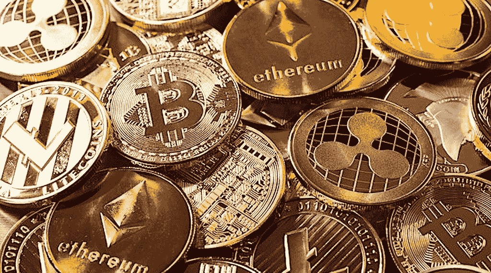

# 比特币让南非人对他们的金融未来有了信心

> 原文：<https://medium.com/coinmonks/bitcoin-gives-south-africans-a-stake-in-their-financial-future-5d9065557871?source=collection_archive---------58----------------------->

周三，南非庆祝自由日，纪念该国 1994 年后种族隔离时代的首次民主选举。

Cointelegraph 联系了南非密码社区的不同知名人士，看看这个节日对他们来说意味着什么。比特币在南非的倡导者 BitcoinZAR 指出，“自由日意味着你可以自由地使用自己的钱过上最好的生活”。

> “我们在自由日可以自由选择比特币，而不是用政府的钱贬值。停止在南非协助和教唆国家夺取政权、腐败和抢劫。用你的钱投票，买比特币。”

一些与加密相关的公司已经在该国涌现，包括加密货币交易所 Luno，而一些企业现在接受比特币支付，包括零售商店和旅游公司。

Luno 由两名南非人于 2013 年创立，目前在 40 多个国家拥有 1000 万客户。该公司的快速扩张表现在去年四个月内增加了 100 万新客户。

2017 年，南非当时最大的在线零售商 Pick n Pay 开始在其一家商店接受比特币支付，暗示加密货币作为一种支付形式的潜力。

解开冲浪旅行是一家南非旅游公司，于 2015 年开始接受比特币。据旅游公司称，自 2011 年以来，它主要服务于俄罗斯/东欧市场，提供前往南非的冲浪旅行。由于俄罗斯对乌克兰的军事入侵，该地区目前处于动荡之中。西方的制裁和法定货币的波动性使得 Unravel Surf Travel 的客户更愿意用加密货币支付旅行费用。该旅游公司补充说:

> *“自 2015 年以来，我们已经使用比特币来接收那些希望旅行并享受南非冲浪体验的客户的付款，否则他们将无法这样做。多亏了比特币，我们可以运营、谋生，我们的客户可以旅行，尽管他们的民选官员经常做些可疑的事情。”*

17 岁的南非人 Lukhangele Brabo 是比特币的支持者和倡导者，他向 Cointelegraph 解释了为什么自由日对他如此重要。布拉博说，“自由日意味着拥有最大的权力和行动的权利。”布拉博曾在南非迪亚兹海滩的 Surfer Kids 工作，在那里他曾通过菲亚特领取薪水。对他来说不幸的是，当他年轻时，他的家人拿走了他所有的钱，使他没有其他收入来源。然而，在他从南非知名比特币倡导者比特币埃卡西那里发现了比特币之后，事情开始向好的方向发展:

> *“现在，发生的事情是我不再用菲亚特支付工资，我开始用比特币领取我的周薪，这变得非常有趣，因为我意识到，好吧，比特币比菲亚特更安全，因为没人能从我这里拿走它。在我手机上，更安全。无论他们做了什么去尝试和拿走它，它都不能工作，因为为什么？他们不知道它是如何工作的，也不知道如何使用它。”*

根据 Borgen 杂志的数据，几乎 20%的南非人每天生活费不到 1.9 美元。普遍的腐败加剧了南非的不平等和贫困。前总统雅各布·祖马(Jacob Zuma)在 2009 年至 2018 年期间监督了猖獗的腐败。据估计，祖马在他的任期内已经让南非付出了至少 350 亿美元的代价，可能有 300 多万人陷入了贫困线以下。

> 加入 Coinmonks [电报频道](https://t.me/coincodecap)和 [Youtube 频道](https://www.youtube.com/c/coinmonks/videos)了解加密交易和投资

# 另外，阅读

*   [如何在 Uniswap 上交换加密？](https://coincodecap.com/swap-crypto-on-uniswap) | [A-Ads 评论](https://coincodecap.com/a-ads-review)
*   [加密货币储蓄账户](/coinmonks/cryptocurrency-savings-accounts-be3bc0feffbf) | [YoBit 审核](/coinmonks/yobit-review-175464162c62)
*   [Botsfolio vs nap bots vs Mudrex](/coinmonks/botsfolio-vs-napbots-vs-mudrex-c81344970c02)|[gate . io 交流回顾](/coinmonks/gate-io-exchange-review-61bf87b7078f)
*   [CoinFLEX 评论](https://coincodecap.com/coinflex-review) | [AEX 交易所评论](https://coincodecap.com/aex-exchange-review) | [UPbit 评论](https://coincodecap.com/upbit-review)
*   [AscendEx 保证金交易](https://coincodecap.com/ascendex-margin-trading) | [Bitfinex 赌注](https://coincodecap.com/bitfinex-staking) | [bitFlyer 审核](https://coincodecap.com/bitflyer-review)