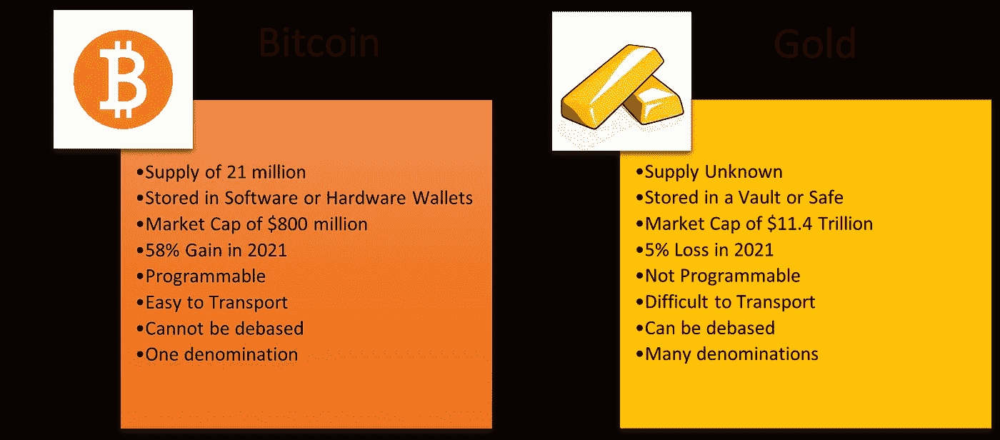
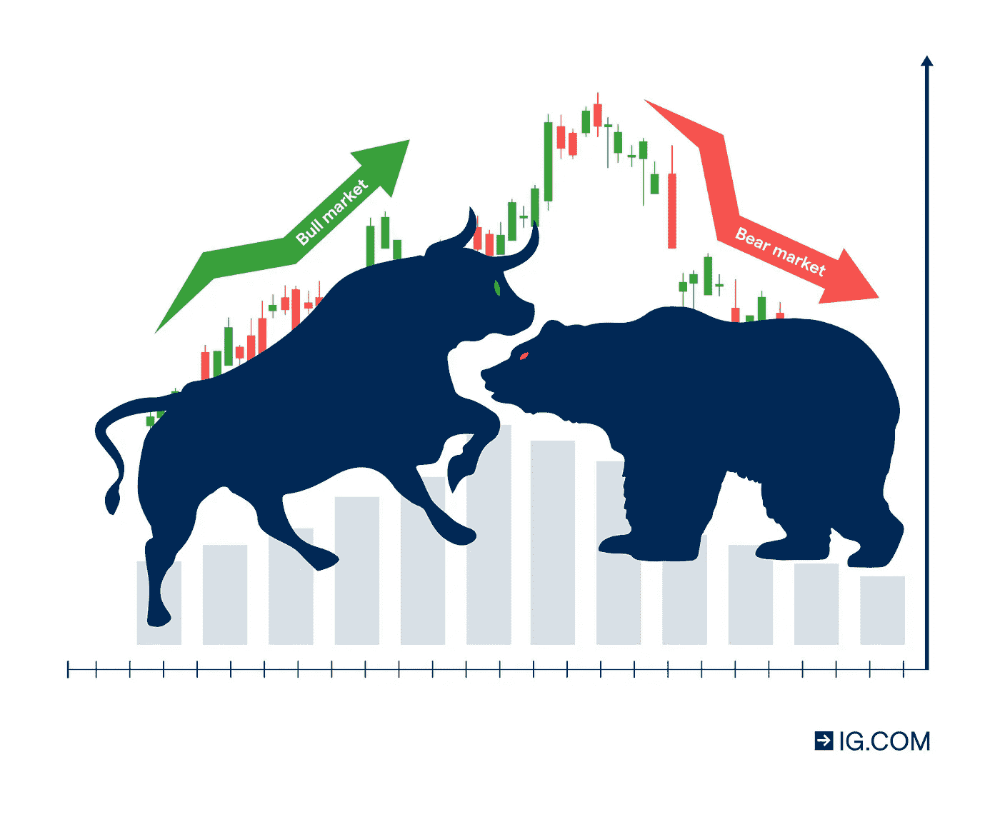

# 比特币、黄金和必要的市场周期

> 原文：<https://medium.com/coinmonks/bitcoin-gold-and-necessary-market-cycles-f548a3e25940?source=collection_archive---------8----------------------->

人们说生活中最美好的东西是免费的，但是谁想出了其他东西的价格呢？市场做到了。市场由生产者和消费者组成，其中包括人、企业和政府。消费带动生产。对一种物品的需求越多，它就会生产得越多。不太受欢迎的产品已经停产。想想 iPhones 和黑莓手机相比的命运吧。因此，市场参与者通过购买决定商品的价值。

政府经历了惨痛的教训才明白这一点。在 20 世纪，前苏联选择了政府主导的经济来决定价格，而不是自由市场。苏联政治家们自作主张提高了鼹鼠皮的价格。后来，毛皮在仓库里泛滥，工厂无法全部出售。Goskomtsen(国家价格委员会)被反复告知此事，但由于他们跟踪了 2400 万个其他价格，所以没有时间决定降低毛皮价格。如今政府很少规定价格，所以他们可以把精力放在其他经济决策上，让市场来决定价格。经济学家托马斯·索维尔指出，“只有当人们愿意支付价格时，价格才成为经济现实”。

爱尔兰政府在 2000 年 2 月承认了这一点，当时他们将能源市场从 Bord Gáis 和电力供应局(ESB)的垄断中解放出来。到 2005 年，所有爱尔兰消费者都可以选择国家提供的两家能源供应商之外的供应商。私营企业之间的竞争使价格保持在较低水平，并赋予消费者更多选择。你用你买的东西为你想要的世界投票。不需要的服务的生产者会因为缺乏消费者而倒闭，除非他们改变或提高他们的标准。

> “顾客永远是对的”这句话来源于他们作为消费者在市场中的地位。然而，这往往被误解，因为它只涉及他们买什么，而不是他们说什么。

你会发现，事实上市场总是正确的，这就是为什么任何资产价值的下降都被称为价格调整。我将解释比特币和黄金的正确价格是如何通过波动的市场情绪来解决的。然后我会详细说明为什么这些市场周期是必要的。

**比特币 vs 黄金**

每当我想到比特币和黄金之间的比较，埃里克·沃尔赫斯(Erik Voorhees)和彼得·希夫(Peter Schiff)之间的传奇辩论就会浮现在脑海中。这段对话发生在 2018 年 7 月，可以在 Youtube 上看到。埃里克是数字资产交易所 Shapeshift 的创始人兼首席执行官。Peter 是 Euro Pacific Capital Incorporated 的首席执行官，也是 Schiff Gold(一家贵金属交易商)的创始人。埃里克认为，比特币或类似形式的加密货币将取代政府法定货币，成为首选的交易媒介。彼得·希夫反对这种观点。

Bitcoin vs Gold compiled by me in Microsoft Word

埃里克表达了比特币是一种可证明稀缺且供应可预测的数字资产。这些特征是通过比特币不可改变的区块链源代码实现的。比特币是一种公共账本(数据库)，分布在世界各地成千上万台作为节点运行的计算机上。“块”由数据列表组成,“链”是随着时间不断增长的数据块的堆栈。这使得更改早期数据几乎不可能，而区块链在存储有价值的数据方面表现出色。就像俄罗斯方块，但是有数据。每个区块构成一个由矿工验证的金融交易和交易发生的密码(加密)证明。这是一种共识机制，所有节点都需要达成一致。这就是比特币的情况，每 10 分钟就会产生一个新的区块。当一个新的区块生成时，矿工会获得比特币奖励。

比特币(BTC)矿工的集体奖励通常会被减半。由于开采 210，000 个区块需要很长时间，大约每 4 年发生一次。创世街区在 2009 年提供了 50 BTC 的奖励。2012 年，在第一次减半时，奖励减少到每块 25 BTC。然后在 2016 年，块奖励降低到 12.5 BTC。第三次减半发生在 2020 年，将矿工赔偿降至 6.25 BTC。比特币是一种在公共区块链上运行的可编程货币，因此我们可以预测每天的供应量，一直到减半的日期。第四次减半将使奖励减少到 3.125 BTC，预计将在 2024 年。

> 一旦价格减半，比特币的周期性反弹(价格下跌后大幅上涨)就开始有意义了。随着大宗报酬递减，市场对比特币的稀缺性做出了反应。在 2020 年减半后，比特币上涨了 294%，而同年黄金上涨了 23%。2021 年，比特币的价值继续增长 58%。另一方面，黄金价格下跌了 5%。随着采矿技术的提高，从金矿中提取黄金变得更加容易。这使得黄金供应量每年增加 2%。你猜对了，黄金变得不那么稀缺了。相反，尽管技术不断进步，但比特币更难获得，因为它的周期减半。

彼得·希夫在我的第一篇文章中探讨的基础上支持黄金。因此，我把重点放在了黄金和比特币的对比上。黄金可以被降级，例如，用钨熔化和重构，以制造更多的黄金，并使其看起来更重。贵金属有太多的面额；硬币、棒、杆、金块、盎司等。法定货币通常有两种面值，例如欧元和美分。比特币只有 1 个面额。1 BTC 由 1 亿只 satoshis(satos)组成，向比特币的假名创造者中本聪致敬。黄金供应存在不可预测的波动，例如 1848 年的加利福尼亚淘金热。运输黄金是一项乏味的工作，如果你拥有大量的黄金，难度会成倍增加。出于这些原因，我认为比特币将超越黄金，成为更好的交易媒介、价值储存手段和价值单位。

**牛市**

2021 年 1 月，说唱歌手米克·米尔(Meek Mill)和比特币基地的联合创始人弗雷德·厄尔萨姆(Fred Ehrsam)在社交音频应用 Clubhouse 上谈论比特币(BTC)。他们的聊天记录在 Youtube 上。弗雷德讨论了当前全球金融体系中日益加剧的不平等，这是他大学毕业后在高盛工作时亲眼目睹的。在那次谈话中，弗雷德说他在 10 或 11 年前以 6 美元的价格买了他的第一枚比特币。写这篇文章的时候，比特币是 41978 美元。增长了 699，633%。在全球市场上，没有任何其他资产能产生如此高的投资回报率(ROI)。比特币从 2009 年发明时的一文不值，到 2022 年市值达到 7.93 亿美元。市值是比特币流通供应量的总价值。

***四十四***

牛市是市场周期中买方多于卖方的阶段。对资产的信心飙升，已经拥有理想资产的市场参与者持有他们的头寸(投资额)。他们通过在任何人之前购买来领先交易。这导致了新买家的资产供应冲击，他们将不得不支付溢价来获得这些资产。对稀缺资产的需求决定了价值，并导致价格上涨。这种价值的增长被认为是看涨的，因为公牛在进攻时会用角向上滑动。在兴高采烈的状态下，市场参与者支付昂贵的价格，以获得备受追捧的资产所反映的收益。有句话说，“牛市中人人都是天才”。这个阶段的贪婪程度是如此过度，以至于一切看起来都像是一个好主意。

当现实来临时，玫瑰色的眼镜开始破裂。我们已经证实，只有当有人愿意支付时，价格才是重要的。最终，一项资产的价值会上升到没有人认为它是一个公平价格的水平。较大的参与者(机构)通过短期抛售大量供应来操纵市场，将散户(公众投资者)挤出市场。稀缺资产的零售使得公司能够以更低的价格购买更多的资产。一旦大规模转向长期出售资产以实现收益或减少损失，牛市就结束了。

尽管过去十年发生了一系列市场崩盘，比特币仍未回到弗雷德·厄尔萨姆(Fred Ehrsam)第一次购买时的 6 美元。整体情绪看你的尺度。如果你从 13 年前开始衡量，比特币的市场情绪是乐观的。如果你的参考点是 2021 年 11 月，那么市场对比特币的情绪是看空的。

Infographic of bull and bear market trends depicted by IG.com

**熊市**

比特币的上一个历史高点(ATH)是在 2021 年 11 月超过 68000 美元。自那以来，BTC 股市下跌了 38%。这表明相对于那个时期，下跌是看跌的。在这里，市场唱了一首“熊的必需品”的新歌，因为熊在攻击时会向下滑动，类似于价格的螺旋式下降。熊市是市场周期中卖方多于买方的一步。市场参与者对资产保值持悲观态度，因此他们抛售头寸。这导致价格下跌，因为恐惧取代了贪婪。著名投资家沃伦·巴菲特建议“在别人恐惧时贪婪，在别人贪婪时恐惧”。然而，恐慌和损失可能如此普遍，以至于价格在很长一段时间内持续下跌。

一个经验丰富的市场观察者知道熊市的严重程度取决于衡量熊市的时间框架。也就是说，它们可以从温和到极端，取决于你是放大还是缩小图表。熊市很难成功，但之前的牛市预示着当看涨情绪回归时可能会上涨。因此，理性的行为者认为熊市是理想资产比平常更便宜的销售。沃伦巴菲特(Warren Buffett)推广了“价值投资”，这是一种通过基本面分析评估资产价值主张的技术。我采用同样的方法。

> 比特币的上一次历史低点(ATL)是在 2013 年 7 月的 67 美元。比特币是黄金作为价值储存手段的重大进步。黄金的市值是 11.4 万亿美元。如果比特币达到或超过这一市值，那么每 BTC 的比特币价格将超过 60 万美元。我不能保证这种情况会发生，但是图表显示了这种趋势。比特币在 8 年内从 67 美元涨到 67000 美元。不管目前的比特币价格上涨还是下跌，根据我的分析，BTC 仍然被低估，我打算继续买入。

当一个公平的价格被获得，购买恢复，市场参与者在熊市中有一个较短的时间偏好(较少的耐心)。他们比在牛市中更快地兑现收益。因此，在这一阶段，复苏是短暂的。不准确地怀疑牛市的市场参与者可能最终亏损，并打算在下一次价格上涨时卖出。这种情况一直持续到顶峰(顶部)持续，低谷(底部)是暂时的——标志着更多买家的过渡和熊市周期的结束。

**市场周期的必要性—结论**

‘The Bare Necessities’, written by Terry Gilkyson for Disney’s ‘The Jungle Book’ in 1967, performed by Baloo the bear (Phil Harris) and Mowgli the child (Bruce Reitherman)

需要市场周期来保持机会重现。《丛林之书》里的巴鲁说得好，“忘掉你的烦恼和冲突”。没有波动性(价格波动)，就没有进入或退出交易的最佳时机。波动的价格让比特币的早期使用者能够在牛市中获利。在熊市期间，价值的变化促使比特币的后来者以更低的价格购买 BTC。正是在这些关键事件中，市场参与者有机会以折扣价获得回报或资产。

一个稳健的、站得住脚的投资方法，比如前面探讨的“价值投资”，可以在你如何管理你的资产组合方面产生显著的影响。它使你的功能自动化，因为你已经通过自己的研究完成了大部分的思考(DYOR)。然后采取相应的行动。最终，市场永远是正确的，所以不要不情愿去适应和修正你的资产估值。依赖炒作或情绪的交易会误导你。理解市场的本质是有效决策和培养健康投资者心理的必要条件。

*   **如果你能走到这一步，为你写作是我的荣幸。我希望你喜欢它，并在此过程中获得了一些东西(文章中隐藏的代码使你能够赢得免费的加密奖励👀).我想简化复杂的事情，包括环境、经济和密码。请关注，喜欢，分享，因为它对我帮助很大。[订阅](https://samoawe.substack.com/)独家获取本文音频版本。请每周收听，了解更多见解。

> 加入 Coinmonks [电报频道](https://t.me/coincodecap)和 [Youtube 频道](https://www.youtube.com/c/coinmonks/videos)了解加密交易和投资

## 也阅读

 [## 杠杆代币[多头代币]终极指南

### 杠杆化令牌是具有杠杆化风险敞口的 ERC20 令牌，不考虑保证金、要求、管理…

medium.com](/coinmonks/leveraged-token-3f5257808b22)  [## 最佳加密交易所| 2022 年十大加密货币交易所| CoinCodeCap

### 哪一个是最好的加密交换？在本文中，我们将根据多种加密货币列出 10 大加密货币交易所

coincodecap.com](https://coincodecap.com/crypto-exchange)  [## 加密、电影、节目和讲座的 40 个最佳电报频道| CoinCodeCap

### 免费下载所有电影。无蒙古包加密信号。下载讲座。CoinCodeCap Classic，网飞电影等。是…

coincodecap.com](https://coincodecap.com/best-telegram-channels)  [## Keevo Wallet Review:这是最安全的硬件钱包吗？2022 | CoinCodeCap

### 在这篇 Keevo Wallet 评论中，我们将讨论他们如何改变我们对硬件钱包的看法。基沃是…

coincodecap.com](https://coincodecap.com/keevo-wallet-review)  [## 2022 年 5 大最佳社交交易平台| CoinCodeCap

### 5 个最佳社交交易平台阅读加密产品评论和比较，了解比特币交易……

coincodecap.com](https://coincodecap.com/best-social-trading-platforms)  [## BlockFi 评论:利弊与利率 2022 | CoinCodeCap

### 今天，我们想出了一个全面的 BlockFi 审查，一个加密贷款平台成立于 2017 年，并有其…

coincodecap.com](https://coincodecap.com/blockfi-review)  [## 如何在印度购买比特币？7 款购买比特币 2021 的最佳应用[手机版]

### 如何使用移动应用购买印度比特币

medium.com](/coinmonks/buy-bitcoin-in-india-feb50ddfef94)  [## 加密税务软件—前 5 名最佳比特币税务计算器[2021]

### 无论您是第一次接触加密技术，还是在这个领域已经有一段时间，您都需要纳税。

medium.com](/coinmonks/best-crypto-tax-tool-for-my-money-72d4b430816b)  [## 9 款 2022 年最佳购买密码| CoinCodeCap

### 9 2022 年最佳购买密码阅读密码产品评论和比较，了解比特币交易…

coincodecap.com](https://coincodecap.com/crypto-to-buy-in-2022)