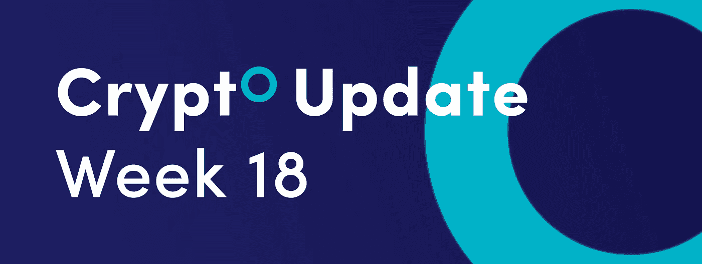
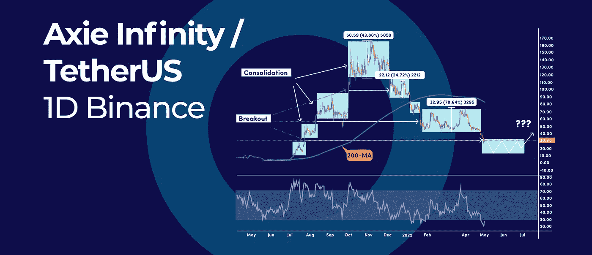
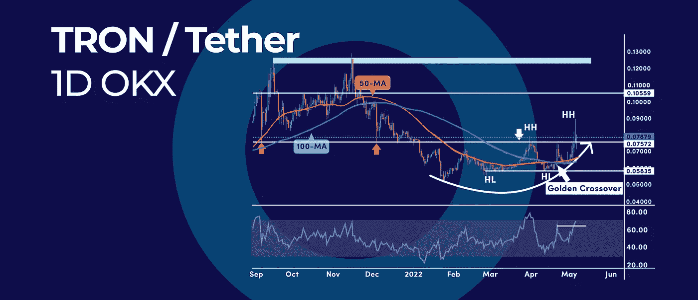
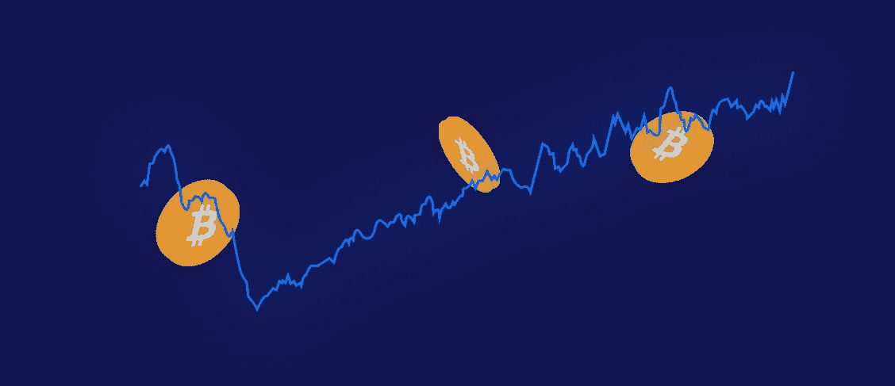

# 比特币散列率创下 223.15 兆次/秒的历史新高，本周的加密更新更是如此。

> 原文：<https://medium.com/coinmonks/bitcoin-hash-rate-hits-new-all-time-high-of-223-15m-th-s-and-more-in-this-weeks-crypto-update-3e80541cff95?source=collection_archive---------46----------------------->

*   Axie Infinity:这个图表模式需要更多的整合
*   黄金交叉信号如何能把创送到 0.10 美元
*   比特币散列率创下 223.15 兆次/秒的历史新高

## Axie Infinity:这个图表模式需要更多的整合

axie Infinity(AXS)的价格走势基本上是横向的，但整体呈下降趋势。这种盘整模式的关键在于，在此之后会出现向下突破。

## 整合—突破模式

最终，只要加密货币表现出整合模式，就会出现突破。Axie Infinity 不遵循随机整合-突破模式。日线图显示，AXS 价格遵循 2021 年牛市周期中出现的相同“阶梯”效应。

在 2021 年的牛市周期中，我们有一个在上升轨迹中发展的阶梯形态；现在，同样的模式随着下降趋势形成。

并非巧合的是，每一个盘整阶段都会出现在图表的右侧，靠近图表左侧向上突破的地方。这可以让我们了解下一个整合阶段可能会在哪里发生。

此外，我们可以测量整合阶段的波动性，并估计下一个整合阶段的规模。当我们走向下行时，价格波动在 25%到 78%之间。

这意味着下一个盘整阶段的底部可能在 25 美元到 10 美元之间，从这里我们有望看到向上突破和新一轮牛市的开始。

## 黄金交叉信号如何能把创送到 0.10 美元

[Tron (TRX)](https://tron.network/) 闪现黄金交叉信号，这被广泛认为是技术买入信号。这种加密货币的看涨情况也受到更高的高点和更高的低点价格结构的支持，这表明上涨趋势可能正在发展。

## **黄金交叉信号**

大多数交易者只学会跟踪 50 和 200 简单均线。但是，没有多少交易者知道，黄金交叉信号也可以发生在 50 日均线交叉到 100 日均线上方的时候。

因为 100 周期的均线比 200 周期的均线快，我们可以更早的发现市场方向的变化。

上图是 TRON 对抗[系绳](https://tether.to/en/)的 1D 图。50 周期的 SMA 用橙色线标记，100 周期的 SMA 用蓝色线标记。9 月 27 日，TRX 触发了黄金交叉信号。

## 价格结构

TRX 价格现在正在打印一系列更高的高点，随后是至少两个更高的低点，这表明我们开始向上移动。

此外，基于 RSI 指标，TRX 创造了动量读数的新高，证实了看涨情绪。

**展望:**上行阻力不大，直到 0.10 美元心理数字。另一方面，我们在 0.058 美元有一个强有力的支撑位。只要我们保持在这一支持水平之上，TRX 有潜力达到 0.10 美元的里程碑。

## 什么是创密码，它是用来做什么的

TRON 由 Justin Sun 创立，是一个去中心化的内容娱乐平台，旨在弥合内容创作者和内容消费者之间的鸿沟。该公司使用区块链技术、点对点(P2P)网络和分布式存储技术。

## 什么是黄金交叉信号

黄金交叉是一种看涨的突破模式，由证券的短期移动平均线(如 15 天移动平均线)突破其长期移动平均线(如 50 天移动平均线)或阻力位的交叉形成。

由于长期指标具有更大的权重，黄金交叉表明牛市即将到来，并因高交易量而得到加强。

“黄金交叉”这个术语来源于黄金比例，这个数字据说在自然界中随处可见，一些交易者用它来确定变化点或修正点。黄金比例计算为 1.618。

## 什么是简单移动平均线

简单移动平均线是一个趋势跟踪指标，它平滑价格波动，以衡量价格的整体方向。

第一步是计算一组数据的平均值。这是通过将集合中的所有值相加并除以集合中值的数量来实现的。

**举例:**

假设数据集是一只股票或交易所交易基金(ETF)的一系列价格。为了计算过去五天的简单移动平均值，您应该将过去五天的价格相加，然后将总和除以五。

重要的是要知道，在计算中只使用了最近五天。忽略六天前的价格。

为了计算第二天的简单移动平均线，您将删除六天前的价格，并添加最近一段时间的价格。

## 资源

[投资指数(简单移动平均线(SMA))](https://www.investopedia.com/terms/s/sma.asp)

[Investopedia(黄金交叉信号)](https://www.investopedia.com/terms/g/goldencross.asp)

# 比特币散列率创下 223.15 兆次/秒的历史新高

创历史新高，达到 223.15m TH/s。这是需求仍在增长的有力指标。

比特币(BTC)网络的散列率在 4 月触底后上涨了近 14%，并创下 22314 万 TH/s 的历史新高，比特币散列率在 2 月中旬创下了此前的历史最高读数，但由于能源成本上涨等负面因素，我们看到了挖掘速度的暂停。两个月后，BTC 的哈希利率扫除了所有的绊脚石，并恢复了长期的上升轨迹。[Blockchain.com](https://www.blockchain.com/)还透露，比特币的挖矿难度也创下了 29.79 万亿的历史新高。

## 比特币散列率和比特币价格

说到比特币，哈希率是比特币网络处理能力的衡量单位。

哈希速率越高，越多的挖掘者可以生成工作证明(PoW ),这导致更多的块被添加到区块链，因此完成事务的机会也就越大。更高的散列率也意味着你作为一个矿工比任何其他节点有更好的机会找到一个块，这导致块奖励。

比特币价格和散列率之间的关系通常是这样的:当 BTC 价格高时，采矿活动增加，采矿活动增加，反之亦然。发生这种情况是因为当 BTC 价格高时，矿商每天可以赚取更多的收入，从而刺激他们增加产量。另一方面，当 BTC 价格跌至过低时，一些矿商可能会因无利可图而被迫关闭业务。因此，在过去几年里，这两个指标确实同步发展。

比特币的哈希率在 2019 年增长了 5000%以上，当时加密货币的价格几乎增长了两倍。哈希速率从去年年底的大约 4000 万次/秒跃升至 2 月 21 日的 1.6 亿次/秒以上。同一时期，比特币从 7200 美元飙升至高达 68789.63 美元。

散列率和价格之间有很强的相关性，因为它们遵循摩尔定律。该定律指出，“计算机芯片的速度或容量每两年将翻一番，而成本将随着时间的推移减半。”简而言之，可用于挖掘的计算能力呈指数增长，而获取这种散列能力的确切时间成本呈指数下降。

随着散列率达到历史新高，对比特币挖掘的需求仍在增长，即使在加密货币价格疯狂上涨一年之后。上一次散列率达到历史新高时，比特币的价值约为 40500 美元。在撰写本文时，一个比特币的价值或多或少相当于 BTC 来回交易的近 4 万美元。

由于散列率是一个领先指标，我们可以预计比特币的价格将试图计入新的发展。虽然它们并不总是正相关，但散列率是衡量比特币网络强度的一个关键参数。

## 比特币哈希利率期货

比特币散列率的未来令人兴奋，因为它指向一个更加安全和分散的网络。随着越来越多的人加入挖掘社区，总散列率将会增加。这意味着网络的整体安全性将会提高，因为任何一个人或团体将更难控制 51%的散列能力。此外，更高的散列率可能会导致更快的交易时间和更低的费用，因为矿商争夺的奖励池更小。

## 相关文章

\* [【比特币散列率】](https://en.wikipedia.org/wiki/Bitcoin_hash_rate)

订阅我们的媒体每周博客和更新。
在推特[上关注我们](https://twitter.com/cryptohopper) | [脸书](https://www.facebook.com/cryptohopper)|[Reddit](https://www.reddit.com/r/CryptoHopper/)|[insta gram](https://www.instagram.com/cryptohopper/?hl=nl)

在 [Cryptohopper](https://www.cryptohopper.com/) 开始交易！

> *加入 Coinmonks* [*电报频道*](https://t.me/coincodecap) *和* [*Youtube 频道*](https://www.youtube.com/c/coinmonks/videos) *了解加密交易和投资*

# 另外，阅读

*   [3 商业评论](/coinmonks/3commas-review-an-excellent-crypto-trading-bot-2020-1313a58bec92) | [Pionex 评论](https://coincodecap.com/pionex-review-exchange-with-crypto-trading-bot) | [Coinrule 评论](/coinmonks/coinrule-review-2021-a-beginner-friendly-crypto-trading-bot-daf0504848ba)
*   [莱杰 vs n rave](/coinmonks/ledger-vs-ngrave-zero-7e40f0c1d694)|[莱杰 nano s vs x](/coinmonks/ledger-nano-s-vs-x-battery-hardware-price-storage-59a6663fe3b0) | [币安评论](/coinmonks/binance-review-ee10d3bf3b6e)
*   [Bybit Exchange 审查](/coinmonks/bybit-exchange-review-dbd570019b71) | [Bityard 审查](https://coincodecap.com/bityard-reivew) | [Jet-Bot 审查](https://coincodecap.com/jet-bot-review)
*   [3 commas vs Cryptohopper](/coinmonks/3commas-vs-pionex-vs-cryptohopper-best-crypto-bot-6a98d2baa203)|[赚取加密利息](/coinmonks/earn-crypto-interest-b10b810fdda3)
*   最好的比特币[硬件钱包](/coinmonks/hardware-wallets-dfa1211730c6) | [BitBox02 回顾](/coinmonks/bitbox02-review-your-swiss-bitcoin-hardware-wallet-c36c88fff29)
*   [block fi vs Celsius](/coinmonks/blockfi-vs-celsius-vs-hodlnaut-8a1cc8c26630)|[Hodlnaut 审核](/coinmonks/hodlnaut-review-best-way-to-hodl-is-to-earn-interest-on-your-bitcoin-6658a8c19edf) | [KuCoin 审核](https://coincodecap.com/kucoin-review)