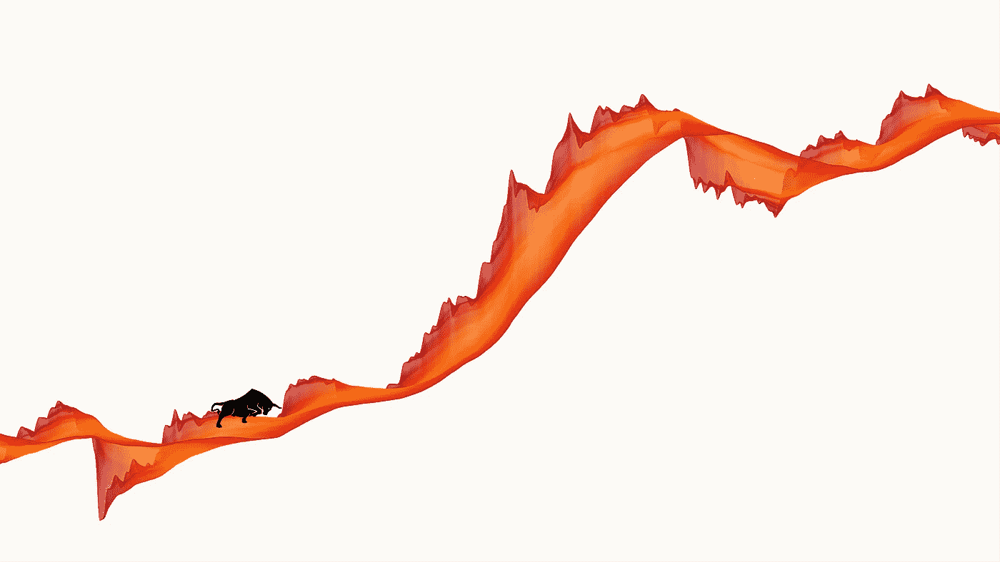
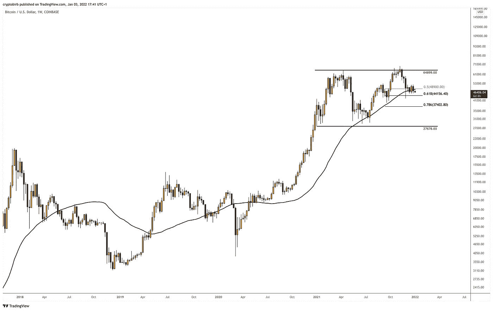
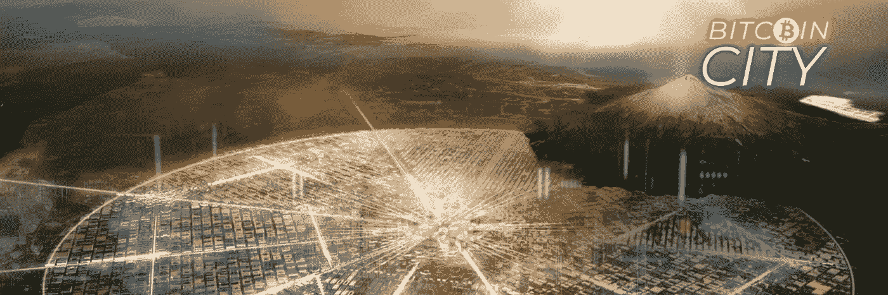
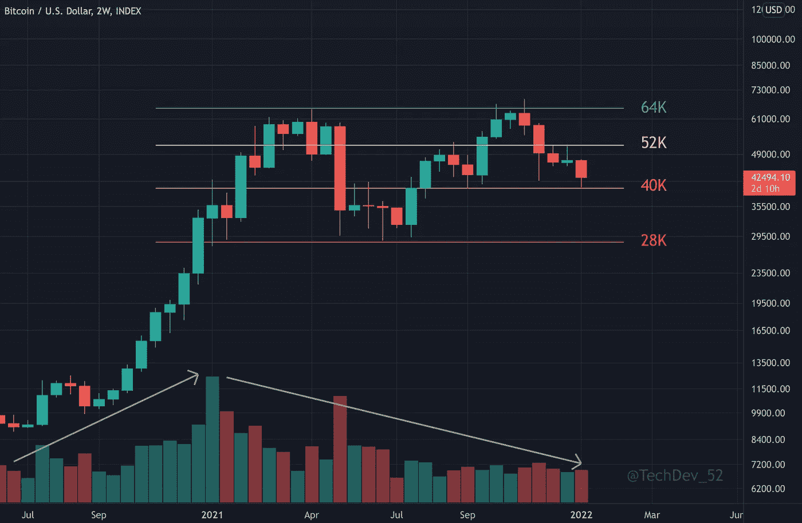
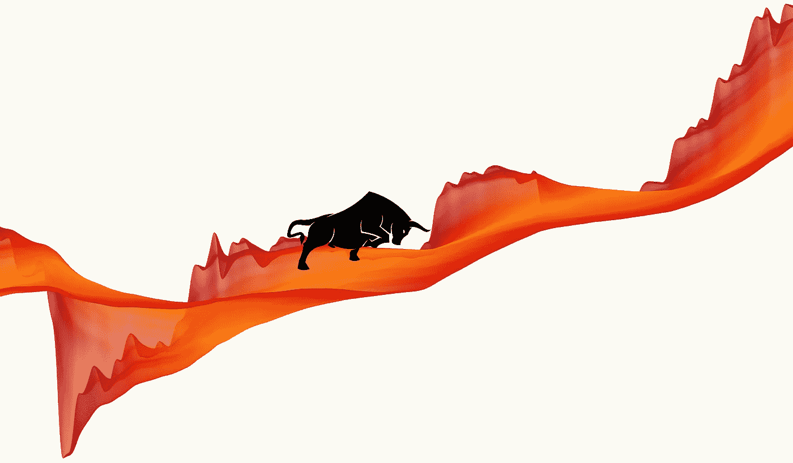

# 2020–2021 年的比特币事件

> 原文：<https://medium.com/coinmonks/bitcoin-history-as-a-cryptowave-1d66210ddabf?source=collection_archive---------7----------------------->

## 作为一种隐波

从 **2020** 到 **2021** 结束，比特币发生了什么？

它的价格历史在上面的图像中被形象地表示为一个密码波。Cryptowave 是由加密货币价格行为衍生而来的生成性价格波，上图属于**加密波艺术** NFT 系列。

 [## 加密波的艺术

### 加密波的艺术是一个 3139 个生成艺术价格波的集合，是为了纪念…

www.theartofcryptowaves.com](https://www.theartofcryptowaves.com/) 

这种类型的 BTC 加密波的特点是稳定的高时间框架增长，巨大的波动性，6.5 倍的回报和看涨的消息。

# 回报和收益

让我们想象一下，在 2020 年 1 月 1 日，你在 BTC 和 HODL 购买了 10 万美元……在 2021 年 12 月 31 日，你将拥有大约 **65 万**。这是一个 **6.5x 的回报**。

不过这还不是最大值。如果你在 2021 年 9 月 11 日的高点以 67k 卖出，你会做一个 **9.4x** 和 **940k** 。

# 波动性

非常高，在 2020 年 3 月 Covid crash 期间达到极端峰值，这是一个黑天鹅事件。

# 增长

BTC 价格走势看起来像一条 S 形曲线，峰值出现在 2021 年 4 月 14 日。在 HTF 上，你不必太担心，因为你的投资在增加。

# 事件

出现了许多看涨和看跌的情况。

*   2020 年 3 月，由于 Covid ，所有市场都出现了**大崩盘。该事件可被归类为“**黑天鹅**”事件。**
*   在 Covid 崩溃后的两个月内，出现了 V 型复苏。
*   从 2020 年 10 月中旬到 2021 年 4 月，比特币经历了一轮**抛物线运行**，这是技术交易者的叫法。

Image from [https://twitter.com/crypto_birb/status/1478087616629293056](https://twitter.com/crypto_birb/status/1478087616629293056)

*   从 2021 年 5 月到 7 月，市场上一直存在着恐惧和绝望，尤其是那些想在 4 月份卖出，但没有卖出的人。恐惧&贪婪指数达到 10。
*   2021 年 6 月 8 日**萨尔瓦多**立法议会在 [Nayib Bukele](https://twitter.com/nayibbukele) 的领导下通过了《比特币法，给予比特币在 2021 年 9 月 7 日之后在萨尔瓦多境内**法定货币的地位。**

Image from [https://twitter.com/nayibbukele](https://twitter.com/nayibbukele)

*   7 月份，许多密码专家都在喊着要做空 20k 甚至 10k。没有人是对的，只有几个专业交易者认为底部在 29k 左右，另一次在 40k 左右。
*   比特币以 69k 的价格于 2021 年 10 月 11 日到达 **ATH。**
*   **在整个第四季度**，每个人都期待着再次升至 90k+，但**并没有发生**。这一价格波动可以被视为 30k-65k 范围内的一个积累阶段。

Image from [https://twitter.com/TechDev_52/status/1482001519478194176](https://twitter.com/TechDev_52/status/1482001519478194176)

总体而言，“2020 年至 2021 年”是比特币的**牛市时期**。看涨，就像上图中的牛市轮廓，在 Covid 崩溃之后和上涨之前。

> 你呢？在这段时间里你做了什么？

一些人在 Covid 崩溃时卖出，另一些人在 4k 时完成了限价单。有些被清算了。有的开始学技术分析。有些人骑完了全程，直到 60 公里。这一定是一次情绪的大起大落。

# 隐波

Cryptowaves 的设计是为了尊重加密和所有加密交易者的进化本质。每个 cryptowave 都是一件独特的艺术品，其元素受到价格行为和技术分析的启发，具有自己的调色板和特征。加密波的艺术是第一个在加密、交易、NFT 和艺术的交叉点上的 NFT 收藏，代表了具有历史意义的 NFT。

更多信息，请看我们的[网站](https://www.theartofcryptowaves.com/)、[推特](https://twitter.com/TACryptowaves)，以及[媒体](/@288kartscientist)中的更多内容。

# 以前的文章:

*   [隐波艺术:创世纪](/@288kartscientist/the-art-of-cryptowaves-genesis-310a2fa16ff2)
*   [密码波的艺术:BTC & ETH。2121 & 1018。情绪&分析](/@288kartscientist/the-art-of-cryptowaves-btc-eth-2121-1018-long-short-4d61e136b029)
*   [隐波艺术:色彩与生活](/coinmonks/the-art-of-cryptowaves-colours-and-life-3f2354372ebb)
*   [密码波的艺术:随机性&秩序](/coinmonks/the-art-of-cryptowaves-randomness-order-a79b73f2a590)

> 加入 Coinmonks [电报频道](https://t.me/coincodecap)和 [Youtube 频道](https://www.youtube.com/c/coinmonks/videos)了解加密交易和投资

## 另外，阅读

*   [3 商业评论](/coinmonks/3commas-review-an-excellent-crypto-trading-bot-2020-1313a58bec92) | [Pionex 评论](https://blog.coincodecap.com/pionex-review-exchange-with-crypto-trading-bot) | [Coinrule 评论](/coinmonks/coinrule-review-2021-a-beginner-friendly-crypto-trading-bot-daf0504848ba)
*   [莱杰 vs Ngrave](/coinmonks/ledger-vs-ngrave-zero-7e40f0c1d694) | [莱杰 nano s vs x](/coinmonks/ledger-nano-s-vs-x-battery-hardware-price-storage-59a6663fe3b0) | [币安评论](/coinmonks/binance-review-ee10d3bf3b6e)
*   [Bybit Exchange 评论](/coinmonks/bybit-exchange-review-dbd570019b71) | [Bityard 评论](https://blog.coincodecap.com/bityard-reivew) | [Jet-Bot 评论](https://blog.coincodecap.com/jet-bot-review)
*   [3 commas vs crypto hopper](/coinmonks/3commas-vs-pionex-vs-cryptohopper-best-crypto-bot-6a98d2baa203)|[赚取加密利息](/coinmonks/earn-crypto-interest-b10b810fdda3)