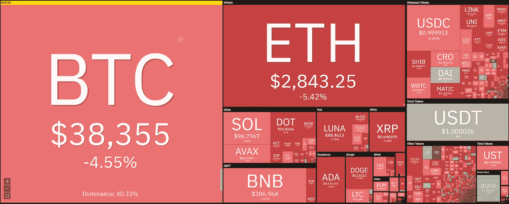
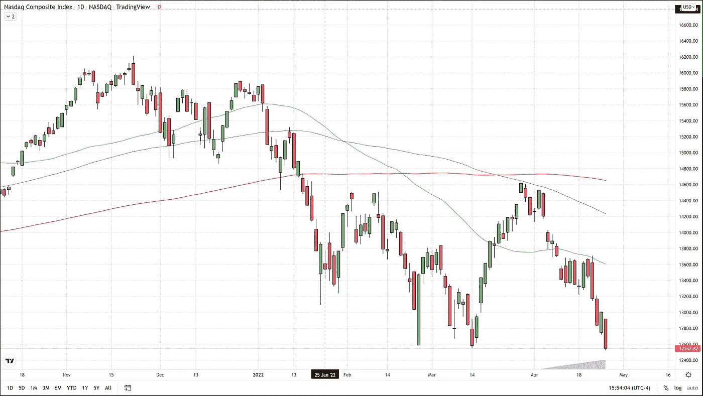
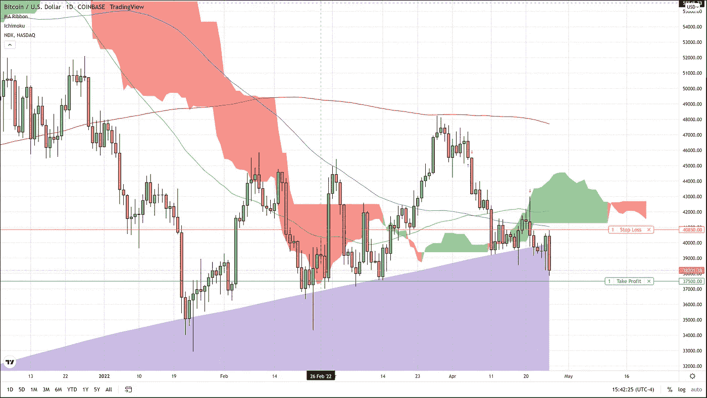

# 比特币 4 月再创新低

> 原文：<https://medium.com/coinmonks/bitcoin-hits-new-low-for-april-2a1c2f14742e?source=collection_archive---------62----------------------->

紧随纳斯达克综合指数下跌 3%之后，比特币创下本月新低，达到自 3 月中旬以来的最高水平。根据比特币基地的数据，截至美国东部时间下午 3 点 10 分，比特币价格下跌了约 2000 美元，至 38500 美元，跌幅约为 4.8%。

在科技巨头微软和 Alphabet 公布财报之前，股市充满了担忧。担忧不仅仅围绕鹰派美联储和乌克兰战争。对于科技巨头来说，正是 Covid 在中国的复兴，才真正有可能在一个对生产他们的许多产品不可或缺的国家再次出现供应链短缺。

据路透社报道，“S&P 指数没有创下 52 周新高和 34 个新低，而纳斯达克指数创下 18 个新高和 464 个新低。”

比特币做出了预期的反应，并重新跌破 600 天移动平均线，自 1 月份以来，这一直是世界上第一种加密货币的支撑水平。跌破这一关键支撑位以及美国股市的严峻前景再次证实了我们对比特币价格下跌的预期，我们的做空交易仍然活跃。

我们在 4 月 21 日周四推荐的做空交易中，差点被止损。我们勉强避开了 40，850 美元的保护性止损。如果受到打击，在上周五降低保护止损点以接近我们的进场价格后，交易者将被止损，每比特币仅损失 50 美元。我们退出交易的目标仍然是 37500 美元。

对于任何有兴趣查看更多关于比特币的文章的人，只需点击这个[链接](https://www.thegoldforecast.com/bitcoin)。

> 加入 Coinmonks [电报频道](https://t.me/coincodecap)和 [Youtube 频道](https://www.youtube.com/c/coinmonks/videos)了解加密交易和投资

# 另外，阅读

*   [有哪些交易信号？](https://coincodecap.com/trading-signal) | [Bitstamp vs 比特币基地](https://coincodecap.com/bitstamp-coinbase) | [买索拉纳](https://coincodecap.com/buy-solana)
*   [ProfitFarmers 回顾](https://coincodecap.com/profitfarmers-review) | [如何使用 Cornix Trading Bot](https://coincodecap.com/cornix-trading-bot)
*   [十大最佳加密货币博客](https://coincodecap.com/best-cryptocurrency-blogs) | [YouHodler 评论](https://coincodecap.com/youhodler-review)
*   [MyConstant Review](https://coincodecap.com/myconstant-review) | [8 款最佳摇摆交易机器人](https://coincodecap.com/best-swing-trading-bots)
*   [MXC 交易所评论](/coinmonks/mxc-exchange-review-3af0ec1cba8c) | [Pionex vs 币安](https://coincodecap.com/pionex-vs-binance) | [Pionex 套利机器人](https://coincodecap.com/pionex-arbitrage-bot)