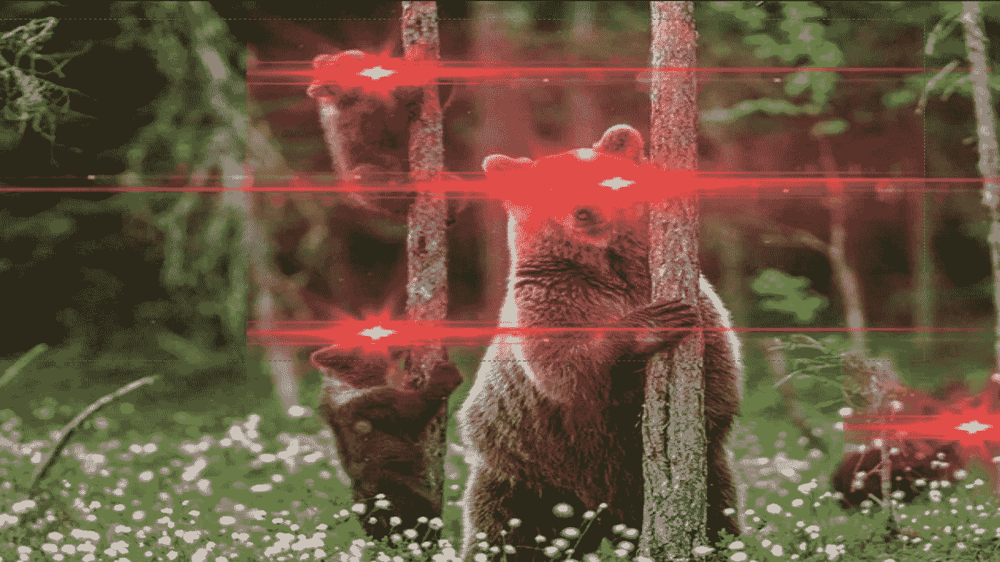
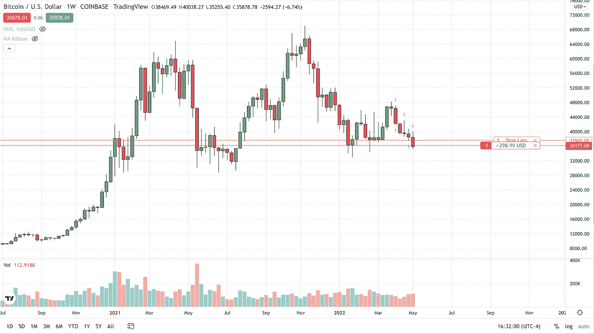
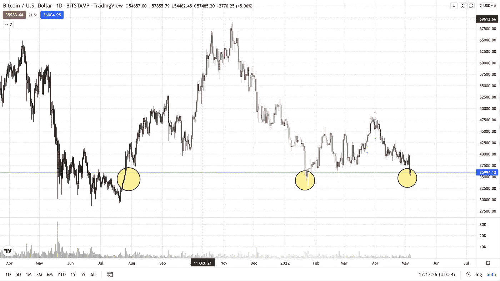

# 比特币创下两个月新低，实际上更接近 10 个月低点

> 原文：<https://medium.com/coinmonks/bitcoin-hits-new-two-month-lows-actually-closer-to-10-month-lows-c5a011e0fda4?source=collection_archive---------64----------------------->

今天，比特币交易价格比昨天低，达到 35250 美元，随后略有回升。目前，截至美国东部时间下午 4 点 20 分，比特币在现货市场的交易价格为 35880 美元，当日下跌 1.8%。

这标志着加密货币连续第六周下跌，也是自 4 月第一周以来的最大单周跌幅。自 4 月的第一周以来，比特币的价值已经下跌了 1 万多美元。

虽然在日内基础上，我们仅处于两个月低点，但在收盘基础上，如果我们以当前价格或低于当前价格收盘，从现在到 2021 年 7 月 25 日，我们只有一天的定价低于当前市场。这意味着我们真的更接近 10 个月的低点，而不是两个月的低点，因为在当前的市场印数和 2021 年夏季的低点之间，我们只有一个收盘价低于 29，000 美元。

我们预测未来价格会更低，支撑位在 33，000 美元，低于 29，000 美元。阻力位于 37，500 美元，这是我们的老支撑位，在此之上还有 40，000 美元。

对于任何有兴趣查看更多关于比特币的文章的人，只需点击这个[链接](https://www.thegoldforecast.com/bitcoin)。

> 加入 Coinmonks [电报频道](https://t.me/coincodecap)和 [Youtube 频道](https://www.youtube.com/c/coinmonks/videos)了解加密交易和投资

# 另外，阅读

*   [5 款最佳加密交易终端](https://coincodecap.com/crypto-trading-terminals) | [最佳 DeFi 应用](https://coincodecap.com/best-defi-apps)
*   [比特币基地 vs 瓦济克斯](https://coincodecap.com/coinbase-vs-wazirx) | [比特鲁点评](https://coincodecap.com/bitrue-review) | [波洛涅克斯 vs 比特鲁](https://coincodecap.com/poloniex-vs-bittrex)
*   [德国最佳加密交易所](https://coincodecap.com/crypto-exchanges-in-germany) | [Arbitrum:第二层解决方案](https://coincodecap.com/arbitrum)
*   [币安交易机器人](/coinmonks/binance-trading-bots-d0d57bb62c4c) | [OKEx 评论](/coinmonks/okex-review-6b369304110f) | [阿塔尼评论](https://coincodecap.com/atani-review)
*   [最佳加密交易信号电报](/coinmonks/best-crypto-signals-telegram-5785cdbc4b2b) | [MoonXBT 评论](/coinmonks/moonxbt-review-6e4ab26d037)
*   [如何在 Bitbns 上购买柴犬(SHIB)币？](https://coincodecap.com/buy-shiba-bitbns) | [买弗洛基](https://coincodecap.com/buy-floki-inu-token)