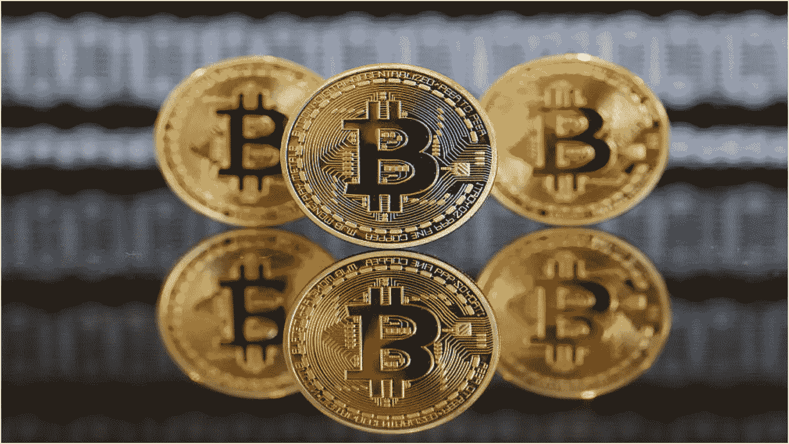
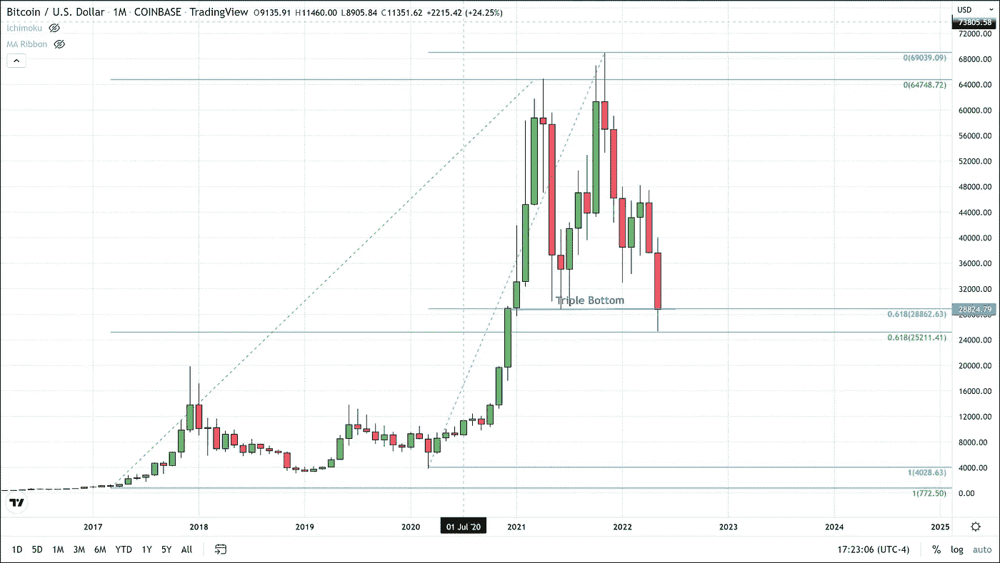
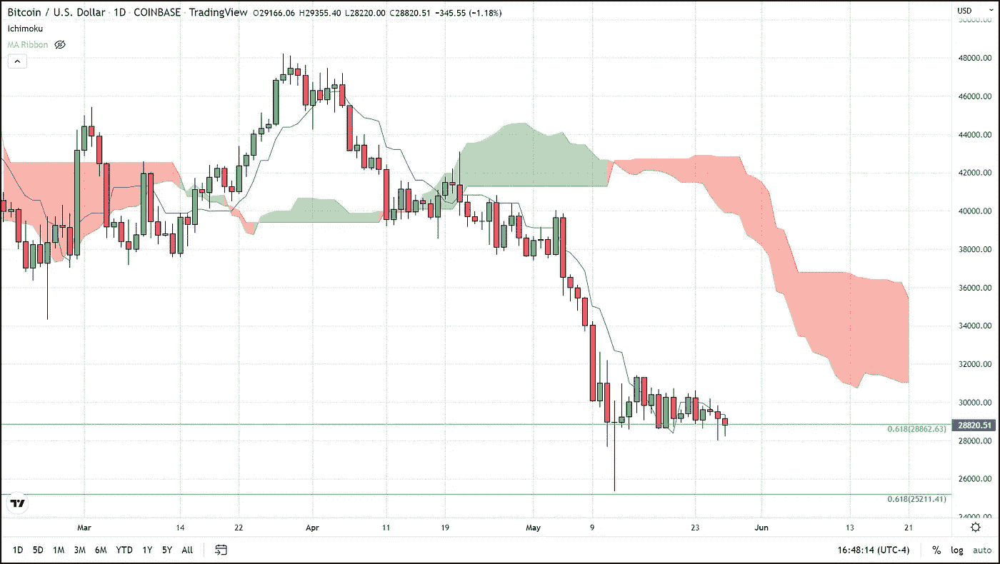

# 比特币守住了真正的三重底部

> 原文：<https://medium.com/coinmonks/bitcoin-holds-on-to-true-triple-bottom-e8b77d3a219?source=collection_archive---------47----------------------->

比特币现在正在形成第九根红色周线蜡烛，上个月突破了 44k 美元的关键支撑位，5 月突破了 37500 美元，过去两个月下跌了 15000 美元。

当我们从最近两次抛物线反弹(2017 年、2020 年至 2021 年)之前的低点进行斐波纳契回撤，并将它们与从该点开始的第二次 ATH 中达到的高点进行比较时，我们得到了一些非常有趣的数字。第一次黑色回撤的 61.8%水平正好在最近的低点 25，211 美元。蓝色的第二个回撤在 28，862 美元处给了我们 61.8%的收益，我们把这个价格标为三重底。

61.8%回撤的反弹可以被视为看涨信号。反之亦然，在 61.8%的水平拒绝可以作为一个看跌信号。出于这个原因，BTC 对这个关键的斐波那契水平和三重底部的防守是比特币多头最关键的战斗。这种支持保持不变的事实是比特币保持看涨模式的少数技术论据之一。尽管比特币最近遭受了迅速的打击，但自 2021 年以来，BTC 仅在一天内收盘略低于 28860 美元的关键支撑。

截至美国东部时间 4:20，比特币在今天早些时候从 28，300 美元的低点回升后，目前交易价格为 28，900 美元。即使在 5 月 12 日，当我们触及自 2020 年 12 月以来的最低价格时，蜡烛的小主体实际上收于 28，886 美元回撤/支撑位上方。此外，我们不要忘记，这个水平确实是去年夏天反弹到新 ATH 之前的底部。

地平线上的风暴云

当我们放大日线图时，并不都是阳光和玫瑰。Ichimoku 云工具预测，由于云的规模以及高于定价，很可能会出现较低的价格。

“云是技术指标整体不可或缺的一部分，帮助交易者和投资者识别对图表进行的具体计算。云线以下的价格表示下降趋势，云线以上的价格表示上升趋势。如果云和价格都朝着同一个方向移动，这些趋势信号会加强。同样，如果云向相反方向移动，信号也会减弱。”-交易观点

我的云图不包括一些通常包括的线，比如基线和滞后跨度。这样做是为了让图表不那么混乱，更容易解读。我在形成云的两条线旁边留下的一条线是蓝色的转换线，这条短期移动平均线在过去三天被证明是 BTC 的阻力。

任何对接收交易提醒感兴趣的人都可以点击这个[链接](https://www.thegoldforecast.com/bitcoin)注册。

> 加入 Coinmonks [电报频道](https://t.me/coincodecap)和 [Youtube 频道](https://www.youtube.com/c/coinmonks/videos)了解加密交易和投资

# 另外，阅读

*   [如何在 Uniswap 上交换加密？](https://coincodecap.com/swap-crypto-on-uniswap) | [A-Ads 审核](https://coincodecap.com/a-ads-review)
*   [WazirX vs coin dcx vs bit bns](/coinmonks/wazirx-vs-coindcx-vs-bitbns-149f4f19a2f1)|[block fi vs coin loan vs Nexo](/coinmonks/blockfi-vs-coinloan-vs-nexo-cb624635230d)
*   [本地比特币审核](/coinmonks/localbitcoins-review-6cc001c6ed56) | [加密货币储蓄账户](https://coincodecap.com/cryptocurrency-savings-accounts)
*   [什么是保证金交易](https://coincodecap.com/margin-trading) | [美元成本平均法](https://coincodecap.com/dca)
*   [支持卡审核](https://coincodecap.com/uphold-card-review) | [信任钱包 vs MetaMask](https://coincodecap.com/trust-wallet-vs-metamask)
*   [Exness 回顾](https://coincodecap.com/exness-review)|[moon xbt Vs bit get Vs Bingbon](https://coincodecap.com/bingbon-vs-bitget-vs-moonxbt)