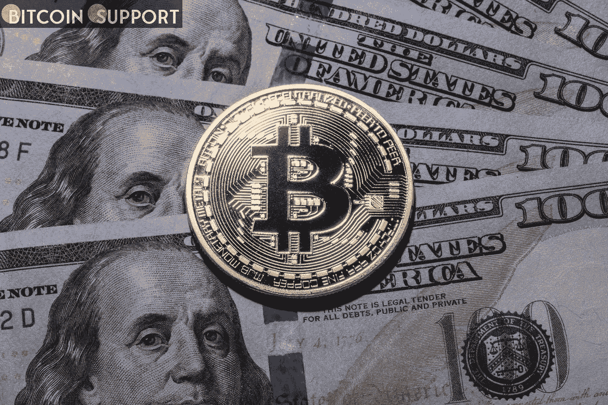
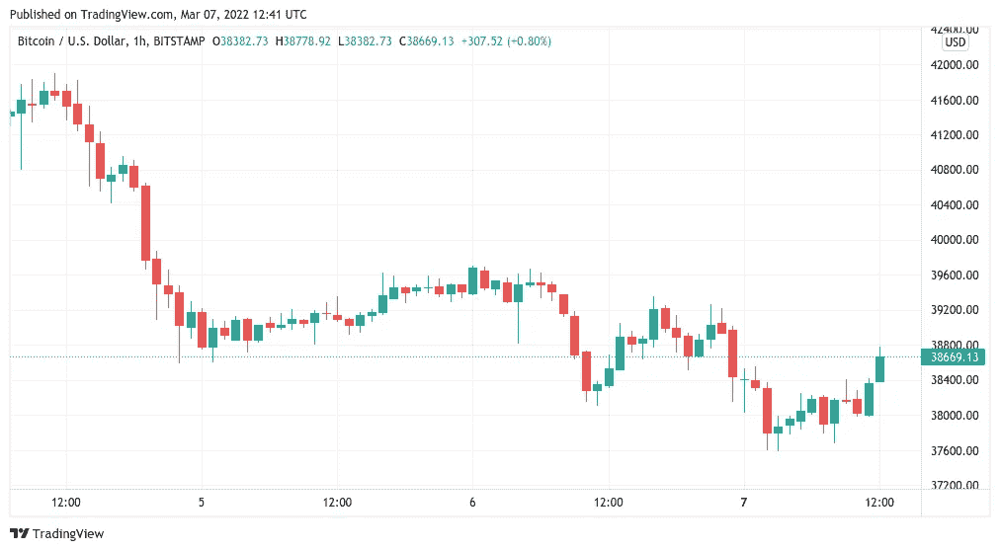
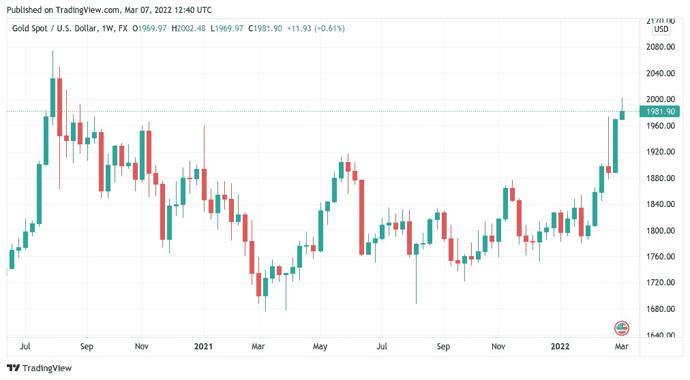
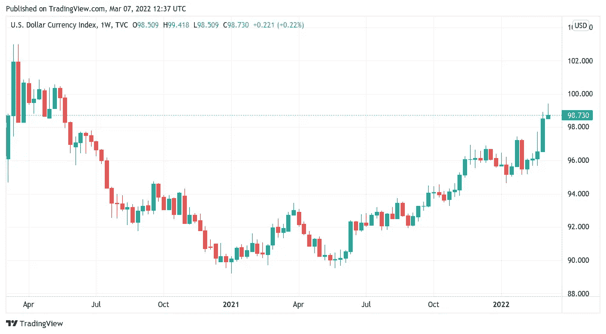

# 随着黄金接近 2000 美元，比特币保持稳定，美元达到 2020 年 5 月以来的最高水平

> 原文：<https://medium.com/coinmonks/bitcoin-holds-steady-as-gold-approaches-2000-and-the-us-dollar-reaches-its-highest-level-since-a28fabb68f2f?source=collection_archive---------68----------------------->

**Visit our website:-** [**https://bitcoinsupports.com/**](https://bitcoinsupports.com/)

大宗商品价格上涨和美元走强加剧了股票交易者的担忧，高盛(Goldman Sachs)前首席执行官问道，为什么加密资产没有“一刻”。随着投资者逃向更安全的避风港，比特币(BTC)在 3 月 7 日保持在一周低点附近。

**Visit our website:-** [**https://bitcoinsupports.com/**](https://bitcoinsupports.com/)

**黄金和美元都预示着股市的糟糕日子。**

根据 TradingView 的数据，BTC/美元隔夜反弹至 37，600 美元，随后跟踪上涨约 1，000 美元。在本周收盘前，这两种货币一直处于压力之下，达到本月的最低水平，因为有报道称西方对俄罗斯的制裁可能会扩大到包括石油禁运。因此，已经令人担忧的环境帮助了黄金的表现，周一自 2020 年 8 月以来首次回到每盎司 2000 美元。

**Visit our website:-** [**https://bitcoinsupports.com/**](https://bitcoinsupports.com/)

美元紧随其后，对其竞争对手飙升，美元货币指数(DXY)创下两年来的新高。

其他主要外币，如欧元，受到打击，欧元/美元跌至 1.09 美元以下，达到自 2020 年 3 月 Covid 崩盘以来的最高水平。

**Visit our website:-** [**https://bitcoinsupports.com/**](https://bitcoinsupports.com/)

“如果比特币与股市脱钩，它自去年 12 月以来的表现将与黄金类似，”分析师马修·海兰(Matthew Hyland)在周日的一份概览中指出。

**“比特币与股市成反比。它没有分离。也许它最终会脱钩，但在此之前，没有办法推断它已经或将要脱钩。**

在股市面临大宗商品价格飙升和政府主导的通胀控制措施的前景之际，这种“脱钩”或许比近年来任何时候都更有必要。华尔街开盘前，标准普尔 500 指数期货接近下跌 2%，而德国 DAX 指数已经下跌近 4%。高盛(Goldman Sachs)前首席执行官布兰克费恩(Blankfein)认为，加密货币应该“拥有一个时刻”。”

与此同时，比特币表现不佳的程度已经引起了传统金融界的关注。高盛(Goldman Sachs)前首席执行官劳埃德布兰克费恩(Lloyd Blankfein)质疑，鉴于政府对货币的控制，为什么加密货币总体上没有经历更多的流入。

“虽然我对加密持开放态度，但鉴于美元的通货膨胀，以及政府在某些情况下可以并将冻结账户和停止支付的强烈提醒，你不认为加密现在正处于一个时刻吗？到目前为止，我没有看到任何定价，”周一，他在推特上说。MicroStrategy 首席执行官迈克尔·塞勒(Michael Saylor)回应道，他特别指责了活跃在比特币领域的相互矛盾的投资组合，但他预测，目前的现状最终将被打破，使其能够履行其作为长期投资的角色。他说:“传统交易员根据他们目前的风险评估和利率预测，将比特币视为可以买卖的东西，而基本面投资者只想全部买入并永久持有，这两者之间存在冲突。”。

**“从长远来看，霍德勒夫妇会占上风。"**

**访问我们的网站:-**[**https://bitcoinsupports.com/**](https://bitcoinsupports.com/)

**免责声明:以上为作者观点，不应视为投资建议。读者应该自己做研究。**