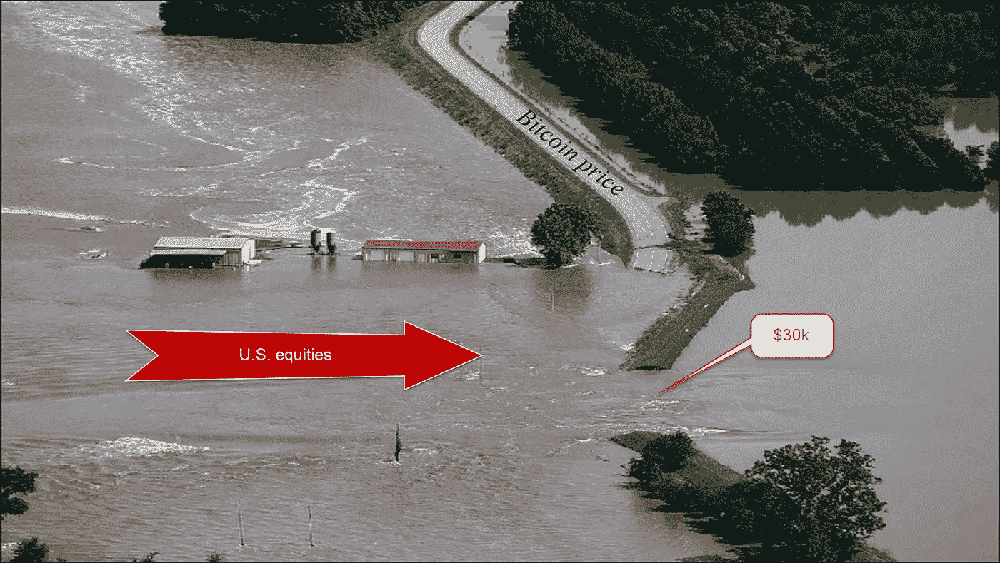
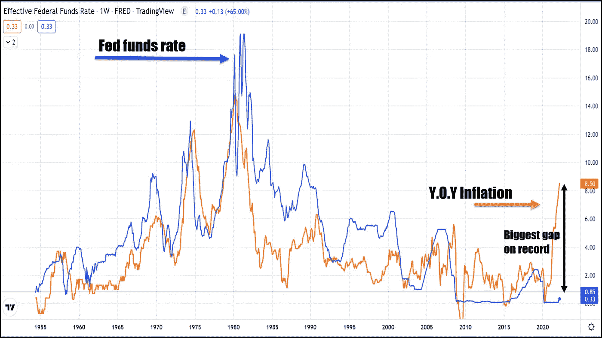
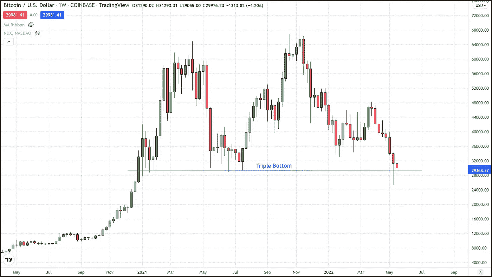

# 比特币持支持，征会破吗？

> 原文：<https://medium.com/coinmonks/bitcoin-holds-support-will-the-levy-break-28c7a8f9ec24?source=collection_archive---------55----------------------->

BTC 价格在前一天跌至 25，500 美元后，上周五(5 月 13 日)回升至 29，000 美元的关键支撑位上方。虽然 BTC 尚未显示出复苏的迹象，但在持续低点后主要抛售压力的暂停似乎反映了一年前的情况。

去年 5 月中旬，比特币在短短两周内下跌了约 30，000 美元，在那段短暂而残酷的时间内损失了约 50%的价值。在以与当前市场印数相当的价格进行了两个月的松散盘整后，出现了新的 ATH。虽然现在说 29，000 美元到 30，000 美元的底部已经形成还为时过早，但价格走势与我们一年前看到的惊人地相似。

当时和现在的最大区别在于，相关性强的市场的潜在宏观基本面已经改变。因此，这些市场，主要是可以通过纳斯达克综合指数看到的大型科技股，与美联储的货币紧缩政策进行了一场艰苦的斗争，这已经使该行业感到紧张。这是在联邦基金利率仍处于历史低位的情况下发生的。目前 0.83%的实际联邦基金利率仍然低于过去 64 年来的任何其他时间，低于最近的疫情，与 1958 年 5 月疫情之前的最低利率持平。

如果我们回顾过去 70 年，比较联邦基金利率攀升到什么水平，以对抗通胀的多次上涨，你会注意到，几乎每个时期的疯狂通胀都要求联邦基金利率等于或高于年同比通胀率。我们离达到那个门槛还有很长的路要走。事实上，在过去的七十多年里，这两个指标之间的差异越来越大。年通胀率仍比联邦基金利率高出近 7%。

这对 BTC 意味着什么？

不幸的是，正是这种根本性的差异很可能成为将比特币拖入经济海洋深处的水泥鞋。纳斯达克很可能只会继续下跌，随之而来的是大量机构投资美元将从比特币和大型科技公司转移出去，或者干脆被机构投资者大规模清算。我们因帮助比特币之前的反弹而受到称赞的投资者，正是将带来新一轮长期熊市的投资者。因此，与前两次比特币在这个价格水平交易(2021 年 1 月和夏季)不同，比特币从这个点开始可能不会有大的反弹，而是可能是下跌过程中的一个停止点。

目前，比特币在 29000 美元上方支撑不稳，但随着股票抛售可能刚刚开始，这种情况会持续多久？低于 29，000 美元，下一个支撑位是 24，500 美元，低于主要支撑位是 18，000 美元，这是我认为这次调整将在未来 6 到 12 个月引领我们的位置。当前阻力在 32k 美元，高于主要阻力 37500 美元。

对于任何有兴趣查看更多关于比特币的文章的人，只需点击这个[链接](https://www.thegoldforecast.com/bitcoin)。

> 加入 Coinmonks [电报频道](https://t.me/coincodecap)和 [Youtube 频道](https://www.youtube.com/c/coinmonks/videos)了解加密交易和投资

# 另外，阅读

*   [5 款最佳加密交易终端](https://coincodecap.com/crypto-trading-terminals) | [最佳 DeFi 应用](https://coincodecap.com/best-defi-apps)
*   [最佳网上赌场](https://coincodecap.com/best-online-casinos) | [币安评论](/coinmonks/binance-review-ee10d3bf3b6e) | [BitMEX 评论](https://coincodecap.com/bitmex-review)
*   [麻雀交换评论](https://coincodecap.com/sparrow-exchange-review) | [纳什交换评论](https://coincodecap.com/nash-exchange-review)
*   [美国最佳加密交易机器人](https://coincodecap.com/crypto-trading-bots-in-the-us) | [经常性评论](https://coincodecap.com/changelly-review)
*   [在印度利用加密套利赚取被动收入](https://coincodecap.com/crypto-arbitrage-in-india)