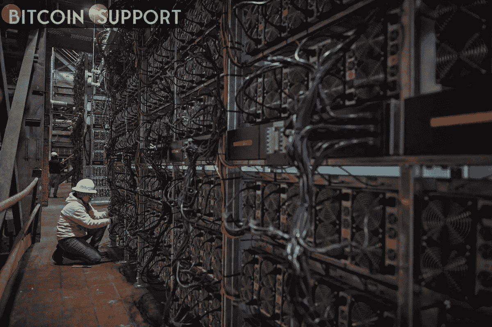

# 《牛仔郡的比特币》——一部关于怀俄明州中部天然气转比特币采矿的新纪录片

> 原文：<https://medium.com/coinmonks/bitcoin-in-cowboy-county-a-new-documentary-about-gas-to-bitcoin-mining-in-central-wyoming-cd7b3450cfe3?source=collection_archive---------90----------------------->

**Visit our website:-** [**https://bitcoinsupports.com/**](https://bitcoinsupports.com/)

比特币采矿公司和采矿设备经销商 Compass Mining 表示，一部关于怀俄明州中部比特币采矿业务的新纪录片将会上映。纪录片《牛仔郡的比特币:怀俄明州的粉河矿工》(bit coin in Cowboy County:Wyoming ' s Powder River Miners)将于 3 月 31 日在德克萨斯州休斯顿举行的 Empower 大会上首映。

**在得克萨斯州的 Empower 大会上，Compass Mining 和 JAI Energy 将首映一部关于比特币采矿的纪录片**

一部新的纪录片即将上映，该片聚焦比特币采矿及其与怀俄明州石油和天然气行业的关系。Compass Mining 将放映这部纪录片，其中将包括比特币能源解决方案公司 JAI Energy。根据 Compass Mining 发布的一份声明，“说明了 JAI Energy 如何利用石油和天然气生产中的额外能源，从浪费的资源中创造价值。”据新闻稿称，JAI Energy 是专门为“利用搁浅、燃烧和不良经济天然气流的应用程序挖掘和提供比特币挖掘服务”而创建的。该公司在怀俄明州的卡斯珀经营一家采矿厂，影片中对此进行了介绍。据 Compass Mining 称，JAI Energy 的所有采矿数据中心都是在怀俄明州制造的。这部纪录片的导演兼 Compass Mining 的内容总监威廉·福克斯利(William Foxley)表示，摄制组“渴望讲述杰能源的故事”。

“使用天然气进行比特币挖矿有诸多优势。福克斯利在一份声明中指出，贾伊和其他矿工“从一种否则会被浪费的资源中获取了价值。我们打算通过纪录片向观众介绍比特币采矿行业的行动，从而使比特币采矿行业人性化。“比特币采矿正在重塑怀俄明州和德克萨斯州石油和天然气行业的未来，我们有幸成为第一个在电影中看到它的人。”上周有消息称，埃克森美孚公司(纽约证券交易所代码:XOM)正与北达科他州的 Crusoe Energy Solutions 合作开发一个天然气转比特币的采矿项目。其他提供天然气转比特币服务的公司包括 Upstream Data、Greenidge Generation 和 EZ Blockchain，此外还有 Crusoe Energy 和 JAI Energy。据美国消费者新闻与商业频道报道，埃克森美孚和克鲁索能源公司正在开采比特币，以消除每天近 1000 万立方英尺的甲烷气体(BTC)。

“在 Compass，我们的目标是让每个人都能使用比特币挖矿。”Compass Mining 首席执行官惠特·吉布斯(Whit Gibbs)表示:“我们赞赏 JAI Energy 正在捕捉燃烧的天然气，将其转化为电力，并利用这些闲置的能源生产比特币。”

**访问我们的网站:-**[**https://bitcoinsupports.com/**](https://bitcoinsupports.com/)

**免责声明:以上为作者观点，不应视为投资建议。读者应该自己做研究。**

> *加入 Coinmonks* [*电报频道*](https://t.me/coincodecap) *和* [*Youtube 频道*](https://www.youtube.com/c/coinmonks/videos) *了解加密交易和投资*

# 另外，阅读

*   [有哪些交易信号？](https://coincodecap.com/trading-signal) | [Bitstamp vs 比特币基地](https://coincodecap.com/bitstamp-coinbase) | [买索拉纳](https://coincodecap.com/buy-solana)
*   [ProfitFarmers 点评](https://coincodecap.com/profitfarmers-review) | [如何使用 Cornix 交易机器人](https://coincodecap.com/cornix-trading-bot)
*   [十大最佳加密货币博客](https://coincodecap.com/best-cryptocurrency-blogs) | [YouHodler 评论](https://coincodecap.com/youhodler-review)
*   [my constant Review](https://coincodecap.com/myconstant-review)|[8 款最佳摇摆交易机器人](https://coincodecap.com/best-swing-trading-bots)
*   [MXC 交易所评论](/coinmonks/mxc-exchange-review-3af0ec1cba8c) | [Pionex vs 币安](https://coincodecap.com/pionex-vs-binance) | [Pionex 套利机器人](https://coincodecap.com/pionex-arbitrage-bot)