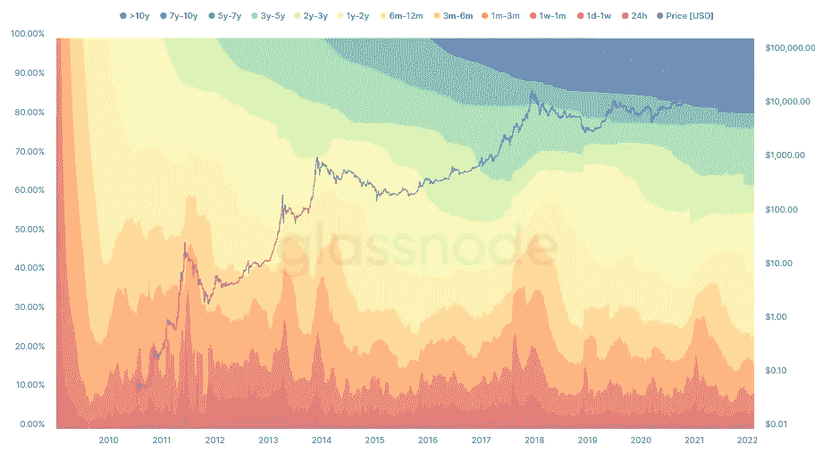

# 由于超过 60%的 BTC 人至少一年没有使用比特币，比特币的闲置供应接近历史最高水平

> 原文：<https://medium.com/coinmonks/bitcoin-inactive-supply-nears-record-as-over-60-of-btc-stays-unspent-for-at-least-1-year-360181cefb76?source=collection_archive---------15----------------------->

比特币(BTC)可能在 40，000 美元上下挣扎，但新数据正在强化一个事实，即几乎没有人有兴趣出售。

来自连锁分析公司 Glassnode 的数据显示，尽管价格波动，但超过 60%的 BTC 供应在一年或更长时间内没有离开过钱包。

强手很少更强

长期投资者的顽固观望是当前比特币市场气候与大多数其他下跌趋势不同的一个特征。

随着现货价格相对于上个月 11 月的历史高点下跌了 50%,人们预期会出现临阵退缩——但在经验丰富的霍德尔家中，抛售从未出现。

[从比特币交易中学习和赚取](https://bit.ly/cryptoQuantleap)

事实上，在相当长的一段时间里，情况正好相反——长期投资者要么增加头寸，要么保持 BTC 敞口不变。

根据 Glassnode 的 HODL 波浪指标，截至 2 月 18 日，BTC 60.61%的供应量已经有一年或更长时间没有用于交易。

比特币 HODL 波浪图(截图)。来源:解放资本

这个数字意义重大——在比特币的历史上，一年或更长时间的价值达到这个水平只有两次。

正如企业家和投资者 Alistair Milne 所指出的那样，这两次事件都是在比特币价格下跌之后和大幅反弹之前发生的。

因此，比特币中期有可能形成完全不同的趋势，这可能会打破宏观支持减弱、利率上升和地缘政治紧张局势的普遍悲观说法。

[从比特币交易中学习和赚取](https://bit.ly/cryptoQuantleap)

“长期 HODL 投资者耐心地进行 HODL 投资，因为他们知道很快会发生什么，”交易套件“分散者”的分析师 Philip Swift 对这些数据补充道。

低时间周期的波动给投机者带来痛苦

因此，短期趋势对大多数流通中的比特币来说似乎没什么影响，尽管如此，这些比特币还是在本周引发了些许焦虑。

相关:2018 年的比特币价格分形可能会困住多头，使 BTC 价格跌至 2.5 万美元——分析师。

[从比特币交易中学习和赚取](https://bit.ly/cryptoQuantleap)

例如，分析资源材料指标公司(analytics resource Material Indicators)监测币安主要交易所的订单交易时发现，就在周五跌至两周低点之前，支撑“地毯”在 4 万美元上方消失。

据 Cointelegraph 补充报道，小投资者在过去一周放缓了他们的积累活动。

> 加入 Coinmonks [电报频道](https://t.me/coincodecap)和 [Youtube 频道](https://www.youtube.com/c/coinmonks/videos)了解加密交易和投资

# 另外，阅读

*   [如何购买 Monero](https://coincodecap.com/buy-monero) | [IDEX 评论](https://coincodecap.com/idex-review) | [BitKan 交易机器人](https://coincodecap.com/bitkan-trading-bot)
*   [尤霍德勒 vs 科恩洛 vs 霍德诺特](/coinmonks/youhodler-vs-coinloan-vs-hodlnaut-b1050acde55a) | [Cryptohopper vs 哈斯博特](https://coincodecap.com/cryptohopper-vs-haasbot)
*   [顶级付费加密货币和区块链课程](https://coincodecap.com/blockchain-courses)
*   [MXC 交易所评论](/coinmonks/mxc-exchange-review-3af0ec1cba8c) | [Pionex vs 币安](https://coincodecap.com/pionex-vs-binance) | [Pionex 套利机器人](https://coincodecap.com/pionex-arbitrage-bot)
*   [如何在印度购买比特币？](/coinmonks/buy-bitcoin-in-india-feb50ddfef94) | [瓦济克斯审查](/coinmonks/wazirx-review-5c811b074f5b)
*   [印度的加密交易所](/coinmonks/bitcoin-exchange-in-india-7f1fe79715c9) | [比特币储蓄账户](/coinmonks/bitcoin-savings-account-e65b13f92451)
*   [Cloudbet 赌场评论](https://coincodecap.com/cloudbet-casino-review) | [点火赌场评论](https://coincodecap.com/ignition-casino-review)
*   [币安收费](/coinmonks/binance-fees-8588ec17965) | [僵尸加密审查](/coinmonks/botcrypto-review-2021-build-your-own-trading-bot-coincodecap-6b8332d736c7) | [热点审查](/coinmonks/hotbit-review-cd5bec41dafb)
*   [my constant Review](https://coincodecap.com/myconstant-review)|[8 款最佳摇摆交易机器人](https://coincodecap.com/best-swing-trading-bots)
*   [我的加密副本交易经历](/coinmonks/my-experience-with-crypto-copy-trading-d6feb2ce3ac5) | [AAX 交易所评论](/coinmonks/aax-exchange-review-2021-67c5ea09330c)