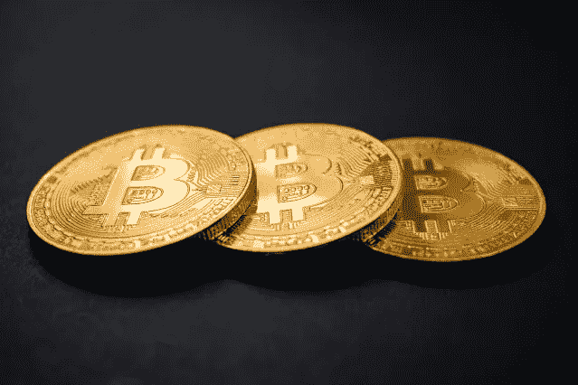
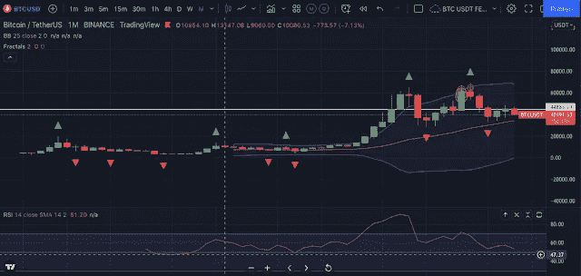

# 比特币机构购买可能会再次成为一个大事件。随着 30k BTC 离开比特币基地

> 原文：<https://medium.com/coinmonks/bitcoin-institutional-purchases-could-be-a-big-story-again-as-30k-btc-departs-from-coinbase-7c33e89d03b6?source=collection_archive---------40----------------------->

比特币(BTC)可能正在逼近 40000 美元，但新数据显示，主要投资者的需求远未下降。

根据在线分析平台 CryptoQuant 首席执行官 Ki Young Ju 的说法，机构 BTC 购买再次成为加密领域的“大事件”。

# 比特币基地专业移动大量的 BTC

Ki 引用了美国比特币基地交易所专业交易部门比特币基地 Pro 的数据，这些数据显示大量 BTC 仍在离开该公司的账簿。

这些份额在本周的一天内总计 30，000 BTC，这种情况并不是孤立的；三月份也观察到了类似的行为。

> “机构购买可能会再次成为大事件，因为行政命令没有设置任何障碍。”

美国上个月发布的调查加密货币生态系统各个方面的行政命令似乎对寻求敞口的大规模投资者没有影响。

正如 MKT 本周报道的那样，这一趋势在各交易所都很明显，就总体流出量而言，4 月份目前正试图与 3 月份持平。

供应的减少与令人不安的宏观形势形成鲜明对比，宏观形势继续给包括加密货币在内的风险资产带来压力。

比特币与受央行政策制约的股票之间的相关性必须打破，才能让情况有所改善，但分析师预测，这一过程绝不会一帆风顺。

“由于各种原因，相关性最终会打破，”评论员迪伦·勒克莱尔本周早些时候说。

> *我的猜测是:最终信用体系崩溃，波动性爆发。BTC 紧随其后，但更多是因为 deriv 交易员，而不是现货销售。由于现货供应继续受到限制，习惯于消退每次反弹的 BTC 空头会卷土重来。*

作者或任何其他人在本文中表达的观点或意见仅供参考，不构成金融、投资或其他建议。投资或交易加密资产会带来财务风险。

# 公开

作者或任何其他人在本文中表达的观点或意见仅供参考，不构成金融、投资或其他建议。投资或交易加密资产会带来财务风险。

*原载于 2022 年 4 月 15 日 https://mkt57.blogspot.com***。**

> *加入 Coinmonks [电报频道](https://t.me/coincodecap)和 [Youtube 频道](https://www.youtube.com/c/coinmonks/videos)了解加密交易和投资*

# *另外，阅读*

*   *[折叠 App 审核](https://coincodecap.com/fold-app-review) | [Kucoin 交易机器人](/coinmonks/kucoin-trading-bot-automate-your-trades-8cf0ca2138e0) | [Probit 审核](https://coincodecap.com/probit-review)*
*   *[如何匿名购买比特币](https://coincodecap.com/buy-bitcoin-anonymously) | [比特币现金钱包](https://coincodecap.com/bitcoin-cash-wallets)*
*   *[币安 vs FTX](https://coincodecap.com/binance-vs-ftx) | [最佳(SOL)索拉纳钱包](https://coincodecap.com/solana-wallets)*
*   *[比诺莫评论](https://coincodecap.com/binomo-review) | [斯多葛派 vs 3Commas vs TradeSanta](https://coincodecap.com/stoic-vs-3commas-vs-tradesanta)*
*   *[Capital.com 评论](https://coincodecap.com/capital-com-review) | [香港的加密借贷平台](https://coincodecap.com/crypto-lending-hong-kong)*
*   *[如何在 Uniswap 上交换加密？](https://coincodecap.com/swap-crypto-on-uniswap) | [A-Ads 评论](https://coincodecap.com/a-ads-review)*