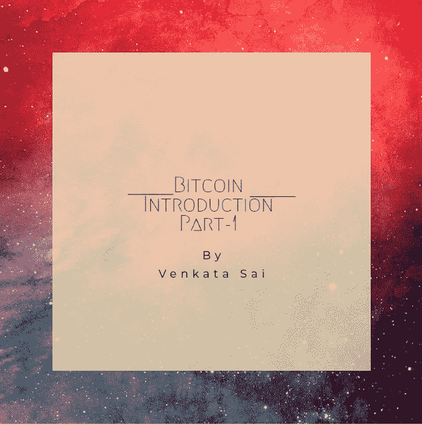
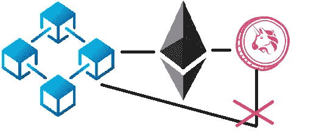
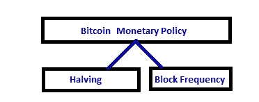
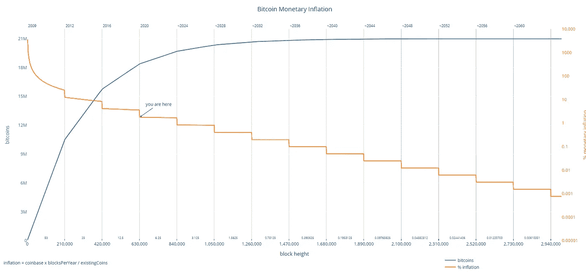
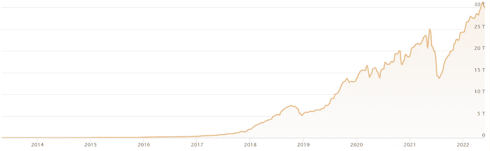

# 比特币简介第一部分

> 原文：<https://medium.com/coinmonks/bitcoin-introduction-part-1-3aa3ed5ed2ed?source=collection_archive---------52----------------------->

在本文中，我们将介绍加密货币比特币。我会试着让你对不同的东西有一个清晰的概念，比如比特币、协议、硬币、代币。

比特币是在 2008 年由一个或几个人以中本聪的名字发明的，2009 年比特币系统开始实施。比特币就是将区块链技术从理论应用到实践，这样人们就可以利用这项技术在网络中进行交易。正因为如此，他们之间不需要中间人，他们可以相互交易，即使他们从未见过面，他们仍然可以相互信任，因为他们信任背后的技术。

> **比特币生态系统:**

比特币生态系统包括以下参与者:

1.  **节点**:这是人们用来参与网络的设备的术语，这些设备并没有挖掘网络。
2.  **矿工**:这些参与者实际上帮助区块链自身发展，通过采矿，通过将交易加入区块，再将区块加入区块链。
3.  大型矿商:这些矿商拥有很多设备，为区块链的发展做出了巨大贡献。
4.  采矿池:这些是矿工聚集在一起进行采矿作业。

> **加密世界中的层:**

在加密领域，我们有 3 个非常重要的层。

1.  技术
2.  协议/硬币
3.  代币

**技术**:涉及到的技术是区块链。(请参考[开始使用葫芦链](/@saisiva249/getting-started-with-blockchain-8ea58f976167))

**协议/币:**第二层我们有比特币。比特币不仅仅是一枚硬币，它实际上是一种协议。协议是一组规则，规定了网络参与者应该如何相互通信。该协议定义了如何使用公钥和签名进行身份验证，我们应该如何就事情达成共识，协议还将定义参与者如何就协议本身的更新达成一致，等等。在这里，我们讨论的是比特币协议，但也有一些其他协议，如以太坊、Ripple、Neo、Waves。

协议实际上包含了一个叫做硬币的特性。上述每个协议都有自己的硬币。比如比特币有比特币，以太坊有以太，涟漪有涟漪。议定书上只会有一枚硬币。这是我们在开采区块时得到的奖励硬币，也是人们用来互相购买东西的硬币。

**令牌**:令牌依赖于智能合约，智能合约建立在第 2 层定义的不同协议之上。例如，如果我们看到以太坊是最流行的协议，用于创建智能合同，并因此创建令牌。它拥有最多的令牌。比特币没有代币，因为它不会促进创建智能合约的概念。

**代币和硬币的区别:**

加密货币指硬币和代币。但它们是不同的，硬币是数字资产，有自己的区块链，而作为代币托管在现有的硬币上，它们没有自己的区块链。

Relation between Coins, Tokens and Block chain

所以代币在母币的基础上被称为子币。它们是数字资产的子类。例如，如果我们认为硬币是操作系统，那么令牌就是程序(*。exe)，我们在操作系统中启动它。

如果我们想开发一种新的加密货币，开发者必须对未来硬币背后的全新区块链的全部功能和逻辑进行编码。因此，在现有的区块链环境中创建/启动令牌(无论是什么类型的令牌)要容易得多，因此背后的底层逻辑将与构建它的区块链相同。

> **比特币的货币政策:**

和银行一样，比特币也有监控政策。这种货币政策完全由软件/算法控制。

Bitcoin Monetary Policy

这条原则规定每 4 年每块释放的比特币数量将减半。当比特币在 2009 年兴起时，成功挖掘一个区块的区块奖励是每 10 分钟 50 个比特币。2012 年 11 月，比特币第一次减半，块奖励从 50 比特币减少到一半 25 比特币。

Bitcoin Monetary Inflation- [https://bashco.github.io/Bitcoin_Monetary_Inflation/](https://bashco.github.io/Bitcoin_Monetary_Inflation/)

这也意味着采矿变得更加复杂。随着网络复杂性随着时间的推移而增加，支付率下降，每个比特币都增加了挖掘的实际成本，这意味着每个比特币的市场价值也增加了(因此矿工可以通过交易费得到补偿，而块奖励则有所减少。)

B 对于众多的加密货币，平均阻断时间或阻断频率是不同的。

例如:比特币平均阻断时间为 10 分钟，以太坊为 15 秒左右。

> **了解挖掘难度:**

例如，如果我们考虑 64 位散列。最大目标将是 FFFFFFFF……..FFFFF (64 次)可能的十六进制数 16⁶⁴，当前目标 000000000000000FFF…FFFF (18 个零和剩余的 f)可能的有效散列 16⁴⁶

**难度=当前目标/最大目标** = 0.2*10-

所以得到一个低于极限值的值来获得奖励的概率是 0.2*10-。这个难度每 2016 个街区调整一次(意味着 2 周)，这不是由任何中央权威机构调整的，而是由节点自己决定的。

Bitcoin Difficulty- Crypto Mining CoinWarz

这是我们的比特币基础知识的第一部分，希望你对区块链、采矿、比特币和代币的基础知识有所了解。我将在第二部分解释剩下的话题。

***感谢阅读，关注我更多***

> 加入 Coinmonks [电报集团](https://t.me/joinchat/Trz8jaxd6xEsBI4p)，了解加密交易和投资

> 参考

[加密硬币与代币——区别和示例(octocrypto.io)](https://octocrypto.io/knowledge/crypto-coin-vs-token-differences-and-examples/#:~:text=Coins%20and%20Tokens%20may%20seem%20similar%20but%20have,coin%20with%20its%20own%20blockchain.%20More%20items...%20)

[https://blog . ineuron . ai/bit coin-Monetary-Policy-khxoyfjg 6 p #:~:text = bit coin % 20 has % 20a % 20 set % 20 limit，in % 20 the % 20 case % 20 of % 20 bit coin](https://blog.ineuron.ai/Bitcoin-Monetary-Policy-khxOyFJg6P#:~:text=Bitcoin%20has%20a%20set%20limit,in%20the%20case%20of%20Bitcoin)。