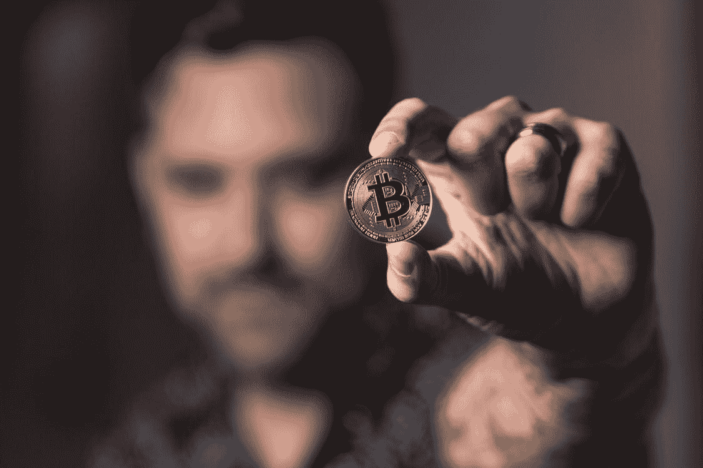
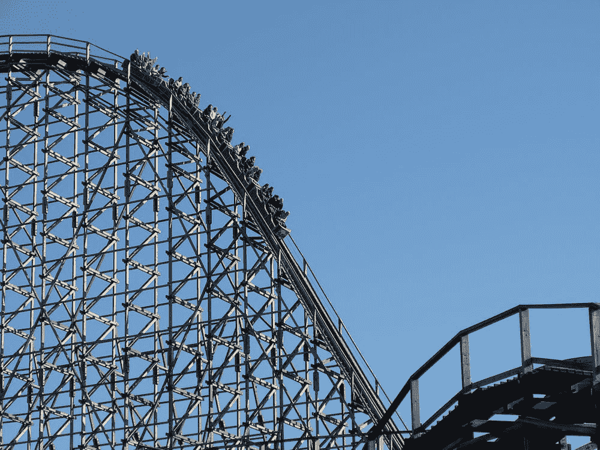

# 比特币崩盘了！

> 原文：<https://medium.com/coinmonks/bitcoin-is-crashing-81405cc2f25?source=collection_archive---------5----------------------->

# 加密冬天的开始和对长期投资者的思考。

Courtesy: Pexels.com

比尔·盖茨在最近的一次采访中驳斥了加密货币的想法，他非常直接。在他看来，像比特币一样，加密资产是基于大傻瓜理论的。这意味着总有一天会有更大的傻瓜以更高的价格购买你的比特币。

加密资产摇摇欲坠，所以反对者有一个场天。自最近的高点以来，比特币已经跌破 2 万英镑，抹去了 70%的投资者财富。

加密贷款公司 Celsius 暂停了所有提款，加剧了这一下跌。这引发了对这一领域其他公司可能蔓延效应的担忧。还有 Terra，一种因流动性担忧而崩溃的所谓稳定货币。三箭资本(Three Arrow Capital)等一些对冲基金濒临破产，因为随着比特币的下跌，它们的整体资产价值大幅下降。

今年 2 月，我写了一篇文章，讲述了像比特币这样的[加密货币是极易波动的资产，会受到剧烈波动的影响。](https://sandeepganju0727.medium.com/creating-a-fortune-from-bitcoin-halving-events-e132db87acd3)我还谈到了加密的冬天，以及它如何有可能抹去比特币的大部分价值。我曾预测比特币在中期可能会达到 14K 的水平。

往前看，崩溃发生得出奇的快。但是，这就是加密技术像所有新兴投资一样的表现。你需要做好坐过山车的准备，在那里你会看到你的运气起起落落。

不管悲观主义者怎么说，也不管最近的崩盘，在我看来，密码仍然是一种资产类别，从长期来看，它将获得牵引力。我不是比特币最大化主义者，但如果你能够忍受这种波动性，加密货币是一种资产类别，你的投资组合中应该有一小部分是加密货币。

我之所以这样认为，有几个原因:

# 1.新兴资产类别总是不稳定的

不确定性高的投资和资产类别总是不稳定的。微观策略公司的迈克尔·塞勒等比特币倡导者谈论了亚马逊股票在 21 世纪初遭受的惊人损失。然而，那些继续持有股票的人赚了一大笔钱，那些最初的损失并不重要。

最初，波动性很高，因为人们仍不确定新兴资产类别能否存活，更不用说繁荣了。有信念的人能承受起起落落，就有机会发财。把握市场时机的交易者心态在这些资产类别中并不总是奏效。如果你在脸书、苹果或印孚瑟斯的股票上市初期崩盘时退出了这些股票，你就错过了最大的赚钱机会。

Courtesy: Pexels.com

# **2。60:40 投资组合之死**

随着通胀率达到创纪录高位，机构发现很难从传统的 60:40 投资组合中获得回报。债券正被包括特定行业股票在内的其他资产类别所取代。最终，密码也将进入传统投资组合。最大的基金公司之一富达(Fidelity)已经建议投资者将一部分退休储蓄投资于 cryptos。甚至在加密冬天来临之前，他们就已经在加大加密投资咨询的力度。

随着通胀率徘徊在 9%的水平，机构转向能够带来指数回报的资产类别是再自然不过的事情了。债券为主的投资组合在可预见的未来只能带来负的实际回报。

# 3.Web 3.0

Web 3.0 发展迅速，有可能改变我们未来使用互联网的方式。Web 3.0 提供了一种逃离平台控制的方式，而这些平台主宰着当今的互联网空间。它为去中心化打开了可能性，最深远的结果之一可能是 Defi(去中心化金融)的发展。这将实现直接的点对点互动，使金融交易成为可能，而不需要中介。许多 Defi 应用程序正在以太网上构建，因此像以太这样的加密货币将在这个新的架构中占据突出地位。

因此，虽然沃伦·巴菲特可能会说加密货币没有内在价值，但未来的加密货币将会发现其作为 Web 3.0 默认交易媒介的价值。

Courtesy: Pexels.com

# 4.网络的力量

现有的货币体系是以法定货币为基础的，比如美元，由中央政府自上而下地驱动。另一方面，比特币则不同。这是基于网络的力量。简而言之，网络越大，越容易被接受。比特币和其他主要密码具有基于信念、协议和平台的网络效应。从众网络效应也开始出现，因为人们希望尽早采用这种技术，以便他们能够从中受益最大。

其结果是，大约有 1.06 亿比特币拥有者，这个数字还在增长，日常交易也在增长。这个网络仍然很小，应该有可能覆盖所有使用现金的人，这意味着世界上大多数人口。随着技术的发展和 Web 3.0 应用的增加，这个数字一定会增加。在 2100 万比特币的有限供应下，网络的大规模增长注定会在长期内推高价格。

# 5.监管过剩

美国目前正致力于围绕加密空间制定法规。虽然这可能需要时间，但这将是朝着正确方向迈出的一步。一旦监管、税收和治理变得清晰，许多投资者将会把主要的加密技术投入新的轨道。欧盟也在制定 MiCA 法案，该法案旨在监管加密空间。

正在讨论的法规也应该给稳定的硬币和非金融债券带来透明度。稳定硬币的使用可能会受到限制，以避免它们取代美元和欧元等法定货币。出于环境考虑，比特币开采是政府可能打击的另一个领域。这可能会进一步加速远离“工作证明”，这是目前用来监管新的供应。

# 结论

当密码的价格很高时，总是有关于比特币达到一百万美元的新闻。比特币的鼓吹者在媒体上大肆宣扬。相反，在价格崩盘的时候，有比特币跌到零的消息。批评家们认为这项资产没有实际价值。

对于对这一领域有信心的长期投资者来说，重要的是将一小部分投资组合配置到这些资产上。她必须保持钢铁般的意志，因为可能会有巨大的起伏。她必须避免受到把握市场时机的诱惑。

这是一个处于未来技术前沿的空间。这是一个在这里停留的空间。

*本文不是一条投资建议。是基于我自己对这个话题的分析和看法。在做任何投资决定之前，你应该咨询你的财务顾问。*

> 加入 Coinmonks [电报频道](https://t.me/coincodecap)和 [Youtube 频道](https://www.youtube.com/c/coinmonks/videos)获取每日[加密新闻](http://coincodecap.com/)

# 另外，阅读

*   [币安 vs FTX](https://coincodecap.com/binance-vs-ftx) | [最佳(SOL)索拉纳钱包](https://coincodecap.com/solana-wallets)
*   [比诺莫评论](https://coincodecap.com/binomo-review) | [斯多葛派 vs 3Commas vs TradeSanta](https://coincodecap.com/stoic-vs-3commas-vs-tradesanta)
*   【Capital.com】|[港加密借贷平台](https://coincodecap.com/crypto-lending-hong-kong)
*   [如何在 Uniswap 上交换加密？](https://coincodecap.com/swap-crypto-on-uniswap) | [A-Ads 评论](https://coincodecap.com/a-ads-review)
*   [WazirX vs CoinDCX vs bit bns](/coinmonks/wazirx-vs-coindcx-vs-bitbns-149f4f19a2f1)|[block fi vs coin loan vs Nexo](/coinmonks/blockfi-vs-coinloan-vs-nexo-cb624635230d)
*   [本地比特币审核](/coinmonks/localbitcoins-review-6cc001c6ed56) | [加密货币储蓄账户](https://coincodecap.com/cryptocurrency-savings-accounts)
*   [什么是保证金交易](https://coincodecap.com/margin-trading) | [美元成本平均法](https://coincodecap.com/dca)