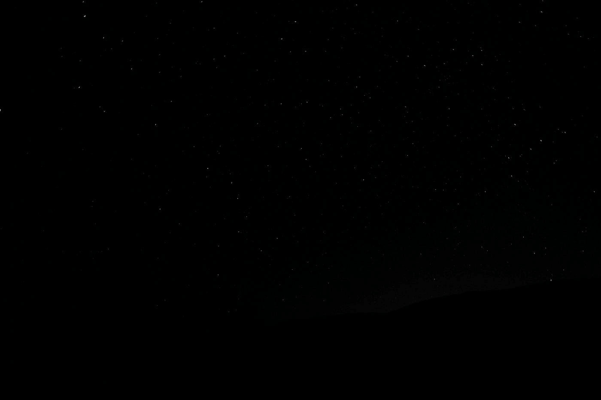
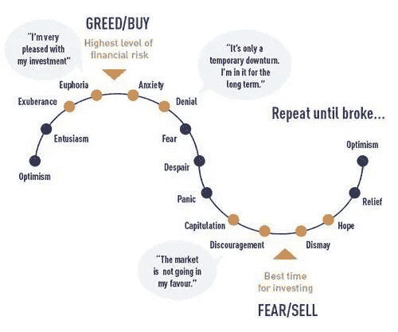

# 比特币已死。

> 原文：<https://medium.com/coinmonks/bitcoin-is-dead-af54a2dbec21?source=collection_archive---------23----------------------->

这是加密的末日，比特币已死。

Photo by [Francesco Ungaro](https://unsplash.com/@francesco_ungaro?utm_source=medium&utm_medium=referral) on [Unsplash](https://unsplash.com?utm_source=medium&utm_medium=referral)

如果你仍然活跃在市场上，你会多次看到这种说法。首先，我为点击诱饵道歉，因为比特币没有死。我还应该强调，这完全是我的观点，我在密码领域和传统市场进行了 4 年的研究和知识。

比特币死了几次？总共 453 次，根据[99 比特币。](https://99bitcoins.com/bitcoin-obituaries/)现在让它深入人心。当市场情绪消极时，看跌文章往往会重新出现，将更多的投资者推向恐惧的边缘。比特币远未消亡。事实上，在过去的 453 次比特币被称为死亡都发生在熊市期间或熊市开始时。随着大公司和国家继续探索比特币的应用，比特币继续证明其价值。

## 我们正处于投降阶段。

当已经下跌的市场面临巨大的抛售压力时，市场就会投降。这意味着，在大多数情况下，市场投降发生在熊市或市场情绪消极的时候。这听起来像我们现在的处境吗？市场投降的结果是整个市场的资产价格迅速下跌。下图最好地描述了我们现在所处的阶段。

Image credit: [ZeroHedge](https://seekingalpha.com/article/4340263-current-rally-new-bull-market-are-calling-is-not-end-of-bear)

## 为什么我认为我们正处于投降阶段？

我认为是这样的一些关键原因是:

1.  公司刚刚开始破产。随着 TerraForm Lab 和 LUNA 的消亡，Celsius 和 Three Arrows Capital 将成为下一个目标。
2.  鉴于加密市场的崩溃，公司刚刚开始裁员。Crypto.com 和比特币基地的目标是裁员近 20%。许多其他加密公司也预计会裁员。我确定。
3.  随着油价和通胀持续飙升，看不到尽头，美联储将继续加息，市场势头将继续南下。
4.  这是一个人应该开始感到绝望和沮丧，并最终退出市场。

## 还有更多下跌空间吗？

是的，我想是的。这很容易理解。有一句名言，“鱼从头开始腐烂。”

只要联邦政府继续从数量上收紧市场以减少需求，股票市场(S&P500)将继续下跌。当利率上升时，更少的人和企业会倾向于借钱，因为产生的利息会更高。这反过来会降低市场对资金的需求，导致更少的资金涌入股市等风险更高的资产类别。随着流入股市的资金减少，股市将继续下跌，或者至少会出现横向价格波动。这不是火箭科学！

感谢您阅读我的文章。在这里给我买一台 [***的 ko-fi 支持我。***](https://ko-fi.com/unemployedbanana) *☕❤️*

*想要购买/交易密码？考虑免费使用我的会员链接！*

***【🟡】(收费最低)|*[***ku coin***](https://www.kucoin.com/r/rf/rPELADP)**🟢(大量低市值宝石)****

> **加入 Coinmonks [电报频道](https://t.me/coincodecap)和 [Youtube 频道](https://www.youtube.com/c/coinmonks/videos)了解加密交易和投资**

# **另外，阅读**

*   **[加拿大最佳加密交易机器人](https://coincodecap.com/5-best-crypto-trading-bots-in-canada) | [Bybit vs 币安](https://coincodecap.com/bybit-binance-moonxbt)**
*   **[阿联酋 5 大最佳加密交易所](https://coincodecap.com/best-crypto-exchanges-in-uae) | [SimpleSwap 评论](https://coincodecap.com/simpleswap-review)**
*   **购买 Dogecoin 的 7 种最佳方式**
*   **[最佳期货交易信号](https://coincodecap.com/futures-trading-signals) | [流动性交易所评论](https://coincodecap.com/liquid-exchange-review)**
*   **[用于 Huobi 的加密交易信号](https://coincodecap.com/huobi-crypto-trading-signals) | [Swapzone 审查](/coinmonks/swapzone-review-crypto-exchange-data-aggregator-e0ad78e55ed7)**
*   **[最佳加密交易机器人](/coinmonks/crypto-trading-bot-c2ffce8acb2a) | [购买索拉纳](https://coincodecap.com/buy-solana) | [矩阵导出评论](https://coincodecap.com/matrixport-review)**
*   **[Coldcard 评论](https://coincodecap.com/coldcard-review) | [BOXtradEX 评论](https://coincodecap.com/boxtradex-review)|[uni swap 指南](https://coincodecap.com/uniswap)**