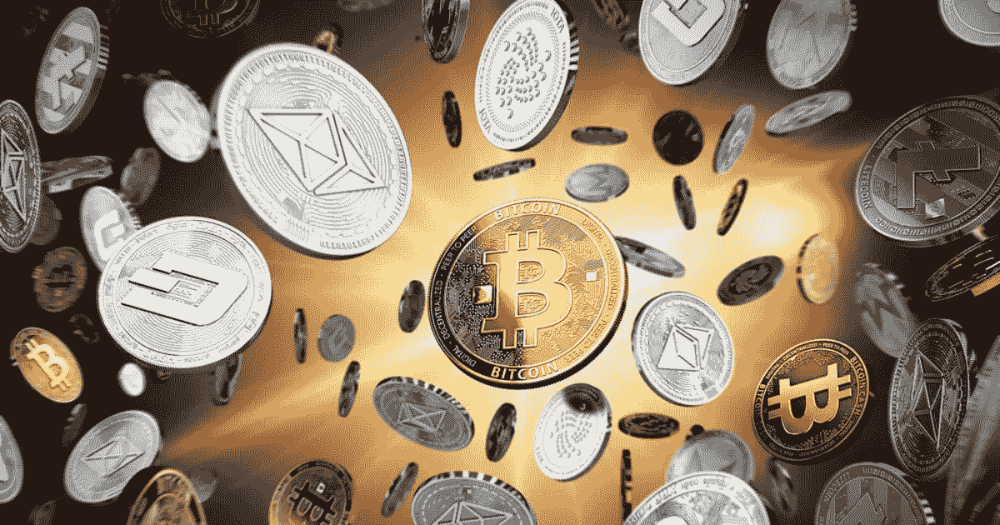
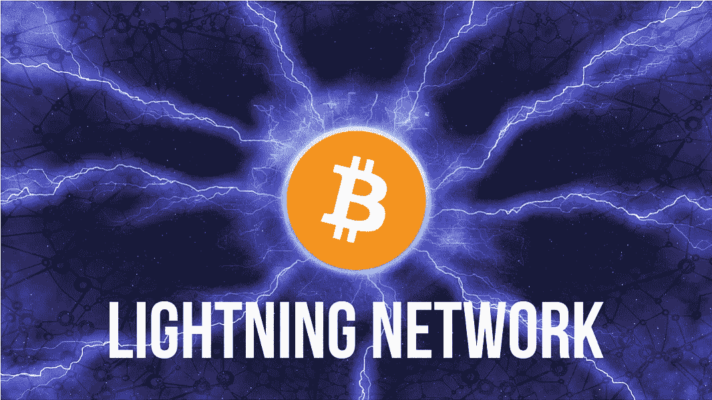
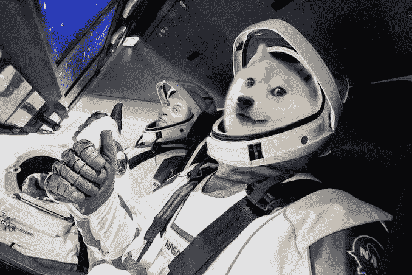

# 比特币已死，比特币万岁

> 原文：<https://medium.com/coinmonks/bitcoin-is-dead-long-live-bitcoin-9117424a6cdf?source=collection_archive---------29----------------------->

从 Satoshi 发表比特币论文开始，很久过去了，发生了这么多事情。传统金融领域仍引发人们对加密货币领域的担忧，但最近一段时间以来，这种关系出现了良好的和解。

但让我们从远处开始，最初，加密货币与我们这样的技术爱好者有关，这些人喜欢代码和脱离传统系统的想法。萨博当然是这场新运动的领导者之一，他是真正的天才和未来主义者。Bitcointalk 是这项新技术的爱好者和早期采用者的巢穴。这是唯一一个谈论比特币的地方。

BTC 之后，以太坊通过 ICO 到达。一个比比特币更复杂的系统来解释，因为以太坊提出自己是一台世界计算机。维塔利科·布特林无疑已经成为密码界最有影响力的人之一。

随着时间的推移，从 Tether(稳定货币)到 Solana、Avalanche、Terra 和 Telos 等项目，新项目不断诞生。

随着时间的推移，媒体对 crypto 的关注越来越多，媒体开始每天都在谈论它。基金和机构意识到有事要发生了。问题是，正如技术和机构经常发生的那样，机构没有/还没有为这项技术做好准备，并从技术上深刻地谈论它。

与此同时，风险投资也已经到来，他们的大量资本已经开始为加密/区块链领域的大型项目提供融资。有一件事让许多密码纯粹主义者嗤之以鼻。

从技术角度来看，论文发表以来发生了哪些变化？

像许多其他第一层一样，比特币在大规模采用方面受到一些技术限制，社区正在致力于被确定为第二层的项目。就比特币而言，闪电网络正在建设中。一个非常有趣的项目，目前仍处于测试阶段。出于安全原因，使用第 2 层显然是至关重要的。但是我相信技术会进步，密码世界会找到越来越好的解决方案和应用。

今天，许多第一层正在移动，或生来就有除了 PoW 之外的系统。我们倾向于使用 PoS 或衍生品等系统。

对加密货币的看法发生了怎样的变化？

今天所有人都在谈论比特币。埃隆·马斯克支持 Dogecoin，通过特斯拉购买了比特币。除了拥有他个人。美国银行支持索拉纳作为一项技术。投资者经常谈论加密货币，进行分析并试图提出他们的愿景。

总之，现在无法预测加密货币的未来。这些机构肯定不了解这个问题，可能会对立法造成损害。然而，加密货币今天是一种技术现象，它们已经完全淹没了世界，并且已经在某些方面部分改变了世界。想想 NFTs 的出现，这是一个有趣的产品，在短时间内获得了媒体的关注。有许多严肃而重要的项目正在进行中。

比特币已经岌岌可危，永远不会被遗忘或搁置。它的技术和社区已经发生了变化，书写了新的历史篇章。

比特币万岁。

> 加入 Coinmonks [电报频道](https://t.me/coincodecap)和 [Youtube 频道](https://www.youtube.com/c/coinmonks/videos)了解加密交易和投资

# 另外，阅读

*   [OKEx vs KuCoin](https://coincodecap.com/okex-kucoin) | [摄氏替代品](https://coincodecap.com/celsius-alternatives) | [如何购买 VeChain](https://coincodecap.com/buy-vechain)
*   [币安期货交易](https://coincodecap.com/binance-futures-trading)|[3 comas vs Mudrex vs eToro](https://coincodecap.com/mudrex-3commas-etoro)
*   [如何购买 Monero](https://coincodecap.com/buy-monero) | [IDEX 评论](https://coincodecap.com/idex-review) | [BitKan 交易机器人](https://coincodecap.com/bitkan-trading-bot)
*   [CoinDCX 评论](/coinmonks/coindcx-review-8444db3621a2) | [加密保证金交易交易所](https://coincodecap.com/crypto-margin-trading-exchanges)
*   [红狗赌场评论](https://coincodecap.com/red-dog-casino-review) | [Swyftx 评论](https://coincodecap.com/swyftx-review) | [CoinGate 评论](https://coincodecap.com/coingate-review)