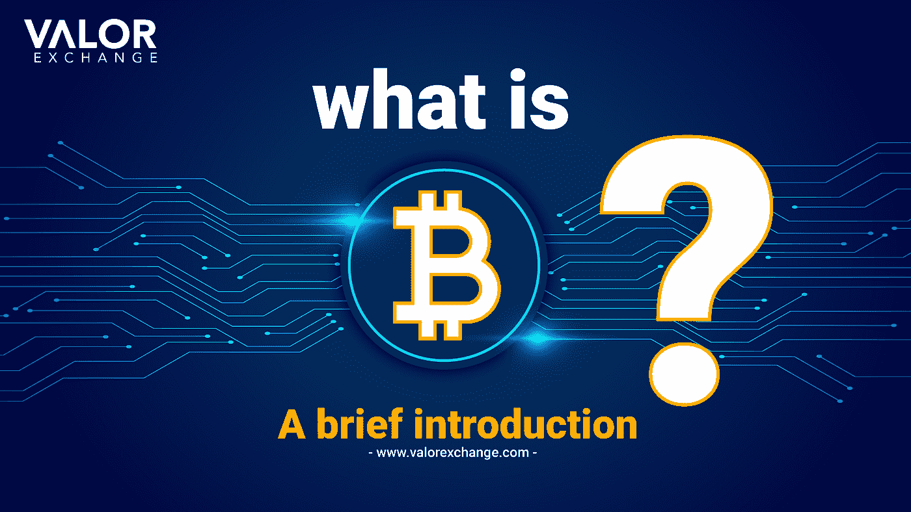
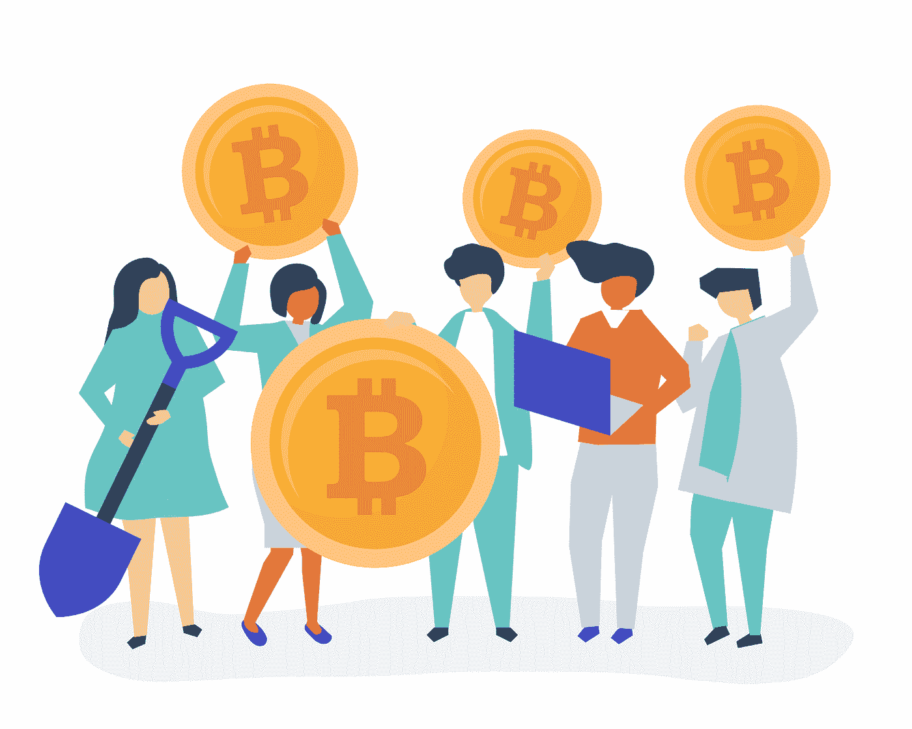

# 比特币是什么？—简介。

> 原文：<https://medium.com/coinmonks/bitcoin-is-decentralized-digital-money-which-you-can-store-exchange-and-make-payments-with-4500d9bb655c?source=collection_archive---------56----------------------->

比特币是一种去中心化的虚拟货币，你可以储存、交换和用于支付。比特币的去中心化本质是它与普通法定货币或由政府或银行控制的纸币的主要区别。

作为一个公民，当谈到你可以使用什么货币时，你没有选择。你出生或拥有国籍的国家有你必须使用的货币。如果你出生在像尼日利亚这样的第三世界国家。这仅仅意味着你将看着你的货币每年贬值。如果你为未来几年的生活存钱，这永远不够。这就像试图填满一个满是洞的桶。

然而，比特币是传统系统的一种选择。我们将讨论它是什么，它是如何工作的，以及你可以用它来做什么。

*图片来源:rawpixel.com*

**比特币的历史**

2009 年，比特币成为美国经济衰退后首批创建的加密货币之一。它被设计成一种去中心化的数字货币，使用一种难以置信的安全信息记录系统，不能被黑客攻击、编辑或更改，即区块链。经济危机是指许多人失去了他们的钱、房子和安全感。比特币希望让人们能够控制一种没有任何政府或监管机构参与的资产。虽然公众完全接受它需要几年时间，但它慢慢成为我们今天看到的动力。

比特币创造者的身份至今仍不为人知，但他们通常被称为中本聪。

**比特币为什么这么值钱？**

历史上，我们用不同的东西作为交换手段。我们尝试了贝壳、石头等等。

几个世纪以来，黄金成为人们的最爱。每个人都认为它很有价值，因为它稀有、耐用，并且可以被分割成更小的单元。这使得它值得交换和作为价值储存。

比特币因其稀缺、耐用和可分割性，常被称为数字黄金。

**稀缺:**比特币在市场上的供应量有限，即 2100 万枚(两千一百万)。

持久:没有比特币会真的丢失。每一枚被开采或出售的比特币都在区块链注册。

**可分:**比特币可以小单位购买。你可以在 [ValorExchange](https://account.valorexchange.com/signup) 上以低至 1 美元的价格购买一整枚比特币或其中的一部分。尽管如此，你的账户并不仅限于购买 crypto。您可以使用您的帐户进行国际转账、储蓄和付款。

如果你想查看我们关于国际转账或汇款的教程，那么请看这篇文章。

**比特币从何而来？**

所有的加密货币都有一个指导它们如何操作的系统。比特币使用工作共识机制的证明，该机制指导如何找到新的比特币并将其添加到区块链中。

在这种机制中，矿工将验证交易，第一个这样做的人将获得新的加密货币，以增加他们的钱包。如果你需要关于工作证明如何运作的更深入的解释，那么请访问我们以前的文章[。](https://valorexchange.com/blog/post?slug=proof-of-stake-and-proof-of-work-a-beginner-s-guide)

**如何获得比特币？**

你可以试着挖掘，我们已经在[上写过如何去做](https://valorexchange.com/blog/post?slug=what-is-bitcoin-mining-a-beginners-guide)。虽然，你要做好准备，把时间和大量的资金投入到电脑、电力等方面。

如果你不准备这样做，那么你可以在我们这里开一个账户。这是一个简单的过程，你可以[开始](https://account.valorexchange.com/)并在几分钟内完成。在我们的平台上，您可以轻松安全地购买比特币、以太和系绳。

**比特币的三种用途**

**无边界传输:**这是我们热爱 crypto 的原因之一。在跨国转账时，你必须遵循一些程序。在 ValorExchange 上，你可以随心所欲地进行多次跨国转账，如果两个账户都在我们的平台上，那么转账是免费的。

**购买日常用品:**现在接受比特币作为支付方式的商店和组织比以往任何时候都多。最棒的是，这些数字还在不断增加。

**价值储存:**虽然比特币的价格不稳定，但许多人用它来储蓄或作为价值储存。与法定货币不同，比特币抗通胀，自推出以来价格大幅上涨。

**总之**

比特币发展迅猛，已经成为一种被广泛采用且有用的加密货币。

我们有一个电报社区，在那里我们谈论加密，利弊等等。我们免费分享资源、新闻和工具，帮助您完成加密之旅。