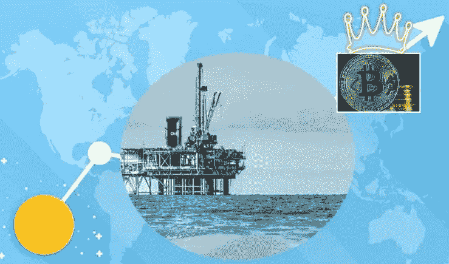

# 比特币是推动经济发展的数字石油

> 原文：<https://medium.com/coinmonks/bitcoin-is-digital-oil-that-will-fuel-the-economy-980567ff0f77?source=collection_archive---------31----------------------->

我认为我从未对比特币的低价感到如此兴奋。我只希望这种情况能再持续几个月，同时我还能(对我来说)进行一些大动作，并在这些价格下买入更多比特币。在我看来，数字石油将在未来十年或更长时间内推动我们的经济增长。

现在，这类似于在 2020 年 4 月购买桶石油，当时原油价格短暂下跌。不同之处在于，普通投资者不能像比特币和其他加密货币一样购买石油来储存。

今天，我们看到比特币和其他加密货币迈出了重要一步，参议员辛西娅·m·卢米斯(怀俄明州共和党人)和柯尔斯顿·吉利布兰德(纽约州民主党人)提出了一项法案，将它们视为下一代商品。如果获得通过，这将把控制权交给商品期货交易委员会(CFTC)而不是证券交易委员会(SEC)。当然，我们需要记住的是，正如学校的摇滚漫画所描述的，我[只是一个法案](https://www.youtube.com/watch?v=OgVKvqTItto)，要成为法律还有很长的路要走。然而，令人鼓舞的是，向前迈出了一大步，对话已经开始，可以就突出的细节开始讨价还价。

该法案的一些要点是:

*   该法案兑现了对 200 美元以下的交易不征税的承诺。免税或“微量”允许 BTC 持有者购买商品和服务
*   该法案将赋予  比特币持有者自行保管其比特币的权利。
*   该法案的一个关键部分是让矿工奖金在“处置”后征税。目前，开采出来的比特币在开采的那一刻就被当作收入征税。

在接下来的一年左右，将会充满创新和对话的热潮，乐观主义者希望这个法案能够对网络 3 加密经济产生更有利于增长的影响。自 2022 年初以来，科技公司已经解雇了 17，000 名高技能工人，这是一个好时机。我们需要他们，他们也需要工作，这一切都有利于我们经济的下一个增长轨迹和前进道路。当然，这条道路就是区块链和比特币，它们是为各种产品和服务提供燃料的数字石油，就像石油为我们今天使用但大多没有意识到的许多产品提供燃料一样。

因此，正如经常发生的那样，随着一个技术周期的衰退，下一个周期开始演变和加速。毫无疑问，Web3 将受到比特币等数字商品的推动。事实上，根据《哈佛评论》最近的一篇文章，Web3 有望像个人电脑和智能手机一样极大地改变在线体验。

作为一个在技术领域工作了 30 年的人，我从未见过这样一个机会，在这种对我们普通人来说如此容易和低门槛的新商品中拥有前所未有的优势。

目前，我们正处于我所称的区块链 1.0 结束的开端，事实上的赢家是比特币，它作为一种商品将继续升值，并将成为未来所有数字事物的最终结算层。Web3 区块链目前仍处于蛮荒的西部。

没有人确切地知道在 NFTs、Dao 和智能合约的技术标准方面，事情会如何发展。我们仍然处于早期阶段，现在为时不晚。最安全、最好的机会是在比特币等数字商品的价格开始与肯定会到来的需求相匹配之前，增加我们在这些商品中的股份，就像我们在加油站看到的那样。

祝一切顺利，

吉姆·福克斯

> 加入 Coinmonks [电报集团](https://t.me/joinchat/Trz8jaxd6xEsBI4p)，了解加密交易和投资