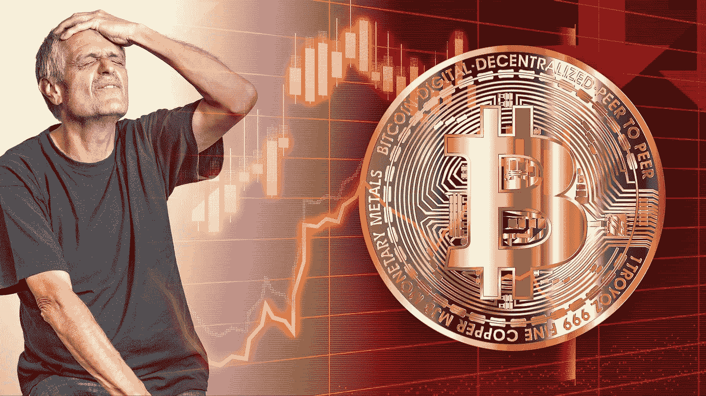

# 比特币是全球自由——它能经受住人类的恐惧吗？

> 原文：<https://medium.com/coinmonks/bitcoin-is-global-freedom-will-it-survive-human-fear-a3a0b10d909a?source=collection_archive---------50----------------------->

我们都在寻求以我们认为合适的方式生活的自由:思考的自由；旅行自由；管理我们自己的自由；最后，存在的自由。我们可以将所有这些对自由的渴望归结为一个单一的现代元素:金钱

Image Courtesy of [Methodshop](https://pixabay.com/users/methodshop-1460919/?utm_source=link-attribution&utm_medium=referral&utm_campaign=image&utm_content=7188262) (Pixabay)

没有经济资源来保障我们的生命能量，我们就不能自由地生活，更不用说表达我们的目的了。钱是最重要的…