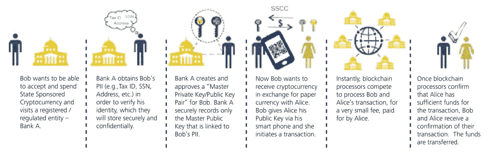

# 德勤:比特币是帮助政府降低中央银行成本的好地方

> 原文：<https://medium.com/coinmonks/bitcoin-is-in-a-good-place-to-help-governments-make-cbdcs-cheaper-deloitte-323b6a112370?source=collection_archive---------84----------------------->

**Visit our website:-** [**https://bitcoinsupports.com/**](https://bitcoinsupports.com/)

德勤的调查表明，比特币可能会在速度、安全性、效率和跨境支付方面显著改善传统法定货币的表现。根据金融服务巨头德勤(Deloitte)的一份新报告，比特币(BTC)有潜力成为电子法定货币或中央银行数字货币(CBDC)更实惠、更快、更安全的环境的基础。

然而，该分析确定了比特币可能显著改善传统法定货币的五个关键领域——速度、安全、效率、跨境支付以及与其他支付合作伙伴的合作——如下:

**“如果能够做到这一点，而不依赖于日常运营的中央实体，无论是商业还是联邦，效果可能真的会发生变革。”**

**Visit our website:-** [**https://bitcoinsupports.com/**](https://bitcoinsupports.com/)

德勤的分析强调了 BTC 和国家发行的中央银行之间的区别，同时重申了法定货币的主要通胀特征之一，指出中央银行对账上包含的金额没有限制，中央政府可以定义 CBDC 的价值。根据该报告，首先在全国范围内实施 CBDC 的国家将在影响其本币在国际市场和交易中的使用方面获得早期优势。

德勤(Deloitte)预计加密交易所将保留其现有的服务商角色，在跨多种货币交易时，将“用户的加密货币转换为纸币，并收取交易费。“在这种情况下，银行将作为分布式账本的保管人，与其他矿商竞争处理交易并获得回报。

最后，报告指出，虽然 CBDCs 不会完全取代比特币和其他加密货币，但它们的主流化将为用户提供另一种选择，以选择最合适的支付方式，结论是:

**“有可能产生大量新的机会，最终将改变当前的支付系统，使其更快、更安全、运营成本更低。"**

虽然其他政府也加入了建立内部 CBDCs 的竞赛，但普遍采用是确保其成功的一个关键方面。

牙买加总理安德鲁·霍尔尼斯宣布，作为该计划的一部分，首批 10 万名使用该国 CBDC Jam-Dex 的公民将获得 16 美元的免费付款，以促进更广泛的采用。

[https://twitter.com/jlpjamaica/status/1501311286822547457](https://twitter.com/jlpjamaica/status/1501311286822547457)

大约 17%的牙买加人口没有银行账户，牙买加政府打算利用 CBDC 来鼓励中低收入居民加入国家银行体系。

**访问我们的网站:-**[**https://bitcoinsupports.com/**](https://bitcoinsupports.com/)

**免责声明:以上为作者观点，不应视为投资建议。读者应该自己做研究。**

> 加入 Coinmonks [电报频道](https://t.me/coincodecap)和 [Youtube 频道](https://www.youtube.com/c/coinmonks/videos)了解加密交易和投资

# 另外，阅读

*   [rypto 交易信号为 Huobi](https://coincodecap.com/huobi-crypto-trading-signals) | [HitBTC 审核](/coinmonks/hitbtc-review-c5143c5d53c2)
*   [如何在 FTX 交易所交易期货](https://coincodecap.com/ftx-futures-trading) | [OKEx vs 币安](https://coincodecap.com/okex-vs-binance)
*   [OKEx vs KuCoin](https://coincodecap.com/okex-kucoin) | [摄氏替代品](https://coincodecap.com/celsius-alternatives) | [如何购买 VeChain](https://coincodecap.com/buy-vechain)
*   [ProfitFarmers 点评](https://coincodecap.com/profitfarmers-review) | [如何使用 Cornix Trading Bot](https://coincodecap.com/cornix-trading-bot)
*   [如何匿名购买比特币](https://coincodecap.com/buy-bitcoin-anonymously) | [比特币现金钱包](https://coincodecap.com/bitcoin-cash-wallets)