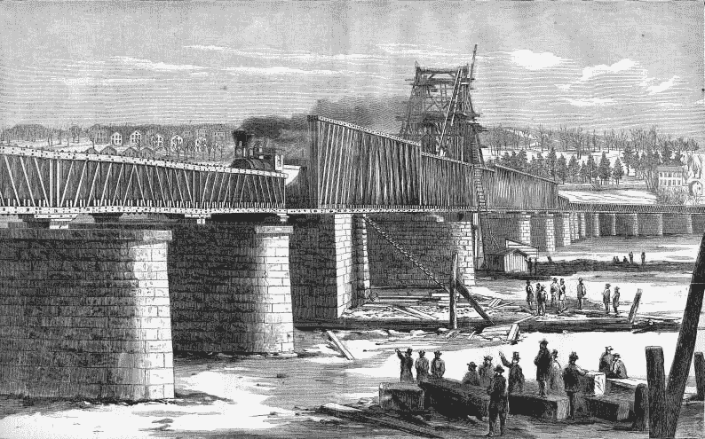
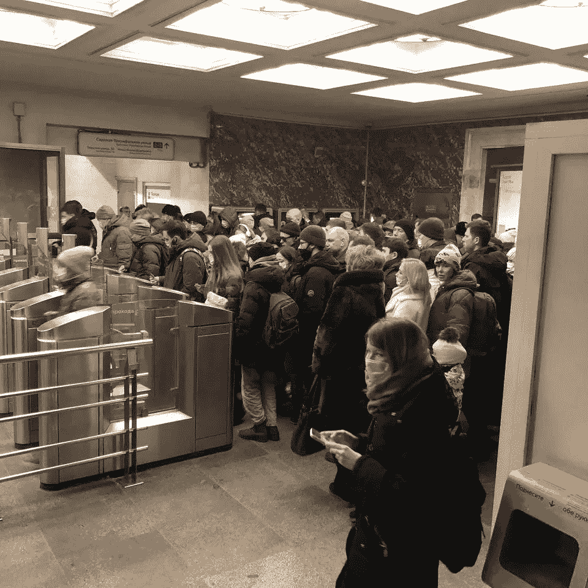
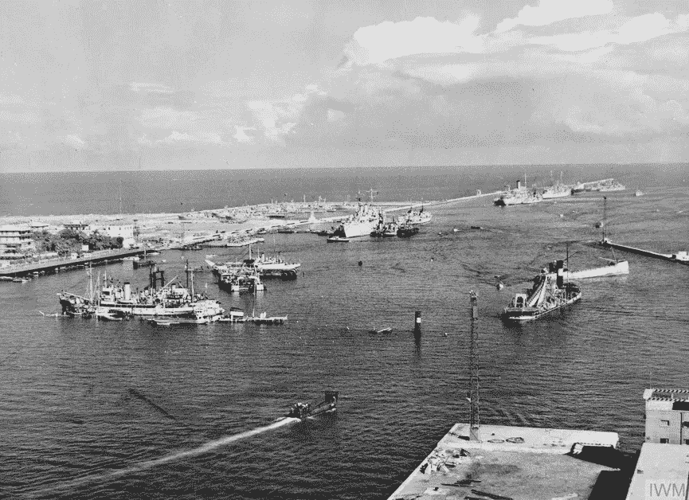

# 比特币是对抗制裁的保险

> 原文：<https://medium.com/coinmonks/bitcoin-is-insurance-against-sanctions-868cc30b2cdf?source=collection_archive---------61----------------------->

“最大的错误之一是根据意图而不是结果来判断政策和计划。”
*弗里德曼*

在第一次世界大战爆发时，由于大英帝国的统治，英国拥有最先进的海底电报电缆系统，覆盖了整个世界。1914 年 8 月 5 日，也就是英国对德国宣战的第二天，一艘名为“警报”的英国船只从多佛港起航，其任务是通过破坏德国的海底电缆来切断德国与世界的所有联系。任务圆满完成。

8 月 4 日，也就是警报发布的前一天，一名男子被部署到康沃尔郡波斯科诺的电缆站，承载大西洋交通的电缆在这个海滩上岸。这个人的头衔是“审查官”，从香港到马耳他再到新加坡，这个帝国部署了无数其他的审查官。一旦审查者就位，一个被称为**“审查”**的世界性通讯拦截系统就诞生了。它的主要目的是防止敌人及其代理人之间的战略情报交流。换句话说，目标已经从削弱德国人的通讯能力发展到收集情报。英国办公室的 180 个审查网络每天处理超过 50 000 条信息。通过利用其对国际电报基础设施的主导地位，英国人创建了第一个全球通信监控系统，该系统从开普敦延伸到开罗，从直布罗陀延伸到桑给巴尔。这成为导致德国人失败的瓶颈之一。

在当今世界，审查的做法已经从仅仅阻碍或拦截通信发展到一种更危险的形式，即切断一个人的经济命脉并阻碍其自由交易的能力，这种做法被称为金融审查。这可以针对个人、组织甚至整个国家。后一种情况是通常所说的制裁的一种形式。制裁被国际社会(主要是美国和联合国)视为强制遵守特定政治要求和保护国家安全利益的重要工具。

它们也是军事冲突的可接受的替代方案，因为它们是在没有地面部队的情况下进行力量投射的途径，因此应被视为经济战的武器。坦率地说，经济制裁是一种战争行为。经济制裁的目标是使被制裁国家的平民贫困和患病，目的是通过避免内乱迫使被制裁国家的政府顺从。不幸的是，这种情况很少发生，因此，承受制裁冲击的是普通公民，而不是目标政客。

例如，当美国在 2018 年对伊朗实施制裁[时，大量在英国留学的伊朗学生发现自己无力支付学费。这不是因为他们缺乏这样做的金融手段，而是因为伊朗被暂停了环球银行间金融电信协会(SWIFT)的会员资格，导致伊朗停止支付现金。由于学生签证被吊销以及无法完成学业的威胁悬在头顶，许多伊朗学生转向比特币作为支付学费的工具。这一举动显然招致了美国官员的大量批评，但归根结底，所有因制裁而受到伤害的人都要对伊朗政府推行的“敌对政策”直接负责吗？如果没有，他们该怎么办？你会怎么做？受制裁政权的政治阶层和富裕支持者通常持有资产而非现金，因此工薪阶层和养老金领取者最终总是成为制裁的受害者。](https://bitcoinmagazine.com/technical/unbanked-iranian-university-students-turn-bitcoin-pay-tuition)

20 世纪 90 年代初伊拉克入侵科威特失败后，联合国对伊拉克实施了当时被称为“现代最严厉的制裁”。萨达姆和他的核心集团基本上没有受到制裁的影响，但普通伊拉克人付出了沉重的代价。在 1996 年 5 月播出的一次 60 分钟的采访中，*记者莱斯利·斯塔尔向时任联合国大使的前国务卿马德琳·奥尔布赖特提出了以下问题:“我们听说有 50 万儿童死亡。我是说，这比死在广岛的孩子还多。而且——而且，你知道，这个价格值得吗？”对此，她回答道，“我认为这是一个非常艰难的选择，但是这个价格——我们认为这个价格是值得的。”她后来收回了声明，称这是一个“愚蠢的声明”,但制裁仍在继续，普通伊拉克人的生活变得极其糟糕。*

今天，世界上有 23 亿多人生活在被制裁的国家，关于制裁是否合理的辩论将持续多年。在这篇文章中，我们将探讨经济制裁形式的金融审查对普通公民生活的影响，以及比特币如何成为受制裁国家人民的潜在生命线。

***“谁控制了任何国家的货币量，谁就是一切工商业的绝对主宰。”***

詹姆斯·a·加菲尔德

科尼利尔斯·范德比尔特(又名“准将”)是一个残酷的商人，在美国内战(1861-1865)前，他在航运业积累了大量财富。在意识到铁路是下一个巨大的商机后，他把目光投向了建立一条横贯大陆的铁路，这条铁路将会把东西海岸的旅行时间缩短数月。到战争结束时，他的铁路帝国已经是行业中的主导者，价值相当于今天的 800 亿美元。尽管他作为“铁路之王”占据主导地位，但这并没有阻止他的一些竞争对手挑战甚至嘲弄他，声称他现在软弱无力。

范德比尔特当时拥有唯一一座连接纽约市的铁路桥(哈德逊河桥)，纽约市拥有最繁忙的港口，他的回应是切断竞争对手使用这座桥的交通。由于无法进入大桥，每一条与之竞争的铁路都被封锁在纽约之外，独自一人在这个国家最繁忙的港口和这个国家的其他地方之间制造了一道封锁。由于封锁，像纽约中央铁路公司这样的竞争对手的股票价格开始下跌，加上收入的损失，他们中的大多数都破产了。这位准将利用这一点，购买了竞争对手铁路公司的所有股份，直到他最终拥有了美国铁路公司 40%的股份，在短短几天内，他创建了美国最大的铁路公司。

Hudson River Bridge

就像范德比尔特一样，西方控制了我们今天所拥有的传统金融体系的大部分金融轨道；像范德比尔特一样，他们能够对他们认为与其利益对立的国家实施“金融封锁”。经济制裁是由主要由美国和欧盟控制的法定货币体系的金融基础设施的中央集权性质决定的。他们的经济工具之一是 SWIFT 网络。SWIFT 是一个国际银行报文传送系统，自 20 世纪 70 年代开始运营，每天在全球范围内传输近[5 万亿美元](https://www.fincen.gov/sites/default/files/shared/Appendix_D.pdf)。该系统使金融机构能够在安全、标准化的环境中发送和接收有关金融交易的信息。

由于美元是全球储备货币，SWIFT 为国际美元体系提供了便利。尽管 SWIFT 的总部设在比利时，但美元的主导地位让美国对其他国家拥有很大的影响力。由于这种主导地位，美国能够使用 SWIFT 作为对付民族国家的金融武器，如俄国和伊朗，它们违反了[“基于规则的秩序”](https://en.wikipedia.org/wiki/Liberal_international_order)从 SWIFT 中取消一个国家的平台或移除该国家基本上是在经济上切断其与世界其他地区的贸易。

与此形成鲜明对比的是，比特币是一种完全去中心化的数字货币和点对点支付系统，不受任何民族国家的控制。根据美国财政部的一份名为“财政部 2021 年制裁审查 ”的报告，在 2001 年至 2021 年期间，美国财政部实施的制裁数量增加了惊人的 [**933%！在一个美元日益武器化、金融基础设施集中化的世界里，国家采用比特币事关国家安全。**](https://www.jdsupra.com/legalnews/no-surprises-but-fascinating-statistics-7929959/) Balaji Srinivasan 在他题为[“为什么印度应该购买比特币”的文章中说:](https://balajis.com/why-india-should-buy-bitcoin/)

> “正是这种属性(指比特币的去中心化)使得比特币对于维护印度国家安全如此珍贵。一个不能被任何国家关闭的网络是印度及其侨民在冲突时可以依靠的网络。出于同样的原因，德国最近从美国遣返了 3378 吨黄金 ，印度应该优先考虑国家对数字黄金的支持，将其作为在 2008 年金融危机或 2020 年 COVID 崩溃等情况下的最后手段……还要记住，印度有着数千年之久的*[*恋情*](https://www.bbc.com/news/business-29720925) [*与*](https://www.moneycontrol.com/news/business/personal-finance/-1830717.html) [*黄金从未对印度构成威胁；黄金一直是印度的资产。和比特币有价值的原因是一样的*](https://www.economist.com/the-economist-explains/2013/11/20/why-do-indians-love-gold) *[*黄金有价值*](https://finance.yahoo.com/news/millennials-twice-likely-buy-bitcoin-221520470.html) 。这是一种国际公认的价值储存手段，非常稀缺，而且是一种所谓的 [*无记名票据*](https://hackernoon.com/cryptocurrencies-future-bearer-instruments-of-choice-31494e34257e) 一键就无法查封。”**

*我还想补充一点，在国家层面采用比特币是防止脱离 SWIFT 等金融支付轨道的屏障。制裁会产生下游连锁反应，对与特定国家、行业或公司相关的所有人产生负面影响。比特币对审查的抵制保护了被制裁国家的公民免受制裁的严重影响，也保护了整个国家的经济免受不合理的攻击。通过利用比特币的分散性和对审查的抵制，生活在受制裁国家的人们能够使用比特币代替美元进行贸易，并成为 SWIFT 的替代支付渠道。*

*2 月下旬，欧盟与美国、澳大利亚、加拿大和日本[同意断开](https://www.bloomberg.com/news/articles/2022-02-26/u-s-weighs-sanctions-on-russia-s-central-bank-over-ukraine?srnd=premium&sref=PqmVp1JY)一些俄罗斯银行与 SWIFT 网络的连接，这是限制性措施的一部分，旨在防止俄罗斯央行规避因其在乌克兰的“军事行动”而对俄罗斯实施的制裁。这一行动之后，Visa、PayPal、MasterCard、MoneyGram、Western Union、Google Pay 和 Apple Pay 等公司暂停了对俄罗斯的服务。国际清算银行不甘示弱，也暂停了俄罗斯的网络。随着 T2 实施货币管制，人们争相提取尽可能多的现金，自动取款机前排起长队变得很常见。卢布暴跌，迄今对美元贬值 40%。*

**

**Apple Pay & Google Pay no longer work on Moscow’s metro system, leading to long queues as people fumble for cash**

*为了向俄罗斯施加更多压力，迫使其停止“军事行动”，西方大国阻止俄罗斯央行动用其位于西方的外汇储备。截至 2 月 18 日，[俄罗斯央行在纽约和伦敦等城市持有的储备价值 6400 亿美元。这一史无前例的举措的影响比 SWIFT 的退出要大得多。不仅持有外汇储备的整个前提被取消，而且这一行动还证明，一个主权国家的外汇储备可以随时被没收。以前被认为是安全和无风险的资产不再是无风险的，因为不存在的信贷风险被实实在在的没收风险所取代。当你需要它们的时候，你却不能得到它们，这有什么好处呢？](https://www.washingtonpost.com/business/2022/02/26/russia-central-bank-white-house/)*

*引用《华尔街日报》最近一篇文章中的一句话，“*除了黄金，这些资产(即外汇储备)是别人的负债——那些可以断定它们一文不值的人……如果货币余额变成了毫无价值的电脑记录，不能保证购买必需品，莫斯科将理智地停止积累它们，将实物财富储存在石油桶里，而不是卖给西方。”*此外，这一举措可能会给俄罗斯经济带来进一步的金融痛苦，从违约到银行挤兑，以及卢布的进一步下跌都是迫在眉睫的可能性。*

*俄罗斯的金融审查在今天看来可能是合理的，但我们有什么保证金融体系的武器化在未来不会被滥用？过去几周在加拿大发生的事件就是一个很好的例子。每个不想遭受“拒绝服务攻击”的国家都需要在国库中持有比特币，以此作为国家安全问题。这也包括没有受到制裁的国家，因为它们仍然需要在一个两极分化的世界中分散和限制自己的地缘政治风险。对于公民个人来说也是如此，因为当经济战争在他们的国家爆发时，他们是附带损害。正如我们在过去几周看到的卢布崩溃，当一种货币崩溃时，以该货币计价的金融资产和房地产的价值也会暴跌。为了以防万一，有一个比特币“保险基金”是谨慎的。*

****“谁控制了粮食供应就控制了人民；谁控制了能源，谁就能控制整个大陆；谁控制了货币，谁就能控制世界。”****

*亨利·基辛格*

*1956 年 7 月，在冷战最激烈的时候，苏伊士运河危机爆发了，当时埃及领导人贾迈勒·纳赛尔(Gamal Nasser)决定将运河国有化，该运河当时由一家英法合资公司所有。在这一事件之前，环球苏伊士运河公司(La Compagnie Universelle du Canal Maritime de Suez)已经经营了将近一个世纪。在以色列人的帮助下，英国人和法国人入侵埃及，试图推翻纳赛尔并重新控制运河。在联合国和美国下令立即结束入侵后，这随后变成了一场令英国蒙羞的政治灾难。*

**

**The entrance to the Suez Canal at Port Said with the blockships sunk by the Egyptians.**

*不仅英国受到制裁威胁，美国总统艾森豪威尔更进一步，说服国际货币基金组织拒绝给予英国任何形式的金融支持。结果，英国经济陷入混乱，当他们试图稳定市场时，数千万英镑的储备被耗尽。[英国央行的官方储备骤降至 20 亿美元以下，这一储备自 20 世纪 40 年代就已到位，英镑贬值迫在眉睫。英国的石油和燃料供应受到限制，导致短缺，1956 年开始实行汽油配给制，一直持续到 1957 年 5 月。面对巨大的国内和国际压力，英国首相安东尼·艾登从埃及撤出了英国军队，并最终在 1957 年 1 月辞职，在他成为首相不到两年之后。这一事件标志着大英帝国灭亡的开始。](https://www.imf.org/external/pubs/ft/fandd/2001/09/boughton.htm)*

*从外交政策的角度来看，这一事件可以被视为一次胜利，因为一旦制裁被提上议程，英国和法国随后从埃及撤出。不应该忽视的一件事是，美国如何利用其对国际货币基金组织的影响力拒绝英国的金融援助。我们的目的不是关注这一决定的道德性，而是讨论中央集权的金融体系所带来的风险。就像 SWIFT 一样，IMF 名义上是一个政治中立的组织，但由于美元享有的全球储备地位，美国对其有相当大的影响力。*

*最近的一个例子发生在去年塔利班接管阿富汗之后。美国指示国际货币基金组织冻结阿富汗 4.6 亿美元的特别提款权，并扣押了这个中亚国家在纽约价值 90 亿美元的外汇储备。随着西联汇款和速汇金等公司暂停在该国的业务，T4 世界银行也紧随其后，冻结了经济援助。值得注意的是，这些措施是针对地球上最贫穷的国家之一实施的，这个国家依赖援助，72%的公民生活在贫困中。这些措施导致了现金短缺、高通胀和当地货币价值的大幅下跌。*

*由于被排除在全球金融体系之外，阿富汗人现在转向比特币，将其作为一种保值的手段，并拥有一种便携式资产，在需要时可以逃离该国。一个展示拥有可转移资产重要性的历史例子是，由于严格的资本管制，逃离分崩离析的苏联的人最多只能购买 100 美元。*

*在 chain analysis 2021 年全球比特币采用指数排名中，阿富汗的比特币采用率飙升，在 154 个国家中排名第 20 位。该指数主要突出了普通人采用加密货币最多的国家，并专注于与交易和个人储蓄有关的用例，而不是交易和投机。根据同一份报告，阿富汗的点对点交易量在全球排名第七，这是在互联网连接不可靠、经常断电和现金短缺的背景下发生的。尽管对阿富汗实施了严厉的制裁，但普通人现在可以以比特币的形式自行保管自己的财富，而不需要依赖第三方，比如从属于政府的银行。*

*如果一个国家的财政命运被另一个国家所控制，那么这个国家就不可能拥有真正的主权。无论是通过 SWIFT、IMF 还是通过 PayPal 和 Western Union 等私营公司，从当前以美元为基础的法定货币体系中退出的风险每天都在增加，对民族国家和个人都是如此。虽然 IMF 或 SWIFT 不是直接与公众打交道的机构，但它们对一个国家的金融福祉有着巨大的影响。在决定收购哪些资产时，需要进行大量的考虑，以维护个人主权，并在面临攻击时捍卫自己的交易自由。比特币是目前唯一可以在个人层面和国家层面抵御金融审查的金融资产。*

*如果俄罗斯和阿富汗央行的储备是比特币，那么没有哪个国家有能力任意冻结或扣押它们。*

*另一方面，这两个事件可能是美元的滑铁卢，并可能导致寻求降低受美国控制脆弱性的国家迅速去美元化。例如，沙特阿拉伯，美国最亲密的盟友之一，现在正考虑用人民币为他们出口到中国的部分石油定价，这一举动将严重威胁到自 1974 年以来就存在的石油美元体系。尽管美元对人民币的汇率战是否会在这一发展的背景下展开还有待观察，但一个新的货币秩序正在形成是显而易见的。*

*比特币的审查阻力为个人和国家提供了一个可行的选择，以在一个高度极化和取消文化驱动的世界中承受金融去平台化并维护主权和中立。*

> *加入 Coinmonks [电报频道](https://t.me/coincodecap)和 [Youtube 频道](https://www.youtube.com/c/coinmonks/videos)了解加密交易和投资*

# *另外，阅读*

*   *最佳[密码交易机器人](https://coincodecap.com/best-crypto-trading-bots) | [购买索拉纳](https://coincodecap.com/buy-solana) | [矩阵导出评论](https://coincodecap.com/matrixport-review)*
*   *[Coldcard 评论](https://coincodecap.com/coldcard-review) | [BOXtradEX 评论](https://coincodecap.com/boxtradex-review)|[uni swap 指南](https://coincodecap.com/uniswap)*
*   *[比特币基地评论](/coinmonks/coinbase-review-6ef4e0f56064) | [德里比特评论](/coinmonks/deribit-review-options-fees-apis-and-testnet-2ca16c4bbdb2) | [FTX 评论](/coinmonks/ftx-crypto-exchange-review-53664ac1198f)*
*   *[n ave 零点回顾](/coinmonks/ngrave-zero-review-c465cf8307fc) | [Phemex 回顾](/coinmonks/phemex-review-4cfba0b49e28) | [PrimeXBT 回顾](/coinmonks/primexbt-review-88e0815be858)*
*   *最佳[区块链分析](https://bitquery.io/blog/best-blockchain-analysis-tools-and-software)工具| [赚比特币](/coinmonks/earn-bitcoin-6e8bd3c592d9)*
*   *[Cloudbet 赌场评论](https://coincodecap.com/cloudbet-casino-review) | [点火赌场评论](https://coincodecap.com/ignition-casino-review)*