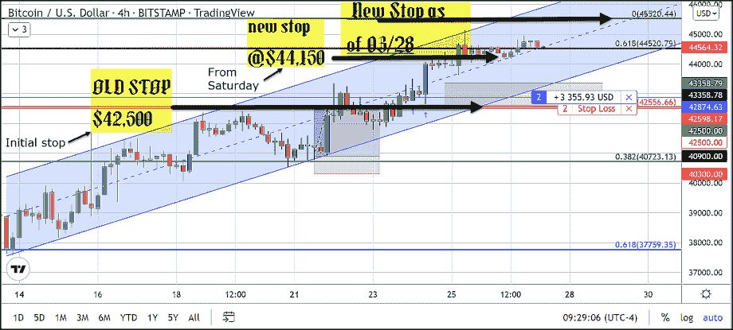
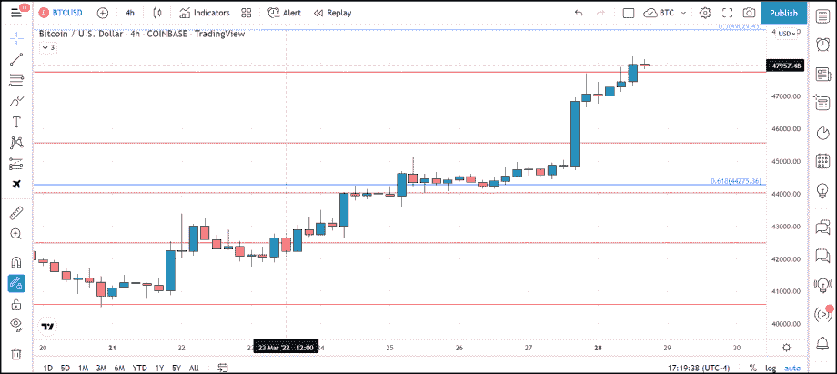
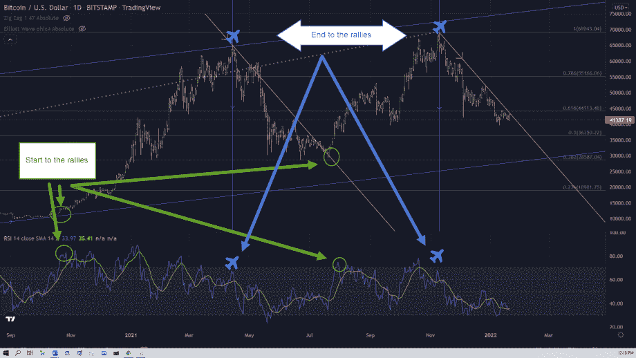
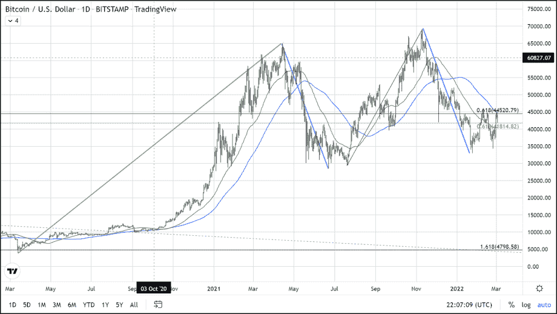
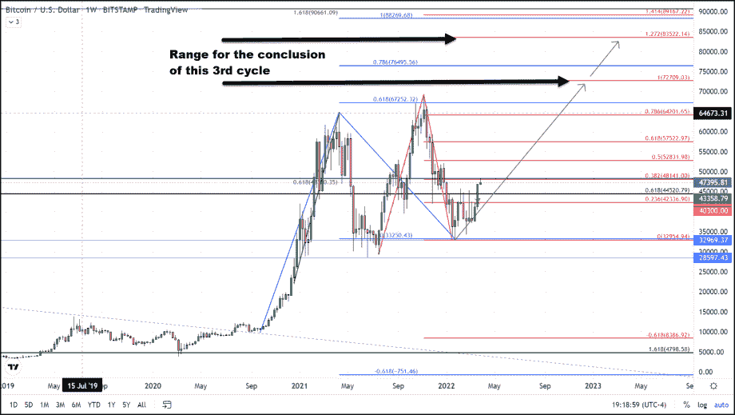

# 比特币正在走向竞赛

> 原文：<https://medium.com/coinmonks/bitcoin-is-off-to-the-races-204691d472ad?source=collection_archive---------100----------------------->

以上是周六止损位加注的图表。

然而，我推荐的策略是最好的选择，我将在我的跟踪记录中使用的策略是将保护性止损提高到 44，500 美元并保持做多，当当前的市场条件发生变化时，我们将跟进进一步的指示。

这种季节性上涨、下跌和底部的形成将我们带到了 6 万美元以上的历史高点，并创造了更高的高点，在修正后也创造了更高的低点。正如我在今年 1 月 20 日发表的一篇名为 ***“比特币的双顶”的文章中所说，下面是一段摘录。***

如果这种模式继续下去，那将意味着我们将会看到另一个从早春开始的大反弹。在所有条件相同的情况下，比特币价格的这种对称演变可能是阻力最小的路径，正如他们所说，事情通常是三件一件来的。-

*最初发表于*[*https://thegoldforecast.com*](https://thegoldforecast.com/crypto/2022/bitcoin-races)*。*

> 加入 Coinmonks [电报频道](https://t.me/coincodecap)和 [Youtube 频道](https://www.youtube.com/c/coinmonks/videos)了解加密交易和投资

# 另外，阅读

*   [有哪些交易信号？](https://coincodecap.com/trading-signal) | [Bitstamp vs 比特币基地](https://coincodecap.com/bitstamp-coinbase) | [买索拉纳](https://coincodecap.com/buy-solana)
*   [ProfitFarmers 回顾](https://coincodecap.com/profitfarmers-review) | [如何使用 Cornix Trading Bot](https://coincodecap.com/cornix-trading-bot)
*   [十大最佳加密货币博客](https://coincodecap.com/best-cryptocurrency-blogs) | [YouHodler 评论](https://coincodecap.com/youhodler-review)
*   [my constant Review](https://coincodecap.com/myconstant-review)|[8 款最佳摇摆交易机器人](https://coincodecap.com/best-swing-trading-bots)
*   [MXC 交易所评论](/coinmonks/mxc-exchange-review-3af0ec1cba8c) | [皮奥尼索斯对币安](https://coincodecap.com/pionex-vs-binance) | [皮奥尼索斯套利机器人](https://coincodecap.com/pionex-arbitrage-bot)