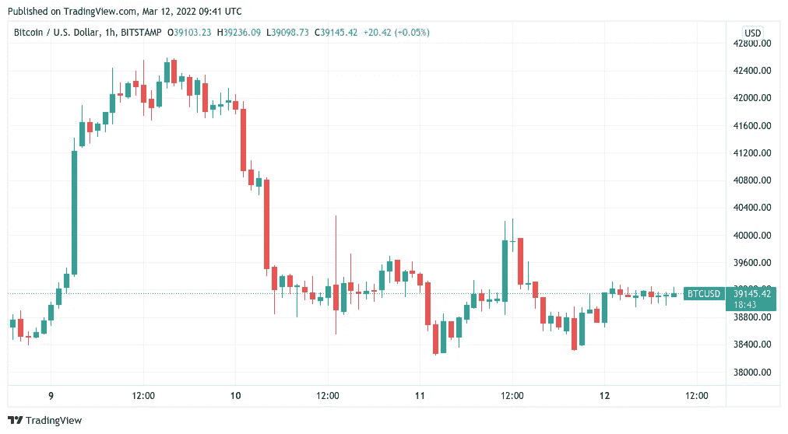
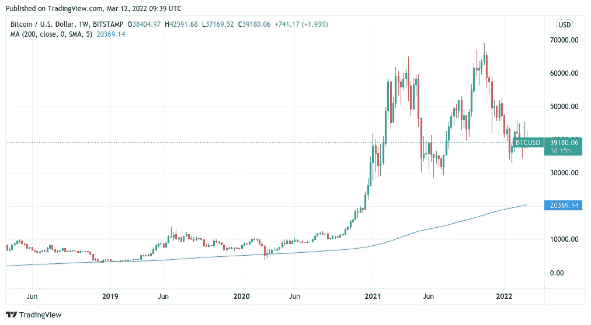
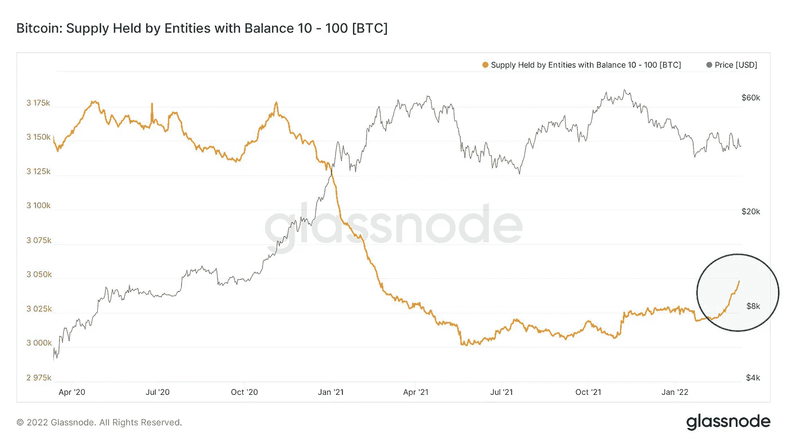

# 比特币正在威胁 38000 美元，3 天图表指向 2020 年 3 月。Covid 的崩溃再次发生

> 原文：<https://medium.com/coinmonks/bitcoin-is-threatening-38-000-with-the-3-day-chart-pointing-to-march-2020-e0c56df1b586?source=collection_archive---------47----------------------->

**Visit our website:-** [**https://bitcoinsupports.com/**](https://bitcoinsupports.com/)

由于一些大买家和小买家选择在当前价格下大举买入 BTC，比特币价格走势的末日场景仍是焦点。一夜之间，比特币(BTC)触及 38000 美元，交易员们忧心忡忡地开始了周末。

**Visit our website:-** [**https://bitcoinsupports.com/**](https://bitcoinsupports.com/)

**三日图可以作为周线图**

的“前兆”根据 TradingView 的数据，在多次试图突破 38，000 美元的支撑后，BTC/美元正在 39，000 美元附近徘徊。由于地缘政治事件，该货币对在周五也曾短暂飙升至 40，000 美元上方，但这只持续了几分钟，之后就回到了之前的状态。本月，这种“造假”达到更高水平——最终比特币转了一整圈，平仓了空头和多头头寸——已经很常见。另一方面，较低时期开始显示出更严重衰退的迹象。

当天，分析资源 Material Indicators 警告 Twitter 关注者称，“自 Covid 崩溃以来，3 日 BTC 蜡烛线首次与 200 MA 线调情。”

**“如果这是周线蜡烛将要完成的事情的预演，确保你有足够的能量来利用接下来的买入机会。”这种反弹有可能改变你的生活。"**

200 周移动平均线现在略高于 20000 美元，并且还在不断上升，在比特币的整个历史中，它一直是比特币的历史底部区域，从未被突破。

**Visit our website:-** [**https://bitcoinsupports.com/**](https://bitcoinsupports.com/)

要实现这一目标，就必须从当前现货价格下跌 50%，从历史高点下跌 70%，这两个价格都是 BTC/美元此前达到的。

例如，在今年晚些时候迎来一个新的价格范式之前，Covid 崩盘在几天内下跌了 60%。

本周，比特币仍受股票市场的摆布，标准普尔 500 指数和纳斯达克指数分别下跌至 2.9%和 3.5%的周跌幅。

此前，知名交易员 Pentoshi 曾明确宣称，他认为今年可能会发生华尔街崩盘式的事件。

**【BTC】各种规模的押注继续涌入**

有利的一面是，长期投资者可以为巨量买入和小投资者钱包的增长而欢欣鼓舞。周五，3 万枚比特币从比特币基地转移，而外汇储备降至去年 7 月和 9 月的水平，就在比特币价格大幅上涨之前。

[https://twitter.com/whale_map/status/1502358053848498195](https://twitter.com/whale_map/status/1502358053848498195)

“装有 10 到 100 个比特币的钱包正在疯狂堆积，它们的供应量正在飙升，”一位用户说。莫斯科维奇资本公司的首席执行官莱克斯·莫斯科维奇，

[https://twitter.com/mskvsk/status/1502451508150890496](https://twitter.com/mskvsk/status/1502451508150890496)

根据一张图表，目前由实体控制的 BTC 供应量的比例——一个或多个钱包被认为拥有相同的所有者——已经达到了一年来的最高水平。

**访问我们的网站:-**[**https://bitcoinsupports.com/**](https://bitcoinsupports.com/)

**免责声明:以上为作者观点，不应视为投资建议。读者应该自己做研究。**