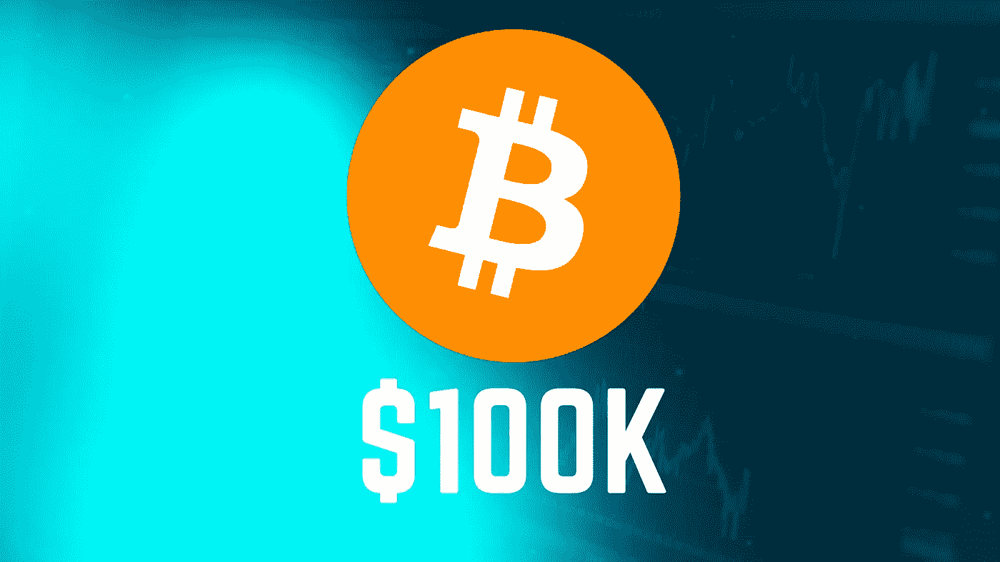
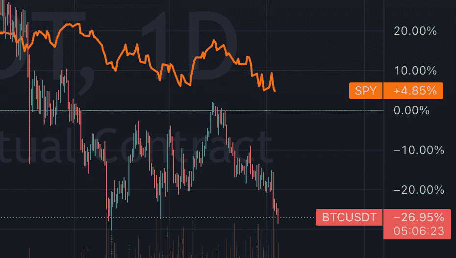

# 比特币今年不会涨到 10 万美元

> 原文：<https://medium.com/coinmonks/bitcoin-isnt-going-to-100k-this-year-4f4b9a2d18c1?source=collection_archive---------54----------------------->

2021 年，有很多人认为比特币会涨到 10 万美元。这最终没有发生，我认为今年也不会发生。这就是为什么首先为了让比特币涨到 10 万美元，必须有一个主要的积极催化剂。催化剂本质上是会导致比特币价格大幅上涨或下跌的东西。2021 年导致最初飙升至 6.9 万美元的催化剂是在美国开始交易的比特币期货 ETF，这也让人们相信比特币现货 ETF 将获得批准，但这并没有发生。如果现货 ETF 获得批准，那么我确实认为比特币会涨到 10 万美元。如果他们的现货 ETF 被 SEC 拒绝，他们可能会起诉([美国消费者新闻与商业频道](https://www.cnbc.com/2022/04/17/grayscale-ceo-matter-of-when-not-if-the-sec-allows-bitcoin-spot-etf.html))。尽管我确实认为 SEC 最终会批准现货 ETF，但这可能不会在今年发生。在这种情况下，比特币不可能涨到 10 万美元。

# 我认为比特币今年会走向何方？

我认为比特币的价格取决于股市。

上面是 BTCUSDT 的图表。橙色线是间谍，你可以看到比特币本质上只是跟随股市。因此，如果股市继续下跌，比特币很可能会进一步下跌。如果股市今年反弹，那么我相信比特币会回升，但不会涨到 10 万美元，而是更接近 6 万美元。

这就是为什么我不认为比特币今年会涨到 10 万美元。但是我希望我是错的。感谢阅读。

> 加入 Coinmonks [电报频道](https://t.me/coincodecap)和 [Youtube 频道](https://www.youtube.com/c/coinmonks/videos)了解加密交易和投资

# 另外，阅读

*   [什么是融资融券交易](https://coincodecap.com/margin-trading) | [成本平均法](https://coincodecap.com/dca)
*   [支持卡审核](https://coincodecap.com/uphold-card-review) | [信任钱包 vs 元掩码](https://coincodecap.com/trust-wallet-vs-metamask)
*   [Exness 回顾](https://coincodecap.com/exness-review)|[moon xbt Vs bit get Vs Bingbon](https://coincodecap.com/bingbon-vs-bitget-vs-moonxbt)
*   [如何开始通过加密贷款赚取被动收入](https://coincodecap.com/passive-income-crypto-lending)
*   [BigONE 交易所点评](/coinmonks/bigone-exchange-review-64705d85a1d4) | [电网交易 Bot](https://coincodecap.com/grid-trading)
*   [氹欞侊贸易评论](https://coincodecap.com/anny-trade-review) | [CoinSpot 评论](https://coincodecap.com/coinspot-review)