# 比特币第三层及其最新崛起

> 原文：<https://medium.com/coinmonks/bitcoin-layer-3-and-its-latest-rise-e80e64c32dd6?source=collection_archive---------2----------------------->

## 当你出去泡吧的时候，我正在学习比特币的发展

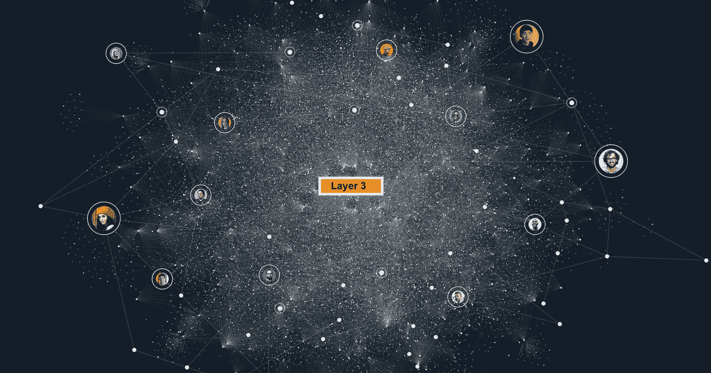

Source — Modified Image by Author from [Link](https://sphinx.chat/features/)

```
**Table of Content 
·** [**A brief note on the Bitcoin base layer**](#be5b) **·** [**Why does Bitcoin require Layer 2 and Layer 3 services?**](#bb11) **·** [**Lightning-enabled Layer 3's**](#b8e8) **1\. P2P Fully Encrypted Lightning Enabled Application — SPHINX
    2\. The real use of Interactive web accessibility — Metamask tale
    3\. Bitcoin in games-ZEBEDEE
    4\. Creating a New P2P Internet Standard — Impervious AI
·** [**Miscellaneous**](#592e)
```

# 比特币基础层的简要说明

比特币社区在推进对其基础层的修改方面一直很谨慎。对其核心协议进行修改需要数年时间。它们被彻底检查，以确保比特币的基本理想**去中心化、稳定性和安全性**不会被牺牲，以换取功能的增加，这可能导致其核心技术的缺陷。

例如

1.  [**【隔离见证】**](https://academy.binance.com/en/articles/a-beginners-guide-to-segretated-witness-segwit) 是一个广受争议的协议升级，修改了比特币交易数据的布局。2015 年提出，2017 年末实施。
2.  [**施诺尔签名**](https://courses.csail.mit.edu/6.857/2020/projects/4-Elbahrawy-Lovejoy-Ouyang-Perez.pdf) 于 2016 年提出，并于 2021 年底部署，改善了比特币的多重签名能力，以最小化其在比特币区块链上的数据足迹。
3.  迄今为止比特币最大的改进之一 [**Taproot**](https://decrypt.co/resources/what-is-taproot-proposed-bitcoin-upgrade) 计划于 2018 年 1 月推出，但直到四年多后的 2021 年 11 月才部署。因此，它是生态系统中最稳定的基础层。

我最近从 subreddit r/CryptoCurrency 上读到了这篇题为— [**我想我终于理解了比特币**](https://www.reddit.com/r/CryptoCurrency/comments/uo24yb/i_think_i_finally_understand_bitcoin/)**【Exerpt below】，**的帖子，我认为这篇帖子总结了为什么比特币的核心层经过了战斗考验，并且每 10 分钟运行一次，持续了近十年。

> “这是一个在后台运行的无声项目。它没有脸。创始人创造了它，然后走开了。这就像一个优雅的时钟开始运转，继续滴答作响。未来 3 年、5 年或 10 年不会出现复杂的协议。没有创始人的自我宣传，它也能做它现在应该做的事情。由于它不需要自我推销就能茁壮成长，因此它不会成为贪婪、魅力四射的领导者利用过于复杂的项目进行营销的恶习的牺牲品。当然，Saylor 和 Novogratz 有时会扮演这种角色。但比特币生存不需要它们，死了也不会需要它们。这个项目现在开始运作了。它会做它应该做的事情，并且会继续做它应该做的事情。
> 
> 没有魅力十足的权道穿着黑色 t 恤和白色背景拍福布斯和史蒂夫·乔布斯的照片。
> 
> BTC 清除了人类的腐败，因为创造它的人类离开了。当然，人们会围绕它建立腐败的系统，但 BTC 本身是一个简单、纯粹、优雅的载体，在背景中无声地滴答作响，直到滴答的声音变得如此之大，以至于没有人能忽视它。"

> 截至 2022 年 6 月 25 日，比特币跌停至今天数**3393 天**。自从它以平均每 10 分钟一个街区的速度连续生产以来，已经有将近 10 年的时间了

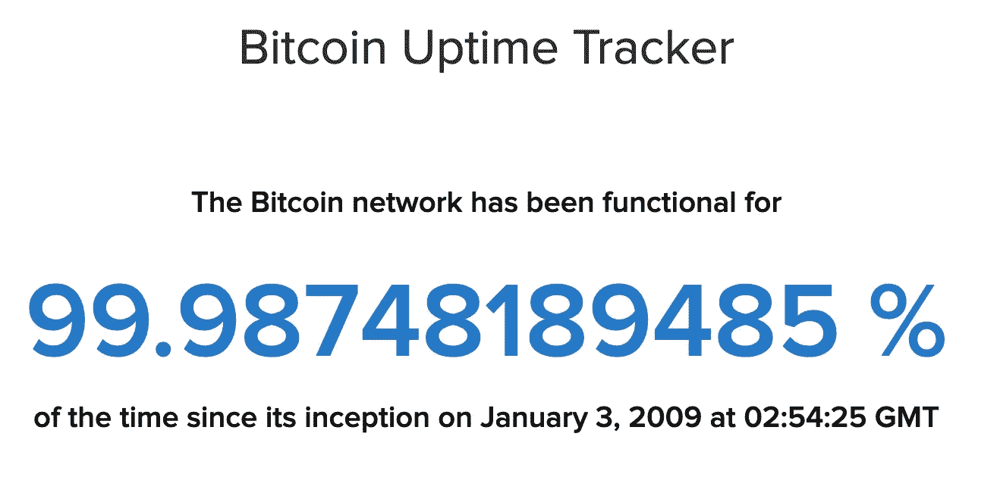

Source-[Bitcoin Uptime Tracker](https://www.buybitcoinworldwide.com/bitcoin-uptime/#:~:text=99.98%25%20%2D%20Bitcoin%20Uptime%20Tracker%20(Network%20Status%20Live))

比特币的可信度不仅限于改变其核心层的难度。这与众多以太坊侧链和替代的第 1 层网络形成了直接对比，如 [**Solana，它们一直受到攻击，并持续经历长时间的网络不可用。**](https://www.cnbc.com/2022/06/01/solana-suffered-its-second-outage-in-a-month-sending-price-plunging.html) 此外，与其他工作证明网络相比，**通过块重组攻击比特币区块链的成本相当高。**

> 下图描述了攻击各种 POW 区块链协议所需的哈希速率和开销

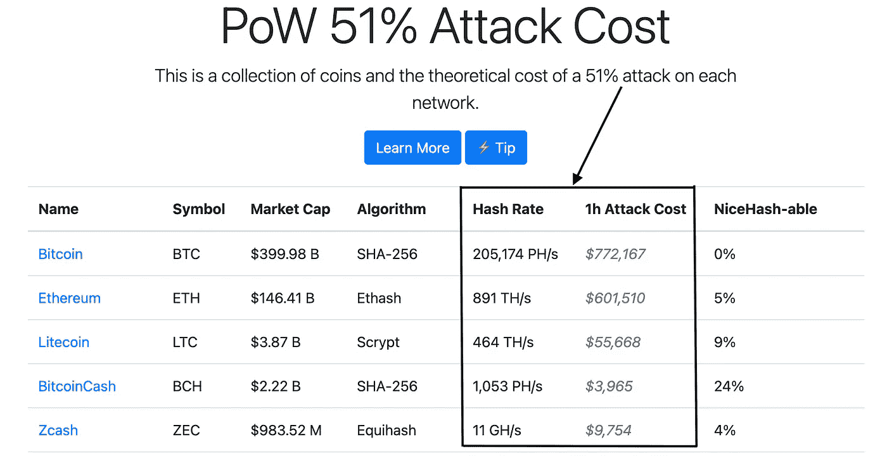

Source-[PoW 51% Attack Cost](https://www.crypto51.app/)

如果你已经关注加密世界有一段时间了，你肯定听说过**区块链三难困境(也称为可伸缩性三难困境)。**简单地说，目前的区块链只能达到三个品质中的两个:**去中心化、安全性和可伸缩性**，这是由于分布式账本技术的本质(DLT)。因此，DLT 倡议必须在一个方面做出妥协，才能在另外两个方面取得成功。

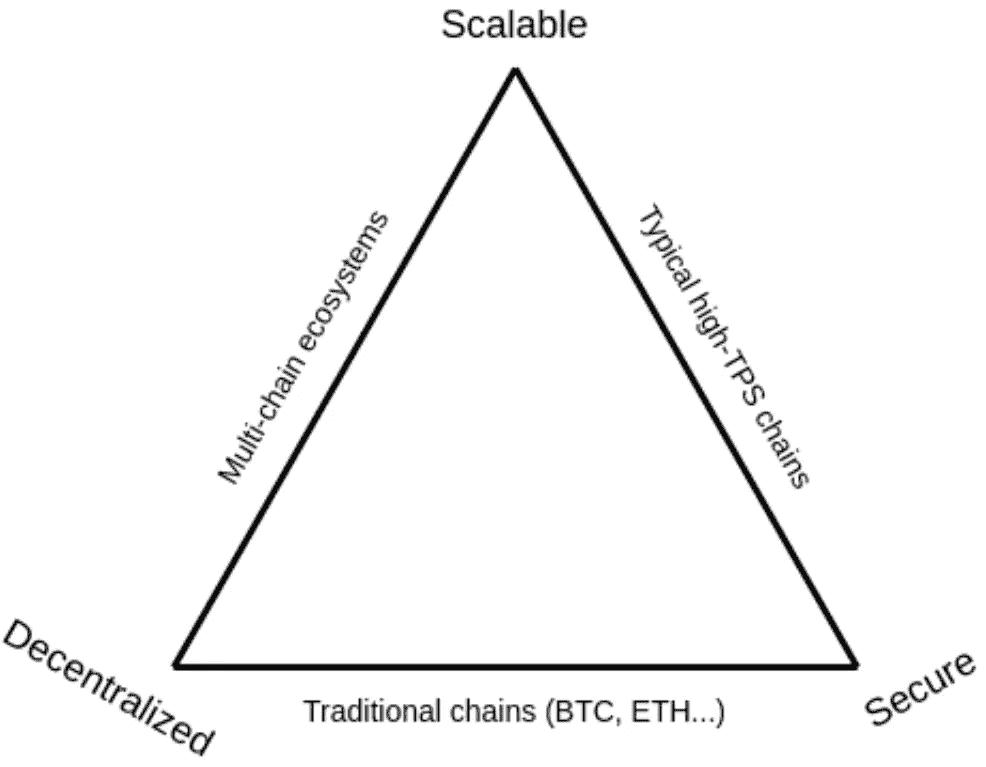

The Blockchain Trilemma — each side of the triangle can only achieve two properties. [Source](https://vitalik.ca/general/2021/04/07/sharding.html).

只有当区块链希望在主要层上拥有所有三个属性时，可扩展性三元悖论才会出现。虽然比特币无法在不牺牲部分安全性或 L1 去中心化的情况下实现高可扩展性，**但它可以通过实施第二层解决方案**来增加吞吐量，如闪电网络，该网络通过将用户移出主链，为他们提供近乎即时和廉价的 BTC 交易。

一般来说，构建在区块链之上的层依赖于主链来完成交易。因此，虽然第 2 层和第 3 层服务为生态系统解决方案提供了额外的好处，但它们仍然保证了与 L1 事务相同(或相当)的安全性和去中心化。

因此，区块链的分层结构为可扩展性三难困境提供了一个有效的解决方案，允许区块链生态系统变得可扩展、分散和安全，而不会失去三个重要特征中的任何一个🤯。

# 为什么比特币需要第二层和第三层服务？

> “你会想把你的建筑建在坚实的花岗岩地基上，所以比特币会永远存在——高度完整，非常耐用。”—迈克尔·塞勒，MicroStrategy 公司首席执行官

如前所述，为了解决可扩展性三难问题，首先，区块链需要一个强大的基础层，然后可以在核心层之上使用多层技术进行扩展。

很多人还在疑惑，**“为什么不直接建在基础层上？”**

*   首先，比特币的**脚本语言不支持循环或复杂的流程**，这使得它不可能直接在其基础层上创建智能合约逻辑以及通用应用程序。

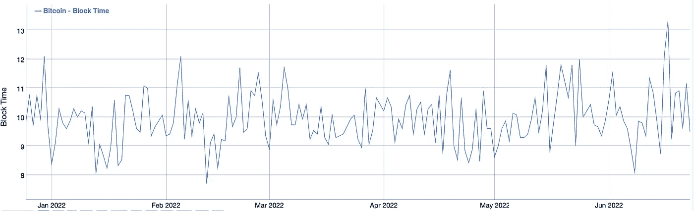

Source — [Bitcoin Block Time historical chart](https://bitinfocharts.com/comparison/bitcoin-confirmationtime.html#6m)

*   与以太坊和其他第一层区块链相比，**比特币的 10 分钟阻塞延迟**相对较长。虽然封锁时间只是评估区块链的结算时间和结算保证质量时必须考虑的几个因素之一，**比特币相对较长的封锁时间阻碍了其在需要快速处理确认的应用中的使用。**

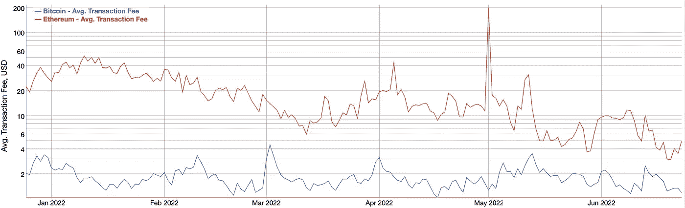

Source- [Bitcoin, Ethereum Avg. Transaction Fee historical chart](https://bitinfocharts.com/comparison/transactionfees-btc-eth.html#log&6m)

*   如图所示，以太坊目前是全区块链最拥挤的网络，而**2022 年比特币交易费用大部分时间在 1 美元到 4 美元之间，相比之下，2021 年比特币交易的平均费用为 10 美元**。然而，其他几个竞争网络的交易成本低至几分之一便士。因此，比特币基础层不适合购买一杯茶等小额交易。

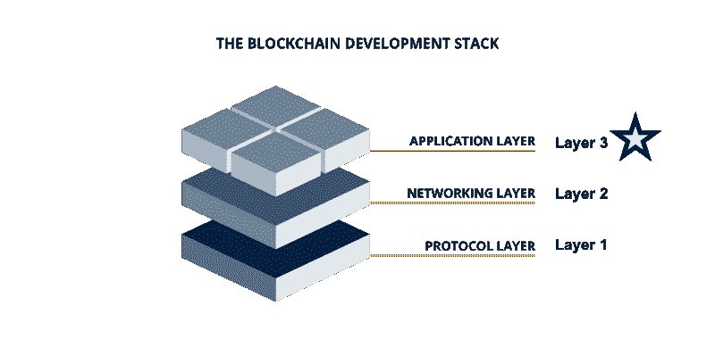

Source — Modified Image by Author from [Link](https://www.getsmarter.com/blog/career-advice/who-is-involved-in-the-blockchain-network/)

因此，

1.  比特币网络存在于第一层，即金钱、深度存储和全球根信任。
2.  **在第二层**，有闪电网络、RSK 和堆栈——现金、流动支付、点对点信任、资产发行和通用网络。
3.  **在第三层**，有许多闪电钱包、不可渗透的网络、SPHINX 和 ZEBEDEE，以及其他应用程序、流式微支付、游戏中的比特币、点对点消息平台和节点联盟。
4.  有人可能会说，在第 4 层中，有一个集中的点对点交换网络，你可以在那里提取比特币，但交易成本是零，而且是即时的。
5.  **在第 5 层**，有集中的交易所或信托机构保存你的比特币，比如 gray，在那里你不能移动你的实际比特币，但可以玩集中实体锁定的比特币价值。

理解第 2 层、第 4 层和第 5 层的完整生态系统是一个完全独立的讨论主题，而且近年来已经取得了很大进展；在本博客的**杂项部分**可以看到生态系统的图形描述。

# 支持闪电的第 3 层

比特币作为一种协议有着巨大的潜力:它类似于 TCP 层，但还没有人发明 HTTP 层。我们才刚刚开始！

请记住，建立在比特币之上的项目包括规模支付和资产发行的协议，以及通用网络。然而，我们只是着眼于支持闪电的第 3 层。

*   **P2P 全加密闪电使能应用——SPHINX**

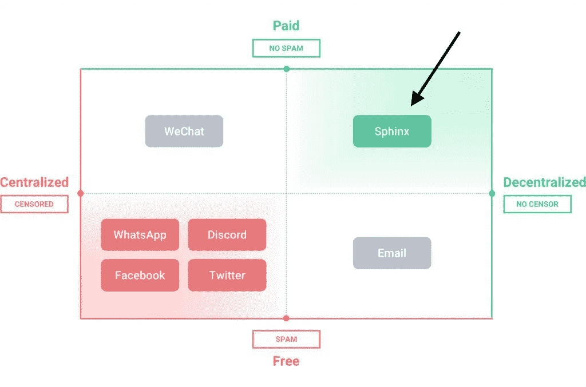

Source- Modified Image by Author from [Link](https://blog.sphinx.chat/2021/02/12/freedom-from-free/)

我们已经看到了 Web 3 社交网络应用背后的不同故事，这些应用建立在不稳定的基础层协议上，但由于市场营销和其他因素而变得流行。原因在于，我们有时会忽略分散的、抵制审查的叙事，这些叙事最初将我们带到了区块链王国。

**我注意到了** [**SPHINX**](https://blog.sphinx.chat/2021/02/12/freedom-from-free/) ，这是一个 web3 应用程序，它使用 lightning 网络来提供去中心化和抵制审查的真正好处。

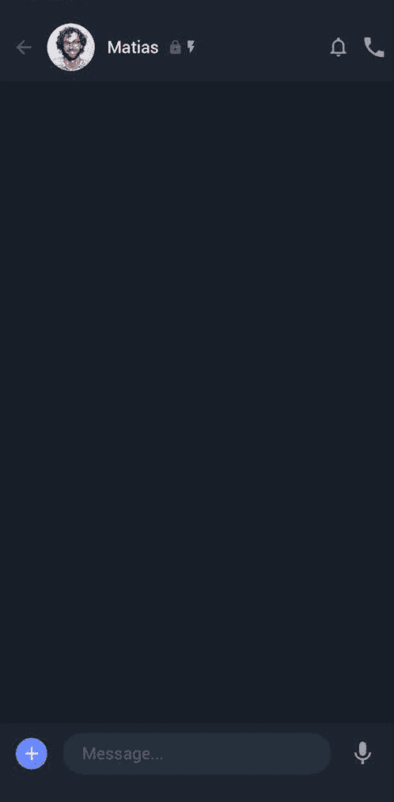

Source- [SPHINX](https://blog.sphinx.chat/wp-content/uploads/2021/02/Blog_gif_edit_2.gif)

它是如何发挥作用的？
1。所有信息都通过闪电网络加密和传输。
2。没有中央服务器收集你的个人信息。
3。**没有人有权将你从网络中删除。
4。你可以用闪电把比特币快速传送给地球上的任何人。**

*   **交互式网页可访问性的真正用途——元掩码故事**

还记得我们从 v **各种层 1 那里听到的故事吗？它们拥有强大的工具，如钱包，被宣传为所有 web 3 应用程序的单一入口。我们也可以在比特币的生态系统中看到这一点，尽管没有得到很好的宣传，但它提供了一种真正去中心化的体验。这里有几个例子。**

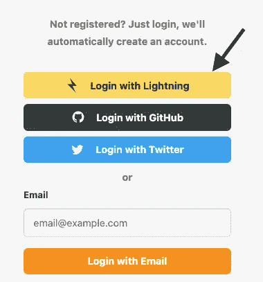

[Source](https://stacker.news/login?callbackUrl=https://stacker.news/)

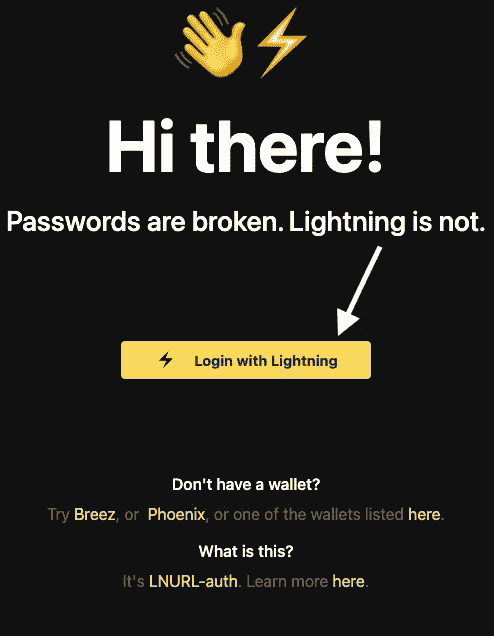

[Source](https://lightninglogin.live/)

*   **游戏中的比特币——西庇太**

自 2018 年以来，已经有了广泛的关于玩赚(P2E)游戏和经济的报道。但是你猜怎么着？**它仅限于一个平台，其货币根据该生态系统内的活动和增长而变化。然而，想象一下，如果有一种方法可以让所有的 P2E 人都可以使用世界上最强大的网络参与所有的游戏，而不受游戏之间一些奇怪的限制。然而，有一个解决方案！**

> 下面的 GIF 展示了西庇太如何将即时比特币交易整合到最受欢迎的多人游戏之一:**反恐精英:全球攻势**🤯

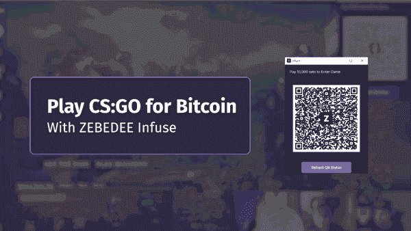

Source-[ZEBEDEE INFUSE](/zebedee-engineering/bitcoin-in-games-how-does-it-work-e6f4fea9d981)

怎么样了？
1。当你加入一个 [**【注入】服务器**](https://zebedee.io/play/infuse) 时，你必须支付一笔**入场费**(用一个西庇太钱包很容易做到这一点)。

**2。所有参赛费用都会被收集起来，并加入总奖金池**。如果你玩得好，你将根据你的分数获得更大份额的奖励。因为闪电交易是如此之快，你不必等到游戏结束时才计算所有分数:**你可以随时选择离开游戏，并提取你在那一刻之前的利润**。

闪电网络(Lightning Network)是一个建立在比特币基础上的快速、可扩展的网络，是西庇太生态系统神奇的原因。交易几乎是即时的，几乎没有成本(说真的，**闪电费用很少**)。虽然普通比特币网络上的交易可能过于昂贵和缓慢，无法处理我们打算添加到游戏中的微支付类型，但 **Lightning 网络为 ZEBEDEE 提供了一种快速和几乎免费的转移资金的方式。**更重要的是，比特币的数字本质使其具有可编程性——它是可以被编程以响应游戏中的动作或事件的货币。这就是西庇太的真正魅力。

*   **创造 P2P 互联网新标准——无渗透人工智能**

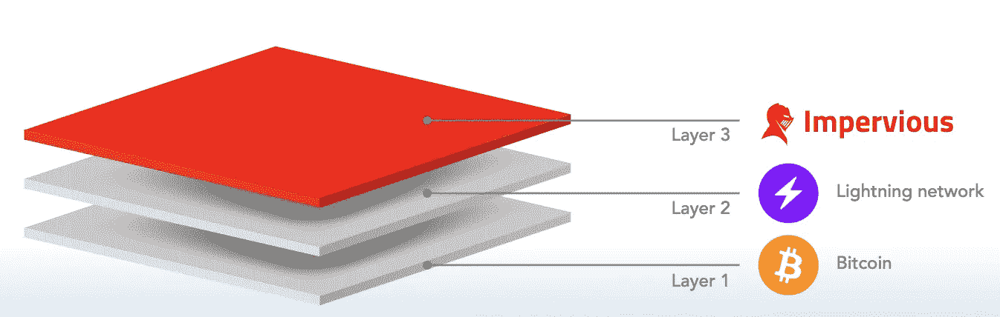

Source — [Impervious](https://www.impervious.ai/)

不可辩驳的说法

> “变焦，不用变焦。
> 
> 谷歌文档，没有谷歌。
> 
> 中等，不中等。
> 
> WhatsApp，没有 WhatsApp。
> 
> 付款，没有银行。
> 
> 身份，没有国家。
> 
> 所有这些都没有集中的中介，内置于不受影响的浏览器中。"

他们最终能实现吗？他们似乎有能力。

> 下图显示了不受影响的浏览器提供一整套简单 P2P 功能的能力。

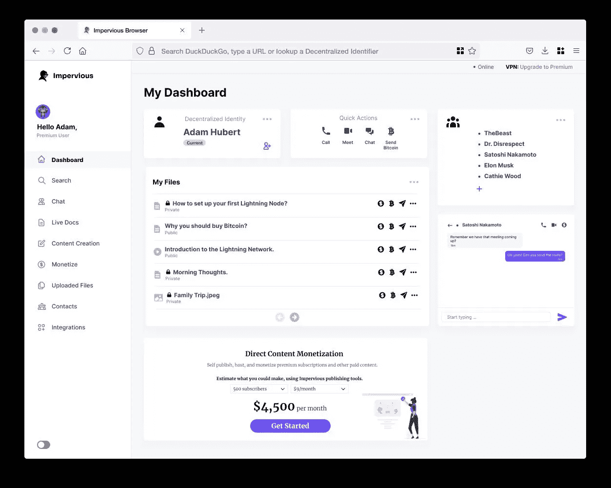

[Source](https://twitter.com/ImperviousAi/status/1470398767232815106/photo/1)

**2021 年 8 月，infined 推出了一套基于比特币闪电网络**的 API，导致**为比特币创建了一个可编程层(即“第三层”)**。任何应用程序或服务都可以使用不受影响的 API 来传输加密安全、防审查和防监视的数据传输通道。

understand 正在为点对点互联网开发工具和基础设施。通过将 Lightning、分散标识符(DIDs)、DIDComm 系统、WebRTC、IPFS 等结合到一个可识别的应用中，不受影响的浏览器能够提供一系列简单的 P2P 功能**。更多信息请点击 [**这里**](https://newsletter.impervious.ai/impervious-browser-functionality-overview/) 。**

# 多方面的

> 下图显示了从 2012 年开始的比特币相关协议的年表

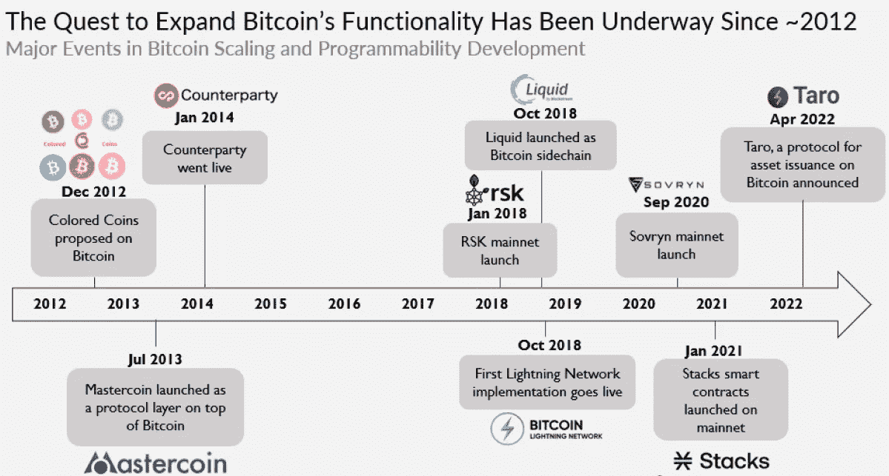

Source- T[he Block](https://www.theblockresearch.com/)

> 下图描绘了基于比特币的协议的完整景观，包括闪电网络、RSK 和正在孵化自己的生态系统的堆栈。这也包括建立在这些网络之上或与之合作的主要生态系统成员

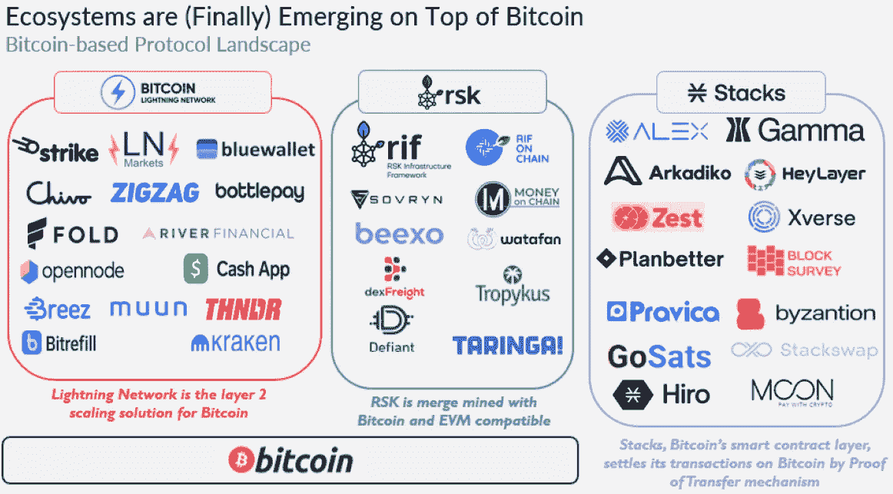

Source- T[he Block](https://www.theblockresearch.com/)

此外，主要的闪电网络开发组织 Lightning Labs 已经推出了 **Taro** ，这是一个利用 Taproot 向闪电网络添加大量资产的协议，**重点关注稳定的 coins。像 Taro 这样的网络有潜力将比特币重新树立为稳定的比特币创造和转移的重要平台。更多关于此的从 [**这里**](https://lightning.engineering/posts/2022-4-5-taro-launch/) **。****

**免责声明:**此贴仅供参考。它不是投资建议，也不是购买或出售任何投资的建议或恳求，它不应用于评估做出任何投资决定的价值。它不应用于提供会计、法律或税务建议，或提出财务建议。本文表达的观点如有变更，恕不另行通知。

> 加入 Coinmonks [电报频道](https://t.me/coincodecap)和 [Youtube 频道](https://www.youtube.com/c/coinmonks/videos)了解加密交易和投资

# 另外，阅读

*   [红狗赌场评论](https://coincodecap.com/red-dog-casino-review) | [Swyftx 评论](https://coincodecap.com/swyftx-review) | [CoinGate 评论](https://coincodecap.com/coingate-review)
*   [Bookmap 评论](https://coincodecap.com/bookmap-review-2021-best-trading-software) | [美国 5 大最佳加密交易所](https://coincodecap.com/crypto-exchange-usa)
*   [如何在 FTX 交易所交易期货](https://coincodecap.com/ftx-futures-trading) | [OKEx vs 币安](https://coincodecap.com/okex-vs-binance)
*   [CoinLoan 评论](https://coincodecap.com/coinloan-review) | [YouHodler 评论](/coinmonks/youhodler-4-easy-ways-to-make-money-98969b9689f2) | [BlockFi 评论](https://coincodecap.com/blockfi-review)
*   [XT.COM 评论](https://coincodecap.com/profittradingapp-for-binance)币安评论 |
*   [SmithBot 评论](https://coincodecap.com/smithbot-review) | [4 款最佳免费开源交易机器人](https://coincodecap.com/free-open-source-trading-bots)