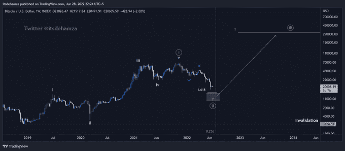

# 比特币宏计数:

> 原文：<https://medium.com/coinmonks/bitcoin-macro-counts-ea896a18733f?source=collection_archive---------39----------------------->

因为一次深度修正，我怀疑比特币在第 4 波。更有可能的是，比特币正在经历去年 11 月 10 日开始的第二波修正。第二波想法实际上比第四波更乐观。

**1。宏观初选计数:**
这里是 wave 2 中的双之字形，与 wave W 差不多完成。在 LTF 可能会低一条腿。为此，我几天前发布了一个短期更新。[比特币](https://twitter.com/hashtag/Bitcoin?src=hashtag_click)第三波将是期待已久的牛市。

**2。**宏主候补:
平修正。这种情况几乎与前一种情况类似，只是 B 波应该回撤至 58.4K 的最小值，才能称为平坦。B 波可以进一步延伸到新的路径，然后急剧下降到 c 波。

**3。Wave 2 接近完成:**
在这种情况下，wave 2 接近完成，它更有可能在 7 月 11 日至 21 日在 fib 箱(16–10k)内和周围终止。

**4。第四波场景:**
这个计数仍然有效，但是因为大幅修正而降级。

**结论:** 1。在这个线程中共享的所有计数中，向上移动是所有计数中常见的。这意味着好日子即将到来。
2。无论是一时冲动还是一次放松的集会。系好安全带，为绿色月份做好准备。
3。比特币最接近底部。

推特 @Itsdehamza

> 加入 Coinmonks [电报频道](https://t.me/coincodecap)和 [Youtube 频道](https://www.youtube.com/c/coinmonks/videos)了解加密交易和投资

# 另外，阅读

*   [Bookmap 评论](https://coincodecap.com/bookmap-review-2021-best-trading-software) | [美国 5 大最佳加密交易所](https://coincodecap.com/crypto-exchange-usa)
*   [密码交易机器人](/coinmonks/crypto-trading-bot-c2ffce8acb2a) | [硬币门评论](https://coincodecap.com/coingate-review)
*   最佳加密[硬件钱包](/coinmonks/hardware-wallets-dfa1211730c6) | [Bitbns 评论](/coinmonks/bitbns-review-38256a07e161)
*   [新加坡十大最佳加密交易所](https://coincodecap.com/crypto-exchange-in-singapore) | [购买 AXS](https://coincodecap.com/buy-axs-token)
*   [红狗赌场评论](https://coincodecap.com/red-dog-casino-review) | [Swyftx 评论](https://coincodecap.com/swyftx-review)
*   [投资印度的最佳密码](https://coincodecap.com/best-crypto-to-invest-in-india-in-2021)|[WazirX P2P](https://coincodecap.com/wazirx-p2p)|[Hi Dollar Review](https://coincodecap.com/hi-dollar-review)